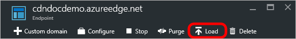

<properties
    pageTitle="Pré-carregar ativos em um ponto de extremidade do Azure CDN | Microsoft Azure"
    description="Saiba como carregar previamente em cache conteúdo em um ponto de extremidade CDN."
    services="cdn"
    documentationCenter=""
    authors="camsoper"
    manager="erikre"
    editor=""/>

<tags
    ms.service="cdn"
    ms.workload="tbd"
    ms.tgt_pltfrm="na"
    ms.devlang="na"
    ms.topic="article"
    ms.date="07/28/2016"
    ms.author="casoper"/>

# Pré-carregar ativos em um ponto de extremidade do Azure CDN

[AZURE.INCLUDE [cdn-verizon-only](../../includes/cdn-verizon-only.md)]

Por padrão, ativos são primeiro armazenadas em cache como eles são solicitados. Isso significa que a primeira solicitação de cada região pode levar mais tempo, pois os servidores de borda não terá o conteúdo em cache e será necessário encaminhar a solicitação para o servidor de origem. Pré-Carregando conteúdo evita essa latência de visita primeira.

Além de fornecer uma melhor experiência de cliente, pré carregando seu cache ativos também pode reduzir o tráfego de rede no servidor de origem.

> [AZURE.NOTE] Pré-carregar ativos é útil para eventos grandes ou conteúdo fica disponível simultaneamente para um grande número de usuários, como uma nova versão de filme ou uma atualização de software.

Este tutorial o orienta pré Carregando conteúdo em cache em todos os nós de borda de CDN do Azure.

## Explicação passo a passo

1. No [Portal do Azure](https://portal.azure.com), navegue até o perfil CDN que contém o ponto de extremidade que você deseja carregar previamente.  A lâmina de perfil é aberto.

2. Clique na extremidade na lista.  Abre a lâmina de ponto de extremidade.

3. Da lâmina do ponto de extremidade CDN, clique no botão carregar.

    

    A lâmina de carga é aberto.

    

4. Insira o caminho completo de cada ativo que você deseja carregar (por exemplo, `/pictures/kitten.png`) na caixa de texto **caminho** .

    > [AZURE.TIP] Caixas de texto de **caminho** mais aparecerão depois de digitar texto para permitir que você criar uma lista de vários ativos.  Você pode excluir ativos na lista clicando no botão de reticências (...).
    >
    > Caminhos devem ser uma URL relativa que se adapte a seguinte [expressão regular](https://msdn.microsoft.com/library/az24scfc.aspx): `^(?:\/[a-zA-Z0-9-_.\u0020]+)+$`.  Cada ativo deve ter seu próprio caminho.  Não há nenhuma funcionalidade de curinga para ativos pré-carregar.

    

5. Clique no botão **carregar** .

    

> [AZURE.NOTE] Não há uma limitação de solicitações de carga 10 por minuto por perfil CDN.

## Consulte também
- [Limpar um ponto de extremidade do Azure CDN](cdn-purge-endpoint.md)
- [Referência de API REST de CDN Azure - limpar ou pré-carregar um ponto extremo](https://msdn.microsoft.com/library/mt634451.aspx)
