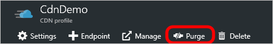

<properties
    pageTitle="Limpar um ponto de extremidade do Azure CDN | Microsoft Azure"
    description="Saiba como limpar o cache todo o conteúdo de um ponto de extremidade CDN."
    services="cdn"
    documentationCenter=""
    authors="camsoper"
    manager="erikre"
    editor=""/>

<tags
    ms.service="cdn"
    ms.workload="tbd"
    ms.tgt_pltfrm="na"
    ms.devlang="na"
    ms.topic="article"
    ms.date="07/28/2016"
    ms.author="casoper"/>

# Limpar um ponto de extremidade do Azure CDN

## Visão geral

Nós de borda do Azure CDN armazenará em cache ativos até que expire time to live (TTL) do ativo.  Depois TTL do ativo expira, quando um cliente solicita o ativo a partir do nó de borda, o nó de borda recuperará uma nova cópia atualizada do ativo para atender à solicitação de cliente e repositório atualizar o cache.

Às vezes, você poderá limpar o conteúdo em cache de todos os nós de borda e forçar todos eles para recuperar novos ativos atualizados.  Isso pode ser devido a atualizações para o aplicativo da web, ou para rapidamente os ativos de atualização que contenham informações incorretas.

> [AZURE.TIP] Observe que apenas descarte limpa o conteúdo em cache nos servidores de borda de CDN.  Qualquer caches downstream, como o cache do navegador local e servidores proxy ainda podem manter uma cópia em cache do arquivo.  É importante lembrar disso quando você definir um arquivo de vida.  Você pode forçar um cliente downstream para solicitar a versão mais recente do seu arquivo, dando a ela um nome exclusivo sempre que você atualizá-lo ou aproveitando de [cache de cadeia de caracteres de consulta](cdn-query-string.md).  

Este tutorial o orienta descarte ativos de todos os nós de borda de um ponto de extremidade.

## Explicação passo a passo

1. No [Portal do Azure](https://portal.azure.com), navegue até o perfil CDN que contém o ponto de extremidade que você deseja limpar.

2. Da lâmina CDN perfil, clique no botão Limpar.

    

    Abre a lâmina de limpeza.

    

3. Na lâmina limpar, selecione o endereço de serviço que deseja limpar na lista suspensa de URL.

    

    > [AZURE.NOTE] Você também pode chegar lâmina limpar clicando no botão **Limpar** na lâmina CDN ponto de extremidade.  Nesse caso, o campo de **URL** será preenchido com o endereço de serviço do ponto de extremidade específico.

4. Selecione quais ativos que deseja limpar de nós de borda.  Se você deseja limpar todos os ativos, clique na caixa de seleção **Limpar tudo** .  Caso contrário, digite o caminho completo de cada ativo que você deseja limpar (por exemplo, `/pictures/kitten.png`) na caixa de texto **caminho** .

    > [AZURE.TIP] Caixas de texto de **caminho** mais aparecerão depois de digitar texto para permitir que você criar uma lista de vários ativos.  Você pode excluir ativos na lista clicando no botão de reticências (...).
    >
    > Caminhos devem ser uma URL relativa que correspondam a seguinte [expressão regular](https://msdn.microsoft.com/library/az24scfc.aspx): `^\/(?:[a-zA-Z0-9-_.\u0020]+\/)*\*$";`.  Para **Azure CDN da Verizon** (padrão e Premium), asterisco (\*) pode ser usado como um caractere curinga (por exemplo, `/music/*`).  Caracteres curinga e **Limpar todos** não são permitidas com **Azure CDN do Akamai**.
    
5. Clique no botão **Limpar** .

    

> [AZURE.IMPORTANT] Solicitações de limpeza levar aproximadamente de 2 a 3 minutos para processar com o **Azure CDN da Verizon** (padrão e Premium) e aproximadamente 7 minutos com o **Azure CDN do Akamai**.  Azure CDN tem um limite de 50 simultâneas limpar solicitações a qualquer momento. 

## Consulte também
- [Pré-carregar ativos em um ponto de extremidade do Azure CDN](cdn-preload-endpoint.md)
- [Referência de API REST de CDN Azure - limpar ou pré-carregar um ponto extremo](https://msdn.microsoft.com/library/mt634451.aspx)
