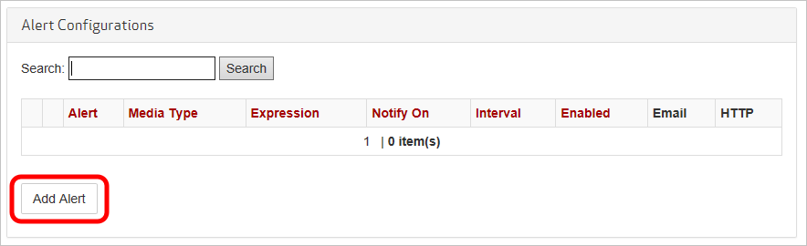

<properties
    pageTitle="Alertas em tempo real do Azure CDN | Microsoft Azure"
    description="Alertas em tempo real no Microsoft Azure CDN. Alertas em tempo real fornecem notificações sobre o desempenho dos pontos de extremidade no seu perfil CDN."
    services="cdn"
    documentationCenter=""
    authors="camsoper"
    manager="erikre"
    editor=""/>

<tags
    ms.service="cdn"
    ms.workload="tbd"
    ms.tgt_pltfrm="na"
    ms.devlang="na"
    ms.topic="article"
    ms.date="07/12/2016"
    ms.author="casoper"/>

# <a name="real-time-alerts-in-microsoft-azure-cdn"></a>Alertas em tempo real no Microsoft Azure CDN

[AZURE.INCLUDE [cdn-premium-feature](../../includes/cdn-premium-feature.md)]


## <a name="overview"></a>Visão geral

Este documento explica alertas em tempo real no Microsoft Azure CDN. Esta funcionalidade fornece notificações em tempo real sobre o desempenho dos pontos de extremidade no seu perfil CDN.  Você pode configurar o email ou alertas HTTP com base em:

* Largura de banda
* Códigos de status
* Status de cache
* Conexões

## <a name="creating-a-real-time-alert"></a>Criar uma alerta em tempo real

1. No [Portal do Azure](https://portal.azure.com), navegue até seu perfil CDN.

    

2. Da lâmina CDN perfil, clique no botão **Gerenciar** .

    

    O portal de gerenciamento de CDN é aberta.

3. Passe o mouse sobre a guia de **análise** , em seguida, passe o mouse sobre o submenu **Estatísticas em tempo real** .  Clique em **alertas em tempo real**.

    

    Lista de configurações de alerta existentes (se houver) é exibida.

4. Clique no botão **Adicionar alerta** .

    

    Um formulário para criar um novo alerta é exibido.

    

5. Se você quiser este alerta esteja ativa quando você clicar em **Salvar**, marque a caixa de seleção **Habilitado de alerta** .

6. Insira um nome descritivo para o alerta no campo **nome** .

7. Na lista suspensa **Tipo de mídia** , selecione **Objeto de grande de HTTP**.

    

    > [AZURE.IMPORTANT] Você deve selecionar o **Objeto grande HTTP** como o **Tipo de mídia**.  Outras opções não são usadas pelo **Azure CDN da Verizon**.  Falha ao selecionar **Objeto grande HTTP** fará com que seu alerta para nunca ser disparadas.

8. Crie uma **expressão** para monitorar selecionando uma **métrica**, o **operador**e o **valor de disparador**.

    - Para **métrica**, selecione o tipo de condição que você deseja monitorar.  **Mbps de largura de banda** é a quantidade de uso de largura de banda em megabits por segundo.  **Total de conexões** é o número de conexões de HTTP simultâneas com nossos servidores de borda.  Para obter definições dos vários status de cache e códigos de status, consulte [Códigos de Status do Azure CDN Cache](https://msdn.microsoft.com/library/mt759237.aspx) e [Códigos de Status do Azure CDN HTTP](https://msdn.microsoft.com/library/mt759238.aspx)
    - **Operador** é o operador matemático que estabelece a relação entre a métrica e o valor disparador.
    - **Valor de disparador** é o valor de limite que deve ser atendido antes de uma notificação será enviada.

    No exemplo abaixo, a expressão que posso ter criado indica que eu gostaria de ser notificado quando o número de códigos de status 404 é maior que 25.

    

9. Para **intervalo**, insira a frequência que você gostaria que a expressão avaliada.

10. Na lista suspensa de **notificação em** , selecione quando você deseja ser notificado quando a expressão for verdadeira.
    
    - **Começar a condição** indica que uma notificação será enviada quando a condição especificada primeiro for detectada.
    - **Condição final** indica que uma notificação será enviada quando a condição especificada não é mais detectada. Essa notificação só pode ser acionada após nosso sistema de monitoramento de rede detectado que ocorreu a condição especificada.
    - **Contínua** indica que uma notificação será enviada cada vez que o sistema de monitoramento de rede detecta à condição especificada. Tenha em mente que o sistema de monitoramento de rede verifica somente uma vez por intervalo para a condição especificada.
    - **Condição de início e fim** indica que uma notificação será enviada na primeira vez que a condição especificada for detectada e novamente quando a condição não é mais detectada.

11. Se você quiser receber notificações por email, marque a caixa de seleção de **notificação por Email** .  

    
    
    No campo **para** , digite o endereço de email onde você deseja que as notificações enviado. Para o **assunto** e o **corpo**, você pode deixar o padrão ou você pode personalizar a mensagem usando a lista de **palavras-chave disponíveis** para inserir dados de alerta dinamicamente quando a mensagem é enviada.

    > [AZURE.NOTE] Você pode testar a notificação de email clicando no botão de **Notificação de teste** , mas somente após a configuração do alerta foi salvo.

12. Se você quiser notificações a ser postada em um servidor web, marque a caixa de seleção **notificar por HTTP Post** .

    

    No campo **Url** , digite a URL onde você deseja que a mensagem HTTP postada. Na caixa de texto **cabeçalhos** , insira os cabeçalhos HTTP sejam enviados na solicitação.  Para o **corpo** , você pode personalizar a mensagem usando a lista de **palavras-chave disponíveis** para inserir dados de alerta dinamicamente quando a mensagem é enviada.  **Cabeçalhos** e o **corpo** padrão para uma carga XML semelhante do exemplo abaixo.

    ```
    <string xmlns="http://schemas.microsoft.com/2003/10/Serialization/">
        <![CDATA[Expression=Status Code : 404 per second > 25&Metric=Status Code : 404 per second&CurrentValue=[CurrentValue]&NotificationCondition=Condition Start]]>
    </string>
    ```

    > [AZURE.NOTE] Você pode testar a notificação de HTTP Post clicando no botão de **Notificação de teste** , mas somente após a configuração do alerta foi salvo.

13. Clique no botão **Salvar** para salvar sua configuração de alerta.  Se você tiver marcado **Alerta habilitado** na etapa 5, seu alerta agora está ativo.

## <a name="next-steps"></a>Próximas etapas

- Analisar [estatísticas em tempo real no Azure CDN](cdn-real-time-stats.md)
- Investigar com [relatórios HTTP avançados](cdn-advanced-http-reports.md)
- Analisar [padrões de uso](cdn-analyze-usage-patterns.md)

