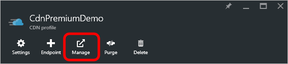

<properties
    pageTitle="Real-tempo-estatísticas no Azure CDN | Microsoft Azure"
    description="Estatísticas em tempo real fornecem dados em tempo real sobre o desempenho do Azure CDN quando fornecimento de conteúdo para seus clientes."
    services="cdn"
    documentationCenter=""
    authors="camsoper"
    manager="erikre"
    editor=""/>

<tags
    ms.service="cdn"
    ms.workload="tbd"
    ms.tgt_pltfrm="na"
    ms.devlang="na"
    ms.topic="article"
    ms.date="07/28/2016"
    ms.author="casoper"/>

# Estatísticas em tempo real no Microsoft Azure CDN

[AZURE.INCLUDE [cdn-premium-feature](../../includes/cdn-premium-feature.md)]

## Visão geral

Este documento explica estatísticas em tempo real no Microsoft Azure CDN.  Esta funcionalidade fornece dados em tempo real, como largura de banda, o status de cache e conexões simultâneas ao seu perfil CDN quando fornecimento de conteúdo para seus clientes. Isso permite monitoramento contínuo da integridade de seu serviço a qualquer momento, incluindo eventos de ativação.

Os gráficos a seguintes estão disponíveis:

* [Largura de banda](#bandwidth)
* [Códigos de status](#status-codes)
* [Status de cache](#cache-statuses)
* [Conexões](#connections)

## Acessando estatísticas em tempo real

1. No [Portal do Azure](https://portal.azure.com), navegue até seu perfil CDN.

    

2. Da lâmina CDN perfil, clique no botão **Gerenciar** .

    

    O portal de gerenciamento de CDN é aberta.

3. Passe o mouse sobre a guia de **análise** , em seguida, passe o mouse sobre o submenu **Estatísticas em tempo real** .  Clique no **objeto grande HTTP**.

    

    Os gráficos de estatísticas em tempo real são exibidos.
    
Cada um dos gráficos exibe estatísticas em tempo real para o período de tempo selecionado, começando quando a página for carregada.  Os gráficos são atualizadas automaticamente cada alguns segundos.  Botão **Atualizar Graph** , se estiver presente, limpará o gráfico, após o qual ele apenas exibirá os dados selecionados.

## Largura de banda

O gráfico de **largura de banda** exibe a quantidade de largura de banda usada para a plataforma atual sobre o período de tempo selecionado. Na parte do gráfico sombreada indica o uso de largura de banda. O valor exato de largura de banda sendo utilizada é exibido diretamente abaixo do gráfico de linha.

## Códigos de status

O gráfico de **Códigos de Status** indica com que frequência determinados códigos de resposta HTTP estão ocorrendo sobre o período de tempo selecionado.

> [AZURE.TIP]  Para obter uma descrição de cada opção de código de status HTTP, consulte [Códigos de Status do Azure CDN HTTP](https://msdn.microsoft.com/library/mt759238.aspx).

Uma lista de códigos de status HTTP é exibida diretamente acima do gráfico. Esta lista indica cada código de status que pode ser incluído no gráfico de linhas e o número de ocorrências por segundo para esse código de status atual. Por padrão, uma linha é exibida para cada um desses códigos de status no gráfico. No entanto, você pode optar por monitorar apenas os códigos de status que têm um significado especial para a sua configuração de CDN. Para fazer isso, verifique os códigos de status desejado, desmarque todas as outras opções e clique em **Atualizar o gráfico**. 

Você pode ocultar temporariamente dados registrados para um código de status específico.  Da legenda diretamente abaixo do gráfico, clique no código de status que você deseja ocultar. O código de status ficará oculto imediatamente do gráfico. Clicar nesse código de status novamente fará com que essa opção seja exibida novamente.

## Status de cache

O gráfico de **Status de Cache** indica com que frequência certos tipos de status de cache estão ocorrendo sobre o período de tempo selecionado. 

> [AZURE.TIP]  Para obter uma descrição de cada opção de código de status do cache, consulte [Códigos de Status do Azure CDN Cache](https://msdn.microsoft.com/library/mt759237.aspx).

Uma lista de códigos de status de cache é exibida diretamente acima do gráfico. Esta lista indica cada código de status que pode ser incluído no gráfico de linhas e o número de ocorrências por segundo para esse código de status atual. Por padrão, uma linha é exibida para cada um desses códigos de status no gráfico. No entanto, você pode optar por monitorar apenas os códigos de status que têm um significado especial para a sua configuração de CDN. Para fazer isso, verifique os códigos de status desejado, desmarque todas as outras opções e clique em **Atualizar o gráfico**. 

Você pode ocultar temporariamente dados registrados para um código de status específico.  Da legenda diretamente abaixo do gráfico, clique no código de status que você deseja ocultar. O código de status ficará oculto imediatamente do gráfico. Clicar nesse código de status novamente fará com que essa opção seja exibida novamente.

## Conexões

Esse gráfico indica quantas conexões foram estabelecidos para seus servidores de borda. Cada solicitação de um ativo que passam por nossos resultados CDN em uma conexão.

## Próximas etapas

- Ser notificado com [alertas em tempo real no Azure CDN](cdn-real-time-alerts.md)
- Investigar com [relatórios HTTP avançados](cdn-advanced-http-reports.md)
- Analisar [padrões de uso](cdn-analyze-usage-patterns.md)

