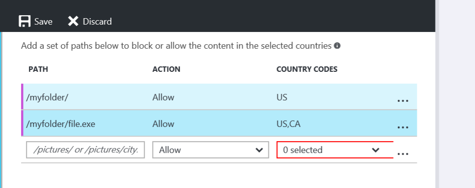

<properties
    pageTitle="Restringir o acesso ao seu conteúdo do Azure CDN por país | Microsoft Azure"
    description="Saiba como restringir o acesso ao seu conteúdo de CDN Azure usando o recurso de filtragem de localização geográfica."
    services="cdn"
    documentationCenter=""
    authors="camsoper, rli"
    manager="akucer"
    editor=""/>

<tags
    ms.service="cdn"
    ms.workload="tbd"
    ms.tgt_pltfrm="na"
    ms.devlang="na"
    ms.topic="article"
    ms.date="10/14/2016"
    ms.author="Lichard"/>

#Restringir o acesso ao seu conteúdo por país - Akamai

> [AZURE.SELECTOR]
- [Verizon](cdn-restrict-access-by-country.md)
- [Padrão de Akamai](cdn-restrict-access-by-country-akamai.md)

##Visão geral

Quando um usuário solicita seu conteúdo, por padrão, o conteúdo é atendido, independentemente de onde o usuário feitas esta solicitação de. Em alguns casos, você pode querer restringir o acesso ao seu conteúdo por país. Este tópico explica como usar o recurso de **Filtragem de geográfica** para configurar o serviço para permitir ou bloquear o acesso por país.

> [AZURE.IMPORTANT] Os produtos Verizon e Akamai fornecem a mesma funcionalidade de filtragem de localização geográfica, mas difere de interface do usuário. Este documento descreve a interface do **Azure CDN padrão do Akamai**. Para geográfica filtragem com o **Azure CDN padrão/Premium da Verizon**, consulte [restringir o acesso ao seu conteúdo por país - Verizon](cdn-restrict-access-by-country.md).

Para obter informações sobre as considerações que se aplicam ao configurar esse tipo de restrição, consulte a seção [Considerações](cdn-restrict-access-by-country.md#considerations) no final do tópico.  

##Etapa 1: Definir o caminho do diretório

Selecione o ponto de extremidade dentro do portal e localizar a guia de filtragem de localização geográfica na navegação à esquerda para encontrar esse recurso.

Ao configurar um filtro de país/região, especifique o caminho relativo para o local para o qual os usuários serão permitidos ou acesso negados. Você pode aplicar a filtragem de localização geográfica para todos os seus arquivos com "/" ou pastas selecionadas, especificando caminhos de diretório "/ imagens /". Você também pode aplicar filtragem geográfica para um único arquivo especificando o arquivo e, em seguida, deixando a barra invertida "/ pictures/city.png".

Filtro de caminho do diretório de exemplo:

    /                                 
    /Photos/
    /Photos/Strasbourg/
    /Photos/Strasbourg/city.png

##Etapa 2: Definir a ação: bloquear ou permitir

**Bloco:** Os usuários de países/regiões especificados serão negados acesso aos ativos solicitados do caminho recursiva. Se não há outras opções de filtragem de país/região tem sido configuradas para esse local, em seguida, todos os outros usuários terão acesso.

**Permitir:** Somente usuários do países especificados poderão ser acesso a ativos solicitada do caminho recursiva.

##Etapa 3: Definir países/regiões

Selecione os países que você deseja bloquear ou permitir para o caminho. Para obter mais informações, consulte [Azure CDN de códigos de país/região Akamai](https://msdn.microsoft.com/library/mt761717.aspx).

Por exemplo, a regra de bloqueio /Photos/Strasbourg/filtre arquivos, incluindo:

    http://<endpoint>.azureedge.net/Photos/Strasbourg/1000.jpg
    http://<endpoint>.azureedge.net/Photos/Strasbourg/Cathedral/1000.jpg

##Códigos de país/região

O recurso de **Filtragem de localização geográfica** usa códigos de país/região para definir os países da qual uma solicitação será permitida ou bloqueada para um diretório protegido. Você encontrará os códigos de país/região no [Azure CDN de códigos de país/região Akamai](https://msdn.microsoft.com/library/mt761717.aspx). 

##Considerações

- Ele pode levar alguns minutos para que as alterações seu país configuração de filtragem em vigor.
- Este recurso não dá suporte a caracteres curinga (por exemplo, ' *').
- A configuração de filtragem de geográfica associada com o caminho relativo será aplicado repetidamente para o caminho.
- Apenas uma regra pode ser aplicada ao mesmo caminho relativo (você não pode criar vários filtros de país/região que apontam para o mesmo caminho relativo. Entretanto, uma pasta pode ter vários filtros de país. Isso é devido a natureza recursiva do filtros por país. Em outras palavras, uma subpasta de uma pasta configurada anteriormente pode ser atribuída um filtro de outro país.

