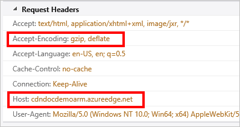
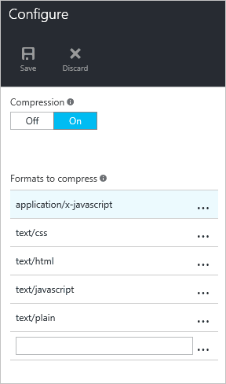

<properties
    pageTitle="Solução de problemas de compactação de arquivo no Azure CDN | Microsoft Azure"
    description="Solucionar problemas de compactação de arquivo do Azure CDN."
    services="cdn"
    documentationCenter=""
    authors="camsoper"
    manager="erikre"
    editor=""/>

<tags
    ms.service="cdn"
    ms.workload="tbd"
    ms.tgt_pltfrm="na"
    ms.devlang="na"
    ms.topic="article"
    ms.date="09/01/2016"
    ms.author="casoper"/>
    
# Solução de problemas de compactação de arquivo CDN

Este artigo ajuda você a solucionar problemas com [a compactação de arquivo CDN](cdn-improve-performance.md).

Se precisar de mais ajuda a qualquer momento neste artigo, você pode contatar os Azure especialistas no [Azure MSDN e os fóruns de estouro de pilha](https://azure.microsoft.com/support/forums/). Como alternativa, você também pode enviar um incidente de suporte Azure. Vá para o [site de suporte do Azure](https://azure.microsoft.com/support/options/) e clique em **Obter suporte**.

## Sintoma

A compactação para seu ponto de extremidade está ativada, mas arquivos estão sendo retornados descompactados.

>[AZURE.TIP] Para verificar se os arquivos estão sendo retornados compactados, você precisará usar uma ferramenta como [Fiddler](http://www.telerik.com/fiddler) ou do seu navegador [Ferramentas de desenvolvedor](https://developer.microsoft.com/microsoft-edge/platform/documentation/f12-devtools-guide/).  Cabeçalhos de resposta de seleção HTTP retornados com seu cache CDN conteúdos.  Se houver um cabeçalho chamado `Content-Encoding` com um valor de **gzip**, **bzip2**ou **deflate**, seu conteúdo é compactado.
>
>

## Causa

Há diversas causas possíveis, incluindo:

- O conteúdo solicitado não está qualificado para compactação.
- Compactação não está habilitada para o tipo de arquivo solicitado.
- A solicitação HTTP não incluiu um cabeçalho solicitando um tipo de compactação válidos.

## Etapas de solução de problemas

> [AZURE.TIP] Como com implantando pontos de extremidade de novo, alterações de configuração de CDN levar algum tempo para se propagarem através da rede.  Normalmente, as alterações serão aplicadas dentro de 90 minutos.  Se esta for a primeira vez que você configurou compactação para seu ponto de extremidade CDN, você deve considerar aguardando 1 e 2 horas para ter certeza de que a compactação configurações tiveram propagado para o aparece. 

### Verifique se a solicitação

Primeiro, devemos fazer uma verificação de integridade rápida na solicitação.  Você pode usar [Ferramentas de desenvolvedor](https://developer.microsoft.com/microsoft-edge/platform/documentation/f12-devtools-guide/) do seu navegador para exibir as solicitações sendo feitas.

- Verifique se a solicitação está sendo enviada para a URL de ponto de extremidade, `<endpointname>.azureedge.net`e não sua origem.
- Verifique se a solicitação contém um cabeçalho de **Codificação de aceitação** e o valor para esse cabeçalho **gzip**, **deflate**ou **bzip2**.

> [AZURE.NOTE] Perfis de **Azure CDN do Akamai** só oferece suporte a codificação **gzip** .

### Verificar configurações de compactação (perfil CDN padrão)

> [AZURE.NOTE] Esta etapa aplica-se somente se o seu perfil CDN é um perfil **Padrão do Azure CDN da Verizon** ou **Azure CDN padrão do Akamai** . 

Navegue até seu ponto de extremidade no [portal do Azure](https://portal.azure.com) e clique no botão **Configurar** .

- Verifique se a compactação está ativada.
- Verificar o tipo MIME para o conteúdo a ser compactado está incluído na lista de formatos de compactado.

### Verificar configurações de compactação (perfil CDN Premium)

> [AZURE.NOTE] Esta etapa aplica-se somente se o seu perfil CDN é um perfil do **Azure CDN Premium da Verizon** .

Navegue até seu ponto de extremidade no [portal do Azure](https://portal.azure.com) e clique no botão **Gerenciar** .  O portal complementar será aberta.  Passe o mouse sobre a guia **HTTP grandes** , em seguida, passe o mouse sobre o submenu de **Configurações de Cache** .  Clique em **compactação**. 

- Verifique se a compactação está ativada.
- Verifique se que a lista de **Tipos de arquivo** contém uma lista separada por vírgulas (sem espaços) de tipos de MIME.
- Verificar o tipo MIME para o conteúdo a ser compactado está incluído na lista de formatos de compactado.

### Verifique se que o conteúdo é armazenada em cache

> [AZURE.NOTE] Esta etapa aplica-se somente se o seu perfil CDN é um perfil do **Azure CDN da Verizon** (Standard ou Premium).

Usando ferramentas de desenvolvedor do seu navegador, verifique os cabeçalhos de resposta para garantir que o arquivo é armazenado em cache na região onde ele está sendo solicitado.

- Verificar o cabeçalho de resposta do **servidor** .  O cabeçalho deve ter o formato de **plataforma (POP/servidor ID)**, conforme visto no exemplo a seguir.
- Verificar o cabeçalho de resposta do **Cache de X** .  O cabeçalho deve ler **ACERTAR**.  

### Verifique se que o arquivo atende aos requisitos de tamanho

> [AZURE.NOTE] Esta etapa aplica-se somente se o seu perfil CDN é um perfil do **Azure CDN da Verizon** (Standard ou Premium).

Para ser qualificado para compactação, um arquivo deve atender aos seguintes requisitos de tamanho:

- Maior que 128 bytes.
- Menor que 1 MB.

### Verifique a solicitação no servidor de origem para um cabeçalho **Via**

O cabeçalho **Via** HTTP indica para o servidor web que a solicitação está sendo passada por um servidor proxy.  Servidores de web Microsoft IIS por padrão não compacte respostas quando a solicitação contém um cabeçalho **Via** .  Para substituir esse comportamento, faça o seguinte:

- **IIS 6**: [Definir HcNoCompressionForProxies = "FALSE" nas propriedades do Metabase IIS](https://msdn.microsoft.com/library/ms525390.aspx)
- **IIS 7 e até**: [Defina **noCompressionForHttp10** e **noCompressionForProxies** como False na configuração do servidor](http://www.iis.net/configreference/system.webserver/httpcompression)

