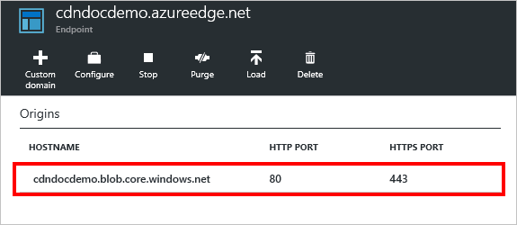

<properties
    pageTitle="Solução de problemas de pontos de extremidade do Azure CDN retornando status 404 | Microsoft Azure"
    description="Solucionar problemas 404 códigos de resposta com pontos de extremidade do Azure CDN."
    services="cdn"
    documentationCenter=""
    authors="camsoper"
    manager="erikre"
    editor=""/>

<tags
    ms.service="cdn"
    ms.workload="tbd"
    ms.tgt_pltfrm="na"
    ms.devlang="na"
    ms.topic="article"
    ms.date="07/28/2016"
    ms.author="casoper"/>
    
# Pontos de extremidade CDN retornando 404 status de solução de problemas

Este artigo ajuda você a solucionar problemas com [pontos de extremidade CDN](cdn-create-new-endpoint.md) retornando 404 erros.

Se precisar de mais ajuda a qualquer momento neste artigo, você pode contatar os Azure especialistas no [Azure MSDN e os fóruns de estouro de pilha](https://azure.microsoft.com/support/forums/). Como alternativa, você também pode enviar um incidente de suporte Azure. Vá para o [site de suporte do Azure](https://azure.microsoft.com/support/options/) e clique em **Obter**suporte.

## Sintoma

Você criou um perfil CDN e um ponto de extremidade, mas seu conteúdo não parece estar disponíveis na CDN.  Os usuários que tentarem acessar seu conteúdo por meio da URL CDN recebem códigos de status de HTTP 404. 

## Causa

Há diversas causas possíveis, incluindo:

- Origem do arquivo não é visível para a CDN
- O ponto de extremidade está configurado incorretamente, causando a CDN pesquisar no lugar errado
- O host está rejeitando o cabeçalho do host da CDN
- O ponto de extremidade não teve tempo de propagação em toda a CDN

## Etapas de solução de problemas

> [AZURE.IMPORTANT] Depois de criar um ponto de extremidade CDN, ele não estará disponível imediatamente para uso, como demora para o registro a se propagar através do CDN.  Para os perfis do <b>Azure CDN do Akamai</b> , propagação geralmente conclui dentro de um minuto.  Para perfis do <b>Azure CDN da Verizon</b> , propagação geralmente concluirá dentro de 90 minutos, mas em alguns casos pode levar mais tempo.  Se você concluir as etapas neste documento e ainda está obtendo 404 respostas, considere a possibilidade de espera algumas horas para verificar novamente antes de abrir um tíquete.

### Verificar o arquivo de origem

Primeiro, vamos deve verificar que o arquivo queremos armazenados em cache está disponível em nossa origem e é acessível publicamente.  A maneira mais rápida de fazer isso é abrir um navegador em uma sessão de navegação anônima ou em particular e navegue diretamente para o arquivo.  Apenas digite ou cole a URL na caixa Endereço e ver se o resultado é o arquivo que você espera.  Neste exemplo, vou usar um arquivo existente em uma conta de armazenamento do Azure, acessível em `https://cdndocdemo.blob.core.windows.net/publicblob/lorem.txt`.  Como você pode ver, ele passa com êxito o teste.

> [AZURE.WARNING] Embora seja a maneira mais rápida e fácil de verificar que seu arquivo está disponível publicamente, algumas configurações de rede de sua organização podem dar a ilusão que esse arquivo está publicamente disponível quando é, na verdade, só é visível para os usuários da sua rede (mesmo se ele estiver hospedado no Azure).  Se você tiver um navegador externo do qual você pode testar, como um dispositivo móvel que não está conectado à rede da sua organização ou uma máquina virtual no Azure, que seria melhor.

### Verifique as configurações de origem

Agora que podemos verificar que o arquivo está publicamente disponível na internet, podemos deve verificar as configurações de origem.  No [Portal do Azure](https://portal.azure.com), navegue até seu perfil CDN e clique no ponto de extremidade que você está solucionando problemas.  Na **extremidade** lâmina resultante, clique na origem.  

A lâmina de **origem** é exibida. 

#### Hostname e tipo de origem

Verifique se que o **tipo de origem** está correto e verifique o **nome do host de origem**.  No meu exemplo, `https://cdndocdemo.blob.core.windows.net/publicblob/lorem.txt`, a parte do nome do host da URL é `cdndocdemo.blob.core.windows.net`.  Como você pode ver na captura de tela, isso está correto.  Para o armazenamento do Azure, Web App e origens de serviço de nuvem, o campo de **origem hostname** é uma lista suspensa, então nós não precisa se preocupar ortografia-la corretamente.  No entanto, se você estiver usando uma origem personalizada, é *fundamental* que seu hostname escrita corretamente!

#### Portas HTTP e HTTPS

A outra coisa verificar aqui é seu **HTTP** e **portas HTTPS**.  Na maioria dos casos, 80 e 443 estão corretos e não exigirão nenhuma alteração.  No entanto, se o servidor de origem é escutar em uma porta diferente, que precisará ser representada aqui.  Se você não tiver certeza, basta examine a URL para o arquivo de origem.  As especificações de HTTP e HTTPS especificar portas 80 e 443 como padrões. Em minha URL, `https://cdndocdemo.blob.core.windows.net/publicblob/lorem.txt`, uma porta não for especificada, para que o padrão de 443 será considerado e Minhas configurações estão corretas.  

No entanto, digamos que a URL de seu arquivo de origem que você testou anteriormente é `http://www.contoso.com:8080/file.txt`.  Observação a `:8080` no final do segmento hostname.  Isso informa ao navegador para usar a porta `8080` para se conectar ao servidor web em `www.contoso.com`, portanto, você precisará inserir 8080 no campo **porta HTTP** .  É importante observar que essas configurações de porta só afetam qual porta o ponto de extremidade usa para recuperar informações a partir da origem.

> [AZURE.NOTE] Pontos de extremidade do **Azure CDN do Akamai** não permitem o intervalo de portas TCP completo para origens.  Para obter uma lista das portas de origem que não são permitidos, consulte [Azure CDN de portas de origem do Akamai permitidas](https://msdn.microsoft.com/library/mt757337.aspx).  
  
### Verifique as configurações de ponto de extremidade

Ligue a lâmina de **ponto de extremidade** , clique no botão **Configurar** .

Blade de **Configurar** o ponto de extremidade é exibida.

#### Protocolos

Para **protocolos**, verifique se o protocolo sendo usado pelos clientes está selecionado.  O mesmo protocolo usado pelo cliente será usada para acessar a origem, portanto é importante ter as portas de origem configuradas corretamente na seção anterior.  O ponto de extremidade apenas ouve os HTTP e HTTPS portas padrão (80 e 443), independentemente das portas de origem.

Vamos retornar ao nosso exemplo hipotético com `http://www.contoso.com:8080/file.txt`.  Como você se lembrará, Contoso especificados `8080` como seu HTTP porta, mas também suponhamos que eles especificado `44300` como seu porta HTTPS.  Se eles criaram um ponto de extremidade chamado `contoso`, seu nome de host do ponto de extremidade CDN seria `contoso.azureedge.net`.  Uma solicitação para `http://contoso.azureedge.net/file.txt` é uma solicitação HTTP, portanto, o ponto de extremidade usaria HTTP na porta 8080 para recuperá-la a partir da origem.  Uma solicitação de segura em HTTPS, `https://contoso.azureedge.net/file.txt`, faria com que o ponto de extremidade usar HTTPS na porta 44300 quando ao recuperar o arquivo de origem.

#### Cabeçalho do host de origem

O **cabeçalho do host de origem** é o valor de cabeçalho de host enviado para a origem com cada solicitação.  Na maioria dos casos, isso deve ser a mesma que a **origem hostname** podemos verificados anteriormente.  Um valor incorreto neste campo geralmente não causa 404 status, mas pode causar outros status 4xx, dependendo de qual espera a origem.

#### Caminho de origem

Por fim, podemos deve verificar nosso **caminho de origem**.  Por padrão, este é em branco.  Você só deve usar este campo se você quiser restringir o escopo dos recursos hospedado de origem que você deseja disponibilizar na CDN.  

Por exemplo, no meu ponto de extremidade, eu quis todos os recursos na minha conta de armazenamento esteja disponível, para que eu deixado **caminho de origem** em branco.  Isso significa que uma solicitação para `https://cdndocdemo.azureedge.net/publicblob/lorem.txt` resulta em uma conexão do meu ponto de extremidade para `cdndocdemo.core.windows.net` que solicita `/publicblob/lorem.txt`.  Da mesma forma, uma solicitação para `https://cdndocdemo.azureedge.net/donotcache/status.png` resulta em solicitando o ponto de extremidade `/donotcache/status.png` partir da origem.

Mas, e se não quiser usar a CDN para cada caminho em minha origem?  Digamos que eu queria apenas expor o `publicblob` caminho.  Se eu inserir */publicblob* no campo meu **caminho de origem** , que fará com que o ponto de extremidade inserir */publicblob* antes de cada solicitação seja feita à origem.  Isso significa que a solicitação para `https://cdndocdemo.azureedge.net/publicblob/lorem.txt` agora levará realmente a parte de solicitação de URL, `/publicblob/lorem.txt`e acrescentar `/publicblob` para o início. Isso resulta em uma solicitação para `/publicblob/publicblob/lorem.txt` partir da origem.  Se esse caminho não resolver para um arquivo real, a origem irá retornar um status 404.  A URL correta para recuperar lorem.txt neste exemplo seria realmente `https://cdndocdemo.azureedge.net/lorem.txt`.  Observe que podemos não incluir o caminho */publicblob* , porque a parte de solicitação de URL é `/lorem.txt` e adiciona o ponto de extremidade `/publicblob`, resultando em `/publicblob/lorem.txt` a solicitação de sendo passados para a origem.
