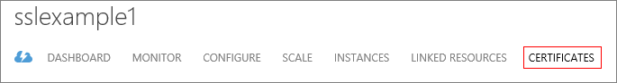

<properties 
    pageTitle="Configurar SSL para um serviço de nuvem (clássico) | Microsoft Azure" 
    description="Saiba como especificar um ponto de extremidade HTTPS para uma função da web e como carregar um certificado SSL para proteger o aplicativo." 
    services="cloud-services" 
    documentationCenter=".net" 
    authors="Thraka" 
    manager="timlt" 
    editor=""/>

<tags 
    ms.service="cloud-services" 
    ms.workload="tbd" 
    ms.tgt_pltfrm="na" 
    ms.devlang="na" 
    ms.topic="article" 
    ms.date="10/04/2016"
    ms.author="adegeo"/>

# Configurar o SSL para um aplicativo no Azure

> [AZURE.SELECTOR]
- [Portal do Azure](cloud-services-configure-ssl-certificate-portal.md)
- [Azure portal clássico](cloud-services-configure-ssl-certificate.md)

Criptografia segura de soquete Layer (SSL) é o método mais comumente usado de proteção de dados enviados pela internet. Essa tarefa comum discute como especificar um ponto de extremidade HTTPS para uma função da web e como carregar um certificado SSL para proteger o aplicativo.

> [AZURE.NOTE] Os procedimentos nesta tarefa se aplicam aos serviços de nuvem do Azure; para serviços de aplicativo, consulte [Este](../app-service-web/web-sites-configure-ssl-certificate.md) artigo.

Essa tarefa usa uma implantação de produção. Informações sobre como usar uma implantação preparação são fornecidas no final deste tópico.

Leia [Este](cloud-services-how-to-create-deploy.md) artigo primeiro se você não tiver ainda criado um serviço na nuvem.

[AZURE.INCLUDE [websites-cloud-services-css-guided-walkthrough](../../includes/websites-cloud-services-css-guided-walkthrough.md)]

## Etapa 1: Obter um certificado SSL

Para configurar SSL para um aplicativo, primeiro é necessário obter um certificado SSL que tenha sido assinado por uma autoridade de certificação (CA), um terceiro confiável que emite certificados para essa finalidade. Se você ainda não tiver um, você precisa obter um de uma empresa que vende certificados SSL.

O certificado deve atender os seguintes requisitos para certificados SSL no Azure:

-   O certificado deve conter uma chave privada.
-   O certificado deve ser criado para troca de chaves, podem ser exportada para um arquivo de troca de informações pessoais (. pfx).
-   Nome de assunto do certificado deve corresponder o domínio usado para acessar o serviço de nuvem. Você não pode obter um certificado SSL de uma autoridade de certificação (CA) para o domínio cloudapp.net. Você deve adquirir um nome de domínio personalizado para usar quando acessar o serviço. Quando você solicita um certificado de uma autoridade de certificação, o nome de assunto do certificado deve corresponder ao nome de domínio personalizado utilizado para acessar seu aplicativo. Por exemplo, se o nome de domínio personalizado for **contoso.com** você faria solicitar um certificado da autoridade de certificação para * **. contoso.com** ou * *www.contoso.com**.
-   O certificado deve usar um mínimo de criptografia de 2048 bits.

Para fins de teste, você pode [criar](cloud-services-certs-create.md) e usar um certificado autoassinado. Um certificado autoassinado não é autenticado por meio de uma autoridade de certificação e pode usar o domínio cloudapp.net como a URL do site. Por exemplo, a tarefa a seguir usa um certificado auto-assinado em que o nome comum (CN) usado no certificado é **sslexample.cloudapp.net**.

Em seguida, você deve incluir informações sobre o certificado na sua definição de serviço e os arquivos de configuração de serviço.

## Etapa 2: Modificar os arquivos de definição e configuração do serviço

Seu aplicativo deverá ser configurado para usar o certificado e um ponto de extremidade HTTPS deve ser adicionado. Como resultado, a definição de serviço e os arquivos de configuração do serviço precisam ser atualizados.

1.  No seu ambiente de desenvolvimento, abra o arquivo de definição de serviço (CSDEF), adicione uma seção de **certificados** dentro da seção **WebRole** e incluem as seguintes informações sobre o certificado (e certificados intermediários):

        <WebRole name="CertificateTesting" vmsize="Small">
        ...
            <Certificates>
                <Certificate name="SampleCertificate" 
                             storeLocation="LocalMachine" 
                             storeName="My"
                             permissionLevel="limitedOrElevated" />
                <!-- IMPORTANT! Unless your certificate is either
                self-signed or signed directly by the CA root, you
                must include all the intermediate certificates
                here. You must list them here, even if they are
                not bound to any endpoints. Failing to list any of
                the intermediate certificates may cause hard-to-reproduce
                interoperability problems on some clients.-->
                <Certificate name="CAForSampleCertificate"
                             storeLocation="LocalMachine"
                             storeName="CA"
                             permissionLevel="limitedOrElevated" />
            </Certificates>
        ...
        </WebRole>

    A seção de **certificados** define o nome do nosso certificado, sua localização e o nome da loja onde ele está localizado.
    
    Permissões (`permisionLevel` atributo) podem ser definidas para um dos seguintes valores:

  	| Valor de permissão  | Descrição |
  	| ----------------  | ----------- |
  	| limitedOrElevated | **(Padrão)** Todos os processos de função podem acessar a chave privada. |
  	| elevados          | Somente os processos elevados podem acessar a chave privada.|

2.  No seu arquivo de definição de serviço, adicione um elemento **InputEndpoint** dentro da seção de **pontos de extremidade** para habilitar HTTPS:

        <WebRole name="CertificateTesting" vmsize="Small">
        ...
            <Endpoints>
                <InputEndpoint name="HttpsIn" protocol="https" port="443" 
                    certificate="SampleCertificate" />
            </Endpoints>
        ...
        </WebRole>

3.  No seu arquivo de definição de serviço, adicione um elemento **encadernação** dentro da seção de **Sites** . Esta seção adiciona uma associação HTTPS para mapear o ponto de extremidade para seu site:

        <WebRole name="CertificateTesting" vmsize="Small">
        ...
            <Sites>
                <Site name="Web">
                    <Bindings>
                        <Binding name="HttpsIn" endpointName="HttpsIn" />
                    </Bindings>
                </Site>
            </Sites>
        ...
        </WebRole>

    Todas as alterações necessárias para o arquivo de definição de serviços foram concluídas, mas você ainda precisa adicionar as informações de certificado para o arquivo de configuração do serviço.

4.  No seu arquivo de configuração de serviço (CSCFG), ServiceConfiguration.Cloud.cscfg, adicione uma seção de **certificados** dentro da seção de **função** , substituindo o valor de impressão digital de exemplo mostrado abaixo com do seu certificado:

        <Role name="Deployment">
        ...
            <Certificates>
                <Certificate name="SampleCertificate" 
                    thumbprint="9427befa18ec6865a9ebdc79d4c38de50e6316ff" 
                    thumbprintAlgorithm="sha1" />
                <Certificate name="CAForSampleCertificate"
                    thumbprint="79d4c38de50e6316ff9427befa18ec6865a9ebdc" 
                    thumbprintAlgorithm="sha1" />
            </Certificates>
        ...
        </Role>

(O exemplo anterior usa **sha1** para o algoritmo de impressão digital. Especifique o valor apropriado para o algoritmo de impressão digital do seu certificado.)

Agora que a definição de serviço e os arquivos de configuração do serviço tenham sido atualizados, empacote sua implantação para carregamento em Azure. Se você estiver usando **cspack**, não use o sinalizador **/generateConfigurationFile** , como que substitui as informações de certificado que você inseriu.

## Etapa 3: Carregar um certificado

Seu pacote de implantação foi atualizado para usar o certificado e um ponto de extremidade HTTPS foi adicionado. Agora você pode carregar o pacote e o certificado no Azure com o Azure portal clássico.

1. Faça logon no [portal de clássico Azure][]. 
2. Clique em **Serviços de nuvem** no painel de navegação do lado esquerdo.
3. Clique no serviço de nuvem desejado.
4. Clique na guia **certificados** .

    

5. Clique no botão **carregar** .

    
    
6. Forneça o **arquivo**, **senha**, clique em **concluído** (a marca de seleção).

## Etapa 4: Conectar-se à instância de função usando HTTPS

Agora que sua implantação está em execução no Azure, você pode conectá-lo usando HTTPS.

1.  No portal do Azure clássico, selecione sua implantação, clique no link em **URL do Site**.

    ![Determinar a URL do site][2]

2.  No navegador da web, modificar o vínculo para usar **https** em vez de **http**e, em seguida, visite a página.

    >[AZURE.NOTE] Se você estiver usando um certificado autoassinado, quando você navegar para um ponto de extremidade HTTPS associado com o certificado auto-assinado, você poderá ver um erro de certificado no navegador. Usando um certificado assinado por uma autoridade de certificação confiável elimina esse problema; Enquanto isso, você pode ignorar o erro. (A outra opção é adicionar o certificado auto-assinado ao repositório de certificados de autoridade de certificação confiável do usuário.)

    ![Exemplo de SSL-site][3]

Se você quiser usar SSL para uma implantação de teste em vez de uma implantação de produção, primeiro é necessário determinar a URL usada para a implantação de teste. Implante seu serviço de nuvem para o ambiente de teste sem incluir um certificado ou qualquer informação de certificado. Uma vez implantado, você pode determinar a URL baseados em GUID, o que está listada no campo de **URL do Site** do portal de clássico Azure. Crie um certificado com o nome comum (CN) igual à URL baseados em GUID (por exemplo, **32818777-6e77-4ced-a8fc-57609d404462.cloudapp.net**). Use o portal de clássico Azure para adicionar o certificado ao seu serviço de nuvem em estágios. Em seguida, adicione as informações do certificado a seus arquivos CSDEF e CSCFG, empacotar novamente seu aplicativo e atualizar sua implantação em estágios para usar o novo pacote.

## Próximas etapas

* [Configuração geral do seu serviço de nuvem](cloud-services-how-to-configure.md).
* Saiba como [implantar um serviço na nuvem](cloud-services-how-to-create-deploy.md).
* Configure um [nome de domínio personalizado](cloud-services-custom-domain-name.md).
* [Gerenciar seu serviço de nuvem](cloud-services-how-to-manage.md).

  [Azure portal clássico]: http://manage.windowsazure.com
  [0]: ./media/cloud-services-configure-ssl-certificate/CreateCloudService.png
  [1]: ./media/cloud-services-configure-ssl-certificate/AddCertificate.png
  [2]: ./media/cloud-services-configure-ssl-certificate/CopyURL.png
  [3]: ./media/cloud-services-configure-ssl-certificate/SSLCloudService.png
  [4]: ./media/cloud-services-configure-ssl-certificate/AddCertificateComplete.png  
