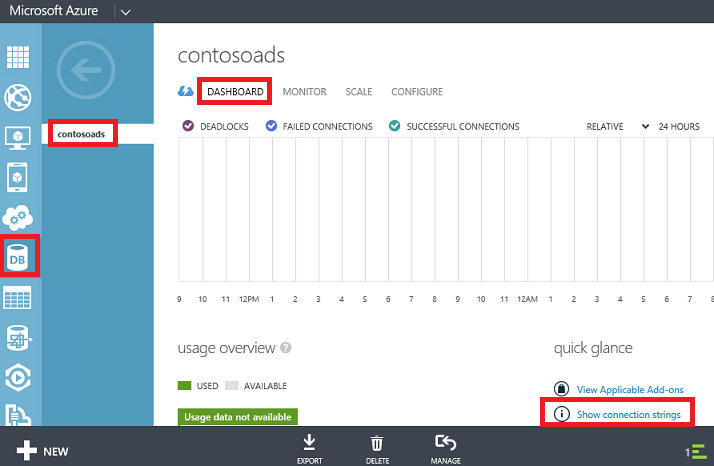
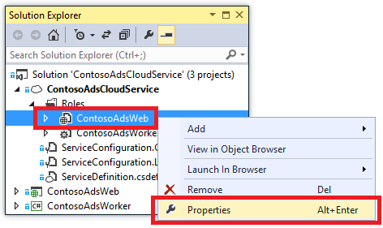
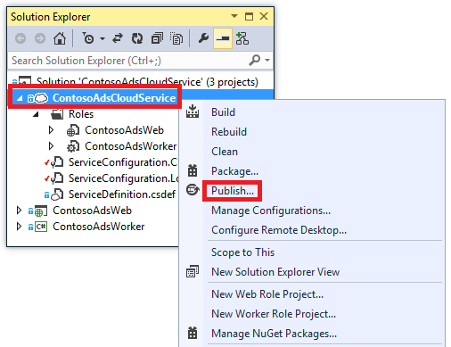
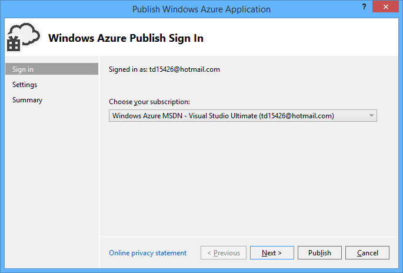

<properties
    pageTitle="Introdução aos serviços de nuvem do Azure e ASP.NET | Microsoft Azure"
    description="Aprenda a criar um aplicativo de várias camado usando ASP.NET MVC e Azure. O aplicativo é executado em um serviço de nuvem, com a função web e função de trabalho. Ele usa blobs e filas de estrutura de entidades, banco de dados SQL e armazenamento do Azure."
    services="cloud-services, storage"
    documentationCenter=".net"
    authors="Thraka"
    manager="timlt"
    editor=""/>

<tags
    ms.service="cloud-services"
    ms.workload="tbd"
    ms.tgt_pltfrm="na"
    ms.devlang="dotnet"
    ms.topic="hero-article"
    ms.date="06/10/2016"
    ms.author="adegeo"/>

# <a name="get-started-with-azure-cloud-services-and-aspnet"></a>Introdução aos serviços de nuvem do Azure e ASP.NET

> [AZURE.SELECTOR]
- [Node](cloud-services-nodejs-develop-deploy-app.md)
- [.NET](cloud-services-dotnet-get-started.md)

## <a name="overview"></a>Visão geral

Este tutorial mostra como criar um aplicativo do .NET de vários nível com um ASP.NET MVC front-end e implantá-lo em um [serviço de nuvem Azure](cloud-services-choose-me.md). O aplicativo usa o [serviço de fila do Azure](http://www.asp.net/aspnet/overview/developing-apps-with-windows-azure/building-real-world-cloud-apps-with-windows-azure/queue-centric-work-pattern), o [serviço do Azure Blob](http://www.asp.net/aspnet/overview/developing-apps-with-windows-azure/building-real-world-cloud-apps-with-windows-azure/unstructured-blob-storage)e [Azure SQL Database](http://msdn.microsoft.com/library/azure/ee336279). Você pode [baixar o projeto do Visual Studio](http://code.msdn.microsoft.com/Simple-Azure-Cloud-Service-e01df2e4) da Galeria de código do MSDN.

O tutorial mostra como criar e executar o aplicativo localmente, como implantá-lo para Azure e executar na nuvem e finalmente como criá-lo a partir do zero. Você pode começar criando do zero e fazer o teste e implantar etapas posteriormente, se você preferir.

## <a name="contoso-ads-application"></a>Aplicativo de anúncios de Contoso

O aplicativo é um BBS anúncios. Os usuários criar um anúncio digitando texto e carregar uma imagem. Eles podem ver uma lista de anúncios com imagens em miniatura e eles podem ver a imagem de tamanho máximo quando selecionam um anúncio para ver os detalhes.


O aplicativo usa o [padrão de trabalho centrados em fila](http://www.asp.net/aspnet/overview/developing-apps-with-windows-azure/building-real-world-cloud-apps-with-windows-azure/queue-centric-work-pattern) transfira o trabalho que requer muita CPU da criação de miniaturas para um processo de back-end.

## <a name="alternative-architecture-websites-and-webjobs"></a>Arquitetura alternativa: sites e WebJobs

Este tutorial mostra como executar front-end e back-end em um serviço de nuvem Azure. Uma alternativa é executado front-end em um [site do Azure](/services/web-sites/) e usar o recurso de [WebJobs](http://go.microsoft.com/fwlink/?LinkId=390226) (atualmente em preview) para back-end. Para um tutorial que usa WebJobs, consulte [Introdução ao SDK do WebJobs do Azure](../app-service-web/websites-dotnet-webjobs-sdk-get-started.md). Para obter informações sobre como escolher os serviços que melhor ajuste seu cenário, consulte [comparação de máquinas virtuais, serviços de nuvem e sites de Azure](../app-service-web/choose-web-site-cloud-service-vm.md).

## <a name="what-youll-learn"></a>O que você aprenderá

* Como habilitar o computador para desenvolvimento Azure instalando o SDK do Azure.
* Como criar um projeto de serviço de nuvem do Visual Studio com um ASP.NET MVC função web e uma função de trabalho.
* Como testar o projeto de serviço de nuvem localmente, usando o emulador de armazenamento do Azure.
* Como publicar o projeto de nuvem em um serviço de nuvem do Azure e teste usando uma conta de armazenamento do Azure.
* Como carregar arquivos e armazená-los no serviço do Azure Blob.
* Como usar o serviço de fila do Azure para comunicação entre camadas.

## <a name="prerequisites"></a>Pré-requisitos

O tutorial supõe que você compreender [conceitos básicos sobre os serviços de nuvem Azure](cloud-services-choose-me.md) como *funções da web* e *trabalhador* terminologia.  Ele também pressupõe que você saiba como trabalhar com projetos [ASP.NET MVC](http://www.asp.net/mvc/tutorials/mvc-5/introduction/getting-started) ou [Web Forms](http://www.asp.net/web-forms/tutorials/aspnet-45/getting-started-with-aspnet-45-web-forms/introduction-and-overview) no Visual Studio. O aplicativo de exemplo usa MVC, mas a maioria do tutorial também se aplica a formulários da Web.

Você pode executar o aplicativo localmente sem uma assinatura do Azure, mas será necessário um para implantar o aplicativo na nuvem. Se você não tiver uma conta, você pode [ativar seus benefícios de assinante MSDN](/pricing/member-offers/msdn-benefits-details/?WT.mc_id=A55E3C668) ou [inscrever-se para uma avaliação gratuita](/pricing/free-trial/?WT.mc_id=A55E3C668).

As instruções tutoriais trabalham com qualquer um dos seguintes produtos:

* Visual Studio 2013
* Visual Studio de 2015

Se você não tiver um desses, Visual Studio 2015 será instalado automaticamente quando você instala o SDK do Azure.

## <a name="application-architecture"></a>Arquitetura do aplicativo

O aplicativo armazena anúncios em um banco de dados do SQL, usando entidade Framework Code First para criar as tabelas e acessar os dados. Para cada anúncio o banco de dados armazena dois URLs, uma para a imagem em tamanho normal e outra para a miniatura.


Quando um usuário carrega uma imagem, a execução de front-end em uma função de web armazena a imagem em um [blob do Azure](http://www.asp.net/aspnet/overview/developing-apps-with-windows-azure/building-real-world-cloud-apps-with-windows-azure/unstructured-blob-storage)e armazena as informações de anúncio do banco de dados com uma URL que aponta para o blob. Ao mesmo tempo, ele grava uma mensagem para uma fila Azure. Um processo de back-end em execução em uma função de trabalho periodicamente controla a fila para novas mensagens. Quando uma nova mensagem for exibida, a função de trabalho cria uma miniatura de imagem e atualiza o campo de banco de dados do URL em miniatura para esse anúncio. O diagrama a seguir mostra como as partes do aplicativo interagem.


[AZURE.INCLUDE [install-sdk](../../includes/install-sdk-2015-2013.md)]

## <a name="download-and-run-the-completed-solution"></a>Baixar e executar a solução completa

1. Baixe e descompacte a [concluído solução](http://code.msdn.microsoft.com/Simple-Azure-Cloud-Service-e01df2e4).

2. Inicie o Visual Studio.

3. No menu **arquivo** escolher **Abrir projeto**, navegue até onde você baixou a solução e abra o arquivo de solução.

3. Pressione CTRL + SHIFT + B para criar a solução.

    Por padrão, o Visual Studio restaura automaticamente o conteúdo do pacote NuGet, que não foi incluído no arquivo *. zip* . Se os pacotes não restaurar, instalá-los manualmente indo para a caixa de diálogo **Gerenciar pacotes NuGet para solução** e clicar no botão **Restaurar** na parte superior direita.

3. No **Solution Explorer**, certifique-se de que **ContosoAdsCloudService** seja selecionado como o projeto de inicialização.

2. Se você estiver usando o Visual Studio de 2015, altere a cadeia de conexão do SQL Server no arquivo de *Web. config* do aplicativo do projeto ContosoAdsWeb e no arquivo *ServiceConfiguration.Local.cscfg* do projeto ContosoAdsCloudService. Em cada caso, altere "(localdb) \v11.0" para "\MSSQLLocalDB (localdb)".

1. Pressione CTRL + F5 para executar o aplicativo.

    Quando você executa um projeto de serviço de nuvem localmente, o Visual Studio chama automaticamente o Azure *Calcular emulador* e o Azure *emulador de armazenamento*. O emulador de computação usa recursos do computador para simular os ambientes de função de função e trabalhador da web. Emulador de armazenamento usa um banco de dados do [SQL Server Express LocalDB](http://msdn.microsoft.com/library/hh510202.aspx) para simular armazenamento em nuvem Azure.

    Na primeira vez que você executa um projeto de serviço de nuvem, demora um minuto mais ou menos para os emuladores iniciar. Quando terminar de inicialização de emulador, o navegador padrão abre à home page do aplicativo.

    

2. Clique em **criar um anúncio**.

2. Inserir alguns dados de teste e selecione uma imagem *. jpg* para carregar e clique em **criar**.

    

    O aplicativo vai para a página de índice, mas ele não mostra uma miniatura para o novo anúncio, pois que o processamento não foi aconteceu ainda.

3. Aguarde um momento e, em seguida, atualize a página de índice para ver a miniatura.

    

4. Clique em **detalhes** para o ad para ver a imagem em tamanho normal.

    

Você tiver sido executando o aplicativo inteiramente no seu computador local, com nenhuma conexão para a nuvem. Emulador de armazenamento armazena os dados de fila e blob em um banco de dados do SQL Server Express LocalDB e o aplicativo armazena os dados do ad em outro banco de dados de LocalDB. Entidade Framework Code First criada automaticamente o banco de dados do ad na primeira vez que o aplicativo web tentou acessá-lo.

Na seção a seguir, você irá configurar a solução para usar recursos de nuvem Azure para filas, blobs e o banco de dados do aplicativo quando ele é executado na nuvem. Se desejar continuar a executar localmente, mas usar recursos de armazenamento e o banco de dados de nuvem, você pode fazer isso; é apenas uma questão de configuração de cadeias de caracteres de conexão, você verá como fazer.

## <a name="deploy-the-application-to-azure"></a>Implantar o aplicativo do Azure

Você vai fazer as seguintes etapas para executar o aplicativo na nuvem:

* Crie um serviço de nuvem Azure.
* Crie um banco de dados do SQL Azure.
* Crie uma conta de armazenamento do Azure.
* Configure a solução para usar o banco de dados do SQL Azure quando ele é executado no Azure.
* Configure a solução para usar sua conta de armazenamento do Azure quando ele é executado no Azure.
* Implante o projeto seu serviço de nuvem Azure.

### <a name="create-an-azure-cloud-service"></a>Criar um serviço de nuvem do Azure

Um serviço de nuvem Azure é o ambiente que o aplicativo será executado em.

1. No navegador, abra o [portal clássico Azure](http://manage.windowsazure.com).

2. Clique em **Novo > calcular > serviço em nuvem > rápido criar**.

4. Na caixa de entrada de URL, digite um prefixo de URL.

    Essa URL deve ser exclusivo.  Você receberá uma mensagem de erro se o prefixo que você escolher já está em uso por outra pessoa.

5. Escolha a região onde você deseja implantar o aplicativo.

    Este campo especifica quais data center seu serviço de nuvem será hospedado no. Para um aplicativo de produção, escolha a região mais próxima aos seus clientes. Para este tutorial, escolha o mais próximo de região.

6. Clique em **Criar serviço na nuvem**.

    Na imagem a seguir, um serviço de nuvem é criado com o contosoads.cloudapp.net de URL.

    

### <a name="create-an-azure-sql-database"></a>Criar um banco de dados do SQL Azure

Quando o aplicativo é executado na nuvem, ele usará um banco de dados na nuvem.

1. No [portal do Azure clássico](http://manage.windowsazure.com), clique em **Novo > Serviços de dados > banco de dados SQL > criar rápida**.

1. Na caixa **Nome do banco de dados** , digite *contosoads*.

1. Na lista suspensa **servidor** , escolha **novo banco de dados do SQL server**.

    Como alternativa, se a sua assinatura já tiver um servidor, você pode selecionar o servidor na lista suspensa.

1. Escolha o mesmo **região** que você escolheu para o serviço de nuvem.

    Quando o serviço de nuvem e o banco de dados estão em diferentes dos data centers (diferentes regiões), latência aumentará e você será cobrado por largura de banda fora do data center. Largura de banda em um data center é gratuita.

1. Insira um **Nome de Login** de administrador e uma **senha**.

    Se você selecionou o **novo banco de dados do SQL server** que você não digitar um nome existente e senha aqui, você estiver inserindo um novo nome e senha que você está definindo agora para usar mais tarde quando você acessa o banco de dados. Se você selecionou um servidor que você criou anteriormente, você será solicitado a senha para a conta de usuário administrativo que você já tiver criado.

1. Clique em **Criar banco de dados SQL**.

    

1. Após Azure concluir a criação do banco de dados, clique na guia **Bancos de dados SQL** no painel esquerdo do portal e, em seguida, clique no nome do novo banco de dados.

2. Clique na guia do **painel** .

3. Clique em **Gerenciar endereços IP permitidos**.

4. Em **Serviços permitidos**, altere **Os serviços do Azure** para **Sim**.

5. Clique em **Salvar**.

### <a name="create-an-azure-storage-account"></a>Criar uma conta de armazenamento do Azure

Uma conta de armazenamento do Azure fornece recursos para armazenar dados fila e blob na nuvem.

Em um aplicativo do mundo real, você faria normalmente cria contas separadas para aplicativo dados versus dados de registro em log e separada contabilizam para dados de teste versus dados de produção. Para este tutorial, você usará apenas uma conta.

1. No [portal do Azure clássico](http://manage.windowsazure.com), clique em **Novo > Serviços de dados > armazenamento > criar rápida**.

4. Na caixa **URL** , digite um prefixo de URL.

    Esse prefixo, além do texto que você vê sob a caixa será a URL exclusiva para sua conta de armazenamento. Se o prefixo que você insira já foi usado por outra pessoa, você precisará escolher um prefixo diferente.

5. Defina a lista suspensa de **região** a mesma região que você escolheu para o serviço de nuvem.

    Quando a conta de armazenamento e serviços de nuvem estão em diferentes dos data centers (diferentes regiões), latência aumentará e você será cobrado por largura de banda fora do data center. Largura de banda em um data center é gratuita.

    Grupos de afinidade Azure fornecem um mecanismo para minimizar a distância entre recursos em um data center, que pode reduzir a latência. Este tutorial não usar grupos de afinidade. Para obter mais informações, consulte [como criar um grupo de afinidade no Azure](http://msdn.microsoft.com/library/jj156209.aspx).

6. Defina a lista suspensa de **replicação** **redundantes localmente**.

    Quando a localização geográfica replicação estiver habilitada para uma conta de armazenamento, o conteúdo armazenado é replicado para um data center secundário para habilitar o failover para esse local no caso de um desastre maior no local principal. Replicação geográfica pode provoca custos adicionais. Para contas de teste e desenvolvimento, geralmente não deseja pagar pela replicação geográfica. Para obter mais informações, consulte [criar, gerenciar, ou excluir uma conta de armazenamento](../storage/storage-create-storage-account.md#replication-options).

5. Clique em **Criar conta de armazenamento**.

    

    Na imagem, uma conta de armazenamento é criada com a URL `contosoads.core.windows.net`.

### <a name="configure-the-solution-to-use-your-azure-sql-database-when-it-runs-in-azure"></a>Configurar a solução para usar o banco de dados do SQL Azure quando ele é executado no Azure

O projeto da web e o projeto de função de trabalho tem sua própria cadeia de conexão de banco de dados, e cada precisa apontar para o banco de dados do SQL Azure quando o aplicativo é executado no Azure.

Você vai usar um [Web. config transformar](http://www.asp.net/mvc/tutorials/deployment/visual-studio-web-deployment/web-config-transformations) para a função da web e uma configuração de ambiente de serviço de nuvem para a função de trabalho.

>[AZURE.NOTE] Nesta seção e a próxima seção você armazena credenciais em arquivos de projeto. [Não armazenar dados confidenciais em repositórios de código de origem público](http://www.asp.net/aspnet/overview/developing-apps-with-windows-azure/building-real-world-cloud-apps-with-windows-azure/source-control#secrets).

1. No projeto ContosoAdsWeb, abra o arquivo de transformação de *Web.Release.config* para o arquivo de *Web. config* do aplicativo, excluir o bloco de comentário que contém uma `<connectionStrings>` elemento e cole o código a seguir em seu lugar.

    ```xml
    <connectionStrings>
        <add name="ContosoAdsContext" connectionString="{connectionstring}"
        providerName="System.Data.SqlClient" xdt:Transform="SetAttributes" xdt:Locator="Match(name)"/>
    </connectionStrings>
    ```

    Deixe o arquivo aberto para edição.

2. No [portal do Azure clássico](http://manage.windowsazure.com), clique em **Bancos de dados SQL** no painel esquerdo, clique o banco de dados que você criou para este tutorial, clique na guia do **painel** e, em seguida, clique em **Mostrar cadeias de caracteres de conexão**.

    

    O portal exibe cadeias de caracteres de conexão, com um espaço reservado para a senha.

    

4. Exclua o arquivo de transformação de *Web.Release.config* , `{connectionstring}` e cole em seu lugar a cadeia de conexão de ADO.NET do Azure portal clássico.

5. A cadeia de conexão que você colou para o arquivo de transformação *Web.Release.config* , substitua `{your_password_here}` com a senha que você criou para o novo banco de dados do SQL.

7. Salve o arquivo.  

6. Selecione e copie a cadeia de conexão (sem as aspas ao redor) para uso nas seguintes etapas para configurar o projeto de função de trabalho.

5. No **Solution Explorer**, em **funções** no projeto de serviço de nuvem, **ContosoAdsWorker** de atalho e, em seguida, clique em **Propriedades**.

    

6. Clique na guia **configurações** .

7. Alterar a **configuração do serviço** na **nuvem**.

7. Selecione o campo de **valor** para o `ContosoAdsDbConnectionString` configuração e cole a cadeia de conexão que você copiou na seção anterior do tutorial.

    

7. Salve as alterações.  

### <a name="configure-the-solution-to-use-your-azure-storage-account-when-it-runs-in-azure"></a>Configurar a solução para usar sua conta de armazenamento do Azure quando ele é executado no Azure

Cadeias de conexão de conta de armazenamento do Azure para o projeto de função da web e o projeto de função de trabalho são armazenadas em configurações de ambiente do projeto de serviço de nuvem. Para cada projeto, há um conjunto separado de configurações a serem usadas quando o aplicativo é executado localmente e quando ele é executado na nuvem. Você vai atualizar as configurações de ambiente de nuvem para web e trabalhador projetos de função.

1. No **Solution Explorer**, clique com botão direito **ContosoAdsWeb** em **funções** no projeto **ContosoAdsCloudService** e clique em **Propriedades**.

    

2. Clique na guia **configurações** . Na caixa suspensa **Configuração do serviço** , escolha a **nuvem**.

    

3. Selecione a entrada de **StorageConnectionString** , e você verá um botão de reticências (**…**) na extremidade direita da linha. Clique no botão de reticências para abrir a caixa de diálogo **Criar cadeia de Conexão de conta de armazenamento** .

    

4. Na caixa de diálogo **Criar cadeia de Conexão de armazenamento** , clique em **sua assinatura**, escolha a conta de armazenamento que você criou anteriormente e clique em **Okey**. Se você ainda não estiver conectado, você será solicitado para suas credenciais de conta do Microsoft Azure.

    

5. Salve as alterações.

6. Siga o mesmo procedimento que você usou para o `StorageConnectionString` cadeia de conexão para definir a `Microsoft.WindowsAzure.Plugins.Diagnostics.ConnectionString` cadeia de conexão.

    Essa cadeia de caracteres de conexão é usada para fazer logon.

7. Siga o mesmo procedimento que você usou para a função **ContosoAdsWeb** para definir as duas cadeias de caracteres de conexão para a função **ContosoAdsWorker** . Não se esqueça de definir a **Configuração do serviço** na **nuvem**.

As configurações de ambiente de função que você configurou usando a interface do usuário do Visual Studio são armazenadas nos seguintes arquivos no projeto ContosoAdsCloudService:

* *ServiceDefinition.csdef* - define os nomes de configuração.
* *ServiceConfiguration.Cloud.cscfg* - fornece valores para quando o aplicativo é executado na nuvem.
* *ServiceConfiguration.Local.cscfg* - fornece valores para quando o aplicativo é executado localmente.

Por exemplo, o ServiceDefinition.csdef inclui as seguintes definições.

```xml
<ConfigurationSettings>
    <Setting name="StorageConnectionString" />
    <Setting name="ContosoAdsDbConnectionString" />
</ConfigurationSettings>
```

E o arquivo de *ServiceConfiguration.Cloud.cscfg* inclui os valores que você inseriu para essas configurações no Visual Studio.

```xml
<Role name="ContosoAdsWorker">
    <Instances count="1" />
    <ConfigurationSettings>
        <Setting name="StorageConnectionString" value="{yourconnectionstring}" />
        <Setting name="ContosoAdsDbConnectionString" value="{yourconnectionstring}" />
        <!-- other settings not shown -->

    </ConfigurationSettings>
    <!-- other settings not shown -->

</Role>
```

O `<Instances>` configuração especifica o número de máquinas virtuais que Azure será executado código de função de trabalhador em. A seção [próximas etapas](#next-steps) inclui links para obter mais informações sobre o dimensionamento de um serviço de nuvem,

###  <a name="deploy-the-project-to-azure"></a>Implantar o projeto do Azure

1.  No **Solution Explorer**, clique com botão direito do projeto de nuvem **ContosoAdsCloudService** e selecione **Publicar**.

    

2. Na etapa do Assistente para **Publicar aplicativos do Azure** **entrar** , clique em **Avançar**.

    

3. Na etapa do Assistente de **configurações** , clique em **Avançar**.

    

    As configurações padrão na guia **Avançado** são pequeno para este tutorial. Para obter informações sobre a guia Avançado, consulte [Publicar Assistente de aplicativo do Azure](http://msdn.microsoft.com/library/hh535756.aspx).

4. Na etapa **Resumo** , clique em **Publicar**.

    

   A janela de **Log de atividade do Azure** abre no Visual Studio.

5. Clique no ícone de seta para a direita para expandir os detalhes de implantação.

    A implantação pode demorar até 5 minutos ou mais para ser concluída.

    

6. Quando o status da implantação for concluído, clique na **URL do Web app** para iniciar o aplicativo.

7. Agora você pode testar o aplicativo criando, exibindo e editando alguns anúncios, como você fez quando você executou o aplicativo localmente.

>[AZURE.NOTE] Quando tiver terminado de teste, exclua ou interromper o serviço de nuvem. Mesmo se você não estiver usando o serviço de nuvem, ela é acúmulo encargos porque os recursos de máquina virtual são reservados para ele. E se você deixar em execução, qualquer pessoa que encontra sua URL pode criar e exibir anúncios. No [portal de clássico Azure](http://manage.windowsazure.com), vá para a guia **painel** de seu serviço de nuvem e clique no botão **Excluir** na parte inferior da página. Se você quiser apenas temporariamente impedir que outras pessoas acessem o site, clique em **Parar** . Nesse caso, encargos continuará a acumular. Você pode seguir um procedimento semelhante para excluir a conta de armazenamento e banco de dados do SQL quando você não precisa-los.

## <a name="create-the-application-from-scratch"></a>Criar o aplicativo do zero

Se você ainda não estiver baixado [o aplicativo concluído](http://code.msdn.microsoft.com/Simple-Azure-Cloud-Service-e01df2e4), faça isso agora. Você vai copiar arquivos do projeto baixado no novo projeto.

Criar o aplicativo de anúncios de Contoso envolve as seguintes etapas:

* Crie uma solução de Visual Studio de serviço de nuvem.
* Atualizar e adicione pacotes do NuGet.
* Referências de projeto do conjunto.
* Configure cadeias de caracteres de conexão.
* Adicione arquivos de código.

Depois que a solução for criada, você deverá revisar o código exclusiva para projetos de serviço de nuvem e blobs Azure e filas.

### <a name="create-a-cloud-service-visual-studio-solution"></a>Criar uma solução de Visual Studio de serviço de nuvem

1. No Visual Studio, escolha **Novo projeto** no menu **arquivo** .

2. No painel esquerdo da caixa de diálogo **Novo projeto** , expanda **Visual c#** e escolha modelos de **nuvem** e, em seguida, escolha o modelo de **Serviço de nuvem do Azure** .

3. Nome do projeto e a solução ContosoAdsCloudService e clique em **Okey**.

    

4. Na caixa de diálogo **Novo serviço de nuvem do Azure** , adicione uma função web e uma função de trabalho. Nomeie a função de web ContosoAdsWeb e nomeie a função de trabalho ContosoAdsWorker. (Use o ícone de lápis no painel direito para alterar os nomes padrão das funções.)

    

5. Quando você vir a caixa de diálogo **Novo projeto ASP.NET** para a função da web, escolha o modelo MVC e, em seguida, clique em **Autenticação de alteração**.

    

7. Na caixa de diálogo **Alterar autenticação** , escolha **Sem autenticação**e clique em **Okey**.

    

8. Na caixa de diálogo **Novo projeto ASP.NET** , clique em **Okey**.

9. No **Solution Explorer**, clique com botão direito a solução (não um dos projetos) e escolha **Adicionar - novo projeto**.

11. Na caixa de diálogo **Add New Project** , escolha **Windows** em **Visual c#** no painel esquerdo e, em seguida, clique no modelo de **Biblioteca de classes** .  

10. Nomeie o projeto *ContosoAdsCommon*e clique em **Okey**.

    Você precisará fazer referência o contexto de estrutura de entidade e o modelo de dados da web e trabalhador projetos de função. Como alternativa, você pode definir as classes relacionadas EF no projeto de função da web e referência projeto a partir do projeto de função de trabalho. Mas na abordagem alternativa, seu projeto de função de trabalho terá uma referência a montagens de web que não precisa.

### <a name="update-and-add-nuget-packages"></a>Atualizar e adicionar pacotes do NuGet

1. Abra a caixa de diálogo **Gerenciar pacotes do NuGet** para a solução.

2. Na parte superior da janela, selecione **atualizações**.

3. Procure o pacote de *WindowsAzure.Storage* e se ele estiver na lista, selecione-os projetos da web e trabalhador para atualizá-lo em e selecione, em seguida, clique em **Atualizar**.

    A biblioteca de cliente do armazenamento é atualizada mais de modelos de projeto do Visual Studio, para que você normalmente encontrará que a versão em uma recém-criado projetada precisam ser atualizados.

4. Na parte superior da janela, selecione **Procurar**.

5. Localize o pacote de NuGet *EntityFramework* e instalá-lo em todos os três projetos.

6. Localize o pacote de NuGet *Microsoft.WindowsAzure.ConfigurationManager* e instalá-lo do projeto de função de trabalho.

### <a name="set-project-references"></a>Referências de projeto de conjunto

1. No projeto ContosoAdsWeb, defina uma referência ao projeto ContosoAdsCommon. O projeto de ContosoAdsWeb de atalho e, em seguida, clique em **referências** - **Adicionar referências**. Na caixa de diálogo **Gerenciador de referência** , selecione **solução – projetos** no painel esquerdo, selecione **ContosoAdsCommon**e clique em **Okey**.

2. No projeto ContosoAdsWorker, defina uma referência ao projeto ContosAdsCommon.

    ContosoAdsCommon conterá a estrutura de entidade dados modelo e contexto de classe, que será usada pelo front-end e back-end.

3. No projeto ContosoAdsWorker, defina uma referência `System.Drawing`.

    Este assembly é usado pelo back-end para converter imagens em miniaturas.

### <a name="configure-connection-strings"></a>Configurar cadeias de caracteres de conexão

Nesta seção você configurar o armazenamento do Azure e SQL cadeias de caracteres de conexão para teste localmente. As instruções de implantação anteriormente no tutorial explicam como configurar as cadeias de caracteres de conexão para quando o aplicativo é executado na nuvem.

1. No projeto ContosoAdsWeb, abra o arquivo Web. config do aplicativo e insira o seguinte `connectionStrings` elemento após o `configSections` elemento.

    ```xml
    <connectionStrings>
        <add name="ContosoAdsContext" connectionString="Data Source=(localdb)\v11.0; Initial Catalog=ContosoAds; Integrated Security=True; MultipleActiveResultSets=True;" providerName="System.Data.SqlClient" />
    </connectionStrings>
    ```

    Se você estiver usando o Visual Studio de 2015, substitua "v11.0" por "MSSQLLocalDB".

2. Salve as alterações.

3. No projeto ContosoAdsCloudService, ContosoAdsWeb em **funções**de atalho e, em seguida, clique em **Propriedades**.

    

4. Na janela de propriedades **ContosAdsWeb [função]** , clique na guia **configurações** e clique em **Adicionar configuração**.

    Deixe o conjunto de **Configuração do serviço** para **Todas as configurações**.

5. Adicione uma nova configuração denominada *StorageConnectionString*. Definir **tipo** para *ConnectionString*e defina o **valor** *seja UseDevelopmentStorage = true*.

    

6. Salve as alterações.

7. Siga o mesmo procedimento para adicionar uma cadeia de conexão de armazenamento nas propriedades de função ContosoAdsWorker.

8. Ainda na janela de propriedades **ContosoAdsWorker [função]** , adicione outra cadeia de caracteres de conexão:

    * Nome: ContosoAdsDbConnectionString
    * Tipo: cadeia de caracteres
    * Valor: Cole a mesma cadeia de conexão que você usou para o projeto de função web. (O exemplo a seguir para Visual Studio 2013; não se esqueça de alterar a fonte de dados se você copiar este exemplo e você estiver usando o Visual Studio 2015.)

        ```
        Data Source=(localdb)\v11.0; Initial Catalog=ContosoAds; Integrated Security=True; MultipleActiveResultSets=True;
        ```

### <a name="add-code-files"></a>Adicionar arquivos de código

Nesta seção você copie arquivos de código da solução baixada para a nova solução. As seções a seguir mostrará e explicam principais partes desse código.

Para adicionar arquivos a um projeto ou uma pasta, clique com botão direito do projeto ou a pasta e clique em **Adicionar** - **Item existente**. Selecione os arquivos que você deseja e clique em **Adicionar**. Se for solicitado se você deseja substituir arquivos existentes, clique em **Sim**.

3. No projeto ContosoAdsCommon, exclua o arquivo *Class1. cs* e adicionar no seu lugar os arquivos *Ad.cs* e *ContosoAdscontext.cs* do projeto baixado.

3. No projeto ContosoAdsWeb, adicione os seguintes arquivos do projeto baixado.
    - *Global.asax.cs*.  
    - Na pasta *Views\Shared* : * \_Layout.cshtml*.
    - Na pasta *Views\Home* : *cshtml*.
    - Na pasta *controladores* : *AdController.cs*.
    - Na pasta *Views\Ad* (criar pasta primeiro): cinco arquivos *. cshtml* .

3. No projeto ContosoAdsWorker, adicione *WorkerRole.cs* do projeto baixado.

Agora você pode criar e executar o aplicativo, conforme indicado anteriormente no tutorial, e o aplicativo usará recursos de emulador de armazenamento e banco de dados local.

As seções a seguir explicam o código relacionado ao trabalhar com o ambiente do Azure, blobs e filas. Este tutorial não explicam como criar exibições usando a estrutura, como escrever código de estrutura de entidade que funciona com bancos de dados do SQL Server ou Noções básicas de programação assíncrona em ASP.NET 4,5 e controladores MVC. Para obter informações sobre esses tópicos, consulte os seguintes recursos:

* [Introdução ao MVC 5](http://www.asp.net/mvc/tutorials/mvc-5/introduction/getting-started)
* [Introdução ao EF 6 e 5 de MVC](http://www.asp.net/mvc/tutorials/getting-started-with-ef-using-mvc)
* [Introdução ao assíncrona programação em .NET 4,5](http://www.asp.net/aspnet/overview/developing-apps-with-windows-azure/building-real-world-cloud-apps-with-windows-azure/web-development-best-practices#async).

### <a name="contosoadscommon---adcs"></a>ContosoAdsCommon - Ad.cs

O arquivo de Ad.cs define uma enumeração para categorias de ad e uma classe de entidade POCO para obter informações do ad.

```csharp
public enum Category
{
    Cars,
    [Display(Name="Real Estate")]
    RealEstate,
    [Display(Name = "Free Stuff")]
    FreeStuff
}

public class Ad
{
    public int AdId { get; set; }

    [StringLength(100)]
    public string Title { get; set; }

    public int Price { get; set; }

    [StringLength(1000)]
    [DataType(DataType.MultilineText)]
    public string Description { get; set; }

    [StringLength(1000)]
    [DisplayName("Full-size Image")]
    public string ImageURL { get; set; }

    [StringLength(1000)]
    [DisplayName("Thumbnail")]
    public string ThumbnailURL { get; set; }

    [DataType(DataType.Date)]
    [DisplayFormat(DataFormatString = "{0:yyyy-MM-dd}", ApplyFormatInEditMode = true)]
    public DateTime PostedDate { get; set; }

    public Category? Category { get; set; }
    [StringLength(12)]
    public string Phone { get; set; }
}
```

### <a name="contosoadscommon---contosoadscontextcs"></a>ContosoAdsCommon - ContosoAdsContext.cs

A classe ContosoAdsContext Especifica que a classe de Ad é usada em um conjunto de DbSet, estrutura de entidade armazenará em um banco de dados do SQL.

```csharp
public class ContosoAdsContext : DbContext
{
    public ContosoAdsContext() : base("name=ContosoAdsContext")
    {
    }
    public ContosoAdsContext(string connString)
        : base(connString)
    {
    }
    public System.Data.Entity.DbSet<Ad> Ads { get; set; }
}
```

A classe tem dois construtores. A primeira delas é usada pelo projeto da web e especifica o nome de uma cadeia de conexão que está armazenado no arquivo Web. config. O segundo construtor permite passar na cadeia de conexão real. Que é necessário pelo projeto de função de trabalho, desde que ela não tem um arquivo Web. config. Você viu anteriormente onde essa cadeia de caracteres de conexão foi armazenada, e você verá posteriormente como o código recupera a cadeia de conexão quando ele cria uma instância da classe DbContext.

### <a name="contosoadsweb---globalasaxcs"></a>ContosoAdsWeb - Global.asax.cs

Código que é chamado do `Application_Start` método cria um contêiner de blob de *imagens* e uma fila de *imagens* , caso ainda não existam. Isso garante que sempre que você começar a usar uma nova conta de armazenamento ou começar a usar o emulador de armazenamento em um novo computador, o contêiner de blob necessários e fila serão criados automaticamente.

O código obtém acesso à conta de armazenamento, usando a cadeia de conexão de armazenamento do arquivo *.cscfg* .

```csharp
var storageAccount = CloudStorageAccount.Parse
    (RoleEnvironment.GetConfigurationSettingValue("StorageConnectionString"));
```

Em seguida, ele obtém uma referência para o contêiner de blob de *imagens* , cria o contêiner se ele ainda não exista e define as permissões de acesso no contêiner de novo. Por padrão, novos contêineres só permitem acesso blobs de clientes com credenciais de conta de armazenamento. O site precisa os blobs seja público para que ele possa exibir imagens usando URLs que apontam para os blobs de imagem.

```csharp
var blobClient = storageAccount.CreateCloudBlobClient();
var imagesBlobContainer = blobClient.GetContainerReference("images");
if (imagesBlobContainer.CreateIfNotExists())
{
    imagesBlobContainer.SetPermissions(
        new BlobContainerPermissions
        {
            PublicAccess =BlobContainerPublicAccessType.Blob
        });
}
```

Código semelhante obtém uma referência para a fila de *imagens* e cria uma nova fila. Nesse caso, nenhuma alteração de permissões é necessária.

```csharp
CloudQueueClient queueClient = storageAccount.CreateCloudQueueClient();
var imagesQueue = queueClient.GetQueueReference("images");
imagesQueue.CreateIfNotExists();
```

### <a name="contosoadsweb---layoutcshtml"></a>ContosoAdsWeb - \_Layout.cshtml

O arquivo *cshtml* define o nome do aplicativo no cabeçalho e rodapé e cria uma entrada de menu "Anúncios".

### <a name="contosoadsweb---viewshomeindexcshtml"></a>ContosoAdsWeb - Views\Home\Index.cshtml

O arquivo de *Views\Home\Index.cshtml* exibe links de categoria na home page. Os links de passam o valor inteiro do `Category` enumeração em uma variável de sequência de consulta para a página de índice de anúncios.

```razor
<li>@Html.ActionLink("Cars", "Index", "Ad", new { category = (int)Category.Cars }, null)</li>
<li>@Html.ActionLink("Real estate", "Index", "Ad", new { category = (int)Category.RealEstate }, null)</li>
<li>@Html.ActionLink("Free stuff", "Index", "Ad", new { category = (int)Category.FreeStuff }, null)</li>
<li>@Html.ActionLink("All", "Index", "Ad", null, null)</li>
```

### <a name="contosoadsweb---adcontrollercs"></a>ContosoAdsWeb - AdController.cs

No *AdController.cs* as chamadas de construtor de arquivo a `InitializeStorage` método para criar objetos de biblioteca de cliente de armazenamento do Azure que fornecem uma API para trabalhar com blobs e filas.

Em seguida, o código obtém uma referência ao contêiner de blob de *imagens* , como você viu anteriormente em *Global.asax.cs*. Ao fazer que define um padrão [Repetir política](http://www.asp.net/aspnet/overview/developing-apps-with-windows-azure/building-real-world-cloud-apps-with-windows-azure/transient-fault-handling) apropriado para um aplicativo web. A política padrão de repetição de retirada exponencial pode travar o aplicativo web por mais de um minuto em tentativas para uma falha temporária. A política de repetição especificada aqui aguarda 3 segundos após cada tentar para até 3 tentativas.

```csharp
var blobClient = storageAccount.CreateCloudBlobClient();
blobClient.DefaultRequestOptions.RetryPolicy = new LinearRetry(TimeSpan.FromSeconds(3), 3);
imagesBlobContainer = blobClient.GetContainerReference("images");
```

Código semelhante obtém uma referência para a fila de *imagens* .

```csharp
CloudQueueClient queueClient = storageAccount.CreateCloudQueueClient();
queueClient.DefaultRequestOptions.RetryPolicy = new LinearRetry(TimeSpan.FromSeconds(3), 3);
imagesQueue = queueClient.GetQueueReference("images");
```

A maioria do código do controlador é típico para trabalhar com um modelo de dados de estrutura de entidades usando uma classe DbContext. Uma exceção é o HttpPost `Create` método, que carrega um arquivo e salva no armazenamento de blob. O fichário de modelo fornece um objeto de [HttpPostedFileBase](http://msdn.microsoft.com/library/system.web.httppostedfilebase.aspx) para o método.

```csharp
[HttpPost]
[ValidateAntiForgeryToken]
public async Task<ActionResult> Create(
    [Bind(Include = "Title,Price,Description,Category,Phone")] Ad ad,
    HttpPostedFileBase imageFile)
```

Se o usuário selecionado um arquivo para carregar, o código carrega o arquivo, salva em um blob e atualiza o registro de banco de dados do Ad com uma URL que aponta para o blob.

```csharp
if (imageFile != null && imageFile.ContentLength != 0)
{
    blob = await UploadAndSaveBlobAsync(imageFile);
    ad.ImageURL = blob.Uri.ToString();
}
```

O código que faz o carregamento está na `UploadAndSaveBlobAsync` método. Ele cria um nome GUID para o blob, carrega e salva o arquivo e retorna uma referência para o blob salvo.

```csharp
private async Task<CloudBlockBlob> UploadAndSaveBlobAsync(HttpPostedFileBase imageFile)
{
    string blobName = Guid.NewGuid().ToString() + Path.GetExtension(imageFile.FileName);
    CloudBlockBlob imageBlob = imagesBlobContainer.GetBlockBlobReference(blobName);
    using (var fileStream = imageFile.InputStream)
    {
        await imageBlob.UploadFromStreamAsync(fileStream);
    }
    return imageBlob;
}
```

Após o HttpPost `Create` método carrega um blob e atualiza o banco de dados, ela cria uma mensagem de fila para informar esse processo de back-end que uma imagem está pronta para a conversão em uma miniatura.

```csharp
string queueMessageString = ad.AdId.ToString();
var queueMessage = new CloudQueueMessage(queueMessageString);
await queue.AddMessageAsync(queueMessage);
```

O código para o HttpPost `Edit` método é semelhante, exceto que se o usuário selecionar um novo arquivo de imagem qualquer bolhas que já existem devem ser excluídas.

```csharp
if (imageFile != null && imageFile.ContentLength != 0)
{
    await DeleteAdBlobsAsync(ad);
    imageBlob = await UploadAndSaveBlobAsync(imageFile);
    ad.ImageURL = imageBlob.Uri.ToString();
}
```

O exemplo a seguir mostra o código que exclui blobs quando você exclui um anúncio.

```csharp
private async Task DeleteAdBlobsAsync(Ad ad)
{
    if (!string.IsNullOrWhiteSpace(ad.ImageURL))
    {
        Uri blobUri = new Uri(ad.ImageURL);
        await DeleteAdBlobAsync(blobUri);
    }
    if (!string.IsNullOrWhiteSpace(ad.ThumbnailURL))
    {
        Uri blobUri = new Uri(ad.ThumbnailURL);
        await DeleteAdBlobAsync(blobUri);
    }
}
private static async Task DeleteAdBlobAsync(Uri blobUri)
{
    string blobName = blobUri.Segments[blobUri.Segments.Length - 1];
    CloudBlockBlob blobToDelete = imagesBlobContainer.GetBlockBlobReference(blobName);
    await blobToDelete.DeleteAsync();
}
```

### <a name="contosoadsweb---viewsadindexcshtml-and-detailscshtml"></a>ContosoAdsWeb - Views\Ad\Index.cshtml e Details.cshtml

O arquivo *cshtml* exibe miniaturas com os outros dados do ad.

```razor

```

O arquivo de *Details.cshtml* exibe a imagem em tamanho normal.

```razor

```

### <a name="contosoadsweb---viewsadcreatecshtml-and-editcshtml"></a>ContosoAdsWeb - Views\Ad\Create.cshtml e Edit.cshtml

Os arquivos *Create.cshtml* e *Edit.cshtml* especificam a codificação do formulário que permite que o controlador obter o `HttpPostedFileBase` objeto.

```razor
@using (Html.BeginForm("Create", "Ad", FormMethod.Post, new { enctype = "multipart/form-data" }))
```

Um `<input>` elemento informa o navegador para fornecer uma caixa de diálogo de seleção de arquivo.

```razor
<input type="file" name="imageFile" accept="image/*" class="form-control fileupload" />
```

### <a name="contosoadsworker---workerrolecs---onstart-method"></a>Método de OnStart ContosoAdsWorker - WorkerRole.cs-

As chamadas de ambiente de função do Azure trabalhador a `OnStart` método na `WorkerRole` classe quando a função de trabalho é Introdução e chama o `Run` método quando o `OnStart` método terminar.

O `OnStart` método obtém a cadeia de conexão de banco de dados do arquivo *.cscfg* e passa para a classe de entidade Framework DbContext. O provedor do SQLClient é usado por padrão, para que o provedor não precisa ser especificado.

```csharp
var dbConnString = CloudConfigurationManager.GetSetting("ContosoAdsDbConnectionString");
db = new ContosoAdsContext(dbConnString);
```

Depois que o método obtém uma referência para a conta de armazenamento e cria o contêiner de blob e fila caso eles não existam. O código para isso é semelhante ao que você já viu na função web `Application_Start` método.

### <a name="contosoadsworker---workerrolecs---run-method"></a>ContosoAdsWorker - WorkerRole.cs - executar método

O `Run` método é chamado quando o `OnStart` método terminar seu trabalho de inicialização. O método executa um loop infinito que inspeções para novas mensagens de fila e processos-los quando chegarem.

```csharp
public override void Run()
{
    CloudQueueMessage msg = null;

    while (true)
    {
        try
        {
            msg = this.imagesQueue.GetMessage();
            if (msg != null)
            {
                ProcessQueueMessage(msg);
            }
            else
            {
                System.Threading.Thread.Sleep(1000);
            }
        }
        catch (StorageException e)
        {
            if (msg != null && msg.DequeueCount > 5)
            {
                this.imagesQueue.DeleteMessage(msg);
            }
            System.Threading.Thread.Sleep(5000);
        }
    }
}
```

Após cada iteração do loop, se nenhuma mensagem de fila foi encontrada, o programa suspende por um segundo. Isso impede que a função de trabalho excessiva CPU tempo e armazenamento transação os custos decorridos. A equipe de comunicado de cliente do Microsoft informa uma história sobre um desenvolvedor que se esqueceram de incluir isso, implantados em produção e para a esquerda para as férias. Quando ele se voltar, sua supervisão custa mais que as férias.

Às vezes, o conteúdo de uma mensagem de fila causa um erro no processamento. Isso é chamado de uma *mensagem suspeita*, e se você apenas efetuado um erro e reiniciado o loop, você poderia indefinidamente tente processar essa mensagem.  Portanto, o bloco de variável inclui um se instrução que verifica para ver quantas vezes o aplicativo tentou processar a mensagem atual e se ele tiver sido mais de 5 vezes, a mensagem é excluída da fila.

`ProcessQueueMessage`é chamado quando uma mensagem de fila for encontrada.

```csharp
private void ProcessQueueMessage(CloudQueueMessage msg)
{
    var adId = int.Parse(msg.AsString);
    Ad ad = db.Ads.Find(adId);
    if (ad == null)
    {
        throw new Exception(String.Format("AdId {0} not found, can't create thumbnail", adId.ToString()));
    }

    CloudBlockBlob inputBlob = this.imagesBlobContainer.GetBlockBlobReference(ad.ImageURL);

    string thumbnailName = Path.GetFileNameWithoutExtension(inputBlob.Name) + "thumb.jpg";
    CloudBlockBlob outputBlob = this.imagesBlobContainer.GetBlockBlobReference(thumbnailName);

    using (Stream input = inputBlob.OpenRead())
    using (Stream output = outputBlob.OpenWrite())
    {
        ConvertImageToThumbnailJPG(input, output);
        outputBlob.Properties.ContentType = "image/jpeg";
    }

    ad.ThumbnailURL = outputBlob.Uri.ToString();
    db.SaveChanges();

    this.imagesQueue.DeleteMessage(msg);
}
```

Este código lê o banco de dados para obter a URL da imagem, converte a imagem em uma miniatura, salva a miniatura em um blob, atualiza o banco de dados com a URL de blob miniaturas e exclui a mensagem da fila.

>[AZURE.NOTE] O código a `ConvertImageToThumbnailJPG` método usa classes no namespace Drawing para simplicidade. No entanto, as classes neste namespace foram projetadas para uso com formulários do Windows. Eles não são suportados para uso em um serviço Windows ou do ASP.NET. Para obter mais informações sobre opções de processamento de imagem, consulte [Geração de imagem dinâmica](http://www.hanselman.com/blog/BackToBasicsDynamicImageGenerationASPNETControllersRoutingIHttpHandlersAndRunAllManagedModulesForAllRequests.aspx) e [Profunda dentro de redimensionamento de imagem](http://www.hanselminutes.com/313/deep-inside-image-resizing-and-scaling-with-aspnet-and-iis-with-imageresizingnet-author-na).

## <a name="troubleshooting"></a>Solução de problemas

Caso algo não funciona enquanto você está seguindo as instruções neste tutorial, aqui estão alguns erros comuns e como resolvê-los.

### <a name="serviceruntimeroleenvironmentexception"></a>ServiceRuntime.RoleEnvironmentException

O `RoleEnvironment` objeto é fornecido por Azure quando você executa um aplicativo no Azure ou quando você executa localmente usando o emulador de computação Azure.  Se você receber esse erro quando você estiver executando localmente, certifique-se de que você definiu o projeto ContosoAdsCloudService como o projeto de inicialização. Define o projeto para executar usando o emulador de computação Azure.

Uma das coisas que o aplicativo usa a RoleEnvironment do Azure para é obter a conexão valores de cadeia de caracteres que são armazenadas em arquivos *.cscfg* , portanto outra causa essa exceção é uma cadeia de conexão ausente. Certifique-se de que você criou configurações Local e a configuração de StorageConnectionString de nuvem tanto no projeto ContosoAdsWeb e que você criou as duas cadeias de caracteres de conexão para ambas as configurações do projeto ContosoAdsWorker. Se você fizer uma pesquisa **Localizar tudo** para StorageConnectionString em toda a solução, você deve ver-9 vezes em 6 arquivos.

### <a name="cannot-override-to-port-xxx-new-port-below-minimum-allowed-value-8080-for-protocol-http"></a>Não é possível substituir a porta xxx. Nova porta abaixo o valor mínimo permitido 8080 para protocolo http

Tente alterar o número da porta usado pelo projeto da web. Clique com botão direito no projeto ContosoAdsWeb e clique em **Propriedades**. Clique na guia **Web** e, em seguida, altere o número da porta na configuração da **Url do Project** .

Para outra alternativa que pode resolver o problema, consulte a seção a seguir.

### <a name="other-errors-when-running-locally"></a>Outros erros durante a execução localmente

Por nuvem novo padrão projetos serviço usam computação Azure emulador expressa para simular o ambiente do Azure. Esta é uma versão leve do emulador computação completo e em algumas condições, o emulador completo funcionarão quando a versão express não.  

Para alterar o projeto para usar o emulador inteiro, clique com botão direito no projeto ContosoAdsCloudService e clique em **Propriedades**. Na janela **Properties** clique na guia **Web** e, em seguida, clique no botão de rádio de **Emulador completo de uso** .

Para executar o aplicativo com o emulador completo, você tem que abrir o Visual Studio com privilégios de administrador.

## <a name="next-steps"></a>Próximas etapas

O aplicativo de anúncios de Contoso tem intencionalmente foram mantido simple para um tutorial guia de Introdução. Por exemplo, ela não implementar o [repositório e unidade de padrões de trabalho](http://www.asp.net/mvc/tutorials/getting-started-with-ef-using-mvc/advanced-entity-framework-scenarios-for-an-mvc-web-application#repo)ou [inserção de dependência](http://www.asp.net/mvc/tutorials/hands-on-labs/aspnet-mvc-4-dependency-injection) , não [usar uma interface para o registro em log](http://www.asp.net/aspnet/overview/developing-apps-with-windows-azure/building-real-world-cloud-apps-with-windows-azure/monitoring-and-telemetry#log), ele não usar [EF código primeiro migrações](http://www.asp.net/mvc/tutorials/getting-started-with-ef-using-mvc/migrations-and-deployment-with-the-entity-framework-in-an-asp-net-mvc-application) para gerenciar alterações de modelo de dados ou [EF Conexão resiliência](http://www.asp.net/mvc/tutorials/getting-started-with-ef-using-mvc/connection-resiliency-and-command-interception-with-the-entity-framework-in-an-asp-net-mvc-application) gerenciar erros de rede temporário e assim por diante.

Aqui estão alguns aplicativos de amostra de serviço de nuvem que demonstram mais práticas de codificação reais, listadas do menos complexo para o mais complexo:

* [PhluffyFotos](http://code.msdn.microsoft.com/PhluffyFotos-Sample-7ecffd31). Semelhante em conceito a anúncios de Contoso mas implementa mais recursos e mais práticas de codificação do mundo real.
* [Aplicativo de vários níveis de serviço de nuvem azure com tabelas, filas e Blobs](http://code.msdn.microsoft.com/windowsazure/Windows-Azure-Multi-Tier-eadceb36). Introduz filas bem como blobs e tabelas de armazenamento do Azure. Com base em uma versão mais antiga do SDK do Azure para .NET, exigirão algumas modificações para funcionar com a versão atual.
* [Fundamentos de serviço de nuvem do Microsoft Azure](http://code.msdn.microsoft.com/Cloud-Service-Fundamentals-4ca72649). Uma amostra abrangente demonstrando uma ampla variedade de práticas recomendadas, produzidos pelo grupo Microsoft Patterns and Practices.

Para obter informações gerais sobre como desenvolver para a nuvem, consulte [Aplicativos de nuvem de reais de construção com o Azure](http://www.asp.net/aspnet/overview/developing-apps-with-windows-azure/building-real-world-cloud-apps-with-windows-azure/introduction).

Para um vídeo de Introdução ao armazenamento do Azure melhor práticas e padrões, consulte o [Armazenamento do Microsoft Azure – novidades, práticas recomendadas e padrões](http://channel9.msdn.com/Events/Build/2014/3-628).

Para obter mais informações, consulte os seguintes recursos:

* [Serviços de nuvem Azure parte 1: Introdução](http://justazure.com/microsoft-azure-cloud-services-part-1-introduction/)
* [Como gerenciar serviços de nuvem](cloud-services-how-to-manage.md)
* [Armazenamento do Azure](/documentation/services/storage/)
* [Como escolher um provedor de serviços de nuvem](https://azure.microsoft.com/overview/choosing-a-cloud-service-provider/)
