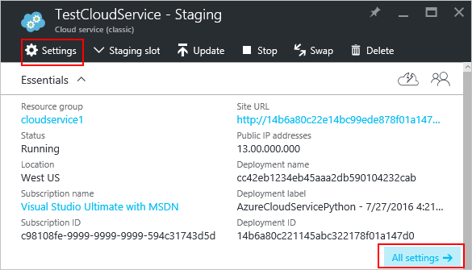

<properties 
    pageTitle="Como configurar um serviço de nuvem (portal) | Microsoft Azure" 
    description="Saiba como configurar os serviços de nuvem no Azure. Saiba como atualizar a configuração de serviço de nuvem e configurar o acesso remoto a instâncias de função. Esses exemplos usam o portal do Azure." 
    services="cloud-services" 
    documentationCenter="" 
    authors="Thraka" 
    manager="timlt" 
    editor=""/>

<tags 
    ms.service="cloud-services" 
    ms.workload="tbd" 
    ms.tgt_pltfrm="na" 
    ms.devlang="na" 
    ms.topic="article" 
    ms.date="10/11/2016"
    ms.author="adegeo"/>

# Como configurar os serviços de nuvem

> [AZURE.SELECTOR]
- [Portal do Azure](cloud-services-how-to-configure-portal.md)
- [Azure portal clássico](cloud-services-how-to-configure.md)

Você pode configurar as configurações mais comumente usadas para um serviço de nuvem no portal do Azure. Ou, se você deseja atualizar seus arquivos de configuração diretamente, baixar um arquivo de configuração do serviço para atualizar, carregue o arquivo atualizado e atualizar o serviço de nuvem com as alterações de configuração. De qualquer forma, as atualizações de configuração são enviadas para todas as instâncias de função.

Você também pode gerenciar as instâncias de suas funções de serviço de nuvem ou área de trabalho remota neles.

Azure só pode garantir disponibilidade do serviço 99,95% durante as atualizações de configuração se você tiver pelo menos duas instâncias de função para cada função. Que permite que uma máquina virtual processar solicitações de cliente, enquanto o outro está sendo atualizado. Para obter mais informações, consulte [Os contratos de nível de serviço](https://azure.microsoft.com/support/legal/sla/).

## Alterar um serviço de nuvem

Depois de abrir o [portal do Azure](https://portal.azure.com/), navegue até seu serviço de nuvem. A partir daqui, você gerencia muitos aspectos dele. 

Os links de **configurações** ou **todas as configurações** abrirá a lâmina de **configurações** onde você pode alterar as **Propriedades**, alterar a **configuração**, gerenciar os **certificados**, configuração de **regras de alerta**e gerenciar os **usuários** que têm acesso a este serviço de nuvem.

>[AZURE.NOTE]
>O sistema operacional usado para o serviço de nuvem não podem ser alterado usando o **portal do Azure**, você só pode alterar essa configuração por meio do [Azure portal clássico](http://manage.windowsazure.com/). Isso é detalhado [aqui](cloud-services-how-to-configure.md#update-a-cloud-service-configuration-file).

## Monitoramento

Você pode adicionar alertas para seu serviço de nuvem. Clique em **configurações** > **Regras de alerta** > **Adicionar alerta**. 

A partir daqui, você pode configurar um alerta. Com a **Mertic** caixa suspensa, você pode configurar um alerta para os seguintes tipos de dados.

- Leitura de disco
- Gravação de disco
- Rede na
- Rede-out
- Porcentagem de CPU 

### Configurar o monitoramento de um bloco de métrica

Em vez de usar **configurações** > **Regras de alerta**, você pode clicar em um dos blocos de métrica na seção **monitoramento** da lâmina **serviço na nuvem** .

A partir daqui, você pode personalizar o gráfico usado com o bloco ou adicionar uma regra de alerta.

## Reinicialização, nova imagem ou área de trabalho remota

Neste momento, você não pode configurar área de trabalho remota usando o **portal do Azure**. No entanto, você pode configurá-lo através de do [portal clássico Azure](cloud-services-role-enable-remote-desktop.md), [PowerShell](cloud-services-role-enable-remote-desktop-powershell.md), ou [Visual Studio](../vs-azure-tools-remote-desktop-roles.md). 

Primeiro, clique na instância do serviço de nuvem.

Da lâmina que abre uou pode iniciar uma conexão de área de trabalho remota, reinicializar remotamente a instância ou remotamente imagem (começa com uma nova imagem) da instância.

## Reconfigurar o seu .cscfg

Talvez você precise reconfigurar serviço em nuvem por meio do arquivo de [configuração do serviço (cscfg)](cloud-services-model-and-package.md#cscfg) . Primeiro você precisa baixar o arquivo .cscfg, modificá-lo, em seguida, carregue-o.

1. Clique no ícone **configurações** ou o link de **todas as configurações** para abrir a lâmina de **configurações** .

    

2. Clique no item de **configuração** .

    

3. Clique no botão **Baixar** .

    

4. Depois de atualizar o arquivo de configuração do serviço, carregar e aplicar as atualizações de configuração:

     
    
5. Selecione o arquivo .cscfg e clique em **Okey**.

            
## Próximas etapas

* Saiba como [implantar um serviço na nuvem](cloud-services-how-to-create-deploy-portal.md).
* Configure um [nome de domínio personalizado](cloud-services-custom-domain-name-portal.md).
* [Gerenciar seu serviço de nuvem](cloud-services-how-to-manage-portal.md).
* Configure [certificados ssl](cloud-services-configure-ssl-certificate-portal.md).