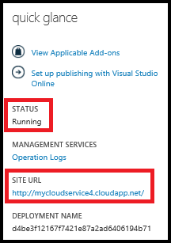

<properties
    pageTitle="Como criar e implantar um serviço de nuvem | Microsoft Azure"
    description="Aprenda a criar e implantar um serviço de nuvem usando o método de criação rápida no Azure."
    services="cloud-services"
    documentationCenter=""
    authors="Thraka"
    manager="timlt"
    editor=""/>

<tags
    ms.service="cloud-services"
    ms.workload="tbd"
    ms.tgt_pltfrm="na"
    ms.devlang="na"
    ms.topic="article"
    ms.date="09/06/2016"
    ms.author="adegeo"/>

# Como criar e implantar um serviço de nuvem

> [AZURE.SELECTOR]
- [Portal do Azure](cloud-services-how-to-create-deploy-portal.md)
- [Azure portal clássico](cloud-services-how-to-create-deploy.md)

O portal de clássico Azure fornece duas maneiras de criar e implantar um serviço de nuvem: **Criar rápida** e **Personalizada**.

Este tópico explica como usar o método de criação rápida para criar um novo serviço de nuvem e depois use **carregar** para carregar e implantar um pacote de serviço de nuvem no Azure. Quando você usa esse método, o portal de clássico Azure torna links conveniente disponíveis para concluir todos os requisitos enquanto você trabalha. Se você estiver pronto para implantar o seu serviço de nuvem quando criá-lo, você pode fazer ambas ao mesmo tempo usando **Criar personalizada**.

> [AZURE.NOTE] Se você planeja publicar seu serviço de nuvem do Visual Studio Team Services (VSTS), use a criação rápida e configurar a publicação de VSTS de **Início rápido** ou painel. Para obter mais informações, consulte [Delivery contínua no Azure usando o Visual Studio Team Services][TFSTutorialForCloudService], ou consulte a Ajuda para a página de **Início rápido** .

## Conceitos
Três componentes são necessários para implantar um aplicativo como um serviço de nuvem no Azure:

- **Definição de serviço**  
  O arquivo de definição de serviço de nuvem (.csdef) define o modelo de serviço, incluindo o número de funções.

- **Configuração do serviço**  
  O arquivo de configuração de serviço de nuvem (.cscfg) fornece configurações para a nuvem funções de serviço e individuais, incluindo o número de instâncias de função.

- **Pacote de serviço**  
  O pacote de serviço (.cspkg) contém o código do aplicativo e configurações e o arquivo de definição de serviço.
  
Você pode saber mais sobre essas e como criar um pacote [aqui](cloud-services-model-and-package.md).

## Preparar seu aplicativo
Antes de implantar um serviço na nuvem, você deve criar o pacote de serviço de nuvem (.cspkg) do código do seu aplicativo e um arquivo de configuração de serviço de nuvem (.cscfg). O SDK do Azure oferece ferramentas para preparar esses arquivos de implantação necessários. Você pode instalar o SDK na página de [Downloads do Azure](https://azure.microsoft.com/downloads/) , no idioma no qual você prefere desenvolver o código do aplicativo.

Três recursos de serviço de nuvem exigem configurações especiais antes de exportar um pacote de serviço:

- Se desejar implantar um serviço de nuvem que usa o Secure Sockets Layer (SSL) para criptografia de dados, [configure seu aplicativo](cloud-services-configure-ssl-certificate.md#step-2-modify-the-service-definition-and-configuration-files) para SSL.

- Se você quiser configurar conexões de área de trabalho remota para instâncias de função, [configure as funções](cloud-services-role-enable-remote-desktop.md) de trabalho remota.

- Se você deseja configurar detalhado de monitoramento de seu serviço de nuvem, habilite o diagnóstico do Azure para o serviço de nuvem. *Monitoramento mínimo* (o nível padrão de monitoração) usa contadores de desempenho obtidos os sistemas operacionais de host para instâncias de função (máquinas virtuais). "Monitoramento detalhado * reúne métricas adicionais com base em dados de desempenho em instâncias de função para habilitar a análise detalhada dos problemas que ocorrem durante o processamento do aplicativo. Para descobrir como habilitar o diagnóstico do Azure, consulte [Habilitando diagnóstico no Azure](cloud-services-dotnet-diagnostics.md).

Para criar um serviço de nuvem com implantações de funções da web ou funções de trabalho, você deve [criar o pacote de serviço](cloud-services-model-and-package.md#servicepackagecspkg).

## Antes de começar

- Se você ainda não instalou o SDK do Azure, clique em **Instalar o SDK do Azure** para abrir a [página de Downloads do Azure](https://azure.microsoft.com/downloads/)e baixe o SDK para o idioma no qual você prefere desenvolver o código. (Você terá a oportunidade de fazer isso posteriormente.)

- Se quaisquer instâncias de função solicitar um certificado, crie os certificados. Serviços de nuvem exigem um arquivo. pfx com uma chave privada. Você pode [carregar os certificados para Azure](cloud-services-configure-ssl-certificate.md#step-3-upload-a-certificate) conforme você criar e implantar o serviço de nuvem.

- Se você planeja implantar o serviço de nuvem em um grupo de afinidade, crie o grupo de afinidade. Você pode usar um grupo de afinidade para implantar o seu serviço de nuvem e outros serviços Azure no mesmo local em uma região. Você pode criar o grupo de afinidade na área de **redes** do portal clássico do Azure, na página **grupos de afinidade** .

## Como: criar um serviço de nuvem usando a criação rápida

1. No [portal do Azure clássico](http://manage.windowsazure.com/), clique em **novo**>**Calcular**>**Serviço de nuvem**>**Criação rápida**.

    

2. No **URL**, insira um nome de subdomínio usar na URL pública para acessar seu serviço de nuvem em implantações de produção. Formato da URL para implantações de produção é: http://*myURL*. cloudapp.net.

3. Na **região ou grupo de afinidade**, selecione a região geográfica ou grupo de afinidade para implantar o serviço de nuvem. Selecione um grupo de afinidade se quiser implantar o seu serviço de nuvem no mesmo local como outros serviços do Azure dentro de uma região.

4. Clique em **Criar serviço na nuvem**.

    

    Você pode monitorar o status do processo na área da mensagem na parte inferior da janela.

    A área de **Serviços de nuvem** é aberta, com o novo serviço de nuvem exibido. Quando o status é alterado para criado, a criação de serviço de nuvem foi concluída com êxito.

    

## Como: carregar um certificado para um serviço de nuvem

1. No [portal do Azure clássico](http://manage.windowsazure.com/), clique em **Serviços de nuvem**, clique no nome do serviço de nuvem e, em seguida, clique em **certificados**.

    

2. Clique em **carregar um certificado** ou **carregar**.

3. No **arquivo**, use **Procurar** para selecionar o certificado (arquivo. pfx).

4. Em **senha**, insira a chave privada para o certificado.

5. Clique em **Okey** (marca de seleção).

    

    Você pode assistir o progresso do carregamento na área da mensagem, mostrado abaixo. Quando o carregamento for concluído, o certificado é adicionado à tabela. Na área da mensagem, clique em Okey para fechar a mensagem.

    

## Como: implantar um serviço de nuvem

1. No [portal do Azure clássico](http://manage.windowsazure.com/), clique em **Serviços de nuvem**, clique no nome do serviço de nuvem e, em seguida, clique em **Painel de controle**.

2. Clique em **carregar uma nova implantação de produção** ou **carregar**.

3. **Rótulo de implantação**, insira um nome para a nova implantação - por exemplo, MyCloudServicev4.

3. Em **pacote**, use **Procurar** para selecionar o arquivo de pacote de serviço (.cspkg) para usar.

4. Em **configuração**, use **Procurar** para selecionar o arquivo de configuração de serviço (.cscfg) para usar.

5. Se o serviço de nuvem incluirá quaisquer funções com apenas uma instância, marque a caixa de seleção **implantar mesmo se uma ou mais funções contêm uma única instância** para habilitar a implantação continuar.

    Azure só pode garantir 99,95% acesso ao serviço de nuvem durante as atualizações de serviço e manutenção se cada função tiver pelo menos duas instâncias. Se necessário, você pode adicionar instâncias de função adicional na página de **escala** após implantar o serviço de nuvem. Para obter mais informações, consulte [Os contratos de nível de serviço](https://azure.microsoft.com/support/legal/sla/).

6. Clique em **Okey** (marca de seleção) para iniciar a implantação do serviço de nuvem.

    

    Você pode monitorar o status da implantação na área da mensagem. Clique em Okey para ocultar a mensagem.

    

## Verifique se sua implantação foi concluída com êxito

1. Clique em **Painel de controle**.

    O status deve mostrar que o serviço está **em execução**.

2. Em **rapidamente**, clique na URL do site para abrir seu serviço de nuvem em um navegador da web.

    

[TFSTutorialForCloudService]: cloud-services-continuous-delivery-use-vso.md
 
## Próximas etapas

* [Configuração geral do seu serviço de nuvem](cloud-services-how-to-configure.md).
* Configure um [nome de domínio personalizado](cloud-services-custom-domain-name.md).
* [Gerenciar seu serviço de nuvem](cloud-services-how-to-manage.md).
* Configure [certificados ssl](cloud-services-configure-ssl-certificate.md).