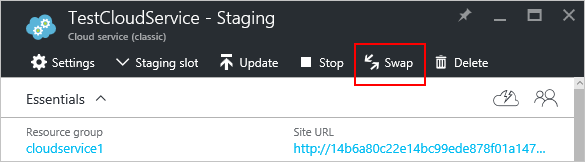
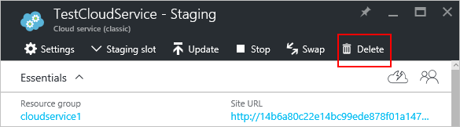

<properties 
    pageTitle="Tarefas comuns de gerenciamento de serviço de nuvem | Microsoft Azure" 
    description="Saiba como gerenciar serviços de nuvem no portal do Azure. Esses exemplos usam o portal do Azure." 
    services="cloud-services" 
    documentationCenter="" 
    authors="Thraka" 
    manager="timlt" 
    editor=""/>

<tags 
    ms.service="cloud-services" 
    ms.workload="tbd" 
    ms.tgt_pltfrm="na" 
    ms.devlang="na" 
    ms.topic="article" 
    ms.date="08/02/2016"
    ms.author="adegeo"/>

# Como gerenciar serviços de nuvem

> [AZURE.SELECTOR]
- [Portal do Azure](cloud-services-how-to-manage-portal.md)
- [Azure portal clássico](cloud-services-how-to-manage.md)

Seu serviço de nuvem é gerenciado na área de **Serviços de nuvem (clássico)** do portal do Azure. Este artigo descreve algumas ações comuns que seguimos durante o gerenciamento de seus serviços de nuvem. Que inclui a atualização, exclusão, dimensionamento e promover uma implantação em estágios para produção.

Mais informações sobre como dimensionar seu serviço de nuvem estão disponíveis [aqui](cloud-services-how-to-scale-portal.md).

## Como: atualizar uma função de serviço de nuvem ou implantação

Se você precisa atualizar o código do aplicativo para o seu serviço de nuvem, use a **atualização** na lâmina de serviço de nuvem. Você pode atualizar uma única função ou todas as funções. Para atualizar, você pode carregar um novo pacote de serviço ou o arquivo de configuração do serviço.

1. No [portal do Azure][], selecione o serviço de nuvem que você deseja atualizar. Esta etapa abre a lâmina de instância do serviço de nuvem.

2. Na lâmina, clique no botão de **atualização** .

    

3. Atualize a implantação com um novo arquivo de pacote de serviço (.cspkg) e o arquivo de configuração de serviço (.cscfg).

    

4. **Opcionalmente** , atualize o rótulo de implantação e a conta de armazenamento. 

5. Se as funções tem apenas uma instância de função, selecione a **implantar o mesmo se uma ou mais funções contêm uma única instância** para ativar a atualização prosseguir. 

    Azure só pode garantir disponibilidade do serviço 99,95% durante uma atualização de serviço de nuvem se cada função tem pelo menos duas instâncias de função (máquinas virtuais). Com duas instâncias de função, uma máquina virtual processará solicitações de cliente, enquanto o outro é atualizado.

6. Marque **Iniciar implantação** para que a atualização aplicada após o carregamento do pacote.

7. Clique em **Okey** para começar a atualização do serviço.

## Como: trocar implantações para promover uma implantação em estágios para produção

Quando você decide implantar uma nova versão de um serviço de nuvem, estágio e testar sua nova versão em seu ambiente de preparação de serviço de nuvem. Use **trocar** para as URLs pelo qual as dois implantações endereçadas e promovem uma nova versão de produção. 

Você pode trocar implantações da página de **Serviços de nuvem** ou painel.

1. No [portal do Azure][], selecione o serviço de nuvem que você deseja atualizar. Esta etapa abre a lâmina de instância do serviço de nuvem.

2. Na lâmina, clique no botão **trocar** .

    

3. Abre o seguinte prompt de confirmação.

    

4. Depois de verificar as informações de implantação, clique em **Okey** para trocar as implantações.

    A troca de implantação rapidamente acontece porque a única coisa que muda é os endereços IP virtuais (VIPs) para as implantações.

    Para salvar os custos de computação, você pode excluir a implantação de preparação depois de verificar se sua implantação de produção está funcionando conforme esperado.

## Como: vincular um recurso a um serviço de nuvem

O portal do Azure não vinculá recursos como o portal do clássico Azure atual. Em vez disso, implante recursos adicionais para o mesmo grupo de recursos sendo usado pelo serviço de nuvem.

## Como: excluir implantações e um serviço de nuvem

Antes de excluir um serviço na nuvem, você deve excluir cada implantação existente.

Para salvar os custos de computação, você pode excluir a implantação de preparação depois de verificar se sua implantação de produção está funcionando conforme esperado. Você será cobrado por custos de computação de instâncias de função implantada que são interrompidas.

Use o procedimento a seguir para excluir uma implantação ou seu serviço de nuvem. 

1. No [portal do Azure][], selecione o serviço de nuvem que você deseja excluir. Esta etapa abre a lâmina de instância do serviço de nuvem.

2. Na lâmina, clique no botão **Excluir** .

    

3. Você pode excluir o serviço de nuvem inteiro marcando **serviço em nuvem e suas implantações** ou escolha a **implantação de produção** ou a **implantação de teste**.

     

4. Clique no botão **Excluir** na parte inferior.

5. Para excluir o serviço de nuvem, clique em **serviço de nuvem de exclusão**. No prompt de confirmação, clique em **Sim**.

> [AZURE.NOTE]
> Quando um serviço de nuvem é excluído e monitoramento detalhado estiver configurado, você deve excluir manualmente os dados de sua conta de armazenamento. Para obter informações sobre onde encontrar as tabelas de métricas, consulte [Este](cloud-services-how-to-monitor.md) artigo.

[Portal do Azure]: https://portal.azure.com

## Próximas etapas

* [Configuração geral do seu serviço de nuvem](cloud-services-how-to-configure-portal.md).
* Saiba como [implantar um serviço na nuvem](cloud-services-how-to-create-deploy-portal.md).
* Configure um [nome de domínio personalizado](cloud-services-custom-domain-name-portal.md).
* Configure [certificados ssl](cloud-services-configure-ssl-certificate-portal.md).