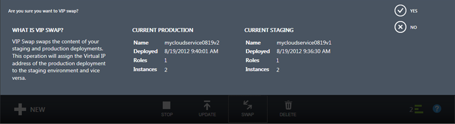

<properties 
    pageTitle="Tarefas de gerenciamento de serviço de nuvem comuns (clássico) | Microsoft Azure" 
    description="Saiba como gerenciar serviços de nuvem no portal de clássico do Azure." 
    services="cloud-services" 
    documentationCenter="" 
    authors="Thraka" 
    manager="timlt" 
    editor=""/>

<tags 
    ms.service="cloud-services" 
    ms.workload="tbd" 
    ms.tgt_pltfrm="na" 
    ms.devlang="na" 
    ms.topic="article" 
    ms.date="08/10/2016"
    ms.author="adegeo"/>

# Como gerenciar serviços de nuvem

> [AZURE.SELECTOR]
- [Portal do Azure](cloud-services-how-to-manage-portal.md)
- [Azure portal clássico](cloud-services-how-to-manage.md)

Na área de **Serviços de nuvem** do portal de clássico do Azure, é possível atualizar uma função de serviço ou uma implantação, promover uma implantação em estágios para produção, link recursos para seu serviço de nuvem para que você possa ver as dependências de recurso e dimensionar os recursos juntos e excluir um serviço de nuvem ou uma implantação.

## Como: atualizar uma função de serviço de nuvem ou implantação

Se você precisa atualizar o código do aplicativo para o seu serviço de nuvem, use a opção **Atualizar** no painel de controle, na página de **Serviços de nuvem** ou página **instâncias** . Você pode atualizar uma única função ou todas as funções. Você precisará carregar um novo pacote de serviço e o arquivo de configuração do serviço.

1. No [portal do Azure clássico](https://manage.windowsazure.com/), no painel de controle, na página de **Serviços de nuvem** ou **instâncias** de página, clique em **Atualizar**.

    

2. **Rótulo de implantação**, insira um nome para identificar a implantação (por exemplo, mycloudservice4). Você encontrará o rótulo de implantação em **início rápido** no painel.

3. Em **pacote**, use **Procurar** para carregar o arquivo de pacote de serviço (.cspkg).

4. Em **configuração**, use **Procurar** para carregar o arquivo de configuração de serviço (.cscfg).

5. **Função**, selecione **todos** se desejar atualizar todas as funções no serviço de nuvem. Para executar uma atualização única função, selecione a função que você deseja atualizar. Mesmo se você selecionar uma função específica para atualizar, as atualizações no arquivo de configuração do serviço são aplicadas a todas as funções.

6. Se a atualização altera o número de funções ou o tamanho de qualquer função, marque a caixa de seleção **Permitir atualizar se altera de tamanhos de função ou número de funções** para ativar a atualização continuar. 

    Lembre-se de que se você alterar o tamanho de uma função (ou seja, o tamanho de uma máquina virtual que hospeda uma instância da função) ou o número de funções, cada instância de função (máquina virtual) deve ser criada novamente e quaisquer dados locais serão perdidos.

7. Se quaisquer funções de serviço tem apenas uma instância de função, selecione a **Atualizar mesmo se uma ou mais função contêm uma caixa de seleção única instância** para ativar a atualização prosseguir. 

    Azure só pode garantir disponibilidade do serviço 99,95% durante uma atualização de serviço de nuvem se cada função tem pelo menos duas instâncias de função (máquinas virtuais). Que permite que uma máquina virtual processar solicitações de cliente, enquanto o outro está sendo atualizado.

8. Clique em **Okey** (marca de seleção) para começar a atualização do serviço.

## Como: trocar implantações para promover uma implantação em estágios para produção

Use **trocar** para promover uma implantação de preparação de um serviço de nuvem para produção. Quando você decide implantar uma nova versão de um serviço de nuvem, você pode testar e testar sua nova versão em seu ambiente de teste de serviço de nuvem enquanto seus clientes estiver usando a versão atual em produção. Quando você estiver pronto para promover a nova versão de produção, você pode usar **trocar** para alternar as URLs endereçadas pelo qual as implantações de duas. 

Você pode trocar implantações da página de **Serviços de nuvem** ou painel.

1. No [portal do Azure clássico](https://manage.windowsazure.com/), clique em **Serviços de nuvem**.

2. Na lista de serviços de nuvem, clique no serviço de nuvem para selecioná-lo.

3. Clique em **trocar**.

    Abre o seguinte prompt de confirmação.

    

4. Depois de verificar as informações de implantação, clique em **Sim** para trocar as implantações.

    A troca de implantação rapidamente acontece porque a única coisa que muda é os endereços IP virtuais (VIPs) para as implantações.

    Para salvar os custos de computação, você pode excluir a implantação no ambiente de teste quando tiver certeza que a nova implantação de produção está executando conforme esperado.

## Como: vincular um recurso a um serviço de nuvem

Para mostrar sua nuvem dependências do serviço em outros recursos, você pode vincular uma instância de banco de dados do Azure SQL ou uma conta de armazenamento para o serviço de nuvem. Você pode vincular e desvincular recursos na página **Recursos vinculados** e monitorar o seu uso no painel de serviço de nuvem. Se uma conta de armazenamento vinculado tiver monitoramento ativado, você pode monitorar o Total de solicitações no painel de serviço de nuvem.

Use o **Link** para vincular uma conta nova ou existente banco de dados SQL instância ou armazenamento seu serviço de nuvem. Em seguida, você pode dimensionar o banco de dados juntamente com a função de serviço de nuvem que está usando na página de **escala** . (Uma conta de armazenamento automaticamente dimensionada como uso aumenta.) Para obter mais informações, consulte [como dimensionar um serviço de nuvem e recursos vinculados](cloud-services-how-to-scale.md). 

Você também pode monitorar, gerenciar e dimensionar o banco de dados no nó **bancos de dados** do Azure portal clássico. 

"Vinculação" um recurso nesse sentido não conectar seu aplicativo para o recurso. Se você criar um novo banco de dados usando o **Link**, você precisará adicionar as cadeias de caracteres de conexão ao seu código de aplicativo e, em seguida, atualização do serviço de nuvem. Você também precisará adicionar cadeias de caracteres de conexão, se seu aplicativo usa recursos de uma conta de armazenamento vinculado.

O procedimento a seguir descreve como vincular uma nova instância do banco de dados SQL, implantada em um novo servidor de banco de dados SQL, para um serviço de nuvem.

### Vincular uma instância de banco de dados SQL para um serviço de nuvem

1. No [portal do Azure clássico](http://manage.windowsazure.com/), clique em **Serviços de nuvem**. Clique no nome do serviço de nuvem para abrir o painel de controle.

2. Clique em **recursos vinculados**.

    A página de **Recursos vinculados** abre.

    

3. Clique em **vincular um recurso** ou **Link**.

    Inicia o Assistente de **Recursos do Link** .

    

4. Clique em **criar um novo recurso** ou **vincular um recurso existente**.

5. Escolha o tipo de recurso para vincular. No [portal do Azure clássico](http://manage.windowsazure.com/), clique em **Banco de dados SQL**. (O portal de clássico do Azure de visualização não dá suporte a vinculação a uma conta de armazenamento para um serviço de nuvem.)

6. Para concluir a configuração de banco de dados, siga as instruções na Ajuda para a área de **Bancos de dados SQL** do portal de clássico do Azure.

    Você pode acompanhar o progresso da operação de vinculação na área da mensagem.

    

    Quando a vinculação é concluída, você pode monitorar o status do recurso vinculado no painel de serviço de nuvem. Para obter informações sobre o dimensionamento de um banco de dados SQL vinculado, veja [como dimensionar um serviço de nuvem e recursos vinculados](cloud-services-how-to-scale.md).

### Desvincular um recurso vinculado

1. No [portal do Azure clássico](http://manage.windowsazure.com/), clique em **Serviços de nuvem**. Clique no nome do serviço de nuvem para abrir o painel de controle.

2. Clique em **Recursos vinculados**e, em seguida, selecione o recurso.

3. Clique em **Desvincular**. Clique em **Sim** no prompt de confirmação.

    Desvincular um banco de dados do SQL não tem efeito sobre o banco de dados ou conexões do aplicativo para o banco de dados. Você ainda poderá gerenciar o banco de dados na área de **Bancos de dados SQL** do portal de clássico do Azure.

## Como: excluir implantações e um serviço de nuvem

Antes de excluir um serviço na nuvem, você deve excluir cada implantação existente.

Para salvar os custos de computação, você pode excluir sua implantação de preparação depois de verificar se sua implantação de produção está funcionando conforme esperado. Você é os custos de computação cobrados por instâncias de função, mesmo se um serviço de nuvem não está sendo executado.

Use o procedimento a seguir para excluir uma implantação ou seu serviço de nuvem. 

1. No [portal do Azure clássico](http://manage.windowsazure.com/), clique em **Serviços de nuvem**.

2. Selecione o serviço de nuvem e, em seguida, clique em **Excluir**. (Para selecionar um serviço na nuvem sem abrir o painel de controle, clique em qualquer lugar, exceto o nome na entrada de serviço de nuvem)

    Se você tiver uma implantação em temporário ou de produção, você verá um menu de opções semelhantes ao seguinte na parte inferior da janela. Antes de excluir o serviço de nuvem, você deve excluir qualquer implantações existentes.

    

3. Para excluir uma implantação, clique em **Excluir implantação de produção** ou **preparação de implantação**. No prompt de confirmação, clique em **Sim**. 

4. Se você planeja excluir o serviço de nuvem, repita a etapa 3, se necessário, para excluir sua implantação outra.

5. Para excluir o serviço de nuvem, clique em **serviço de nuvem de exclusão**. No prompt de confirmação, clique em **Sim**.

> [AZURE.NOTE]
> Se o monitoramento detalhado estiver configurado para o seu serviço de nuvem, Azure não exclua os dados de monitoramento da sua conta de armazenamento ao excluir o serviço de nuvem. Você precisará excluir os dados manualmente. Para obter informações sobre onde encontrar as tabelas de métricas, consulte "como: acesso detalhado monitorando dados fora do Azure portal clássico" em [como os serviços de nuvem do Monitor](cloud-services-how-to-monitor.md).

## Próximas etapas

 * [Configuração geral do seu serviço de nuvem](cloud-services-how-to-configure.md).
* Saiba como [implantar um serviço na nuvem](cloud-services-how-to-create-deploy.md).
* Configure um [nome de domínio personalizado](cloud-services-custom-domain-name.md).
* Configure [certificados ssl](cloud-services-configure-ssl-certificate.md).
