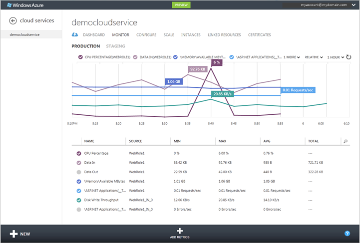

<properties 
    pageTitle="Como monitorar um serviço de nuvem | Microsoft Azure" 
    description="Saiba como monitorar os serviços de nuvem usando o portal de clássico Azure." 
    services="cloud-services" 
    documentationCenter="" 
    authors="rboucher" 
    manager="timlt" 
    editor=""/>

<tags 
    ms.service="cloud-services" 
    ms.workload="tbd" 
    ms.tgt_pltfrm="na" 
    ms.devlang="na" 
    ms.topic="article" 
    ms.date="08/04/2015" 
    ms.author="robb"/>


# <a name="how-to-monitor-cloud-services"></a>Como monitorar os serviços de nuvem

[AZURE.INCLUDE [disclaimer](../../includes/disclaimer.md)]

Você pode monitorar `key` métricas de desempenho dos seus serviços de nuvem no portal de clássico do Azure. Você pode definir o nível de monitoração para mínimo e detalhado para cada função de serviço e pode personalizar o monitoramento exibe. Dados de monitoramento detalhados serão armazenados em uma conta de armazenamento, que você pode acessar fora do portal. 

Monitoramento exibe no portal de clássico do Azure é altamente configurável. Você pode escolher as métricas que você deseja monitorar na lista métricas na página do **Monitor** e você pode escolher quais métricas plotar em gráficos de métricas na página **Monitor** e o painel de controle. 

## <a name="concepts"></a>Conceitos

Por padrão, o monitoramento mínimo é fornecido para um novo serviço de nuvem utilizando medidores de desempenho obtidas o sistema operacional de host para as instâncias de funções (máquinas virtuais). As métricas mínimo limitam-se a porcentagem de CPU, dados no, dados-Out, taxa de transferência de leitura de disco e taxa de transferência de gravação do disco. Configurando o monitoramento detalhado, você pode receber métricas adicionais com base em dados de desempenho em máquinas virtuais (instâncias de função). As métricas detalhadas habilitar análise detalhada dos problemas que ocorrem durante as operações do aplicativo.

Por padrão, os dados de contador de desempenho de instâncias de função é amostra e transferidos da instância de função em intervalos de 3 minutos. Quando você habilita o monitoramento detalhado, os dados do contador de desempenho bruto são agregados para cada instância de função e nas instâncias de função para cada função nos intervalos de 5 minutos, 1 hora e 12 horas. Os dados agregados são descartados depois de 10 dias.

Depois de habilitar o monitoramento detalhado, os dados de monitoramento agregados são armazenados em tabelas em sua conta de armazenamento. Para habilitar o monitoramento detalhado para uma função, você deve configurar uma cadeia de conexão de diagnóstico com links para a conta de armazenamento. Você pode usar contas de armazenamento diferentes para diferentes funções.

Observe que a ativar o monitoramento detalhado aumentará os custos de armazenamento relacionados ao armazenamento de dados, a transferência de dados e transações de armazenamento. Monitoramento mínima não requer uma conta de armazenamento. Os dados para as métricas que são expostos no nível mínimo monitoramento não são armazenados em sua conta de armazenamento, mesmo se você definir o nível de monitoramento para detalhado.


## <a name="how-to-configure-monitoring-for-cloud-services"></a>Como: configurar o monitoramento de serviços de nuvem

Use os procedimentos a seguir para configurar o monitoramento detalhado ou mínima no portal de clássico do Azure. 

### <a name="before-you-begin"></a>Antes de começar

- Crie uma conta de armazenamento para armazenar os dados de monitoramento. Você pode usar contas de armazenamento diferentes para diferentes funções. Para obter mais informações, consulte a Ajuda para **Contas de armazenamento**ou veja [como criar uma conta de armazenamento](/manage/services/storage/how-to-create-a-storage-account/).

- Habilite o diagnóstico do Azure para suas funções de serviço de nuvem. Consulte [Configurando diagnóstico para serviços de nuvem](https://msdn.microsoft.com/library/azure/dn186185.aspx#BK_EnableBefore).

Certifique-se de que a cadeia de conexão de diagnóstico está presente na configuração da função. Você não pode ativar o monitoramento detalhado até você habilitar o diagnóstico do Azure e incluir uma cadeia de conexão de diagnóstico na configuração da função.   

> [AZURE.NOTE] Projetos direcionamento Azure SDK 2.5 não incluem automaticamente a cadeia de conexão de diagnóstico no modelo de projeto. Para esses projetos, você precisa adicionar manualmente a cadeia de conexão de diagnóstico para a configuração da função.

**Para adicionar manualmente a cadeia de conexão de diagnóstico a configuração de função**

1. Abra o projeto de serviço de nuvem no Visual Studio
2. Clique duas vezes na **função** para abrir o designer de função e selecione a guia **configurações**
3. Procure uma configuração denominada **Microsoft.WindowsAzure.Plugins.Diagnostics.ConnectionString**. 
4. Se essa configuração não estiver presente, em seguida, clique no botão **Adicionar configuração** para adicioná-lo à configuração e alterar o tipo para a nova configuração para **ConnectionString**
5. Defina o valor de cadeia de conexão a clicando no botão **…** . Isso abrirá uma caixa de diálogo que permite selecionar uma conta de armazenamento.

    

### <a name="to-change-the-monitoring-level-to-verbose-or-minimal"></a>Para alterar o nível de monitoramento detalhado ou mínimo

1. No [portal de clássico Azure](https://manage.windowsazure.com/), abra a página de **Configurar** para a implantação do serviço de nuvem.

2. No **nível**, clique em **detalhado** ou **mínima**. 

3. Clique em **Salvar**.

Depois de ativar monitoramento detalhado, você deve começar vendo os dados de monitoramento no portal de clássico do Azure na hora.

Os dados de contador de desempenho bruto e dados agregados de monitoramento são armazenados na conta de armazenamento em tabelas qualificado a identificação de implantação para as funções. 

## <a name="how-to-receive-alerts-for-cloud-service-metrics"></a>Como: receber alertas para métricas de serviço de nuvem

Você pode receber alertas com base em seu serviço de nuvem monitoramento métricas. Na página **Serviços de gerenciamento** do portal de clássico do Azure, você pode criar uma regra para acionar um alerta quando a métrica que você escolher atinja um valor que você especifica. Você também pode optar por ter um email enviado quando o alerta for acionado. Para obter mais informações, consulte [como: receber notificações de alerta e gerenciar regras de alerta no Azure](http://go.microsoft.com/fwlink/?LinkId=309356).

## <a name="how-to-add-metrics-to-the-metrics-table"></a>Como: adicionar métricas à tabela de métricas

1. No [portal de clássico Azure](http://manage.windowsazure.com/), abra a página de **Monitor** para o serviço de nuvem.

    Por padrão, a tabela de métricas exibe um subconjunto das métricas disponíveis. A ilustração mostra as métricas de detalhado padrão para um serviço de nuvem, que está limitada ao contador de desempenho de memória \ MBytes, com dados agregados no nível de função. Use **Adicionar métricas** para selecionar medidas adicionais de agregadas e nível de função para monitorar no portal de clássico do Azure.

    
 
2. Para adicionar métricas à tabela métricas:

    1. Clique em **Adicionar métricas** para abrir **Métricas de escolha**, mostrado abaixo.

        A primeira métrica disponível é expandida para mostrar as opções disponíveis. Para cada métrica, a primeira opção exibe dados agregados de monitoramento para todas as funções. Além disso, você pode escolher funções individuais para exibir dados para.

        

    2. Para selecionar métricas para exibir

        - Clique na seta para baixo pela métrica para expandir as opções de monitoramento.
        - Marque a caixa de seleção para cada opção de monitoramento que você deseja exibir.

        Você pode exibir até 50 métricas na tabela métricas.

        > [AZURE.TIP] No monitoramento detalhado, a lista de métricas pode conter dezenas de métricas. Para exibir uma barra de rolagem, passe o mouse sobre o lado direito da caixa de diálogo. Para filtrar a lista, clique no ícone Pesquisar e digite o texto na caixa de pesquisa, conforme mostrado abaixo.
    
        


3. Quando terminar de selecionar métricas, clique em Okey (marca de seleção).

    As métricas selecionadas são adicionadas à tabela métricas, conforme mostrado abaixo.

    

 
4. Para excluir uma métrica da tabela de métricas, clique a métrica para selecioná-la e clique em **Excluir métrica**. (Você só consulte **Excluir métrica** quando você tem uma métrica selecionada.)

### <a name="to-add-custom-metrics-to-the-metrics-table"></a>Para adicionar métricas personalizadas à tabela de métricas

**Detalhado** monitoramento nível fornece uma lista de métricas de padrão que você pode monitorar no portal. Além de esses, você pode monitorar qualquer personalizados de métricas ou contadores de desempenho definidos pelo seu aplicativo por meio do portal.

As etapas a seguir presumem que você tenha ativado **detalhado** nível de monitoramento e tiver configurar seu aplicativo para coletar e transferir contadores de desempenho personalizados. 

Para exibir os contadores de desempenho personalizados no portal, você precisa atualizar a configuração no contêiner de controle wad:
 
1. Abra o blob wad contêiner de controle na sua conta de armazenamento de diagnóstico. Você pode usar o Visual Studio ou qualquer outro gerenciador de armazenamento para fazer isso.

    

2. Navegue o caminho de blob usando o padrão de **Nome de função/DeploymentId/RoleInstance** para localizar a configuração para a sua instância de função. 

    
3. Baixe o arquivo de configuração para a sua instância de função e atualizá-lo para incluir qualquer contador de desempenho personalizados. Por exemplo, para monitorar *Bytes de gravação de disco/s* para a *unidade C* , adicione o seguinte nó **PerformanceCounters\Subscriptions**

    ```xml
    <PerformanceCounterConfiguration>
    <CounterSpecifier>\LogicalDisk(C:)\Disk Write Bytes/sec</CounterSpecifier>
    <SampleRateInSeconds>180</SampleRateInSeconds>
    </PerformanceCounterConfiguration>
    ```
4. Salvar as alterações e carregue o arquivo de configuração de volta para o mesmo local, substituindo o arquivo existente no blob.
5. Alternar para modo detalhado na configuração de portal clássico do Azure. Se você tivesse no modo detalhado já terá que alternar para mínimo e voltar para detalhado.
6. O contador de desempenho personalizados agora estará disponível na caixa de diálogo **Adicionar métricas** . 

## <a name="how-to-customize-the-metrics-chart"></a>Como: personalizar o gráfico de métricas

1. Na tabela métricas, selecione até 6 métricas Plotar no gráfico de métricas. Para selecionar uma métrica, clique na caixa de seleção em seu lado esquerdo. Para remover uma métrica de gráfico métricas, desmarque sua caixa de seleção na tabela métricas.

    Conforme você seleciona métricas na tabela métricas, as métricas são adicionadas ao gráfico de métricas. Em uma exibição estreita, uma lista suspensa de **n mais** contém cabeçalhos de métrica que não correspondam a exibição.

 
2. Para alternar entre exibir valores relativos (valor final somente para cada métrica) e valores absolutos (eixo Y exibido), selecione relativo ou absoluto na parte superior do gráfico.

    

3. Para alterar o intervalo de tempo exibe o gráfico métricas, selecione 1 hora, 24 horas, ou 7 dias na parte superior do gráfico.

    

    No gráfico de métricas de painel, o método para plotagem métricas é diferente. Um conjunto padrão de métricas está disponível e métricas são adicionadas ou removidas, selecionando o cabeçalho métrico.

### <a name="to-customize-the-metrics-chart-on-the-dashboard"></a>Para personalizar o gráfico de métricas no painel

1. Abra o painel de controle para o serviço de nuvem.

2. Adicionar ou remover métricas do gráfico:

    - Para plotar uma nova métrica, marque a caixa de seleção para a métrica em cabeçalhos de gráfico. Em uma exibição estreita, clique na seta para baixo por ** *n*??metrics** plotar uma métrica que na área de cabeçalho de gráfico não pode exibir.

    - Para excluir uma métrica que é plotada no gráfico, desmarque a caixa de seleção por seu cabeçalho.

3. Alternar entre **relativas** e **absolutas** exibe.

4. Escolha 1 hora, 24 horas, ou 7 dias de dados a serem exibidos.

## <a name="how-to-access-verbose-monitoring-data-outside-the-azure-classic-portal"></a>Como: acesso detalhado monitorando dados fora do Azure portal clássico

Dados de monitoramento detalhados são armazenados em tabelas nas contas de armazenamento que você especificar para cada função. Para cada implantação de serviço de nuvem, seis tabelas são criadas para a função. Duas tabelas são criadas para cada (5 minutos, 1 hora e 12 horas). Uma dessas tabelas armazena agregações de nível de função; outra tabela armazena as agregações para instâncias de função. 

Os nomes de tabela têm o seguinte formato:

```
WAD*deploymentID*PT*aggregation_interval*[R|RI]Table
```

onde:

- *deploymentID* é o GUID atribuído para a implantação do serviço de nuvem

- *aggregation_interval* = 5 M, 1h ou 12 H

- função nível agregações = R

- agregações para instâncias de função = RI

Por exemplo, as tabelas a seguir seriam armazenar dados de monitoramento detalhados agregados em intervalos de 1 hora:

```
WAD8b7c4233802442b494d0cc9eb9d8dd9fPT1HRTable (hourly aggregations for the role)

WAD8b7c4233802442b494d0cc9eb9d8dd9fPT1HRITable (hourly aggregations for role instances)
```
