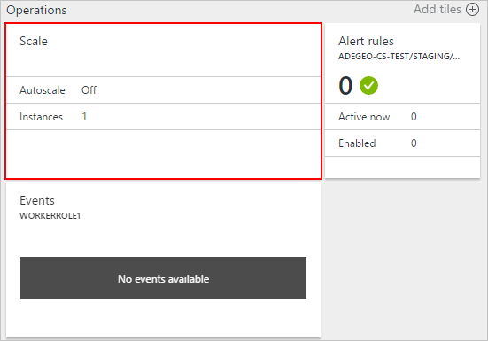

<properties
    pageTitle="Auto dimensionar um serviço de nuvem no portal do | Microsoft Azure"
    description="Saiba como usar o portal para configurar regras de escala automática para uma função de web de serviço de nuvem ou trabalhador no Azure."
    services="cloud-services"
    documentationCenter=""
    authors="Thraka"
    manager="timlt"
    editor=""/>

<tags
    ms.service="cloud-services"
    ms.workload="tbd"
    ms.tgt_pltfrm="na"
    ms.devlang="na"
    ms.topic="article"
    ms.date="09/06/2016"
    ms.author="adegeo"/>

# Como escala automática um serviço na nuvem

> [AZURE.SELECTOR]
- [Portal do Azure](cloud-services-how-to-scale-portal.md)
- [Azure portal clássico](cloud-services-how-to-scale.md)

Condições podem ser definidas para uma função de trabalho de serviço de nuvem que disparar uma escala ou reduzir a operação. As condições para a função podem ser baseadas na CPU, disco ou da função de carga de rede. Você também pode definir um conditation com base em uma fila de mensagem ou a métrica de algum outro recurso Azure associada a sua assinatura.

>[AZURE.NOTE] Este artigo aborda em funções de trabalho e da web do serviço de nuvem. Quando você cria uma máquina virtual (clássico) diretamente, ele é hospedado em um serviço na nuvem. Você pode dimensionar uma máquina virtual padrão associando um [conjunto de disponibilidade](../virtual-machines/virtual-machines-windows-classic-configure-availability.md) e manualmente as ativar ou desativar.

## Considerações

Considere as seguintes informações antes de configurar o dimensionamento do aplicativo:

- Dimensionamento é afetado pelo uso de núcleo. Instâncias de função maiores usam mais cores. Você pode dimensionar um aplicativo apenas dentro do limite de cores para sua assinatura. Por exemplo, se sua assinatura tem um limite de vinte cores e executar um aplicativo com dois médio porte (um total de quatro cores) de serviços de nuvem, você pode apenas crescerão outras implantações de serviço de nuvem em sua assinatura por 16 cores. Consulte [Tamanhos de serviço de nuvem](cloud-services-sizes-specs.md) para obter mais informações sobre tamanhos.

- Você pode dimensionar com base em um limite de mensagem de fila. Para obter mais informações sobre como usar filas, veja [como usar o serviço de armazenamento de fila](../storage/storage-dotnet-how-to-use-queues.md).

- Você também pode dimensionar outros recursos associados a sua assinatura.

- Para habilitar alta disponibilidade do seu aplicativo, você deve garantir que ele é implantado com duas ou mais ocorrências de função. Para obter mais informações, consulte [Os contratos de nível de serviço](https://azure.microsoft.com/support/legal/sla/).

## Onde se encontra escala

Após selecionar seu serviço de nuvem, você deve ter a lâmina de serviço de nuvem visível.

1. Sobre a lâmina de serviço de nuvem, no bloco **funções e instâncias** , selecione o nome do serviço de nuvem.   
**Importante**: Certifique-se de clique na função de serviço de nuvem, não a instância de função que está abaixo da função.

    

2. Selecione o bloco de **escala** .

    

## Escala automática

Você pode configurar as configurações de escala para uma função com dois modos **manual** ou **automática**. Manual conforme esperado, você definir a contagem de absoluta de instâncias. No entanto, automático permite a você definir regras que controlam como e por como muito você deve dimensionar.

Defina a opção de **escala por** regras de **cronograma e desempenho**.

1. Um perfil existente.
2. Adicione uma regra para o perfil pai.
3. Adicione outro perfil.

Selecione **Adicionar perfil**. O perfil determina qual modo você deseja usar para a escala: **sempre**, **Recorrência**, **data fixa**.

Depois que você configurou o perfil e as regras, selecione o ícone de **Salvar** na parte superior.

#### Perfil

O perfil define instâncias mínimas e máximos para a escala, e também quando este intervalo de escala estiver ativo.

* **Sempre**

    Sempre manter este intervalo de instâncias disponíveis.  

    
    
* **Recorrência**

    Escolha um conjunto de dias da semana para dimensionar.

    
    
* **Data fixa**

    Um intervalo de datas fixo dimensionar a função.

    

Após ter configurado o perfil, selecione o botão de **Okey** na parte inferior da lâmina perfil.

#### Regra

As regras são adicionadas a um perfil e representam uma condição que acionará a escala. 

O disparador regra baseia-se em uma métrica de serviço de nuvem (uso da CPU, atividade de disco ou atividade de rede) ao qual você pode adicionar um valor condicional. Além disso, você pode ter o disparador com base em uma fila de mensagem ou a métrica de algum outro recurso Azure associada a sua assinatura.

Depois que você configurou a regra, selecione o botão de **Okey** na parte inferior da lâmina regra.

## Voltar para escala manual

Navegue até as [configurações de escala](#where-scale-is-located) e defina a opção de **escala por** **uma contagem de instância que eu insiro manualmente**.

Isso remove o dimensionamento automatizada da função e, em seguida, você pode definir a contagem de instância diretamente. 

1. A opção escala (manual ou automatizada).
2. Um função instância controle deslizante para definir as instâncias de dimensionar para.
3. Instâncias da função para dimensionar a.

Depois que você configurou as configurações de escala, selecione o ícone de **Salvar** na parte superior.

