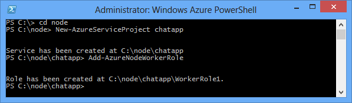

<properties 
    pageTitle="Aplicativo de Node usando Socket.io | Microsoft Azure" 
    description="Saiba como usar socket.io em um aplicativo de Node hospedado no Azure." 
    services="cloud-services" 
    documentationCenter="nodejs" 
    authors="rmcmurray" 
    manager="wpickett" 
    editor=""/>

<tags 
    ms.service="cloud-services" 
    ms.workload="tbd" 
    ms.tgt_pltfrm="na" 
    ms.devlang="nodejs" 
    ms.topic="article" 
    ms.date="08/11/2016" 
    ms.author="robmcm"/>

# Criar um aplicativo de bate-papo Node com Socket.IO em um serviço de nuvem do Azure

Socket.IO fornece comunicação em tempo real entre seu servidor de node e clientes. Este tutorial apresentará um soquete de hospedagem. Aplicativo de bate-papo no Azure baseado em AE. Para obter mais informações sobre Socket.IO, consulte <http://socket.io/>.

Uma captura de tela da aplicação concluída está abaixo:

![Uma janela de navegador exibindo o serviço hospedado no Azure][completed-app]  

## Pré-requisitos

Certifique-se de que os seguintes produtos e versões estão instaladas para concluir com êxito o exemplo neste artigo:

* Instalar o [Visual Studio 2013](https://www.visualstudio.com/en-us/downloads/download-visual-studio-vs.aspx)
* Instalar o [Node](https://nodejs.org/download/)
* Instalar o [Python versão 2.7.10](https://www.python.org/)

## Criar um projeto de serviço de nuvem

As etapas a seguir criam o projeto de serviço de nuvem que hospedará o aplicativo Socket.IO.

1. No menu **Iniciar** ou **Tela Iniciar**, procure **O Windows PowerShell**. Por fim, clique com botão direito **Do Windows PowerShell** e selecione **Executar como administrador**.

    ![Ícone de PowerShell Azure][powershell-menu]

2. Crie um diretório chamado **c:\\nó**. 
 
        PS C:\> md node

3. Altere os diretórios para o **c:\\nó** diretório
 
        PS C:\> cd node

4. Digite os seguintes comandos para criar uma nova solução chamado **chatapp** e uma função de trabalho denominada **WorkerRole1**:

        PS C:\node> New-AzureServiceProject chatapp
        PS C:\Node> Add-AzureNodeWorkerRole

    Você verá a seguinte resposta:

    

## Baixar o exemplo de Chat

Para este projeto, usaremos o exemplo de chat do [repositório de Socket.IO GitHub]. Execute as seguintes etapas para baixar o exemplo e adicioná-lo para o projeto que você criou anteriormente.

1.  Crie uma cópia local do repositório usando o botão **Reproduzir** . Você também pode usar o botão **ZIP** para baixar o projeto.

    ![Uma janela do navegador exibindo https://github.com/LearnBoost/socket.io/tree/master/examples/chat, com o ícone de download ZIP realçado][chat-example-view]

3.  Navegue a estrutura de diretório do repositório local até chegar à **exemplos\\bate-papo** diretório. Copiar o conteúdo desta pasta para a **c:\\nó\\chatapp\\WorkerRole1** diretório criado anteriormente.

    ![Explorer, exibindo o conteúdo dos exemplos\\diretório de bate-papo extraído do arquivo][chat-contents]

    Os itens destacados na captura de tela acima são os arquivos copiados do **exemplos\\bate-papo** diretório

4.  No **c:\\nó\\chatapp\\WorkerRole1** diretório, exclua o arquivo **Server. js** e renomeie o arquivo **app.js** para **Server. js**. Isso remove o arquivo de **Server. js** padrão criado anteriormente pelo cmdlet **Add-AzureNodeWorkerRole** e substitui-lo com o arquivo de aplicativo do exemplo bate-papo.

### Modificar Server. js e instalar módulos

Antes de testar o aplicativo no emulador Azure, podemos deve fazer algumas modificações mínimas. Execute as etapas a seguir para o arquivo Server. js:

1.  Abra o arquivo **Server. js** no Visual Studio ou qualquer editor de texto.

2.  Localize a seção de **dependências de módulo** no começo do Server. js e altere a linha que contém **sio = require('.. //.. lib//Socket.IO')** para **sio = require('socket.io')** conforme mostrado abaixo:

        var express = require('express')
        , stylus = require('stylus')
        , nib = require('nib')
        //, sio = require('..//..//lib//socket.io'); //Original
        , sio = require('socket.io');                //Updated

3.  Para garantir que o aplicativo ouve na porta correta, abra Server. js no bloco de notas ou o editor favorito e, em seguida, altere a seguinte linha substituindo **3000** por **process.env.port** , conforme mostrado abaixo:

        //app.listen(3000, function () {            //Original
        app.listen(process.env.port, function () {  //Updated
          var addr = app.address();
          console.log('   app listening on http://' + addr.address + ':' + addr.port);
        });

Depois de salvar as alterações para **Server. js**, use as seguintes etapas para instalar módulos necessários e, em seguida, teste o aplicativo no emulador Azure:

1.  Usando o **PowerShell do Azure**, altere diretórios para o **c:\\nó\\chatapp\\WorkerRole1** diretório e use o comando a seguir para instalar os módulos necessários por este aplicativo:

        PS C:\node\chatapp\WorkerRole1> npm install

    Os módulos listados no arquivo package.json será instalado. Após o comando terminar, você verá a saída similar ao seguinte:

    ![A saída do npm instalar comando][The-output-of-the-npm-install-command]

4.  Como este exemplo foi originalmente uma parte do repositório Socket.IO GitHub e referenciado diretamente a biblioteca Socket.IO pelo caminho relativo, Socket.IO não foi referenciado no arquivo package.json, para nós deve instalá-la por meio do comando a seguir:

        PS C:\node\chatapp\WorkerRole1> npm install socket.io --save

### Testar e implantar

1.  Inicie o emulador por meio do comando a seguir:

        PS C:\node\chatapp\WorkerRole1> Start-AzureEmulator -Launch

2.  Abra um navegador e navegue até **http://127.0.0.1**.

3.  Quando a janela do navegador é aberta, insira um apelido e ocorrência.
    Isto irá tudo o que você postar mensagens como um apelido específico. Para testar a funcionalidade de vários usuário, abra janelas adicionais do navegador usando a mesma URL e insira apelidos diferentes.

    

3.  Depois de testar o aplicativo, pare o emulador ao emitir o seguinte comando:

        PS C:\node\chatapp\WorkerRole1> Stop-AzureEmulator

4.  Para implantar o aplicativo no Azure, use o cmdlet **Publicar-AzureServiceProject** . Por exemplo:

        PS C:\node\chatapp\WorkerRole1> Publish-AzureServiceProject -ServiceName mychatapp -Location "East US" -Launch

    > [AZURE.IMPORTANT] Certifique-se de usar um nome exclusivo, caso contrário, o processo de publicação falhará. Após a implantação, o navegador será aberto e navegue até o serviço implantado.
    > 
    > Se você receber um erro informando que o nome da assinatura fornecido não existe no perfil publicar importados, você deve baixar e importar o perfil de publicação para sua assinatura antes de implantar no Azure. Consulte a seção **Implantando o aplicativo no Azure** [Construir e implantar um aplicativo Node para um serviço de nuvem do Azure](https://azure.microsoft.com/develop/nodejs/tutorials/getting-started/)

    ![Uma janela de navegador exibindo o serviço hospedado no Azure][completed-app]

    > [AZURE.NOTE] Se você receber um erro informando que o nome da assinatura fornecido não existe no perfil publicar importados, você deve baixar e importar o perfil de publicação para sua assinatura antes de implantar no Azure. Consulte a seção **Implantando o aplicativo no Azure** [Construir e implantar um aplicativo Node para um serviço de nuvem do Azure](https://azure.microsoft.com/develop/nodejs/tutorials/getting-started/)

Seu aplicativo agora está em execução no Azure e pode retransmissão mensagens de chat entre diferentes clientes usando Socket.IO.

> [AZURE.NOTE] Para simplificar, este exemplo está limitado aos conversando entre usuários conectados à mesma instância. Isso significa que se o serviço de nuvem cria duas instâncias de função de trabalho, os usuários só poderão conversar com os outros participantes conectados à mesma instância de função de trabalho. Para dimensionar o aplicativo para trabalhar com várias instâncias de função, você pode usar uma tecnologia como barramento de serviço para compartilhar o estado de repositório de Socket.IO nas instâncias. Para obter exemplos, consulte os exemplos de uso de tópicos e filas do barramento de serviço no [SDK do Azure para Node GitHub repositório](https://github.com/WindowsAzure/azure-sdk-for-node).

##Próximas etapas

Neste tutorial, você aprendeu como criar um aplicativo de chat básicas hospedado em um serviço de nuvem do Azure. Para saber como hospedar este aplicativo em um site do Azure, consulte [criar um aplicativo de bate-papo Node com um Site do Azure Socket.IO][chatwebsite].

Para obter mais informações, consulte também o [Node Developer Center](/develop/nodejs/).

  [chatwebsite]: /develop/nodejs/tutorials/website-using-socketio/

  [Azure SLA]: http://www.windowsazure.com/support/sla/
  [Azure SDK for Node.js GitHub repository]: https://github.com/WindowsAzure/azure-sdk-for-node
  [completed-app]: ./media/cloud-services-nodejs-chat-app-socketio/socketio-10.png
  [Azure SDK for Node.js]: https://www.windowsazure.com/develop/nodejs/
  [Node.js Web Application]: https://www.windowsazure.com/develop/nodejs/tutorials/getting-started/
  [Repositório de Socket.IO GitHub]: https://github.com/LearnBoost/socket.io/tree/0.9.14
  [Azure Considerations]: #windowsazureconsiderations
  [Hosting the Chat Example in a Worker Role]: #hostingthechatexampleinawebrole
  [Summary and Next Steps]: #summary
  [powershell-menu]: ./media/cloud-services-nodejs-chat-app-socketio/azure-powershell-start.png

  [chat example]: https://github.com/LearnBoost/socket.io/tree/master/examples/chat
  [chat-example-view]: ./media/cloud-services-nodejs-chat-app-socketio/socketio-22.png
  
  
  [chat-contents]: ./media/cloud-services-nodejs-chat-app-socketio/socketio-5.png
  [The-output-of-the-npm-install-command]: ./media/cloud-services-nodejs-chat-app-socketio/socketio-7.png
  [The output of the Publish-AzureService command]: ./media/cloud-services-nodejs-chat-app-socketio/socketio-9.png
  
 
