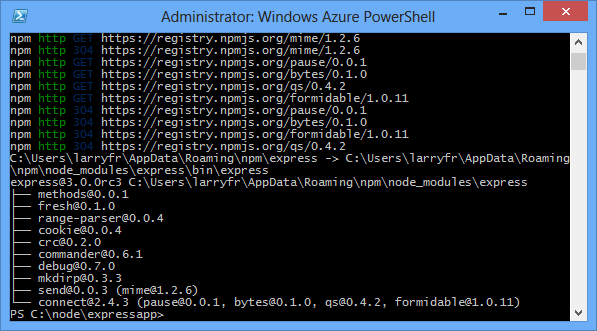
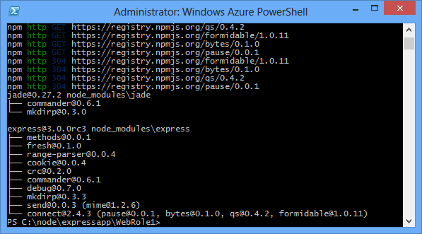

<properties 
    pageTitle="Web App com Express (node) | Microsoft Azure" 
    description="Um tutorial baseia o tutorial de serviço de nuvem e demonstra como usar o módulo do Express." 
    services="cloud-services" 
    documentationCenter="nodejs" 
    authors="rmcmurray" 
    manager="wpickett" 
    editor=""/>

<tags 
    ms.service="cloud-services" 
    ms.workload="tbd" 
    ms.tgt_pltfrm="na" 
    ms.devlang="nodejs" 
    ms.topic="article" 
    ms.date="08/11/2016" 
    ms.author="robmcm"/>

# Criar um aplicativo web do Node usando Express em um serviço de nuvem do Azure

Node inclui um conjunto mínimo de funcionalidade em tempo de execução do núcleo.
Os desenvolvedores muitas vezes usar 3º módulos de terceiros para fornecer funcionalidade adicional ao desenvolver um aplicativo Node. Neste tutorial, você criará um novo aplicativo usando o módulo [Express][] , que fornece uma estrutura MVC para criação de aplicativos web Node.

Uma captura de tela da aplicação concluída está abaixo:

##Criar um projeto de serviço de nuvem

Execute as seguintes etapas para criar um novo projeto de serviço de nuvem chamado 'expressapp':

1. No menu **Iniciar** ou **Tela Iniciar**, procure **O Windows PowerShell**. Por fim, clique com botão direito **Do Windows PowerShell** e selecione **Executar como administrador**.

    

    [AZURE.INCLUDE [install-dev-tools](../../includes/install-dev-tools.md)]

2. Altere os diretórios para o **c:\\nó** diretório e insira os seguintes comandos para criar uma nova solução chamado **expressapp** e uma função de web chamada **WebRole1**:

        PS C:\node> New-AzureServiceProject expressapp
        PS C:\Node\expressapp> Add-AzureNodeWebRole
        PS C:\Node\expressapp> Set-AzureServiceProjectRole WebRole1 Node 0.10.21

    > [AZURE.NOTE] Por padrão, **Adicionar AzureNodeWebRole** usa uma versão antiga do Node. A política de **Conjunto AzureServiceProjectRole** acima instrui o Azure usar v0.10.21 de nó.  Observe que os parâmetros diferenciam maiusculas de minúsculas.  Você pode verificar que a versão correta do Node foi selecionada verificando a propriedade de **mecanismos** em **WebRole1\package.json**.

##Instalar o Express

1. Instale o gerador de Express executando o seguinte comando:

        PS C:\node\expressapp> npm install express-generator -g

    A saída do comando npm deve ser semelhante ao resultado abaixo. 

    

2. Altere diretórios para o diretório **WebRole1** e use o comando express para gerar um novo aplicativo:

        PS C:\node\expressapp\WebRole1> express

    Você será solicitado a substituir seu aplicativo anterior. Insira **y** ou **Sim** para continuar. Express irá gerar o arquivo de app.js e uma estrutura de pasta para a criação de seu aplicativo.

    

5.  Para instalar dependências adicionais definidas no arquivo package.json, digite o seguinte comando:

        PS C:\node\expressapp\WebRole1> npm install

    

6.  Use o seguinte comando para copiar o arquivo de **compartimento/www** **Server. js**. Isso é o serviço de nuvem pode encontrar o ponto de entrada para este aplicativo.

        PS C:\node\expressapp\WebRole1> copy bin/www server.js

    Após concluir este comando, você deve ter um arquivo **Server. js** no diretório WebRole1.

7.  Modificar o **Server. js** para remover uma da '.' caracteres da seguinte linha.

        var app = require('../app');

    Depois de fazer essa modificação, a linha deve aparecer da seguinte maneira.

        var app = require('./app');

    Essa alteração é necessária desde que estamos movido o arquivo antigo ( **bin/www**,) para o mesmo diretório que o arquivo de aplicativo sendo necessário. Após fazer essas alterações, salve o arquivo **Server. js** .

8.  Use o seguinte comando para executar o aplicativo no emulador Azure:

        PS C:\node\expressapp\WebRole1> Start-AzureEmulator -launch

    

## Alterando o modo de exibição

Agora, modificar o modo de exibição para exibir a mensagem "Bem-vindo ao Express no Azure".

1.  Digite o seguinte comando para abrir o arquivo Jade:

        PS C:\node\expressapp\WebRole1> notepad views/index.jade

    

    Jade é o mecanismo de exibição padrão usado por aplicativos de Express. Para obter mais informações sobre o mecanismo de exibição Jade, consulte [http://jade-lang.com][].

2.  Modificar a última linha de texto anexando **no Azure**.

    

3.  Salve o arquivo e saia do bloco de notas.

4.  Atualize o navegador e você verá as alterações.

    

Depois de testar o aplicativo, use o cmdlet **AzureEmulator parar** para interromper o emulador.

##Publicar o aplicativo no Azure

Na janela do PowerShell do Azure, use o cmdlet de **Publicar AzureServiceProject** para implantar o aplicativo para um serviço de nuvem

    PS C:\node\expressapp\WebRole1> Publish-AzureServiceProject -ServiceName myexpressapp -Location "East US" -Launch

Uma vez concluída a operação de implantação, seu navegador será aberto e exibirá a página da web.

## Próximas etapas

Para obter mais informações, consulte o [Node Developer Center](/develop/nodejs/).

  [Node.js Web Application]: http://www.windowsazure.com/develop/nodejs/tutorials/getting-started/
  [Express]: http://expressjs.com/
  [http://jade-lang.com]: http://jade-lang.com

 
