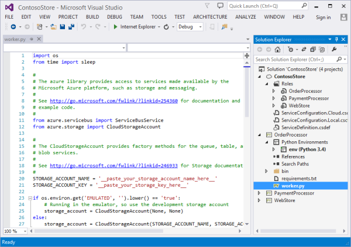
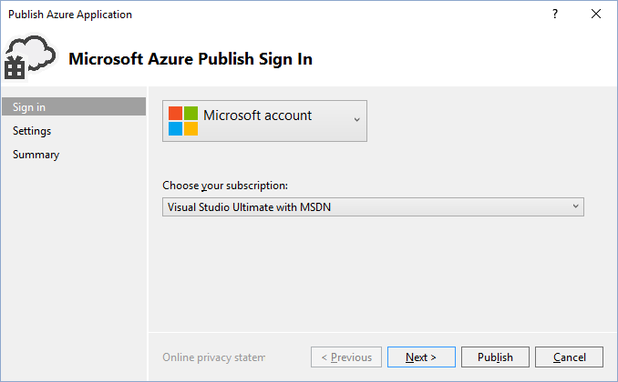
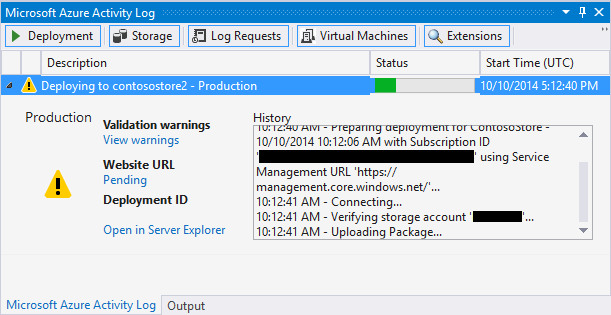

<properties
    pageTitle="Funções de Python web e o trabalho com o Visual Studio | Microsoft Azure"
    description="Visão geral do uso de ferramentas de Python para Visual Studio para criar serviços de nuvem Azure incluindo funções da web e funções de trabalho."
    services="cloud-services"
    documentationCenter="python"
    authors="thraka"
    manager="timlt"
    editor=""/>

<tags
    ms.service="cloud-services"
    ms.workload="tbd"
    ms.tgt_pltfrm="na"
    ms.devlang="python"
    ms.topic="hero-article"
    ms.date="08/03/2016"
    ms.author="adegeo"/>


# <a name="python-web-and-worker-roles-with-python-tools-for-visual-studio"></a>Funções de trabalho e da web de Python com ferramentas Python para Visual Studio

Este artigo fornece uma visão geral de como usar funções da web e trabalhador Python usando [Ferramentas de Python para Visual Studio][]. Você aprenderá como usar o Visual Studio para criar e implantar um serviço de nuvem básico que usa Python.

## <a name="prerequisites"></a>Pré-requisitos

 - Visual Studio 2013 ou 2015
 - [Ferramentas de Python para Visual Studio][] (PTVS)
 - [Ferramentas de Azure SDK do VS 2013][] ou [Azure SDK de VS de 2015][]
 - [Python 2.7 32 bits][] ou [Python 3.5 32 bits][]

[AZURE.INCLUDE [create-account-and-websites-note](../../includes/create-account-and-websites-note.md)]

## <a name="what-are-python-web-and-worker-roles"></a>O que são funções de web e trabalhador Python?

Azure fornece três modelos para execução de aplicativos de computação: [recurso de aplicativos Web do serviço de aplicativo do Azure][execution model-web sites], [máquinas virtuais do Azure][execution model-vms]e [Os serviços de nuvem do Azure][execution model-cloud services]. Todos os modelos de três suportam Python. Serviços de nuvem, que incluem funções da web e trabalhador, fornecem *plataforma como um serviço (PaaS)*. Dentro de um serviço de nuvem, uma função web fornece um servidor de web de serviços de informações da Internet (IIS) dedicado para hospedar aplicativos da web front-end, enquanto uma função de trabalho pode executar tarefas de permanentes ou demorada assíncronas, independentemente de entrada ou interação do usuário.

Para obter mais informações, consulte [o que é um serviço de nuvem?].

> [AZURE.NOTE]*Procurando para criar um site simple?*
Se seu cenário envolve apenas um site simple front-end, considere usando o recurso de aplicativos Web leve do serviço de aplicativo do Azure. Você pode atualizar facilmente para um serviço de nuvem como o crescimento de seu site e suas necessidades mudam. Consulte o <a href="/develop/python/">Python Developer Center</a> para artigos que abordam desenvolvimento do recurso Web Apps no serviço de aplicativo do Azure.
<br />


## <a name="project-creation"></a>Criação de um projeto

No Visual Studio, você pode selecionar o **Serviço de nuvem do Azure** na caixa de diálogo **Novo projeto** , em **Python**.


No Assistente de serviço de nuvem do Azure, você pode criar novas funções da web e trabalhador.


O modelo de função de trabalho vem com código clichê para se conectar a uma conta de armazenamento do Azure ou barramento de serviço do Azure.



Você pode adicionar funções da web ou de trabalho para um serviço de nuvem existente a qualquer momento.  Você pode optar por adicionar projetos existentes em sua solução ou criar novos.


Seu serviço de nuvem pode conter funções implementadas em diferentes idiomas.  Por exemplo, você pode ter uma função de web Python implementada usando Django, com Python ou com funções de trabalho c#.  Você pode facilmente comunicar entre suas funções usando filas de barramento de serviço ou filas de armazenamento.

## <a name="install-python-on-the-cloud-service"></a>Instalar o Python no serviço de nuvem

>[AZURE.WARNING] Os scripts de instalação que são instalados com o Visual Studio (momento a última vez em que este artigo foi atualizado) não funcionam. Esta seção descreve uma solução alternativa.

O principal problema com os scripts de configuração são que eles não instale python. Primeiro, defina duas [tarefas de inicialização](cloud-services-startup-tasks.md) no arquivo [ServiceDefinition.csdef](cloud-services-model-and-package.md#servicedefinitioncsdef) . A primeira tarefa (**PrepPython.ps1**) baixa e instala o tempo de execução do Python. A segunda tarefa (**PipInstaller.ps1**) é executado pip para instalar quaisquer dependências, que você pode ter.

Os scripts a seguir foram escritos direcionamento Python 3.5. Se você quiser usar a versão 2. x do python, configure o arquivo de variável **PYTHON2** para **em** para as duas tarefas de inicialização e a tarefa de runtime: `<Variable name="PYTHON2" value="<mark>on</mark>" />`.


```xml
<Startup>

  <Task executionContext="elevated" taskType="simple" commandLine="bin\ps.cmd PrepPython.ps1">
    <Environment>
      <Variable name="EMULATED">
        <RoleInstanceValue xpath="/RoleEnvironment/Deployment/@emulated" />
      </Variable>
      <Variable name="PYTHON2" value="off" />
    </Environment>
  </Task>

  <Task executionContext="elevated" taskType="simple" commandLine="bin\ps.cmd PipInstaller.ps1">
    <Environment>
      <Variable name="EMULATED">
        <RoleInstanceValue xpath="/RoleEnvironment/Deployment/@emulated" />
      </Variable>
      <Variable name="PYTHON2" value="off" />
    </Environment>
    
  </Task>

</Startup>
```

As variáveis **PYTHON2** e **PYPATH** precisa ser adicionado à tarefa de inicialização de trabalho. A variável **PYPATH** é usada somente se a variável **PYTHON2** é definida como **on**.

```xml
<Runtime>
  <Environment>
    <Variable name="EMULATED">
      <RoleInstanceValue xpath="/RoleEnvironment/Deployment/@emulated" />
    </Variable>
    <Variable name="PYTHON2" value="off" />
    <Variable name="PYPATH" value="%SystemDrive%\Python27" />
  </Environment>
  <EntryPoint>
    <ProgramEntryPoint commandLine="bin\ps.cmd LaunchWorker.ps1" setReadyOnProcessStart="true" />
  </EntryPoint>
</Runtime>
```

#### <a name="sample-servicedefinitioncsdef"></a>ServiceDefinition.csdef de amostra

```xml
<?xml version="1.0" encoding="utf-8"?>
<ServiceDefinition name="AzureCloudServicePython" xmlns="http://schemas.microsoft.com/ServiceHosting/2008/10/ServiceDefinition" schemaVersion="2015-04.2.6">
  <WorkerRole name="WorkerRole1" vmsize="Small">
    <ConfigurationSettings>
      <Setting name="Microsoft.WindowsAzure.Plugins.Diagnostics.ConnectionString" />
      <Setting name="Python2" />
    </ConfigurationSettings>
    <Startup>
      <Task executionContext="elevated" taskType="simple" commandLine="bin\ps.cmd PrepPython.ps1">
        <Environment>
          <Variable name="EMULATED">
            <RoleInstanceValue xpath="/RoleEnvironment/Deployment/@emulated" />
          </Variable>
          <Variable name="PYTHON2" value="off" />
        </Environment>
      </Task>
      <Task executionContext="elevated" taskType="simple" commandLine="bin\ps.cmd PipInstaller.ps1">
        <Environment>
          <Variable name="EMULATED">
            <RoleInstanceValue xpath="/RoleEnvironment/Deployment/@emulated" />
          </Variable>
          <Variable name="PYTHON2" value="off" />
        </Environment>
      </Task>
    </Startup>
    <Runtime>
      <Environment>
        <Variable name="EMULATED">
          <RoleInstanceValue xpath="/RoleEnvironment/Deployment/@emulated" />
        </Variable>
        <Variable name="PYTHON2" value="off" />
        <Variable name="PYPATH" value="%SystemDrive%\Python27" />
      </Environment>
      <EntryPoint>
        <ProgramEntryPoint commandLine="bin\ps.cmd LaunchWorker.ps1" setReadyOnProcessStart="true" />
      </EntryPoint>
    </Runtime>
    <Imports>
      <Import moduleName="RemoteAccess" />
      <Import moduleName="RemoteForwarder" />
    </Imports>
  </WorkerRole>
</ServiceDefinition>
```


Em seguida, crie os arquivos **PrepPython.ps1** e **PipInstaller.ps1** na **. / bin** pasta da sua função.

#### <a name="preppythonps1"></a>PrepPython.ps1

Esse script instala python. Se a variável de ambiente **PYTHON2** é definida como **em** e Python 2.7 será instalado, caso contrário Python 3.5 será instalado.

```powershell
$is_emulated = $env:EMULATED -eq "true"
$is_python2 = $env:PYTHON2 -eq "on"
$nl = [Environment]::NewLine

if (-not $is_emulated){
    Write-Output "Checking if python is installed...$nl"
    if ($is_python2) {
        & "${env:SystemDrive}\Python27\python.exe"  -V | Out-Null
    }
    else {
        py -V | Out-Null
    }

    if (-not $?) {

        $url = "https://www.python.org/ftp/python/3.5.2/python-3.5.2-amd64.exe"
        $outFile = "${env:TEMP}\python-3.5.2-amd64.exe"

        if ($is_python2) {
            $url = "https://www.python.org/ftp/python/2.7.12/python-2.7.12.amd64.msi"
            $outFile = "${env:TEMP}\python-2.7.12.amd64.msi"
        }
        
        Write-Output "Not found, downloading $url to $outFile$nl"
        Invoke-WebRequest $url -OutFile $outFile
        Write-Output "Installing$nl"

        if ($is_python2) {
            Start-Process msiexec.exe -ArgumentList "/q", "/i", "$outFile", "ALLUSERS=1" -Wait
        }
        else {
            Start-Process "$outFile" -ArgumentList "/quiet", "InstallAllUsers=1" -Wait
        }

        Write-Output "Done$nl"
    }
    else {
        Write-Output "Already installed"
    }
}
```

#### <a name="pipinstallerps1"></a>PipInstaller.ps1

Esse script chama pip e instala todas as dependências no arquivo **requirements.txt** . Se a variável de ambiente **PYTHON2** é definida como **em** e Python 2.7 serão usadas, contrário Python 3.5 será usado.

```powershell
$is_emulated = $env:EMULATED -eq "true"
$is_python2 = $env:PYTHON2 -eq "on"
$nl = [Environment]::NewLine

if (-not $is_emulated){
    Write-Output "Checking if requirements.txt exists$nl"
    if (Test-Path ..\requirements.txt) {
        Write-Output "Found. Processing pip$nl"

        if ($is_python2) {
            & "${env:SystemDrive}\Python27\python.exe" -m pip install -r ..\requirements.txt
        }
        else {
            py -m pip install -r ..\requirements.txt
        }

        Write-Output "Done$nl"
    }
    else {
        Write-Output "Not found$nl"
    }
}
```

#### <a name="modify-launchworkerps1"></a>Modificar LaunchWorker.ps1

>[AZURE.NOTE] No caso de um projeto de **função de trabalho** , o arquivo de **LauncherWorker.ps1** é necessário para executar o arquivo de inicialização. Em um projeto de **função web** , o arquivo de inicialização em vez disso, é definido nas propriedades do projeto.

O **bin\LaunchWorker.ps1** foi originalmente criado para fazer muitas trabalho preparatório, mas ele realmente não funciona. Substitua o conteúdo desse arquivo com o seguinte script.

Esse script chama o arquivo de **worker.py** do seu projeto de python. Se a variável de ambiente **PYTHON2** é definida como **em** e Python 2.7 serão usadas, contrário Python 3.5 será usado.

```powershell
$is_emulated = $env:EMULATED -eq "true"
$is_python2 = $env:PYTHON2 -eq "on"
$nl = [Environment]::NewLine

if (-not $is_emulated)
{
    Write-Output "Running worker.py$nl"

    if ($is_python2) {
        cd..
        iex "$env:PYPATH\python.exe worker.py"
    }
    else {
        cd..
        iex "py worker.py"
    }
}
else
{
    Write-Output "Running (EMULATED) worker.py$nl"

    # Customize to your local dev environment

    if ($is_python2) {
        cd..
        iex "$env:PYPATH\python.exe worker.py"
    }
    else {
        cd..
        iex "py worker.py"
    }
}
```

#### <a name="pscmd"></a>PS.cmd

Modelos do Visual Studio devem ter criado um arquivo de **ps.cmd** na **. / bin** pasta. Este script shell destaca os scripts de embalagem do PowerShell acima e fornece log com base no nome da embalagem do PowerShell chamado. Se este arquivo não foi criado, veja aqui o que deve ser nele. 

```bat
@echo off

cd /D %~dp0

if not exist "%DiagnosticStore%\LogFiles" mkdir "%DiagnosticStore%\LogFiles"
%SystemRoot%\System32\WindowsPowerShell\v1.0\powershell.exe -ExecutionPolicy Unrestricted -File %* >> "%DiagnosticStore%\LogFiles\%~n1.txt" 2>> "%DiagnosticStore%\LogFiles\%~n1.err.txt"
```


## <a name="run-locally"></a>Executar localmente

Se você definir seu projeto de serviço de nuvem como o projeto de inicialização e pressione F5, o serviço de nuvem será executado no emulador Azure local.

Embora ofereça suporte a PTVS iniciando no emulador, depuração (por exemplo, pontos de interrupção) não funcionará.

Para depurar suas funções da web e de trabalho, você pode definir o projeto de função como o projeto de inicialização e depurar que em vez disso.  Você também pode definir vários projetos de inicialização.  A solução de atalho e selecione **Definir projetos de inicialização**.


## <a name="publish-to-azure"></a>Publicar no Azure

Para publicar, o projeto de serviço de nuvem na solução de atalho e, em seguida, selecione **Publicar**.



Siga o assistente. Se for necessário, habilite a área de trabalho remota. Área de trabalho remota é útil quando você precisar depurar algo.

Quando terminar de definir as configurações, clique em **Publicar**.

Algum progresso aparecerão na janela de saída e, em seguida, você verá a janela de Log de atividade do Microsoft Azure.



Implantação levará vários minutos para ser concluída e, em seguida, suas funções da web e/ou funcionário serão executado no Azure!

### <a name="investigate-logs"></a>Investigar logs

Após a máquina de virtual do serviço de nuvem é iniciado e instala Python, você pode examinar os logs para localizar as mensagens de falha. Esses logs estão localizados na **C:\Resources\Directory\\\LogFiles {função}** pasta. **PrepPython.err.txt** terá pelo menos um erro de quando o script tenta detectar se Python é instalado e **PipInstaller.err.txt** pode reclamar sobre uma versão desatualizada do pip.

## <a name="next-steps"></a>Próximas etapas

Para obter informações mais detalhadas sobre como trabalhar com funções da web e trabalhador nas ferramentas de Python para Visual Studio, consulte a documentação de PTVS:

- [Projetos de serviço de nuvem][]

Para obter mais detalhes sobre como usar os serviços do Azure de suas funções da web e trabalhador, como usando o armazenamento do Azure ou barramento de serviço, consulte os artigos a seguir.

- [Serviço BLOB][]
- [Serviço de tabela][]
- [Serviço de fila][]
- [Filas do barramento de serviço][]
- [Tópicos de barramento de serviço][]


<!--Link references-->

[O que é um serviço de nuvem?]: cloud-services-choose-me.md
[execution model-web sites]: ../app-service-web/app-service-web-overview.md
[execution model-vms]: ../virtual-machines/virtual-machines-windows-about.md
[execution model-cloud services]: cloud-services-choose-me.md
[Python Developer Center]: /develop/python/

[Serviço BLOB]: ../storage/storage-python-how-to-use-blob-storage.md
[Serviço de fila]: ../storage/storage-python-how-to-use-queue-storage.md
[Serviço de tabela]: ../storage/storage-python-how-to-use-table-storage.md
[Filas do barramento de serviço]: ../service-bus-messaging/service-bus-python-how-to-use-queues.md
[Tópicos de barramento de serviço]: ../service-bus-messaging/service-bus-python-how-to-use-topics-subscriptions.md


<!--External Link references-->

[Ferramentas de Python para Visual Studio]: http://aka.ms/ptvs
[Python Tools for Visual Studio Documentation]: http://aka.ms/ptvsdocs
[Projetos de serviço de nuvem]: http://go.microsoft.com/fwlink/?LinkId=624028
[Ferramentas do Azure SDK do VS 2013]: http://go.microsoft.com/fwlink/?LinkId=323510
[Ferramentas SDK Azure de VS de 2015]: http://go.microsoft.com/fwlink/?LinkId=518003
[Python 2.7 32 bits]: https://www.python.org/downloads/
[Python 3.5 32 bits]: https://www.python.org/downloads/
