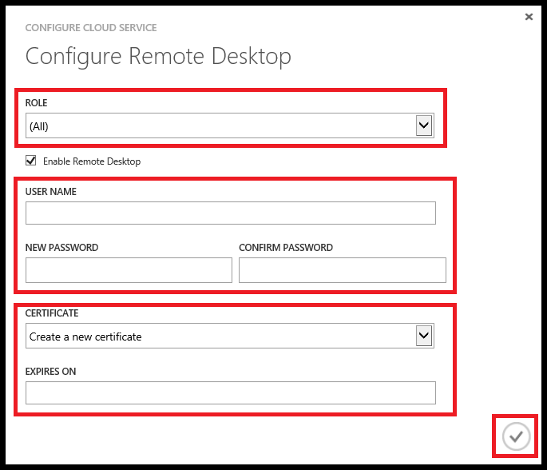

<properties 
pageTitle="Habilitar a Conexão de área de trabalho remota para uma função em serviços de nuvem Azure" 
description="Como configurar seu aplicativo de serviço de nuvem azure para permitir conexões de área de trabalho remotas" 
services="cloud-services" 
documentationCenter="" 
authors="sbtron" 
manager="timlt" 
editor=""/>
<tags 
ms.service="cloud-services" 
ms.workload="tbd" 
ms.tgt_pltfrm="na" 
ms.devlang="na" 
ms.topic="article" 
ms.date="02/17/2016" 
ms.author="saurabh"/>

# <a name="enable-remote-desktop-connection-for-a-role-in-azure-cloud-services"></a>Habilitar a Conexão de área de trabalho remota para uma função em serviços de nuvem Azure

>[AZURE.SELECTOR]
- [Azure portal clássico](cloud-services-role-enable-remote-desktop.md)
- [PowerShell](cloud-services-role-enable-remote-desktop-powershell.md)
- [O Visual Studio](../vs-azure-tools-remote-desktop-roles.md)


Área de trabalho remota permite que você acesse a área de trabalho de uma função em execução no Azure. Você pode usar uma conexão de área de trabalho remota para solucionar problemas e diagnosticar problemas com seu aplicativo enquanto ele é executado. 

Você pode habilitar uma conexão de área de trabalho remota na sua função durante o desenvolvimento, incluindo os módulos de área de trabalho remota em sua definição de serviço ou você pode optar por habilitar a área de trabalho remota através da extensão de área de trabalho remota. A melhor abordagem é usar a extensão de área de trabalho remota, como você pode habilitar a área de trabalho remota mesmo após o aplicativo é implantado sem precisar reimplantar seu aplicativo. 


## <a name="configure-remote-desktop-from-the-azure-classic-portal"></a>Configurar a área de trabalho remota a partir do portal clássico Azure
Portal do clássico Azure usa a abordagem de extensão de área de trabalho remota, portanto, você pode habilitar a área de trabalho remota mesmo após o aplicativo é implantado. A página de **Configurar** seu serviço de nuvem permite que você habilitar a área de trabalho remota, alterar a conta de administrador local usada para conectar-se às máquinas virtuais, o certificado usado na autenticação e definir a data de expiração. 


1. Clique em **Serviços de nuvem**, clique no nome do serviço de nuvem e, em seguida, clique em **Configurar**.

2. Clique em **remoto**.
    
    
    
    > [AZURE.WARNING] Todas as instâncias de função serão reiniciadas quando você primeiro habilitar a área de trabalho remota e clique em Okey (marca de seleção). Para impedir que uma reinicialização, o certificado usado para criptografar a senha deve ser instalado na função. Para impedir a reinicialização [carregar um certificado para o serviço de nuvem](cloud-services-how-to-create-deploy/#how-to-upload-a-certificate-for-a-cloud-service) e retorne a esta caixa de diálogo.
    

3. Em **funções**, selecione a função que você deseja atualizar ou selecionar **tudo** para todas as funções.

4. Faça uma das seguintes alterações:
    
    - Para habilitar a área de trabalho remota, marque a caixa de seleção **Habilitar a área de trabalho remota** . Para desabilitar a área de trabalho remota, desmarque a caixa de seleção.
    
    - Crie uma conta para usar em conexões de área de trabalho remota para as instâncias de função.
    
    - Atualize a senha da conta existente.
    
    - Selecione um certificado carregado para usar de autenticação (carregar o certificado usando **carregar** na página **certificados** ) ou criar um novo certificado. 
    
    - Altere a data de expiração para a configuração de área de trabalho remota.

5. Quando terminar de suas atualizações de configuração, clique em **Okey** (marca de seleção).


## <a name="remote-into-role-instances"></a>Remoto em instâncias de função
Quando a área de trabalho remota estiver ativada nas funções poderá remoto para uma instância de função por meio de diversas ferramentas.

Para conectar a uma instância da função do Azure clássico portal:
    
  1.   Clique em **instâncias** para abrir a página de **instâncias** .
  2.   Selecione uma instância de função que tenha configurado a área de trabalho remota.
  3.   Clique em **Conectar**e siga as instruções para abrir a área de trabalho. 
  4.   Clique em **Abrir** e, em seguida, **conectar-se** para iniciar a conexão de área de trabalho remota. 


### <a name="use-visual-studio-to-remote-into-a-role-instance"></a>Use o Visual Studio para remoto em uma instância de função

No Visual Studio, Server Explorer:

1. Expanda o **Azure\\serviços de nuvem\\[nome do serviço de nuvem]** nó.
2. Expanda **temporário** ou **produção**.
3. Expanda a função individual.
4. Clique com botão direito uma das instâncias de função, clique em **Conectar usando a área de trabalho remota …**e insira o nome de usuário e senha. 


### <a name="use-powershell-to-get-the-rdp-file"></a>Usar o PowerShell para obter o arquivo RDP
Você pode usar o cmdlet [Get-AzureRemoteDesktopFile](https://msdn.microsoft.com/library/azure/dn495261.aspx) para recuperar o arquivo RDP. Em seguida, você pode usar o arquivo RDP com Conexão de área de trabalho remota para acessar o serviço de nuvem.

### <a name="programmatically-download-the-rdp-file-through-the-service-management-rest-api"></a>Baixar arquivo RDP por meio da API do serviço de gerenciamento restante programaticamente
Você pode usar a operação de REST [Baixar arquivo RDP](https://msdn.microsoft.com/library/jj157183.aspx) para baixar o arquivo RDP. 


## <a name="to-configure-remote-desktop-in-the-service-definition-file"></a>Para configurar a área de trabalho remota no arquivo de definição de serviço

Este método permite que você habilite a área de trabalho remota para o aplicativo durante o desenvolvimento. Essa abordagem requer senhas criptografadas armazenada na sua configuração de serviço de arquivos e todas as atualizações para a configuração da área de trabalho remota exijam uma reimplantação do aplicativo. Se você quiser evitar essas desvantagens, você deve usar a abordagem de extensão da área de trabalho remota com base descrita acima.  

Você pode usar o Visual Studio para [Habilitar uma conexão de área de trabalho remota](../vs-azure-tools-remote-desktop-roles.md) usando a abordagem de arquivo de definição de serviço.  
As etapas a seguir descrevem as alterações necessárias para os arquivos de modelo de serviço para habilitar a área de trabalho remota. Visual Studio toma automaticamente essas alterações durante a publicação.

### <a name="set-up-the-connection-in-the-service-model"></a>Configurar a conexão no modelo de serviço 
Use o elemento de **importações** para importar o módulo de **acesso remoto** e o módulo **RemoteForwarder** para o arquivo de [ServiceDefinition.csdef](cloud-services-model-and-package.md#csdef) .

O arquivo de definição de serviço deve ser semelhante ao seguinte exemplo com o `<Imports>` elemento adicionado.

```xml
<ServiceDefinition name="<name-of-cloud-service>" xmlns="http://schemas.microsoft.com/ServiceHosting/2008/10/ServiceDefinition" schemaVersion="2013-03.2.0">
    <WebRole name="WebRole1" vmsize="Small">
        <Sites>
            <Site name="Web">
                <Bindings>
                    <Binding name="Endpoint1" endpointName="Endpoint1" />
                </Bindings>
            </Site>
        </Sites>
        <Endpoints>
            <InputEndpoint name="Endpoint1" protocol="http" port="80" />
        </Endpoints>
        <Imports>
            <Import moduleName="Diagnostics" />
            <Import moduleName="RemoteAccess" />
            <Import moduleName="RemoteForwarder" />
        </Imports>
    </WebRole>
</ServiceDefinition>
```
O arquivo de [ServiceConfiguration](cloud-services-model-and-package.md#cscfg) deve ser semelhante ao exemplo a seguir, observe o `<ConfigurationSettings>` e `<Certificates>` elementos. O certificado especificado deve ser [carregado para o serviço de nuvem](../cloud-services-how-to-create-deploy.md#how-to-upload-a-certificate-for-a-cloud-service).

```xml
<?xml version="1.0" encoding="utf-8"?>
<ServiceConfiguration serviceName="<name-of-cloud-service>" xmlns="http://schemas.microsoft.com/ServiceHosting/2008/10/ServiceConfiguration" osFamily="3" osVersion="*" schemaVersion="2013-03.2.0">
    <Role name="WebRole1">
        <Instances count="2" />
        <ConfigurationSettings>
            <Setting name="Microsoft.WindowsAzure.Plugins.RemoteAccess.Enabled" value="true" />
            <Setting name="Microsoft.WindowsAzure.Plugins.RemoteAccess.AccountUsername" value="[name-of-user-account]" />
            <Setting name="Microsoft.WindowsAzure.Plugins.RemoteAccess.AccountEncryptedPassword" value="[base-64-encrypted-user-password]" />
            <Setting name="Microsoft.WindowsAzure.Plugins.RemoteAccess.AccountExpiration" value="[certificate-expiration]" />
            <Setting name="Microsoft.WindowsAzure.Plugins.RemoteForwarder.Enabled" value="true" />
        </ConfigurationSettings>
        <Certificates>
            <Certificate name="Microsoft.WindowsAzure.Plugins.RemoteAccess.PasswordEncryption" thumbprint="[certificate-thumbprint]" thumbprintAlgorithm="sha1" />
        </Certificates>
    </Role>
</ServiceConfiguration>
```


## <a name="additional-resources"></a>Recursos adicionais

[Como configurar os serviços de nuvem](cloud-services-how-to-configure.md)