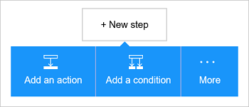

<properties
    pageTitle="Adicionar o armazenamento de blob do Microsoft Azure conector em seus aplicativos de lógica | Microsoft Azure"
    description="Visão geral do armazenamento de blob do Microsoft Azure conector com parâmetros de API REST"
    services=""
    documentationCenter="" 
    authors="MandiOhlinger"
    manager="anneta"
    editor=""
    tags="connectors"/>

<tags
   ms.service="logic-apps"
   ms.devlang="na"
   ms.topic="article"
   ms.tgt_pltfrm="na"
   ms.workload="integration" 
   ms.date="10/18/2016"
   ms.author="mandia"/>

# Começar a usar o conector de armazenamento de blob do Microsoft Azure
Armazenamento de Blob do Azure é um serviço para armazenar grandes quantidades de dados não estruturados. Executar várias ações como carregar, atualizar, obtenha e excluir blobs em armazenamento de blob do Microsoft Azure. 

Com o armazenamento de blob do Microsoft Azure, você:

- Construir seu fluxo de trabalho carregando novos projetos, ou Obtendo arquivos que tenham sido atualizados recentemente.
- Use ações para obter metadados do arquivo, excluir um arquivo, copiar arquivos e muito mais. Por exemplo, quando uma ferramenta é atualizada em um site Azure (um disparador), em seguida, atualize um arquivo no armazenamento de blob (uma ação). 

Este tópico mostra como usar o conector de armazenamento de blob em um aplicativo de lógica e também lista as ações.

>[AZURE.NOTE] Esta versão do artigo se aplica a disponibilidade de aplicativos de lógica geral (GA). 

Para saber mais sobre os aplicativos de lógica, consulte [o que são aplicativos de lógica](../app-service-logic/app-service-logic-what-are-logic-apps.md) e [criar um aplicativo de lógica](../app-service-logic/app-service-logic-create-a-logic-app.md).

## Conectar ao armazenamento de blob do Microsoft Azure

Para que seu aplicativo de lógica possa acessar qualquer serviço, você primeiro criar uma *conexão* com o serviço. Uma conexão fornece conectividade entre um aplicativo de lógica e outro serviço. Por exemplo, para se conectar a uma conta de armazenamento, você primeiro criar uma *conexão*do armazenamento de blob. Para criar uma conexão, insira as credenciais que você normalmente usa para acessar o serviço que você está se conectando. Com o armazenamento do Azure, insira as credenciais de sua conta de armazenamento para criar a conexão. 

#### Criar a conexão

>[AZURE.INCLUDE [Create a connection to Azure blob storage](../../includes/connectors-create-api-azureblobstorage.md)]
 
## Use um gatilho

Esse conector não ter disparadores. Use outros disparadores para iniciar o aplicativo de lógica, como um gatilho de recorrência, um gatilho de HTTP Webhook, disparadores disponíveis com outros conectores e muito mais. [Criar um aplicativo de lógica](../app-service-logic/app-service-logic-create-a-logic-app.md) fornece um exemplo.

## Usar uma ação
    
Uma ação é uma operação realizada pelo fluxo de trabalho definido em um aplicativo de lógica.

1. Selecione o sinal. Você vê várias opções: **Adicionar uma ação**, **Adicionar uma condição**ou uma das opções a **mais** .

    

2. Escolha **Adicionar uma ação**.

3. Na caixa de texto, digite "blob" para obter uma lista de todas as ações disponíveis.

     

4. Em nosso exemplo, escolha **AzureBlob - obter metadados usando o caminho do arquivo**. Se uma conexão já existir, selecione o **…** Botão (Mostrar seletor) para selecionar um arquivo.

    

    Se você for solicitado para as informações de conexão, insira os detalhes para criar a conexão. [Criar a conexão](connectors-create-api-azureblobstorage.md#create-the-connection) neste tópico descreve essas propriedades. 

    > [AZURE.NOTE] Neste exemplo, podemos obter os metadados de um arquivo. Para ver os metadados, adicione outra ação que cria um novo arquivo usando outro conector. Por exemplo, adicione uma ação de OneDrive que cria um novo arquivo "testar" baseado nos metadados. 

5. **Salvar** suas alterações (canto superior esquerdo da barra de ferramentas). Seu aplicativo de lógica é salvo e pode ser ativado automaticamente.

> [AZURE.TIP] [Gerenciador de armazenamento](http://storageexplorer.com/) é uma ótima ferramenta para gerenciar várias contas de armazenamento.

## Detalhes técnicos

## Ações de Blob Storage

|Ação|Descrição|
|--- | ---|
|[Obter metadados de arquivo](connectors-create-api-azureblobstorage.md#get-file-metadata)|Essa operação obtém os metadados de arquivos usando o id de arquivo.|
|[Arquivo de atualização](connectors-create-api-azureblobstorage.md#update-file)|Essa operação atualiza um arquivo.|
|[Excluir arquivo](connectors-create-api-azureblobstorage.md#delete-file)|Essa operação exclui um arquivo.|
|[Obter metadados de arquivos usando o caminho](connectors-create-api-azureblobstorage.md#get-file-metadata-using-path)|Essa operação obtém os metadados de arquivos usando o caminho.|
|[Obter o conteúdo do arquivo usando o caminho](connectors-create-api-azureblobstorage.md#get-file-content-using-path)|Essa operação obtém o conteúdo usando o caminho do arquivo.|
|[Obter o conteúdo do arquivo](connectors-create-api-azureblobstorage.md#get-file-content)|Essa operação obtém o conteúdo do arquivo usando id.|
|[Criar arquivo](connectors-create-api-azureblobstorage.md#create-file)|Essa operação carrega um arquivo.|
|[Copiar arquivo](connectors-create-api-azureblobstorage.md#copy-file)|Essa operação copia um arquivo para o armazenamento de Blob do Azure.|
|[Extrair arquivo morto para pasta](connectors-create-api-azureblobstorage.md#extract-archive-to-folder)|Essa operação extrai um arquivo em uma pasta (exemplo:. zip).|

### Detalhes de ação

Nesta seção, consulte os detalhes específicos sobre cada ação, incluindo quaisquer propriedades de entrada necessárias ou opcionais e qualquer associado com o conector de saída correspondente.

#### Obter metadados de arquivo
Essa operação obtém os metadados de arquivos usando o id de arquivo.  

|Nome da propriedade| Nome para exibição|Descrição|
| ---|---|---|
|ID *|Arquivo|Selecione um arquivo|

Um asterisco (*) significa que a propriedade é necessária.

##### Detalhes de saída
BlobMetadata

| Nome da propriedade | Tipo de dados |
|---|---|
|ID|cadeia de caracteres|
|Nome|cadeia de caracteres|
|DisplayName|cadeia de caracteres|
|Caminho|cadeia de caracteres|
|LastModified|cadeia de caracteres|
|Tamanho|número inteiro|
|Tipo de mídia|cadeia de caracteres|
|IsFolder|booliano|
|ETag|cadeia de caracteres|
|FileLocator|cadeia de caracteres|

#### Arquivo de atualização
Essa operação atualiza um arquivo.  

|Nome da propriedade| Nome para exibição|Descrição|
| ---|---|---|
|ID *|Arquivo|Selecione um arquivo|
|corpo *|Conteúdo do arquivo|Conteúdo do arquivo para atualizar|

Um asterisco (*) significa que a propriedade é necessária.

##### Detalhes de saída
BlobMetadata

| Nome da propriedade | Tipo de dados |
|---|---|
|ID|cadeia de caracteres|
|Nome|cadeia de caracteres|
|DisplayName|cadeia de caracteres|
|Caminho|cadeia de caracteres|
|LastModified|cadeia de caracteres|
|Tamanho|número inteiro|
|Tipo de mídia|cadeia de caracteres|
|IsFolder|booliano|
|ETag|cadeia de caracteres|
|FileLocator|cadeia de caracteres|

#### Excluir arquivo
Essa operação exclui um arquivo.  

|Nome da propriedade| Nome para exibição|Descrição|
| ---|---|---|
|ID *|Arquivo|Selecione um arquivo|

Um asterisco (*) significa que a propriedade é necessária.

##### Detalhes de saída
Nenhuma.

#### Obter metadados de arquivos usando o caminho
Essa operação obtém os metadados de arquivos usando o caminho.  

|Nome da propriedade| Nome para exibição|Descrição|
| ---|---|---|
|caminho *|Caminho do arquivo|Selecione um arquivo|

Um asterisco (*) significa que a propriedade é necessária.

##### Detalhes de saída
BlobMetadata

| Nome da propriedade | Tipo de dados |
|---|---|
|ID|cadeia de caracteres|
|Nome|cadeia de caracteres|
|DisplayName|cadeia de caracteres|
|Caminho|cadeia de caracteres|
|LastModified|cadeia de caracteres|
|Tamanho|número inteiro|
|Tipo de mídia|cadeia de caracteres|
|IsFolder|booliano|
|ETag|cadeia de caracteres|
|FileLocator|cadeia de caracteres|

#### Obter o conteúdo do arquivo usando o caminho
Essa operação obtém o conteúdo usando o caminho do arquivo.  

|Nome da propriedade| Nome para exibição|Descrição|
| ---|---|---|
|caminho *|Caminho do arquivo|Selecione um arquivo|

Um asterisco (*) significa que a propriedade é necessária.

##### Detalhes de saída
Nenhuma.

#### Obter o conteúdo do arquivo
Essa operação obtém o conteúdo do arquivo usando id.  

|Nome da propriedade| Tipo de dados|Descrição|
| ---|---|---|
|ID *|cadeia de caracteres|Selecione um arquivo|

Um asterisco (*) significa que a propriedade é necessária.

##### Detalhes de saída
Nenhuma.

#### Criar arquivo
Essa operação carrega um arquivo.  

|Nome da propriedade| Nome para exibição|Descrição|
| ---|---|---|
|folderPath *|Caminho da pasta|Selecione uma pasta|
|nome *|Nome do arquivo|Nome do arquivo para carregar|
|corpo *|Conteúdo do arquivo|Conteúdo do arquivo para carregar|

Um asterisco (*) significa que a propriedade é necessária.

##### Detalhes de saída
BlobMetadata

| Nome da propriedade | Tipo de dados | 
|---|---|
|ID|cadeia de caracteres|
|Nome|cadeia de caracteres|
|DisplayName|cadeia de caracteres|
|Caminho|cadeia de caracteres|
|LastModified|cadeia de caracteres|
|Tamanho|número inteiro|
|Tipo de mídia|cadeia de caracteres|
|IsFolder|booliano|
|ETag|cadeia de caracteres|
|FileLocator|cadeia de caracteres|

#### Copiar arquivo
Essa operação copia um arquivo para o armazenamento de Blob do Azure.  

|Nome da propriedade| Nome para exibição|Descrição|
| ---|---|---|
|fonte *|Url da fonte|Especificar a Url para o arquivo de origem|
|destino *|Caminho do arquivo de destino|Especifique o caminho de arquivo de destino, incluindo o nome de arquivo de destino|
|Substituir|Substituir?|Um arquivo de destino existente substituir (verdadeiro/falso)?  |

Um asterisco (*) significa que a propriedade é necessária.

##### Detalhes de saída
BlobMetadata

| Nome da propriedade | Tipo de dados |
|---|---|
|ID|cadeia de caracteres|
|Nome|cadeia de caracteres|
|DisplayName|cadeia de caracteres|
|Caminho|cadeia de caracteres|
|LastModified|cadeia de caracteres|
|Tamanho|número inteiro|
|Tipo de mídia|cadeia de caracteres|
|IsFolder|booliano|
|ETag|cadeia de caracteres|
|FileLocator|cadeia de caracteres|

#### Extrair arquivo morto para pasta
Essa operação extrai um arquivo em uma pasta (exemplo:. zip).  

|Nome da propriedade| Nome para exibição|Descrição|
| ---|---|---|
|fonte *|Caminho do arquivo morto fonte|Selecione um arquivo morto|
|destino *|Caminho da pasta de destino|Selecionar o conteúdo para extrair|
|Substituir|Substituir?|Um arquivo de destino existente substituir (verdadeiro/falso)?|

Um asterisco (*) significa que a propriedade é necessária.

##### Detalhes de saída
BlobMetadata

| Nome da propriedade | Tipo de dados |
|---|---|
|ID|cadeia de caracteres|
|Nome|cadeia de caracteres|
|DisplayName|cadeia de caracteres|
|Caminho|cadeia de caracteres|
|LastModified|cadeia de caracteres|
|Tamanho|número inteiro|
|Tipo de mídia|cadeia de caracteres|
|IsFolder|booliano|
|ETag|cadeia de caracteres|
|FileLocator|cadeia de caracteres|

## Respostas HTTP

Ao fazer chamadas para as ações diferentes, você pode receber determinadas respostas. A tabela a seguir descreve as respostas e suas descrições:  

|Nome|Descrição|
|---|---|
|200|Okey|
|202|Aceita|
|400|Solicitação inválida|
|401|Não autorizado|
|403|Proibido|
|404|Não encontrado|
|500|Erro interno do servidor. Ocorreu um erro desconhecido|
|padrão|Falha na operação.|

## Próximas etapas

[Criar um aplicativo de lógica](../app-service-logic/app-service-logic-create-a-logic-app.md). Explore os outros conectores disponíveis nos aplicativos de lógica em nossa [lista APIs](apis-list.md).

