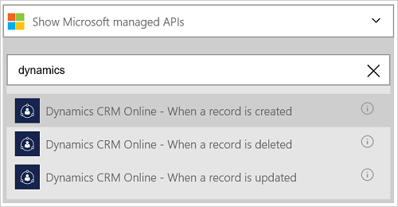
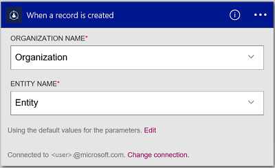

<properties
    pageTitle="Adicionar o conector Dynamics CRM Online para seus aplicativos de lógica | Microsoft Azure"
    description="Crie aplicativos de lógica com o serviço de aplicativo do Azure. O provedor de Conexão Dynamics CRM Online fornece uma API para trabalhar com entidades em Dynamics CRM Online."
    services="logic-apps"    
    documentationCenter=""     
    authors="MandiOhlinger"    
    manager="erikre"    
    editor="" 
    tags="connectors" />

<tags
ms.service="logic-apps"
ms.devlang="na"
ms.topic="article"
ms.tgt_pltfrm="na"
ms.workload="integration"
ms.date="08/15/2016"
ms.author="mandia"/>

# Começar a usar o conector do Dynamics CRM Online
Conectar-se ao Dynamics CRM Online para criar um novo registro, atualize um item e muito mais. Com o CRM Online, você pode:

- Construa seu fluxo de negócios com base nos dados que você obtenha do CRM Online. 
- Ações de uso que excluir um registro, obtenha entidades e muito mais. Essas ações obtém uma resposta e, em seguida, disponibilizar a saída para outras ações. Por exemplo, quando um item é atualizado no CRM, você pode enviar um email usando o Office 365.

Este tópico mostra como usar o conector Dynamics CRM Online em um aplicativo de lógica e também lista os disparadores e ações.

>[AZURE.NOTE] Esta versão do artigo se aplica a disponibilidade de aplicativos de lógica geral (GA).

Para saber mais sobre os aplicativos de lógica, consulte [o que são aplicativos de lógica](../app-service-logic/app-service-logic-what-are-logic-apps.md) e [criar um aplicativo de lógica](../app-service-logic/app-service-logic-create-a-logic-app.md).

## Conecte-se ao Dynamics CRM Online

Para que seu aplicativo de lógica possa acessar qualquer serviço, você primeiro criar uma *conexão* com o serviço. Uma conexão fornece conectividade entre um aplicativo de lógica e outro serviço. Por exemplo, para se conectar ao Dynamics, primeiro é necessário uma *conexão*do Dynamics CRM Online. Para criar uma conexão, insira as credenciais que você normalmente usa para acessar o serviço que você deseja se conectar. Com o Dynamics, insira as credenciais de sua conta do Dynamics CRM Online para criar a conexão.

### Criar a conexão

>[AZURE.INCLUDE [Steps to create a connection to Dynamics CRM Online Connection Provider](../../includes/connectors-create-api-crmonline.md)]

## Use um gatilho

Um disparador é um evento que pode ser usado para iniciar o fluxo de trabalho definido em um aplicativo de lógica. Gatilhos "poll" o serviço a um intervalo e a frequência desejada. [Saiba mais sobre gatilhos](../app-service-logic/app-service-logic-what-are-logic-apps.md#logic-app-concepts).

1. No aplicativo lógica, digite "dynamics" para obter uma lista de disparadores:  

    

2. Selecione **Dynamics CRM Online - quando um registro é criado**. Se uma conexão já existir, selecione uma organização e entidade na lista suspensa.

    

    Se você for solicitado a entrar, insira o sinal na detalhes para criar a conexão. [Criar a conexão](connectors-create-api-crmonline.md#create-the-connection) neste tópico apresenta as etapas. 

    > [AZURE.NOTE] Neste exemplo, o aplicativo de lógica é executado quando um registro é criado. Para ver os resultados do disparador, adicione outra ação que envia um email. Por exemplo, adicione a ação do Office 365 *Enviar um email* que emails quando o novo registro for adicionado. 

3. Selecione o botão **Editar** e defina os valores de **frequência** e **intervalo** . Por exemplo, se quiser que o disparador para pesquisar a cada 15 minutos, em seguida, defina a **frequência** em **minuto**e definir o **intervalo** para **15**. 

    

4. **Salvar** suas alterações (canto superior esquerdo da barra de ferramentas). Seu aplicativo de lógica é salvo e pode ser ativado automaticamente.

## Usar uma ação

Uma ação é uma operação realizada pelo fluxo de trabalho definido em um aplicativo de lógica. [Saiba mais sobre ações](../app-service-logic/app-service-logic-what-are-logic-apps.md#logic-app-concepts).

1. Selecione o sinal. Você vê várias opções: **Adicionar uma ação**, **Adicionar uma condição**ou uma das opções a **mais** .

    

2. Escolha **Adicionar uma ação**.

3. Na caixa de texto, digite "dynamics" para obter uma lista de todas as ações disponíveis.

    

4. Em nosso exemplo, escolha **Dynamics CRM Online, atualize um registro**. Se uma conexão já existir, escolha o **Nome da organização**, **Nome de entidade**e outras propriedades:  

    

    Se você for solicitado para as informações de conexão, insira os detalhes para criar a conexão. [Criar a conexão](connectors-create-api-crmonline.md#create-the-connection) neste tópico descreve essas propriedades. 

    > [AZURE.NOTE] Neste exemplo, podemos atualizar um registro existente no CRM Online. Você pode usar a saída de outro disparador para atualizar o registro. Por exemplo, adicione o disparador do SharePoint *quando um item existente é modificado* . Adicione a ação CRM Online *atualizar um registro* que usa os campos do SharePoint para atualizar o registro existente no CRM Online. 

5. **Salvar** suas alterações (canto superior esquerdo da barra de ferramentas). Seu aplicativo de lógica é salvo e pode ser ativado automaticamente.

## Detalhes técnicos

## Disparadores

|Disparadores | Descrição|
|--- | ---|
|[Quando um registro é criado](connectors-create-api-crmonline.md#when-a-record-is-created)|Aciona um fluxo quando um objeto é criado no CRM.|
|[Quando um registro é atualizado](connectors-create-api-crmonline.md#when-a-record-is-updated)|Aciona um fluxo quando um objeto é modificado no CRM.|
|[Quando um registro é excluído](connectors-create-api-crmonline.md#when-a-record-is-deleted)|Aciona um fluxo quando um objeto é excluído no CRM.|

## Ações

|Ação|Descrição|
|--- | ---|
|[Registros da lista](connectors-create-api-crmonline.md#list-records)|Essa operação obtém os registros para uma entidade.|
|[Criar um novo registro](connectors-create-api-crmonline.md#create-a-new-record)|Esta operação cria um novo registro de uma entidade.|
|[Obtenha o registro](connectors-create-api-crmonline.md#get-record)|Essa operação obtém o registro especificado para uma entidade.|
|[Excluir um registro](connectors-create-api-crmonline.md#delete-a-record)|Essa operação exclui um registro de uma coleção de entidade.|
|[Atualizar um registro](connectors-create-api-crmonline.md#update-a-record)|Essa operação atualiza um registro existente para uma entidade.|

### Detalhes do acionador e ação

Nesta seção, consulte os detalhes específicos sobre cada disparador e ação, incluindo quaisquer propriedades de entrada necessárias ou opcionais e qualquer associado com o conector de saída correspondente.

#### Quando um registro é criado
Aciona um fluxo quando um objeto é criado no CRM. 

|Nome da propriedade| Nome para exibição|Descrição|
| ---|---|---|
|DataSet *|Nome da organização|Nome da organização CRM como Contoso|
|tabela *|Nome de entidade|Nome da entidade|
|$skip|Ignorar contagem|Número de entradas para ignorar (padrão = 0)|
|$top|Contagem de obter máximo|Número máximo de entradas para obter (padrão = 256)|
|$filter|Consulta de filtro|Uma consulta de filtro ODATA para restringir as entradas retornadas|
|$orderby|Classificado por|Uma consulta de orderBy ODATA para especificar a ordem das entradas|

Um asterisco (*) significa que a propriedade é necessária.

##### Detalhes de saída
ItemsList

| Nome da propriedade | Tipo de dados |
|---|---|
|valor|matriz|

#### Quando um registro é atualizado
Aciona um fluxo quando um objeto é modificado no CRM. 

|Nome da propriedade| Nome para exibição|Descrição|
| ---|---|---|
|DataSet *|Nome da organização|Nome da organização CRM como Contoso|
|tabela *|Nome de entidade|Nome da entidade|
|$skip|Ignorar contagem|Número de entradas para ignorar (padrão = 0)|
|$top|Contagem de obter máximo|Número máximo de entradas para obter (padrão = 256)|
|$filter|Consulta de filtro|Uma consulta de filtro ODATA para restringir as entradas retornadas|
|$orderby|Classificado por|Uma consulta de orderBy ODATA para especificar a ordem das entradas|

Um asterisco (*) significa que a propriedade é necessária.

##### Detalhes de saída
ItemsList

| Nome da propriedade | Tipo de dados |
|---|---|
|valor|matriz|

#### Quando um registro é excluído
Aciona um fluxo quando um objeto é excluído no CRM. 

|Nome da propriedade| Nome para exibição|Descrição|
| ---|---|---|
|DataSet *|Nome da organização|Nome da organização CRM como Contoso|
|tabela *|Nome de entidade|Nome da entidade|
|$skip|Ignorar contagem|Número de entradas para ignorar (padrão = 0)|
|$top|Contagem de obter máximo|Número máximo de entradas para obter (padrão = 256)|
|$filter|Consulta de filtro|Uma consulta de filtro ODATA para restringir as entradas retornadas|
|$orderby|Classificado por|Uma consulta de orderBy ODATA para especificar a ordem das entradas|

Um asterisco (*) significa que a propriedade é necessária.

##### Detalhes de saída
ItemsList

| Nome da propriedade | Tipo de dados |
|---|---|
|valor|matriz|

#### Registros da lista
Essa operação obtém os registros para uma entidade. 

|Nome da propriedade| Nome para exibição|Descrição|
| ---|---|---|
|DataSet *|Nome da organização|Nome da organização CRM como Contoso|
|tabela *|Nome de entidade|Nome da entidade|
|$skip|Ignorar contagem|Número de entradas para ignorar (padrão = 0)|
|$top|Contagem de obter máximo|Número máximo de entradas para obter (padrão = 256)|
|$filter|Consulta de filtro|Uma consulta de filtro ODATA para restringir as entradas retornadas|
|$orderby|Classificado por|Uma consulta de orderBy ODATA para especificar a ordem das entradas|

Um asterisco (*) significa que a propriedade é necessária.

##### Detalhes de saída
ItemsList

| Nome da propriedade | Tipo de dados |
|---|---|
|valor|matriz|

#### Criar um novo registro
Esta operação cria um novo registro de uma entidade. 

|Nome da propriedade| Nome para exibição|Descrição|
| ---|---|---|
|DataSet *|Nome da organização|Nome da organização CRM como Contoso|
|tabela *|Nome de entidade|Nome da entidade|

Um asterisco (*) significa que a propriedade é necessária.

##### Detalhes de saída
Nenhuma.

#### Obtenha o registro
Essa operação obtém o registro especificado para uma entidade. 

|Nome da propriedade| Nome para exibição|Descrição|
| ---|---|---|
|DataSet *|Nome da organização|Nome da organização CRM como Contoso|
|tabela *|Nome de entidade|Nome da entidade|
|ID *|Identificador de item|Especifique o identificador do registro|

Um asterisco (*) significa que a propriedade é necessária.

##### Detalhes de saída
Nenhuma.

#### Excluir um registro
Essa operação exclui um registro de uma coleção de entidade. 

|Nome da propriedade| Nome para exibição|Descrição|
| ---|---|---|
|DataSet *|Nome da organização|Nome da organização CRM como Contoso|
|tabela *|Nome de entidade|Nome da entidade|
|ID *|Identificador de item|Especifique o identificador do registro|

Um asterisco (*) significa que a propriedade é necessária.

#### Atualizar um registro
Essa operação atualiza um registro existente para uma entidade. 

|Nome da propriedade| Nome para exibição|Descrição|
| ---|---|---|
|DataSet *|Nome da organização|Nome da organização CRM como Contoso|
|tabela *|Nome de entidade|Nome da entidade|
|ID *|Identificador de registro|Especifique o identificador do registro|

Um asterisco (*) significa que a propriedade é necessária.

##### Detalhes de saída
Nenhuma.

## Respostas HTTP

Ações e disparadores podem retornar um ou mais dos seguintes códigos de status HTTP: 

|Nome|Descrição|
|---|---|
|200|Okey|
|202|Aceita|
|400|Solicitação inválida|
|401|Não autorizado|
|403|Proibido|
|404|Não encontrado|
|500|Erro interno do servidor. Ocorreu um erro desconhecido.|
|padrão|Falha na operação.|

## Próximas etapas

[Criar um aplicativo de lógica](../app-service-logic/app-service-logic-create-a-logic-app.md). Explore os outros conectores disponíveis nos aplicativos de lógica em nossa [lista APIs](apis-list.md).

