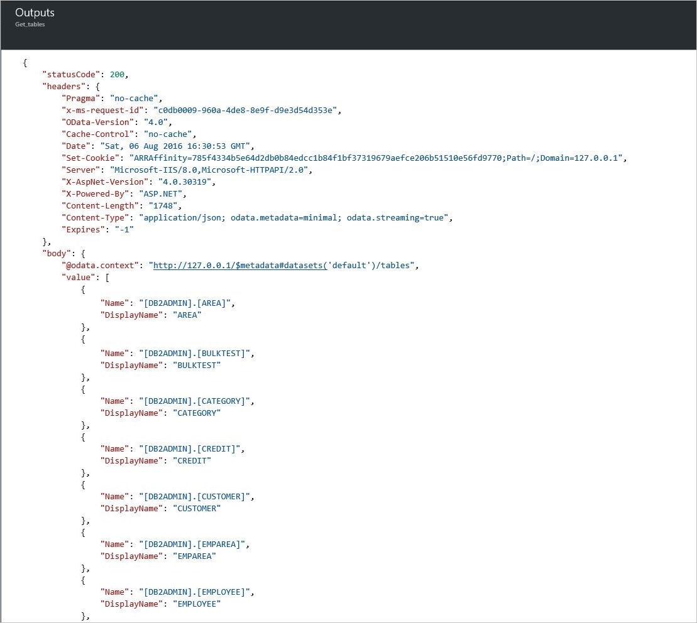
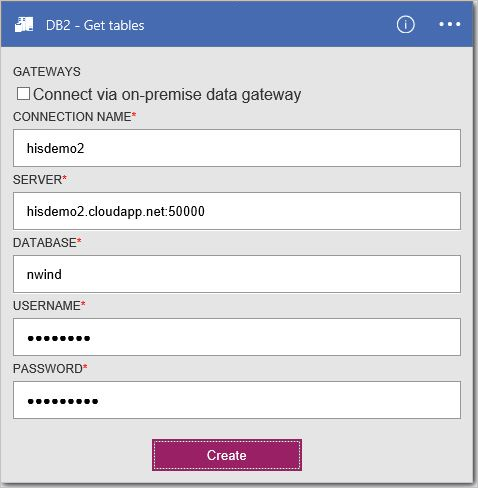
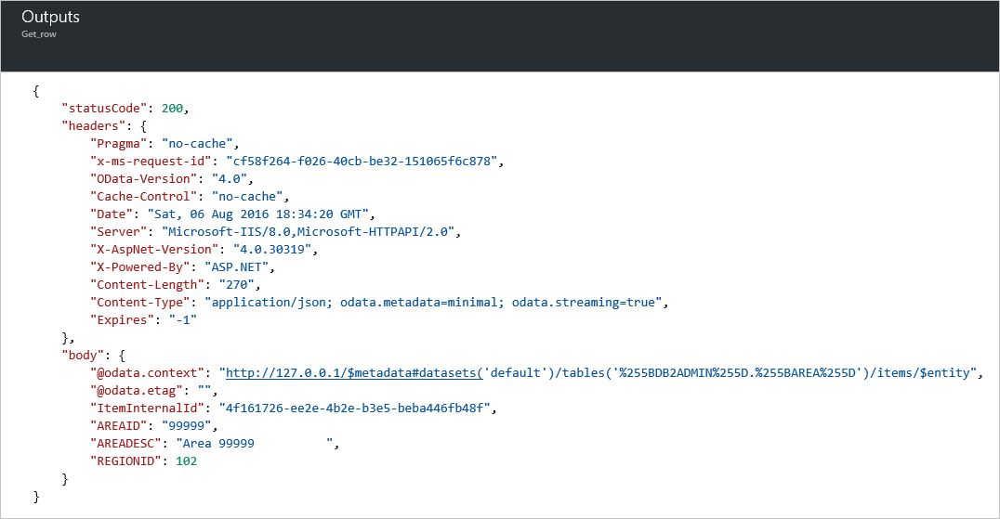

<properties
    pageTitle="Adicionar o conector de DB2 em seus aplicativos de lógica | Microsoft Azure"
    description="Visão geral do conector de DB2 com parâmetros de API REST"
    services=""
    documentationCenter="" 
    authors="gplarsen"
    manager="erikre"
    editor=""
    tags="connectors"/>

<tags
   ms.service="logic-apps"
   ms.devlang="na"
   ms.topic="article"
   ms.tgt_pltfrm="na"
   ms.workload="integration" 
   ms.date="09/26/2016"
   ms.author="plarsen"/>

# Começar a usar o conector de DB2
Conector da Microsoft para DB2 se conecta a lógica de aplicativos aos recursos armazenados em um banco de dados IBM DB2. Esse conector inclui um cliente Microsoft para se comunicar com computadores remotos de servidor de DB2 em uma rede TCP/IP. Isso inclui bancos de dados de nuvem, como IBM Bluemix dashDB ou IBM DB2 para Windows em execução no Azure virtualização e bancos de dados usando o gateway de dados local no local. Consulte a [lista suportados](connectors-create-api-db2.md#supported-db2-platforms-and-versions) da IBM DB2 plataformas e versões (neste tópico).

>[AZURE.NOTE] Esta versão do artigo se aplica a disponibilidade de aplicativos de lógica geral (GA). 

O conector de DB2 suporta as seguintes operações de banco de dados:

- Tabelas de banco de dados de lista
- Ler uma linha usando selecione
- Ler todas as linhas usando selecione
- Adicionar uma linha usando inserir
- Alterar uma linha usando a atualização
- Remover uma linha utilizando DELETE

Este tópico mostra como usar o conector em um aplicativo de lógica para operações de banco de dados do processo.

Para saber mais sobre os aplicativos de lógica, consulte [criar um aplicativo de lógica](../app-service-logic/app-service-logic-create-a-logic-app.md).

## Ações disponíveis
O conector de DB2 suporta as seguintes ações de aplicativo de lógica:

- GetTables
- GetRow
- GetRows
- InsertRow
- UpdateRow
- DeleteRow

## Tabelas de lista
Criação de um aplicativo de lógica para qualquer operação é composta de várias etapas executadas por meio do portal do Microsoft Azure.

Dentro do aplicativo de lógica, você pode adicionar uma ação para tabelas de lista em um banco de dados DB2. A ação instrui o conector para processar uma instrução de esquema DB2, tais como `CALL SYSIBM.SQLTABLES`.

### Criar um aplicativo de lógica
1.  No **Azure iniciar quadro**, selecione **+** (sinal de mais), **Web + Mobile**e, em seguida, **Lógica de aplicativo**.
2.  Digite o **nome**, tal como `Db2getTables`, **assinatura**, **grupo de recursos**, **local**e **Plano de serviço de aplicativo**. Selecione **Fixar no painel de controle**e clique em seguida **criar**.

### Adicionar um disparador e ação
1.  No **Designer de aplicativos de lógica**, selecione **LogicApp em branco** na lista de **modelos** .
2.  Na lista de **disparadores** , selecione **Recorrência**. 
3.  No disparador **Recorrência** , selecione **Editar**, selecione suspensa para selecionar **dia** **frequência** e, em seguida, definir o **intervalo** para digitar **7**.  
4.  Marque a caixa de **+ nova etapa** e selecione **Adicionar uma ação**.
5.  Na lista de **ações** , digite `db2` em **Procurar mais ações** caixa editar e selecione **DB2 - obter tabelas (visualização)**.

      

6.  No painel de configuração **DB2 - obter tabelas** , selecione a **caixa de seleção** habilitar **Conectar via gateway de dados local**. Observe que as configurações alteradas da nuvem para o local.
    - Digite o valor de **servidor**, na forma de endereço ou alias de número de porta de dois-pontos. Por exemplo, digite `ibmserver01:50000`.
    - Digite o valor de **banco de dados**. Por exemplo, digite `nwind`.
    - Selecione o valor para **autenticação**. Por exemplo, selecione **básica**.
    - Digite o valor de **nome de usuário**. Por exemplo, digite `db2admin`.
    - Digite o valor de **senha**. Por exemplo, digite `Password1`.
    - Selecione o valor para o **Gateway**. Por exemplo, selecione **datagateway01**.
7. Selecione **criar**e, em seguida, selecione **Salvar**. 

    

8.  Na lâmina **Db2getTables** , dentro da lista de **Todos é executado** em **Resumo**, selecione o item listados em primeiro lugar (executar mais recente).
9.  Na lâmina **lógica aplicativo executar** , selecione **Executar detalhes**. Dentro da lista de **ação** , selecione **Get_tables**. Consulte o valor de **Status**, que deve ser **bem-sucedido**. Selecione o **link de entradas** para exibir as entradas. Selecione o **link de saídas**e exiba as saídas; qual deve incluir uma lista de tabelas.

    

## Criar conexões de
Esse conector compatível com conexões para bancos de dados hospedados locais e na nuvem usando as seguintes propriedades de conexão. 

Propriedade | Descrição
--- | ---
servidor | Necessário. Aceita um valor de cadeia de caracteres que representa um endereço de TCP/IP ou alias, no formato IPv4 ou IPv6, seguido (separado por dois-pontos) por um número de porta TCP/IP. 
banco de dados | Necessário. Aceita um valor de cadeia de caracteres que representa um nome de banco de dados relacional DRDA (RDBNAM). DB2 para z/OS aceita uma cadeia de caracteres de 16 bits (banco de dados é conhecido como um IBM DB2 para local de z/OS). DB2 para i5/OS aceita uma cadeia de caracteres de 18 bytes (banco de dados é conhecido como um IBM DB2 para i relacional banco de dados). DB2 para LUW aceita uma cadeia de caracteres de 8 bytes.
autenticação | Opcional. Aceita um valor de item de lista, Basic ou Windows (kerberos). 
nome de usuário | Necessário. Aceita um valor de cadeia de caracteres. DB2 para z/OS aceita uma cadeia de caracteres de 8 bytes. DB2 para i aceita uma cadeia de caracteres de 10 bytes. DB2 para Linux ou UNIX aceita uma cadeia de caracteres de 8 bytes. DB2 para Windows aceita uma cadeia de caracteres de 30 bytes.
senha | Necessário. Aceita um valor de cadeia de caracteres.
gateway | Necessário. Aceita um valor de item de lista, que representa o gateway de dados locais definido para aplicativos de lógica dentro do grupo de armazenamento.  

## Criar o local de conexão de gateway
Esse conector pode acessar um banco de dados local de DB2 usando o gateway local. Consulte os tópicos de gateway para obter mais informações. 

1. No painel de configuração **Gateways** , selecione a **caixa de seleção** habilitar **Conectar via gateway**. Observe que as configurações alteradas da nuvem para o local.
2. Digite o valor de **servidor**, na forma de endereço ou alias de número de porta de dois-pontos. Por exemplo, digite `ibmserver01:50000`.
3. Digite o valor de **banco de dados**. Por exemplo, digite `nwind`.
4. Selecione o valor para **autenticação**. Por exemplo, selecione **básica**.
5. Digite o valor de **nome de usuário**. Por exemplo, digite `db2admin`.
6. Digite o valor de **senha**. Por exemplo, digite `Password1`.
7. Selecione o valor para o **Gateway**. Por exemplo, selecione **datagateway01**.
8. Selecione **criar** para continuar. 

    

## Criar a conexão de nuvem
Esse conector pode acessar um banco de dados de nuvem DB2. 

1. No painel de configuração **Gateways** , deixe a **caixa de seleção** desativado (desmarcados) **Conectar via gateway**. 
2. Digite o valor de **nome de Conexão**. Por exemplo, digite `hisdemo2`.
3. Digite o valor do **nome do servidor de DB2**, na forma de endereço ou alias de número de porta de dois-pontos. Por exemplo, digite `hisdemo2.cloudapp.net:50000`.
3. Digite o valor de **nome de banco de dados DB2**. Por exemplo, digite `nwind`.
4. Digite o valor de **nome de usuário**. Por exemplo, digite `db2admin`.
5. Digite o valor de **senha**. Por exemplo, digite `Password1`.
6. Selecione **criar** para continuar. 

    

## Buscar todas as linhas usando selecione
Você pode definir uma ação de aplicativo lógica para buscar todas as linhas em uma tabela DB2. Isso instrui o conector para processar uma instrução SELECT de DB2, tais como `SELECT * FROM AREA`.

### Criar um aplicativo de lógica
1.  No **Azure iniciar quadro**, selecione **+** (sinal de mais), **Web + Mobile**e, em seguida, **Lógica de aplicativo**.
2.  Digite o **nome**, tal como `Db2getRows`, **assinatura**, **grupo de recursos**, **local**e **Plano de serviço de aplicativo**. Selecione **Fixar no painel de controle**e clique em seguida **criar**.

### Adicionar um disparador e ação
1.  No **Designer de aplicativos de lógica**, selecione **LogicApp em branco** na lista de **modelos** .
2.  Na lista de **disparadores** , selecione **Recorrência**. 
3.  No disparador **Recorrência** , selecione **Editar**, selecione suspensa para selecionar **dia** **frequência** e, em seguida, selecione o **intervalo** para digitar **7**. 
4.  Marque a caixa de **+ nova etapa** e selecione **Adicionar uma ação**.
5.  Na lista de **ações** , digite `db2` em **Procurar mais ações** caixa editar e selecione **DB2 - obter linhas (visualização)**.
6. Na ação **obter linhas (visualização)** , selecione a **conexão de alteração**.
7. No painel de configuração de **conexões** , selecione **Criar novo**. 

    
  
8. No painel de configuração **Gateways** , deixe a **caixa de seleção** desativado (desmarcados) **Conectar via gateway**.
    - Digite o valor de **nome de Conexão**. Por exemplo, digite `HISDEMO2`.
    - Digite o valor do **nome do servidor de DB2**, na forma de endereço ou alias de número de porta de dois-pontos. Por exemplo, digite `HISDEMO2.cloudapp.net:50000`.
    - Digite o valor de **nome de banco de dados DB2**. Por exemplo, digite `NWIND`.
    - Digite o valor de **nome de usuário**. Por exemplo, digite `db2admin`.
    - Digite o valor de **senha**. Por exemplo, digite `Password1`.
9. Selecione **criar** para continuar.

    

10. Na lista **nome da tabela** , selecione a **seta para baixo**e selecione **área**.
11. Opcionalmente, selecione **Mostrar opções avançadas** para especificar opções de consulta.
12. Selecione **Salvar**. 

    

13. Na lâmina **Db2getRows** , dentro da lista de **Todos é executado** em **Resumo**, selecione o item listados em primeiro lugar (executar mais recente).
14. Na lâmina **lógica aplicativo executar** , selecione **Executar detalhes**. Dentro da lista de **ação** , selecione **Get_rows**. Consulte o valor de **Status**, que deve ser **bem-sucedido**. Selecione o **link de entradas** para exibir as entradas. Selecione o **link de saídas**e exiba as saídas; qual deve incluir uma lista de linhas.

    

## Adicionar uma linha usando inserir
Você pode definir uma ação de aplicativo lógica para adicionar uma linha em uma tabela DB2. Esta ação instrui o conector para processar uma instrução INSERT de DB2, tais como `INSERT INTO AREA (AREAID, AREADESC, REGIONID) VALUES ('99999', 'Area 99999', 102)`.

### Criar um aplicativo de lógica
1.  No **Azure iniciar quadro**, selecione **+** (sinal de mais), **Web + Mobile**e, em seguida, **Lógica de aplicativo**.
2.  Digite o **nome**, tal como `Db2insertRow`, **assinatura**, **grupo de recursos**, **local**e **Plano de serviço de aplicativo**. Selecione **Fixar no painel de controle**e clique em seguida **criar**.

### Adicionar um disparador e ação
1.  No **Designer de aplicativos de lógica**, selecione **LogicApp em branco** na lista de **modelos** .
2.  Na lista de **disparadores** , selecione **Recorrência**. 
3.  No disparador **Recorrência** , selecione **Editar**, selecione suspensa para selecionar **dia** **frequência** e, em seguida, selecione o **intervalo** para digitar **7**. 
4.  Marque a caixa de **+ nova etapa** e selecione **Adicionar uma ação**.
5.  Na lista de **ações** , digite **db2** na caixa de edição **Pesquisar mais ações** e selecione **DB2 - Inserir linha (visualização)**.
6. Na ação **obter linhas (visualização)** , selecione a **conexão de alteração**. 
7. No painel de configuração de **conexões** , selecione uma conexão. Por exemplo, selecione **hisdemo2**.

    

8. Na lista **nome da tabela** , selecione a **seta para baixo**e selecione **área**.
9. Insira valores para colunas necessárias (consulte asterisco vermelho). Por exemplo, digite `99999` para **AREAID**, digite `Area 99999`e tipo `102` para **REGIONID**. 
10. Selecione **Salvar**.

    
 
11. Na lâmina **Db2insertRow** , dentro da lista de **Todos é executado** em **Resumo**, selecione o item listados em primeiro lugar (executar mais recente).
12. Na lâmina **lógica aplicativo executar** , selecione **Executar detalhes**. Dentro da lista de **ação** , selecione **Get_rows**. Consulte o valor de **Status**, que deve ser **bem-sucedido**. Selecione o **link de entradas** para exibir as entradas. Selecione o **link de saídas**e exiba as saídas; qual deve incluir a nova linha.

    

## Buscar uma linha usando selecione
Você pode definir uma ação de aplicativo lógica para buscar uma linha em uma tabela DB2. Esta ação instrui o conector para processar uma instrução DB2 selecione onde, tais como `SELECT FROM AREA WHERE AREAID = '99999'`.

### Criar um aplicativo de lógica
1.  No **Azure iniciar quadro**, selecione **+** (sinal de mais), **Web + Mobile**e, em seguida, **Lógica de aplicativo**.
2.  Insira o **nome** (por exemplo, "**Db2getRow**"), **assinatura**, **grupo de recursos**, **local**e **Plano de serviço de aplicativo**. Selecione **Fixar no painel de controle**e clique em seguida **criar**.

### Adicionar um disparador e ação
1.  No **Designer de aplicativos de lógica**, selecione **LogicApp em branco** na lista de **modelos** . 
2.  Na lista de **disparadores** , selecione **Recorrência**. 
3.  No disparador **Recorrência** , selecione **Editar**, selecione suspensa para selecionar **dia** **frequência** e, em seguida, selecione o **intervalo** para digitar **7**. 
4.  Marque a caixa de **+ nova etapa** e selecione **Adicionar uma ação**.
5.  Na lista de **ações** , digite **db2** na caixa de edição **Pesquisar mais ações** e selecione **DB2 - obter linhas (visualização)**.
6. Na ação **obter linhas (visualização)** , selecione a **conexão de alteração**. 
7. No painel de configurações de **conexões** , selecione uma conexão existente. Por exemplo, selecione **hisdemo2**.

    

8. Na lista **nome da tabela** , selecione a **seta para baixo**e selecione **área**.
9. Insira valores para colunas necessárias (consulte asterisco vermelho). Por exemplo, digite `99999` para **AREAID**. 
10. Opcionalmente, selecione **Mostrar opções avançadas** para especificar opções de consulta.
11. Selecione **Salvar**. 

    

12. Na lâmina **Db2getRow** , dentro da lista de **Todos é executado** em **Resumo**, selecione o item listados em primeiro lugar (executar mais recente).
13. Na lâmina **lógica aplicativo executar** , selecione **Executar detalhes**. Dentro da lista de **ação** , selecione **Get_rows**. Consulte o valor de **Status**, que deve ser **bem-sucedido**. Selecione o **link de entradas** para exibir as entradas. Selecione o **link de saídas**e exiba as saídas; qual deve incluir linha.

    

## Alterar uma linha usando a atualização
Você pode definir uma ação de aplicativo lógica para alterar uma linha em uma tabela DB2. Esta ação instrui o conector para processar uma instrução UPDATE DB2, tais como `UPDATE AREA SET AREAID = '99999', AREADESC = 'Area 99999', REGIONID = 102)`.

### Criar um aplicativo de lógica
1.  No **Azure iniciar quadro**, selecione **+** (sinal de mais), **Web + Mobile**e, em seguida, **Lógica de aplicativo**.
2.  Digite o **nome**, tal como `Db2updateRow`, **assinatura**, **grupo de recursos**, **local**e **Plano de serviço de aplicativo**. Selecione **Fixar no painel de controle**e clique em seguida **criar**.

### Adicionar um disparador e ação
1.  No **Designer de aplicativos de lógica**, selecione **LogicApp em branco** na lista de **modelos** .
2.  Na lista de **disparadores** , selecione **Recorrência**. 
3.  No disparador **Recorrência** , selecione **Editar**, selecione suspensa para selecionar **dia** **frequência** e, em seguida, selecione o **intervalo** para digitar **7**. 
4.  Marque a caixa de **+ nova etapa** e selecione **Adicionar uma ação**.
5.  Na lista de **ações** , digite **db2** na caixa de edição **Pesquisar mais ações** e selecione **DB2 - linha de atualização (visualização)**.
6. Na ação **obter linhas (visualização)** , selecione a **conexão de alteração**. 
7. No painel de configurações de **conexões** , selecione para selecionar uma conexão existente. Por exemplo, selecione **hisdemo2**.

    

8. Na lista **nome da tabela** , selecione a **seta para baixo**e selecione **área**.
9. Insira valores para colunas necessárias (consulte asterisco vermelho). Por exemplo, digite `99999` para **AREAID**, digite `Updated 99999`e tipo `102` para **REGIONID**. 
10. Selecione **Salvar**. 

    

11. Na lâmina **Db2updateRow** , dentro da lista de **Todos é executado** em **Resumo**, selecione o item listados em primeiro lugar (executar mais recente).
12. Na lâmina **lógica aplicativo executar** , selecione **Executar detalhes**. Dentro da lista de **ação** , selecione **Get_rows**. Consulte o valor de **Status**, que deve ser **bem-sucedido**. Selecione o **link de entradas** para exibir as entradas. Selecione o **link de saídas**e exiba as saídas; qual deve incluir a nova linha.

    

## Remover uma linha utilizando DELETE
Você pode definir uma ação de aplicativo lógica para remover uma linha em uma tabela DB2. Esta ação instrui o conector para processar uma instrução DB2 excluir, tais como `DELETE FROM AREA WHERE AREAID = '99999'`.

### Criar um aplicativo de lógica
1.  No **Azure iniciar quadro**, selecione **+** (sinal de mais), **Web + Mobile**e, em seguida, **Lógica de aplicativo**.
2.  Digite o **nome**, tal como `Db2deleteRow`, **assinatura**, **grupo de recursos**, **local**e **Plano de serviço de aplicativo**. Selecione **Fixar no painel de controle**e clique em seguida **criar**.

### Adicionar um disparador e ação
1.  No **Designer de aplicativos de lógica**, selecione **LogicApp em branco** na lista de **modelos** . 
2.  Na lista de **disparadores** , selecione **Recorrência**. 
3.  No disparador **Recorrência** , selecione **Editar**, selecione suspensa para selecionar **dia** **frequência** e, em seguida, selecione o **intervalo** para digitar **7**. 
4.  Marque a caixa de **+ nova etapa** e selecione **Adicionar uma ação**.
5.  Na lista de **ações** , selecione **db2** na caixa de edição **Pesquisar mais ações** e selecione **DB2 - Excluir linha (visualização)**.
6. Na ação **obter linhas (visualização)** , selecione a **conexão de alteração**. 
7. No painel de configurações de **conexões** , selecione uma conexão existente. Por exemplo, selecione **hisdemo2**.

    

8. Na lista **nome da tabela** , selecione a **seta para baixo**e selecione **área**.
9. Insira valores para colunas necessárias (consulte asterisco vermelho). Por exemplo, digite `99999` para **AREAID**. 
10. Selecione **Salvar**. 

    

11. Na lâmina **Db2deleteRow** , dentro da lista de **Todos é executado** em **Resumo**, selecione o item listados em primeiro lugar (executar mais recente).
12. Na lâmina **lógica aplicativo executar** , selecione **Executar detalhes**. Dentro da lista de **ação** , selecione **Get_rows**. Consulte o valor de **Status**, que deve ser **bem-sucedido**. Selecione o **link de entradas** para exibir as entradas. Selecione o **link de saídas**e exiba as saídas; qual deve incluir a linha excluída.

    

## Detalhes técnicos

## Ações
Uma ação é uma operação realizada pelo fluxo de trabalho definido em um aplicativo de lógica. O conector de banco de dados DB2 inclui as seguintes ações. 

|Ação|Descrição|
|--- | ---|
|[GetRow](connectors-create-api-db2.md#get-row)|Recupera uma única linha de uma tabela DB2|
|[GetRows](connectors-create-api-db2.md#get-rows)|Recupera linhas de uma tabela DB2|
|[InsertRow](connectors-create-api-db2.md#insert-row)|Insere uma nova linha em uma tabela DB2|
|[DeleteRow](connectors-create-api-db2.md#delete-row)|Exclui uma linha de uma tabela DB2|
|[GetTables](connectors-create-api-db2.md#get-tables)|Recupera tabelas de banco de dados DB2|
|[UpdateRow](connectors-create-api-db2.md#update-row)|Atualiza uma linha existente em uma tabela DB2|

### Detalhes de ação

Nesta seção, consulte os detalhes específicos sobre cada ação, incluindo quaisquer propriedades de entrada necessárias ou opcionais e qualquer associado com o conector de saída correspondente.

#### Obter linha 
Recupera uma única linha de uma tabela DB2.  

| Nome da propriedade| Nome para exibição |Descrição|
| ---|---|---|
|tabela * | Nome da tabela |Nome da tabela de DB2|
|ID * | Id da linha |Identificador exclusivo da linha para recuperar|

Um asterisco (*) significa que a propriedade é necessária.

##### Detalhes de saída
Item

| Nome da propriedade | Tipo de dados |
|---|---|
|ItemInternalId|cadeia de caracteres|

#### Obter linhas 
Recupera linhas de uma tabela DB2.  

|Nome da propriedade| Nome para exibição|Descrição|
| ---|---|---|
|tabela *|Nome da tabela|Nome da tabela de DB2|
|$skip|Ignorar contagem|Número de entradas para ignorar (padrão = 0)|
|$top|Contagem de obter máximo|Número máximo de entradas para recuperar (padrão = 256)|
|$filter|Consulta de filtro|Uma consulta de filtro ODATA para restringir o número de entradas|
|$orderby|Classificado por|Uma consulta de orderBy ODATA para especificar a ordem das entradas|

Um asterisco (*) significa que a propriedade é necessária.

##### Detalhes de saída
ItemsList

| Nome da propriedade | Tipo de dados |
|---|---|
|valor|matriz|

#### Inserir linha 
Insere uma nova linha em uma tabela DB2.  

|Nome da propriedade| Nome para exibição|Descrição|
| ---|---|---|
|tabela *|Nome da tabela|Nome da tabela de DB2|
|item *|Linha|Linha para inserir na tabela especificada no DB2|

Um asterisco (*) significa que a propriedade é necessária.

##### Detalhes de saída
Item

| Nome da propriedade | Tipo de dados |
|---|---|
|ItemInternalId|cadeia de caracteres|

#### Excluir linha 
Exclui uma linha de uma tabela DB2.  

|Nome da propriedade| Nome para exibição|Descrição|
| ---|---|---|
|tabela *|Nome da tabela|Nome da tabela de DB2|
|ID *|Id da linha|Identificador exclusivo da linha para excluir|

Um asterisco (*) significa que a propriedade é necessária.

##### Detalhes de saída
Nenhuma.

#### Obter tabelas 
Recupera tabelas de banco de dados DB2.  

Não existem parâmetros para esta chamada. 

##### Detalhes de saída 
TablesList

| Nome da propriedade | Tipo de dados |
|---|---|
|valor|matriz|

#### Linha de atualização 
Atualiza uma linha existente em uma tabela DB2.  

|Nome da propriedade| Nome para exibição|Descrição|
| ---|---|---|
|tabela *|Nome da tabela|Nome da tabela de DB2|
|ID *|Id da linha|Identificador exclusivo da linha para atualizar|
|item *|Linha|Linha com valores atualizados|

Um asterisco (*) significa que a propriedade é necessária.

##### Detalhes de saída  
Item

| Nome da propriedade | Tipo de dados |
|---|---|
|ItemInternalId|cadeia de caracteres|

### Respostas HTTP

Ao fazer chamadas para as ações diferentes, você pode receber determinadas respostas. A tabela a seguir descreve as respostas e suas descrições:  

|Nome|Descrição|
|---|---|
|200|Okey|
|202|Aceita|
|400|Solicitação inválida|
|401|Não autorizado|
|403|Proibido|
|404|Não encontrado|
|500|Erro interno do servidor. Ocorreu um erro desconhecido|
|padrão|Falha na operação.|

## Com suporte DB2 plataformas e versões
Esse conector suporta as seguintes plataformas IBM DB2 e versões, bem como IBM DB2 produtos compatíveis (por exemplo, IBM Bluemix dashDB) que oferecem suporte a arquitetura distribuído de banco de dados relacional (DRDA) SQL Access Manager (SQLAM) versão 10 e 11:

- IBM DB2 para z/OS 11.1
- IBM DB2 para z/OS 10.1
- IBM DB2 para i 7.3
- IBM DB2 para i 7.2
- IBM DB2 para i 7.1
- IBM DB2 para LUW 11
- IBM DB2 para LUW 10.5

## Próximas etapas

[Criar um aplicativo de lógica](../app-service-logic/app-service-logic-create-a-logic-app.md). Explore os outros conectores disponíveis nos aplicativos de lógica em nossa [lista APIs](apis-list.md).

