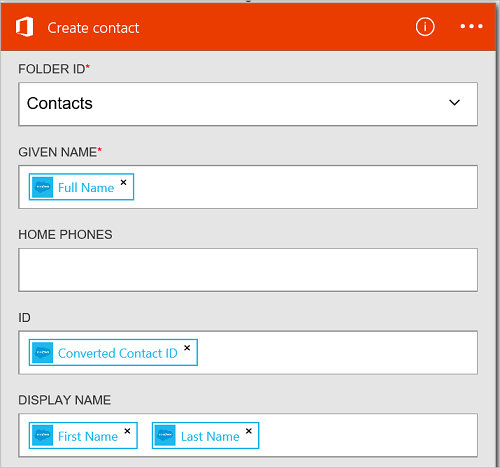

<properties
    pageTitle="Adicionar o Office 365 Outlook connector em seus aplicativos de lógica | Microsoft Azure"
    description="Crie aplicativos de lógica com conector do Office 365 para habilitar a interação com o Office 365. Por exemplo: Criando, editando e Atualizando itens de calendário e contatos."
    services=""    
    documentationCenter=""     
    authors="MandiOhlinger"    
    manager="anneta"    
    editor="" 
    tags="connectors" />

<tags
ms.service="logic-apps"
ms.devlang="na"
ms.topic="article"
ms.tgt_pltfrm="na"
ms.workload="integration"
ms.date="10/18/2016"
ms.author="mandia"/>

# Começar a usar o Office 365 Outlook connector 

O Office 365 Outlook connector permite interação com o Outlook no Office 365. Use este conector para criar, editar, atualizar contatos e itens de calendário e também obtêm, enviar e responder a emails.

Com o Office 365 Outlook, você:

- Construir seu fluxo de trabalho usando os recursos de email e calendário no Office 365. 
- Use disparadores para iniciar o fluxo de trabalho quando há um novo email, quando um item de calendário for atualizado e muito mais.
- Use ações para enviar um email, criar um novo evento de calendário e muito mais. Por exemplo, quando há um novo objeto no Salesforce (um disparador), envie um email para o Office 365 Outlook (uma ação). 

Este tópico mostra como usar o Office 365 Outlook connector em um aplicativo de lógica e também lista os disparadores e ações.

>[AZURE.NOTE] Esta versão do artigo se aplica a disponibilidade de aplicativos de lógica geral (GA).

Para saber mais sobre os aplicativos de lógica, consulte [o que são aplicativos de lógica](../app-service-logic/app-service-logic-what-are-logic-apps.md) e [criar um aplicativo de lógica](../app-service-logic/app-service-logic-create-a-logic-app.md).

## Conectar ao Office 365

Para que seu aplicativo de lógica possa acessar qualquer serviço, você primeiro criar uma *conexão* com o serviço. Uma conexão fornece conectividade entre um aplicativo de lógica e outro serviço. Por exemplo, para se conectar ao Office 365 Outlook, primeiro é necessário uma *conexão*do Office 365. Para criar uma conexão, insira as credenciais que você normalmente usa para acessar o serviço que você deseja se conectar. Com o Office 365 Outlook, insira as credenciais de sua conta do Office 365 para criar a conexão.

## Criar a conexão

>[AZURE.INCLUDE [Steps to create a connection to Office 365](../../includes/connectors-create-api-office365-outlook.md)]

## Use um gatilho

Um disparador é um evento que pode ser usado para iniciar o fluxo de trabalho definido em um aplicativo de lógica. Gatilhos "poll" o serviço a um intervalo e a frequência desejada. [Saiba mais sobre gatilhos](../app-service-logic/app-service-logic-what-are-logic-apps.md#logic-app-concepts).

1. No aplicativo lógica, digite "office 365" para obter uma lista de disparadores:  

    

2. Selecione o **Office 365 Outlook - quando um evento futuro está iniciando em breve**. Se uma conexão já existir, selecione um calendário na lista suspensa.

    

    Se você for solicitado a entrar, insira o sinal na detalhes para criar a conexão. [Criar a conexão](connectors-create-api-office365-outlook.md#create-the-connection) neste tópico apresenta as etapas. 

    > [AZURE.NOTE] Neste exemplo, o aplicativo de lógica é executado quando um evento de calendário for atualizado. Para ver os resultados do disparador, adicione outra ação que envia uma mensagem de texto. Por exemplo, adicione a ação Twilio *Enviar mensagem* que textos quando o evento de calendário está iniciando em 15 minutos. 

3. Selecione o botão **Editar** e defina os valores de **frequência** e **intervalo** . Por exemplo, se quiser que o disparador para pesquisar a cada 15 minutos, em seguida, defina a **frequência** em **minuto**e definir o **intervalo** para **15**. 

    

4. **Salvar** suas alterações (canto superior esquerdo da barra de ferramentas). Seu aplicativo de lógica é salvo e pode ser ativado automaticamente.

## Usar uma ação

Uma ação é uma operação realizada pelo fluxo de trabalho definido em um aplicativo de lógica. [Saiba mais sobre ações](../app-service-logic/app-service-logic-what-are-logic-apps.md#logic-app-concepts).

1. Selecione o sinal. Você vê várias opções: **Adicionar uma ação**, **Adicionar uma condição**ou uma das opções a **mais** .

    

2. Escolha **Adicionar uma ação**.

3. Na caixa de texto, digite "office 365" para obter uma lista de todas as ações disponíveis.

     

4. Em nosso exemplo, escolha **Office 365 Outlook - criar contato**. Se uma conexão já existir, escolha a **ID da pasta**, **nome fornecido**e outras propriedades:  

    

    Se você for solicitado para as informações de conexão, insira os detalhes para criar a conexão. [Criar a conexão](connectors-create-api-office365-outlook.md#create-the-connection) neste tópico descreve essas propriedades. 

    > [AZURE.NOTE] Neste exemplo, podemos criar um novo contato no Outlook do Office 365. Você pode usar a saída de outro disparador para criar o contato. Por exemplo, adicione o disparador SalesForce *quando um objeto é criado* . Adicione a ação do Office 365 Outlook *criar contato* que usa os campos de SalesForce para criar o novo contato de novo no Office 365. 

5. **Salvar** suas alterações (canto superior esquerdo da barra de ferramentas). Seu aplicativo de lógica é salvo e pode ser ativado automaticamente.

## Detalhes técnicos

Aqui estão os detalhes sobre disparadores, ações e respostas que dá suporte a essa conexão:

## Disparadores do Office 365

|Disparadores | Descrição|
|--- | ---|
|[Quando um evento futuro está iniciando em breve](connectors-create-api-office365-outlook.md#when-an-upcoming-event-is-starting-soon)|Essa operação aciona um fluxo quando um evento de calendário futuras está iniciando.|
|[Quando um novo email chega](connectors-create-api-office365-outlook.md#when-a-new-email-arrives)|Essa operação aciona um fluxo quando chega um novo email|
|[Quando um novo evento for criado](connectors-create-api-office365-outlook.md#when-a-new-event-is-created)|Essa operação aciona um fluxo quando um novo evento é criado em um calendário.|
|[Quando um evento é modificado](connectors-create-api-office365-outlook.md#when-an-event-is-modified)|Essa operação aciona um fluxo quando um evento é modificado em um calendário.|

## Ações do Office 365

|Ação|Descrição|
|--- | ---|
|[Receber emails](connectors-create-api-office365-outlook.md#get-emails)|Essa operação obtém emails de uma pasta.|
|[Enviar um email](connectors-create-api-office365-outlook.md#send-an-email)|Essa operação envia uma mensagem de email.|
|[Excluir emails](connectors-create-api-office365-outlook.md#delete-email)|Essa operação exclui um email pela identificação.|
|[Marcar como lido](connectors-create-api-office365-outlook.md#mark-as-read)|Essa operação marca um email como tendo sido lidas.|
|[Responder ao email](connectors-create-api-office365-outlook.md#reply-to-email)|Essa operação responde a um email.|
|[Obter o anexo](connectors-create-api-office365-outlook.md#get-attachment)|Essa operação obtém um anexo de email por id.|
|[Enviar email com opções](connectors-create-api-office365-outlook.md#send-email-with-options)|Essa operação envia um email com várias opções e aguarda o destinatário de responder novamente com uma das opções.|
|[Enviar email de aprovação](connectors-create-api-office365-outlook.md#send-approval-email)|Essa operação envia um email de aprovação e aguarda uma resposta do destinatário.|
|[Obtenha calendários](connectors-create-api-office365-outlook.md#get-calendars)|Essa operação lista calendários disponíveis.|
|[Obter eventos](connectors-create-api-office365-outlook.md#get-events)|Essa operação obtém eventos do calendário.|
|[Criar um evento](connectors-create-api-office365-outlook.md#create-event)|Esta operação cria um novo evento em um calendário.|
|[Obter evento](connectors-create-api-office365-outlook.md#get-event)|Essa operação obtém um evento específico do calendário.|
|[Excluir evento](connectors-create-api-office365-outlook.md#delete-event)|Essa operação exclui um evento em um calendário.|
|[Evento de atualização](connectors-create-api-office365-outlook.md#update-event)|Essa operação atualiza um evento em um calendário.|
|[Obtenha as pastas de contatos](connectors-create-api-office365-outlook.md#get-contact-folders)|Essa operação lista pastas de contatos disponível.|
|[Obter contatos](connectors-create-api-office365-outlook.md#get-contacts)|Essa operação obtém contatos de uma pasta de contatos.|
|[Criar contato](connectors-create-api-office365-outlook.md#create-contact)|Esta operação cria um novo contato em uma pasta de contatos.|
|[Obtenha o contato](connectors-create-api-office365-outlook.md#get-contact)|Essa operação obtém um contato específico de uma pasta de contatos.|
|[Excluir contato](connectors-create-api-office365-outlook.md#delete-contact)|Essa operação exclui um contato de uma pasta de contatos.|
|[Atualizar contato](connectors-create-api-office365-outlook.md#update-contact)|Essa operação atualiza um contato em uma pasta de contatos.|

### Detalhes do acionador e ação

Nesta seção, consulte os detalhes específicos sobre cada disparador e ação, incluindo quaisquer propriedades de entrada necessárias ou opcionais e qualquer associado com o conector de saída correspondente.

#### Quando um evento futuro está iniciando em breve
Essa operação aciona um fluxo quando um evento de calendário futuras está iniciando. 

|Nome da propriedade| Nome para exibição|Descrição|
| ---|---|---|
|tabela *|Identificação do calendário|Identificador exclusivo do calendário|
|lookAheadTimeInMinutes|Aparência com previsão de tempo|Tempo (em minutos) para procurar ahead eventos futuros|

Um asterisco (*) significa que a propriedade é necessária.

##### Detalhes de saída
CalendarItemsList: A lista de itens de calendário

| Nome da propriedade | Tipo de dados | Descrição |
|---|---|---|
|valor|matriz|Lista de itens de calendário|

#### Receber emails
Essa operação obtém emails de uma pasta. 

|Nome da propriedade| Nome para exibição|Descrição|
| ---|---|---|
|folderPath|Caminho da pasta|Caminho da pasta para recuperar emails (padrão: 'Entrada')|
|Início|Início|Número de emails para recuperar (padrão: 10)|
|fetchOnlyUnread|Buscar somente mensagens não lidas|Recuperar somente os emails não lidos?|
|includeAttachments|Incluir anexos|Se definido como true, anexos também será recuperado junto com o email|
|searchQuery|Consulta de pesquisa|Consulta de pesquisa para filtrar emails|
|Ignorar|Ignorar|Número de emails para ignorar (padrão: 0)|
|skipToken|Ignorar Token|Vá token para a nova página de busca|

Um asterisco (*) significa que a propriedade é necessária.

##### Detalhes de saída
ReceiveMessage: Receber a mensagem de Email

| Nome da propriedade | Tipo de dados | Descrição |
|---|---|---|
|De|cadeia de caracteres|De|
|Para|cadeia de caracteres|Para|
|Assunto|cadeia de caracteres|Assunto|
|Corpo|cadeia de caracteres|Corpo|
|Prioridade|cadeia de caracteres|Prioridade|
|Tem anexo|booliano|Tem anexo|
|ID|cadeia de caracteres|Id da mensagem|
|Foi lido|booliano|Ser lido|
|DateTimeReceived|cadeia de caracteres|Data hora do recebimento|
|Anexos|matriz|Anexos|
|Cc|cadeia de caracteres|Especificar os endereços de email separados por ponto e vírgula comosomeone@contoso.com|
|Cco|cadeia de caracteres|Especificar os endereços de email separados por ponto e vírgula comosomeone@contoso.com|
|IsHtml|booliano|É Html|

#### Enviar um email
Essa operação envia uma mensagem de email. 

|Nome da propriedade| Nome para exibição|Descrição|
| ---|---|---|
|emailMessage *|Email|Email|

Um asterisco (*) significa que a propriedade é necessária.

##### Detalhes de saída
Nenhuma.

#### Excluir emails
Essa operação exclui um email pela identificação. 

|Nome da propriedade| Nome para exibição|Descrição|
| ---|---|---|
|messageId *|Id da mensagem|ID do email para excluir|

Um asterisco (*) significa que a propriedade é necessária.

##### Detalhes de saída
Nenhuma.

#### Marcar como lido
Essa operação marca um email como tendo sido lidas. 

|Nome da propriedade| Nome para exibição|Descrição|
| ---|---|---|
|messageId *|Id da mensagem|ID do email a ser marcado como lido|

Um asterisco (*) significa que a propriedade é necessária.

##### Detalhes de saída
Nenhuma.

#### Responder ao email
Essa operação responde a um email. 

|Nome da propriedade| Nome para exibição|Descrição|
| ---|---|---|
|messageId *|Id da mensagem|ID do email para responder a|
|comentário *|Comentário|Comentário de resposta|
|responder a todos|Responder a todos|Responder a todos os destinatários|

Um asterisco (*) significa que a propriedade é necessária.

##### Detalhes de saída
Nenhuma.

#### Obter o anexo
Essa operação obtém um anexo de email por id. 

|Nome da propriedade| Nome para exibição|Descrição|
| ---|---|---|
|messageId *|Id da mensagem|ID do email|
|attachmentId *|Id de anexo|ID do anexo para baixar|

Um asterisco (*) significa que a propriedade é necessária.

##### Detalhes de saída
Nenhuma.

#### Quando um novo email chega
Essa operação aciona um fluxo quando chega um novo email.

|Nome da propriedade| Nome para exibição|Descrição|
| ---|---|---|
|folderPath|Caminho da pasta|Pasta de email para recuperar (padrão: caixa de entrada)|
|Para|Para|Endereços de e-mail do destinatário|
|De|De|Endereço do remetente|
|prioridade|Prioridade|Prioridade do email (alta, Normal, baixa) (padrão: Normal)|
|fetchOnlyWithAttachment|Tem anexos|Recuperar somente os emails com um anexo|
|includeAttachments|Incluir anexos|Incluir anexos|
|subjectFilter|Filtro de assunto|Cadeia de caracteres a ser procurada no assunto|

Um asterisco (*) significa que a propriedade é necessária.

##### Detalhes de saída
TriggerBatchResponse [ReceiveMessage]

| Nome da propriedade | Tipo de dados |
|---|---|
|valor|matriz|

#### Enviar email com opções
Essa operação envia um email com várias opções e aguarda o destinatário de responder novamente com uma das opções. 

|Nome da propriedade| Nome para exibição|Descrição|
| ---|---|---|
|optionsEmailSubscription *|Solicitação de assinatura de email de opções|Solicitação de assinatura de email de opções|

Um asterisco (*) significa que a propriedade é necessária.

##### Detalhes de saída
SubscriptionResponse: Modelo de assinatura de Email de aprovação

| Nome da propriedade | Tipo de dados | Descrição |
|---|---|---|
|ID|cadeia de caracteres|ID da assinatura|
|recurso|cadeia de caracteres|Recurso de solicitação de assinatura|
|notificationType|cadeia de caracteres|Tipo de notificação|
|notificationUrl|cadeia de caracteres|Url de notificação|

#### Enviar email de aprovação
Essa operação envia um email de aprovação e aguarda uma resposta do destinatário. 

|Nome da propriedade| Nome para exibição|Descrição|
| ---|---|---|
|approvalEmailSubscription *|Solicitação de assinatura de email de aprovação|Solicitação de assinatura de email de aprovação|

Um asterisco (*) significa que a propriedade é necessária.

##### Detalhes de saída
SubscriptionResponse: Modelo de assinatura de Email de aprovação

| Nome da propriedade | Tipo de dados | Descrição |
|---|---|---|
|ID|cadeia de caracteres|ID da assinatura|
|recurso|cadeia de caracteres|Recurso de solicitação de assinatura|
|notificationType|cadeia de caracteres|Tipo de notificação|
|notificationUrl|cadeia de caracteres|Url de notificação|

#### Obtenha calendários
Essa operação lista calendários disponíveis. 

Não existem parâmetros para esta chamada.

##### Detalhes de saída
TablesList

| Nome da propriedade | Tipo de dados |
|---|---|
|valor|matriz|

#### Obter eventos
Essa operação obtém eventos do calendário. 

|Nome da propriedade| Nome para exibição|Descrição|
| ---|---|---|
|tabela *|Identificação do calendário|Selecione um calendário|
|$filter|Consulta de filtro|Uma consulta de filtro ODATA para restringir as entradas retornadas|
|$orderby|Classificado por|Uma consulta de orderBy ODATA para especificar a ordem das entradas|
|$skip|Ignorar contagem|Número de entradas para ignorar (padrão = 0)|
|$top|Contagem de obter máximo|Número máximo de entradas para recuperar (padrão = 256)|

Um asterisco (*) significa que a propriedade é necessária.

##### Detalhes de saída
CalendarEventList: A lista de itens de calendário

| Nome da propriedade | Tipo de dados | Descrição |
|---|---|---|
|valor|matriz|Lista de itens de calendário|

#### Criar um evento
Esta operação cria um novo evento em um calendário. 

|Nome da propriedade| Nome para exibição|Descrição|
| ---|---|---|
|tabela *|Identificação do calendário|Selecione um calendário|
|item *|Item|Evento para criar|

Um asterisco (*) significa que a propriedade é necessária.

##### Detalhes de saída
CalendarEvent: Classe de modelo do evento de calendário específico de conector.

| Nome da propriedade | Tipo de dados | Descrição |
|---|---|---|
|ID|cadeia de caracteres|Identificador exclusivo do evento.|
|Participantes|matriz|Lista de participantes para o evento.|
|Corpo|não definido|O corpo da mensagem associado ao evento.|
|BodyPreview|cadeia de caracteres|A visualização da mensagem associada ao evento.|
|Categorias|matriz|As categorias associadas ao evento.|
|ChangeKey|cadeia de caracteres|Identifica a versão do objeto de evento. Sempre que o evento for alterado, ChangeKey também é alterado.|
|DateTimeCreated|cadeia de caracteres|A data e a hora em que o evento foi criado.|
|DateTimeLastModified|cadeia de caracteres|A data e a hora em que o evento foi modificado pela última vez.|
|Final|cadeia de caracteres|A hora de término do evento.|
|EndTimeZone|cadeia de caracteres|Especifica o fuso horário da reunião hora de término. Este valor deve ser conforme definido no Windows (exemplo: 'Horário padrão do Pacífico').|
|Tem anexos|booliano|Defina como verdadeiro se o evento tem anexos.|
|Prioridade|cadeia de caracteres|A importância do evento: baixa, Normal ou alta.|
|IsAllDay|booliano|Defina como verdadeiro se o evento durar o dia inteiro.|
|IsCancelled|booliano|Defina como verdadeiro se o evento foi cancelado.|
|IsOrganizer|booliano|Defina como verdadeiro se o remetente da mensagem também for o organizador.|
|Local|não definido|O local do evento.|
|Organizador|não definido|O organizador do evento.|
|Recorrência|não definido|O padrão de recorrência para o evento.|
|Lembrete|número inteiro|Tempo em minutos antes do início do evento para lembrar.|
|ResponseRequested|booliano|Defina como verdadeiro se o remetente gostaria de uma resposta quando o evento for aceito ou recusado.|
|ResponseStatus|não definido|Indica o tipo de resposta enviada em resposta a uma mensagem de evento.|
|SeriesMasterId|cadeia de caracteres|Identificador exclusivo para o tipo de evento série mestre.|
|ShowAs|cadeia de caracteres|Mostra como disponível ou ocupado.|
|Iniciar|cadeia de caracteres|A hora de início do evento.|
|StartTimeZone|cadeia de caracteres|Especifica a hora a hora de início de zona da reunião. Este valor deve ser conforme definido no Windows (exemplo: "Hora padrão do Pacífico").|
|Assunto|cadeia de caracteres|Assunto do evento.|
|Tipo|cadeia de caracteres|O tipo de evento: única ocorrência, ocorrência, exceção ou série mestre.|
|WebLink|cadeia de caracteres|A visualização da mensagem associada ao evento.|

#### Obter evento
Essa operação obtém um evento específico do calendário. 

|Nome da propriedade| Nome para exibição|Descrição|
| ---|---|---|
|tabela *|Identificação do calendário|Selecione um calendário|
|ID *|Id do item|Selecione um evento|

Um asterisco (*) significa que a propriedade é necessária.

##### Detalhes de saída
CalendarEvent: Classe de modelo do evento de calendário específico de conector.

| Nome da propriedade | Tipo de dados | Descrição |
|---|---|---|
|ID|cadeia de caracteres|Identificador exclusivo do evento.|
|Participantes|matriz|Lista de participantes para o evento.|
|Corpo|não definido|O corpo da mensagem associado ao evento.|
|BodyPreview|cadeia de caracteres|A visualização da mensagem associada ao evento.|
|Categorias|matriz|As categorias associadas ao evento.|
|ChangeKey|cadeia de caracteres|Identifica a versão do objeto de evento. Sempre que o evento for alterado, ChangeKey também é alterado.|
|DateTimeCreated|cadeia de caracteres|A data e a hora em que o evento foi criado.|
|DateTimeLastModified|cadeia de caracteres|A data e a hora em que o evento foi modificado pela última vez.|
|Final|cadeia de caracteres|A hora de término do evento.|
|EndTimeZone|cadeia de caracteres|Especifica o fuso horário da reunião hora de término. Este valor deve ser conforme definido no Windows (exemplo: 'Horário padrão do Pacífico').|
|Tem anexos|booliano|Defina como verdadeiro se o evento tem anexos.|
|Prioridade|cadeia de caracteres|A importância do evento: baixa, Normal ou alta.|
|IsAllDay|booliano|Defina como verdadeiro se o evento durar o dia inteiro.|
|IsCancelled|booliano|Defina como verdadeiro se o evento foi cancelado.|
|IsOrganizer|booliano|Defina como verdadeiro se o remetente da mensagem também for o organizador.|
|Local|não definido|O local do evento.|
|Organizador|não definido|O organizador do evento.|
|Recorrência|não definido|O padrão de recorrência para o evento.|
|Lembrete|número inteiro|Tempo em minutos antes do início do evento para lembrar.|
|ResponseRequested|booliano|Defina como verdadeiro se o remetente gostaria de uma resposta quando o evento for aceito ou recusado.|
|ResponseStatus|não definido|Indica o tipo de resposta enviada em resposta a uma mensagem de evento.|
|SeriesMasterId|cadeia de caracteres|Identificador exclusivo para o tipo de evento série mestre.|
|ShowAs|cadeia de caracteres|Mostra como disponível ou ocupado.|
|Iniciar|cadeia de caracteres|A hora de início do evento.|
|StartTimeZone|cadeia de caracteres|Especifica a hora a hora de início de zona da reunião. Este valor deve ser conforme definido no Windows (exemplo: "Hora padrão do Pacífico").|
|Assunto|cadeia de caracteres|Assunto do evento.|
|Tipo|cadeia de caracteres|O tipo de evento: única ocorrência, ocorrência, exceção ou série mestre.|
|WebLink|cadeia de caracteres|A visualização da mensagem associada ao evento.|

#### Excluir evento
Essa operação exclui um evento em um calendário. 

|Nome da propriedade| Nome para exibição|Descrição|
| ---|---|---|
|tabela *|Identificação do calendário|Selecione um calendário|
|ID *|ID|Selecione um evento|

Um asterisco (*) significa que a propriedade é necessária.

##### Detalhes de saída
Nenhuma.

#### Evento de atualização
Essa operação atualiza um evento em um calendário. 

|Nome da propriedade| Nome para exibição|Descrição|
| ---|---|---|
|tabela *|Identificação do calendário|Selecione um calendário|
|ID *|ID|Selecione um evento|
|item *|Item|Evento para atualizar|

Um asterisco (*) significa que a propriedade é necessária.

##### Detalhes de saída
CalendarEvent: Classe de modelo do evento de calendário específico de conector.

| Nome da propriedade | Tipo de dados | Descrição |
|---|---|---|
|ID|cadeia de caracteres|Identificador exclusivo do evento.|
|Participantes|matriz|Lista de participantes para o evento.|
|Corpo|não definido|O corpo da mensagem associado ao evento.|
|BodyPreview|cadeia de caracteres|A visualização da mensagem associada ao evento.|
|Categorias|matriz|As categorias associadas ao evento.|
|ChangeKey|cadeia de caracteres|Identifica a versão do objeto de evento. Sempre que o evento for alterado, ChangeKey também é alterado.|
|DateTimeCreated|cadeia de caracteres|A data e a hora em que o evento foi criado.|
|DateTimeLastModified|cadeia de caracteres|A data e a hora em que o evento foi modificado pela última vez.|
|Final|cadeia de caracteres|A hora de término do evento.|
|EndTimeZone|cadeia de caracteres|Especifica o fuso horário da reunião hora de término. Este valor deve ser conforme definido no Windows (exemplo: 'Horário padrão do Pacífico').|
|Tem anexos|booliano|Defina como verdadeiro se o evento tem anexos.|
|Prioridade|cadeia de caracteres|A importância do evento: baixa, Normal ou alta.|
|IsAllDay|booliano|Defina como verdadeiro se o evento durar o dia inteiro.|
|IsCancelled|booliano|Defina como verdadeiro se o evento foi cancelado.|
|IsOrganizer|booliano|Defina como verdadeiro se o remetente da mensagem também for o organizador.|
|Local|não definido|O local do evento.|
|Organizador|não definido|O organizador do evento.|
|Recorrência|não definido|O padrão de recorrência para o evento.|
|Lembrete|número inteiro|Tempo em minutos antes do início do evento para lembrar.|
|ResponseRequested|booliano|Defina como verdadeiro se o remetente gostaria de uma resposta quando o evento for aceito ou recusado.|
|ResponseStatus|não definido|Indica o tipo de resposta enviada em resposta a uma mensagem de evento.|
|SeriesMasterId|cadeia de caracteres|Identificador exclusivo para o tipo de evento série mestre.|
|ShowAs|cadeia de caracteres|Mostra como disponível ou ocupado.|
|Iniciar|cadeia de caracteres|A hora de início do evento.|
|StartTimeZone|cadeia de caracteres|Especifica a hora a hora de início de zona da reunião. Este valor deve ser conforme definido no Windows (exemplo: "Hora padrão do Pacífico").|
|Assunto|cadeia de caracteres|Assunto do evento.|
|Tipo|cadeia de caracteres|O tipo de evento: única ocorrência, ocorrência, exceção ou série mestre.|
|WebLink|cadeia de caracteres|A visualização da mensagem associada ao evento.|

#### Quando um novo evento for criado
Essa operação aciona um fluxo quando um novo evento é criado em um calendário. 

|Nome da propriedade| Nome para exibição|Descrição|
| ---|---|---|
|tabela *|Identificação do calendário|Selecione um calendário|
|$filter|Consulta de filtro|Uma consulta de filtro ODATA para restringir as entradas retornadas|
|$orderby|Classificado por|Uma consulta de orderBy ODATA para especificar a ordem das entradas|
|$skip|Ignorar contagem|Número de entradas para ignorar (padrão = 0)|
|$top|Contagem de obter máximo|Número máximo de entradas para recuperar (padrão = 256)|

Um asterisco (*) significa que a propriedade é necessária.

##### Detalhes de saída
CalendarItemsList: A lista de itens de calendário

| Nome da propriedade | Tipo de dados | Descrição |
|---|---|---|
|valor|matriz|Lista de itens de calendário|

#### Quando um evento é modificado
Essa operação aciona um fluxo quando um evento é modificado em um calendário. 

|Nome da propriedade| Nome para exibição|Descrição|
| ---|---|---|
|tabela *|Identificação do calendário|Selecione um calendário|
|$filter|Consulta de filtro|Uma consulta de filtro ODATA para restringir as entradas retornadas|
|$orderby|Classificado por|Uma consulta de orderBy ODATA para especificar a ordem das entradas|
|$skip|Ignorar contagem|Número de entradas para ignorar (padrão = 0)|
|$top|Contagem de obter máximo|Número máximo de entradas para recuperar (padrão = 256)|

Um asterisco (*) significa que a propriedade é necessária.

##### Detalhes de saída
CalendarItemsList: A lista de itens de calendário

| Nome da propriedade | Tipo de dados | Descrição |
|---|---|---|
|valor|matriz|Lista de itens de calendário|

#### Obtenha as pastas de contatos
Essa operação lista pastas de contatos disponível. 

Não existem parâmetros para esta chamada.

##### Detalhes de saída
TablesList

| Nome da propriedade | Tipo de dados |
|---|---|
|valor|matriz|

#### Obter contatos
Essa operação obtém contatos de uma pasta de contatos. 

|Nome da propriedade| Nome para exibição|Descrição|
| ---|---|---|
|tabela *|Id da pasta|Identificador exclusivo da pasta de contatos para recuperar|
|$filter|Consulta de filtro|Uma consulta de filtro ODATA para restringir as entradas retornadas|
|$orderby|Classificado por|Uma consulta de orderBy ODATA para especificar a ordem das entradas|
|$skip|Ignorar contagem|Número de entradas para ignorar (padrão = 0)|
|$top|Contagem de obter máximo|Número máximo de entradas para recuperar (padrão = 256)|

Um asterisco (*) significa que a propriedade é necessária.

##### Detalhes de saída
ContactList: A lista de contatos

| Nome da propriedade | Tipo de dados | Descrição |
|---|---|---|
|valor|matriz|Lista de contatos|

#### Criar contato
Esta operação cria um novo contato em uma pasta de contatos. 

|Nome da propriedade| Nome para exibição|Descrição|
| ---|---|---|
|tabela *|Id da pasta|Selecione uma pasta de contatos|
|item *|Item|Criar os contatos|

Um asterisco (*) significa que a propriedade é necessária.

##### Detalhes de saída
Contato: contato

| Nome da propriedade | Tipo de dados | Descrição |
|---|---|---|
|ID|cadeia de caracteres|Identificador exclusivo do contato.|
|ParentFolderId|cadeia de caracteres|A ID da pasta de pai do contato|
|Aniversário|cadeia de caracteres|Aniversário do contato.|
|FileAs|cadeia de caracteres|O nome do contato é arquivado em.|
|DisplayName|cadeia de caracteres|Nome de exibição do contato.|
|GivenName|cadeia de caracteres|O nome do contato fornecido.|
|Iniciais|cadeia de caracteres|Iniciais do contato.|
|MiddleName|cadeia de caracteres|Nome do meio do contato.|
|Apelido|cadeia de caracteres|Apelido do contato.|
|Sobrenome|cadeia de caracteres|Sobrenome do contato.|
|Título|cadeia de caracteres|O título do contato.|
|Geração|cadeia de caracteres|Geração do contato.|
|EmailAddresses|matriz|Endereços de email do contato.|
|ImAddresses|matriz|Os endereços do contato instantâneos mensagens (IM).|
|JobTitle|cadeia de caracteres|Cargo do contato.|
|NomeDaEmpresa|cadeia de caracteres|O nome da empresa do contato.|
|Departamento|cadeia de caracteres|Departamento do contato.|
|Local do escritório|cadeia de caracteres|A localização do escritório do contato.|
|Profissão|cadeia de caracteres|A profissão do contato.|
|Home page da empresa|cadeia de caracteres|A página inicial de negócios do contato.|
|Nome do Assistente|cadeia de caracteres|O nome do Assistente do contato.|
|Gerenciador de|cadeia de caracteres|O nome do gerente do contato.|
|HomePhones|matriz|Números de telefone residencial do contato.|
|BusinessPhones|matriz|Números de telefone do contato comercial|
|MobilePhone1|cadeia de caracteres|Número de celular do contato.|
|Endereçoresidencial|não definido|Endereço residencial do contato.|
|Endereçocomercial|não definido|O endereço do contato comercial.|
|OtherAddress|não definido|Outros endereços para o contato.|
|YomiCompanyName|cadeia de caracteres|O nome da empresa de japonês fonética do contato.|
|YomiGivenName|cadeia de caracteres|O fonético japonês nome fornecido (nome) do contato.|
|YomiSurname|cadeia de caracteres|Os japonês fonéticas sobrenome (Sobrenome) do contato|
|Categorias|matriz|As categorias associadas com o contato.|
|ChangeKey|cadeia de caracteres|Identifica a versão do objeto de evento|
|DateTimeCreated|cadeia de caracteres|A hora em que o contato foi criado.|
|DateTimeLastModified|cadeia de caracteres|A hora em que o contato foi modificado.|

#### Obtenha o contato
Essa operação obtém um contato específico de uma pasta de contatos. 

|Nome da propriedade| Nome para exibição|Descrição|
| ---|---|---|
|tabela *|Id da pasta|Selecione uma pasta de contatos|
|ID *|Id do item|Identificador exclusivo de um contato para recuperar|

Um asterisco (*) significa que a propriedade é necessária.

##### Detalhes de saída
Contato: contato

| Nome da propriedade | Tipo de dados | Descrição |
|---|---|---|
|ID|cadeia de caracteres|Identificador exclusivo do contato.|
|ParentFolderId|cadeia de caracteres|A ID da pasta de pai do contato|
|Aniversário|cadeia de caracteres|Aniversário do contato.|
|FileAs|cadeia de caracteres|O nome do contato é arquivado em.|
|DisplayName|cadeia de caracteres|Nome de exibição do contato.|
|GivenName|cadeia de caracteres|O nome do contato fornecido.|
|Iniciais|cadeia de caracteres|Iniciais do contato.|
|MiddleName|cadeia de caracteres|Nome do meio do contato.|
|Apelido|cadeia de caracteres|Apelido do contato.|
|Sobrenome|cadeia de caracteres|Sobrenome do contato.|
|Título|cadeia de caracteres|O título do contato.|
|Geração|cadeia de caracteres|Geração do contato.|
|EmailAddresses|matriz|Endereços de email do contato.|
|ImAddresses|matriz|Os endereços do contato instantâneos mensagens (IM).|
|JobTitle|cadeia de caracteres|Cargo do contato.|
|NomeDaEmpresa|cadeia de caracteres|O nome da empresa do contato.|
|Departamento|cadeia de caracteres|Departamento do contato.|
|Local do escritório|cadeia de caracteres|A localização do escritório do contato.|
|Profissão|cadeia de caracteres|A profissão do contato.|
|Home page da empresa|cadeia de caracteres|A página inicial de negócios do contato.|
|Nome do Assistente|cadeia de caracteres|O nome do Assistente do contato.|
|Gerenciador de|cadeia de caracteres|O nome do gerente do contato.|
|HomePhones|matriz|Números de telefone residencial do contato.|
|BusinessPhones|matriz|Números de telefone do contato comercial|
|MobilePhone1|cadeia de caracteres|Número de celular do contato.|
|Endereçoresidencial|não definido|Endereço residencial do contato.|
|Endereçocomercial|não definido|O endereço do contato comercial.|
|OtherAddress|não definido|Outros endereços para o contato.|
|YomiCompanyName|cadeia de caracteres|O nome da empresa de japonês fonética do contato.|
|YomiGivenName|cadeia de caracteres|O fonético japonês nome fornecido (nome) do contato.|
|YomiSurname|cadeia de caracteres|Os japonês fonéticas sobrenome (Sobrenome) do contato|
|Categorias|matriz|As categorias associadas com o contato.|
|ChangeKey|cadeia de caracteres|Identifica a versão do objeto de evento|
|DateTimeCreated|cadeia de caracteres|A hora em que o contato foi criado.|
|DateTimeLastModified|cadeia de caracteres|A hora em que o contato foi modificado.|

#### Excluir contato
Essa operação exclui um contato de uma pasta de contatos. 

|Nome da propriedade| Nome para exibição|Descrição|
| ---|---|---|
|tabela *|Id da pasta|Selecione uma pasta de contatos|
|ID *|ID|Identificador exclusivo do contato para excluir|

Um asterisco (*) significa que a propriedade é necessária.

##### Detalhes de saída
Nenhuma.

#### Atualizar contato
Essa operação atualiza um contato em uma pasta de contatos. 

|Nome da propriedade| Nome para exibição|Descrição|
| ---|---|---|
|tabela *|Id da pasta|Selecione uma pasta de contatos|
|ID *|ID|Identificador exclusivo do contato para atualizar|
|item *|Item|Atualizar item de contato|

Um asterisco (*) significa que a propriedade é necessária.

##### Detalhes de saída
Contato: contato

| Nome da propriedade | Tipo de dados | Descrição |
|---|---|---|
|ID|cadeia de caracteres|Identificador exclusivo do contato.|
|ParentFolderId|cadeia de caracteres|A ID da pasta de pai do contato|
|Aniversário|cadeia de caracteres|Aniversário do contato.|
|FileAs|cadeia de caracteres|O nome do contato é arquivado em.|
|DisplayName|cadeia de caracteres|Nome de exibição do contato.|
|GivenName|cadeia de caracteres|O nome do contato fornecido.|
|Iniciais|cadeia de caracteres|Iniciais do contato.|
|MiddleName|cadeia de caracteres|Nome do meio do contato.|
|Apelido|cadeia de caracteres|Apelido do contato.|
|Sobrenome|cadeia de caracteres|Sobrenome do contato.|
|Título|cadeia de caracteres|O título do contato.|
|Geração|cadeia de caracteres|Geração do contato.|
|EmailAddresses|matriz|Endereços de email do contato.|
|ImAddresses|matriz|Os endereços do contato instantâneos mensagens (IM).|
|JobTitle|cadeia de caracteres|Cargo do contato.|
|NomeDaEmpresa|cadeia de caracteres|O nome da empresa do contato.|
|Departamento|cadeia de caracteres|Departamento do contato.|
|Local do escritório|cadeia de caracteres|A localização do escritório do contato.|
|Profissão|cadeia de caracteres|A profissão do contato.|
|Home page da empresa|cadeia de caracteres|A página inicial de negócios do contato.|
|Nome do Assistente|cadeia de caracteres|O nome do Assistente do contato.|
|Gerenciador de|cadeia de caracteres|O nome do gerente do contato.|
|HomePhones|matriz|Números de telefone residencial do contato.|
|BusinessPhones|matriz|Números de telefone do contato comercial|
|MobilePhone1|cadeia de caracteres|Número de celular do contato.|
|Endereçoresidencial|não definido|Endereço residencial do contato.|
|Endereçocomercial|não definido|O endereço do contato comercial.|
|OtherAddress|não definido|Outros endereços para o contato.|
|YomiCompanyName|cadeia de caracteres|O nome da empresa de japonês fonética do contato.|
|YomiGivenName|cadeia de caracteres|O fonético japonês nome fornecido (nome) do contato.|
|YomiSurname|cadeia de caracteres|Os japonês fonéticas sobrenome (Sobrenome) do contato|
|Categorias|matriz|As categorias associadas com o contato.|
|ChangeKey|cadeia de caracteres|Identifica a versão do objeto de evento|
|DateTimeCreated|cadeia de caracteres|A hora em que o contato foi criado.|
|DateTimeLastModified|cadeia de caracteres|A hora em que o contato foi modificado.|

## Respostas HTTP

Ações e disparadores acima podem retornar um ou mais dos seguintes códigos de status HTTP: 

|Nome|Descrição|
|---|---|
|200|Okey|
|202|Aceita|
|400|Solicitação inválida|
|401|Não autorizado|
|403|Proibido|
|404|Não encontrado|
|500|Erro interno do servidor. Ocorreu um erro desconhecido|
|padrão|Falha na operação.|

## Próximas etapas

[Criar um aplicativo de lógica](../app-service-logic/app-service-logic-create-a-logic-app.md). Explore os outros conectores disponíveis nos aplicativos de lógica em nossa [lista APIs](apis-list.md).