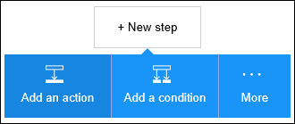
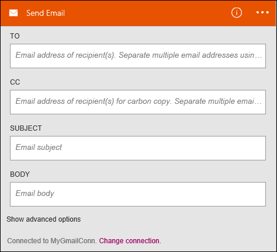

<properties
pageTitle="SMTP | Microsoft Azure"
description="Crie aplicativos de lógica com o serviço de aplicativo do Azure. Conecte a SMTP para enviar email."
services="logic-apps"   
documentationCenter=".net,nodejs,java"  
authors="msftman"   
manager="erikre"    
editor=""
tags="connectors" />

<tags
ms.service="app-service-logic"
ms.devlang="multiple"
ms.topic="article"
ms.tgt_pltfrm="na"
ms.workload="integration"
ms.date="07/15/2016"
ms.author="deonhe"/>

# Começar a usar o conector SMTP

Conecte a SMTP para enviar email.

Para usar [qualquer conector](./apis-list.md), primeiro é necessário criar um aplicativo de lógica. Você pode começar pela [criação de um aplicativo de lógica agora](../app-service-logic/app-service-logic-create-a-logic-app.md).

## Conectar a SMTP

Para que seu aplicativo de lógica possa acessar qualquer serviço, primeiro é necessário criar uma *conexão* com o serviço. Uma [conexão](./connectors-overview.md) fornece conectividade entre um aplicativo de lógica e outro serviço. Por exemplo, para se conectar ao SMTP, primeiro é necessário uma *conexão*de SMTP. Para criar uma conexão, você precisa fornecer as credenciais que você normalmente usa para acessar o serviço que você deseja se conectar. Portanto, no exemplo SMTP, você faria necessita as credenciais para o seu nome de conexão, endereço do servidor SMTP e informações de logon do usuário para criar a conexão para SMTP. [Saiba mais sobre conexões]()  

### Criar uma conexão para SMTP

>[AZURE.INCLUDE [Steps to create a connection to SMTP](../../includes/connectors-create-api-smtp.md)]

## Usar um gatilho de SMTP

Um disparador é um evento que pode ser usado para iniciar o fluxo de trabalho definido em um aplicativo de lógica. [Saiba mais sobre gatilhos](../app-service-logic/app-service-logic-what-are-logic-apps.md#logic-app-concepts).

Neste exemplo, porque SMTP não tem um disparador das suas próprias, usaremos o disparador **Salesforce - quando um objeto é criado** . Esse disparador será ativado quando um novo objeto é criado no Salesforce. Para nosso exemplo, podemos configurará-lo, para que sempre que um novo cliente potencial é criado em Salesforce, ocorre uma ação de *enviar emails* por meio do conector SMTP com uma notificação do novo cliente potencial está sendo criada.

1. Insira *salesforce* na caixa de pesquisa no designer de aplicativos de lógica e selecione o disparador **Salesforce - quando um objeto é criado** .  
   

2. O controle **quando um objeto é criado** é exibido.
   

3. Selecione o **Tipo de objeto** e *conduzir* na lista de objetos. Nesta etapa, você está indicando que você está criando um disparador que notificará seu aplicativo de lógica sempre que um novo cliente potencial é criado no Salesforce.  
   

4. O disparador foi criado.  
   

## Usar uma ação de SMTP

Uma ação é uma operação realizada pelo fluxo de trabalho definido em um aplicativo de lógica. [Saiba mais sobre ações](../app-service-logic/app-service-logic-what-are-logic-apps.md#logic-app-concepts).

Agora que o disparador tenha sido adicionado, siga estas etapas para adicionar uma ação de SMTP que ocorrerá quando um novo cliente potencial é criado no Salesforce.

1. Selecione **+ nova etapa** para adicionar a ação que você gostaria de fazer quando um novo cliente potencial é criado.  
   

2. Selecione **Adicionar uma ação**. Isso abre a caixa de pesquisa onde você pode pesquisar qualquer ação você gostaria de fazer.  
   

3. Insira *smtp* para procurar as ações relacionadas à SMTP.  

4. Selecione **SMTP - Enviar E-mail** como a ação a ser executada quando o novo cliente potencial é criado. Abre o bloco de controle de ação. Você precisará estabelecer sua conexão de smtp no bloco de designer se você não tiver feito isso anteriormente.  
     

5. Insira suas informações de email desejado no bloco de **SMTP - Enviar E-mail** .  
   

6. Salve seu trabalho para ativar o seu fluxo de trabalho.  

## Detalhes técnicos

Aqui estão os detalhes sobre disparadores, ações e respostas que dá suporte a essa conexão:

## Gatilhos de SMTP

SMTP não possui disparadores. 

## Ações de SMTP

SMTP tem a ação a seguir:

|Ação|Descrição|
|--- | ---|
|[Enviar Email](connectors-create-api-smtp.md#send-email)|Essa operação envia um email para um ou mais destinatários.|

### Detalhes de ação

Aqui estão os detalhes para a ação deste conector, juntamente com suas respostas:

### Enviar Email
Essa operação envia um email para um ou mais destinatários. 

|Nome da propriedade| Nome para exibição|Descrição|
| ---|---|---|
|Para|Para|Especificar os endereços de email separados por ponto e vírgula comorecipient1@domain.com;recipient2@domain.com|
|CC|Cc|Especificar os endereços de email separados por ponto e vírgula comorecipient1@domain.com;recipient2@domain.com|
|Assunto|Assunto|Assunto do email|
|Corpo|Corpo|Corpo do email|
|De|De|Endereço de email do remetente comosender@domain.com|
|IsHtml|É Html|Envie o email como HTML (verdadeiro/falso)|
|Cco|Cco|Especificar os endereços de email separados por ponto e vírgula comorecipient1@domain.com;recipient2@domain.com|
|Prioridade|Prioridade|Prioridade do email (alta, Normal ou baixa)|
|ContentData|Dados de conteúdo de anexos|Dados de conteúdo (codificado na Base 64 para fluxos e como-é para cadeia de caracteres)|
|ContentType|Tipo de conteúdo de anexos|Tipo de conteúdo|
|ContentTransferEncoding|Codificação de transferência conteúdo de anexos|Transferir codificação de conteúdo (na Base 64 ou nenhum)|
|Nome do arquivo|Nome de arquivo de anexos|Nome do arquivo|
|ContentId|ID do conteúdo de anexos|Id do conteúdo|

Um * indica que uma propriedade é necessária

## Respostas HTTP

Ações e disparadores acima podem retornar um ou mais dos seguintes códigos de status HTTP: 

|Nome|Descrição|
|---|---|
|200|Okey|
|202|Aceita|
|400|Solicitação inválida|
|401|Não autorizado|
|403|Proibido|
|404|Não encontrado|
|500|Erro interno do servidor. Ocorreu um erro desconhecido.|
|padrão|Falha na operação.|

## Próximas etapas
[Criar um aplicativo de lógica](../app-service-logic/app-service-logic-create-a-logic-app.md)