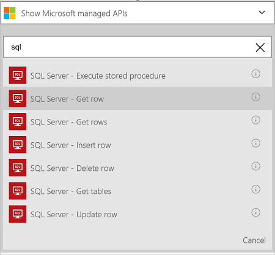
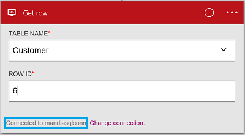

<properties
    pageTitle="Adicionar o conector de banco de dados do Azure SQL em seus aplicativos de lógica | Microsoft Azure"
    description="Visão geral do conector de banco de dados de SQL Azure com parâmetros de API REST"
    services=""
    documentationCenter="" 
    authors="MandiOhlinger"
    manager="anneta"
    editor=""
    tags="connectors"/>

<tags
   ms.service="logic-apps"
   ms.devlang="na"
   ms.topic="article"
   ms.tgt_pltfrm="na"
   ms.workload="na" 
   ms.date="10/18/2016"
   ms.author="mandia"/>

# Começar a usar o conector de banco de dados do Azure SQL
Usando o conector de banco de dados de SQL Azure, crie fluxos de trabalho para a sua organização que gerenciam dados nas suas tabelas. 

Com o banco de dados SQL, você:

- Construir seu fluxo de trabalho, adicionando um novo cliente para um banco de dados de clientes ou atualizando um pedido em um banco de dados de pedidos.
- Use ações para obter uma linha de dados, inserir uma nova linha e até mesmo excluir. Por exemplo, quando um registro é criado no Dynamics CRM Online (um disparador), inserir uma linha em um banco de dados do SQL Azure (uma ação). 

Este tópico mostra como usar o conector de banco de dados SQL em um aplicativo de lógica e também lista as ações.

>[AZURE.NOTE] Esta versão do artigo se aplica a disponibilidade de aplicativos de lógica geral (GA). 

Para saber mais sobre os aplicativos de lógica, consulte [o que são aplicativos de lógica](../app-service-logic/app-service-logic-what-are-logic-apps.md) e [criar um aplicativo de lógica](../app-service-logic/app-service-logic-create-a-logic-app.md).

## Conectar ao banco de dados do SQL Azure

Para que seu aplicativo de lógica possa acessar qualquer serviço, você primeiro criar uma *conexão* com o serviço. Uma conexão fornece conectividade entre um aplicativo de lógica e outro serviço. Por exemplo, para se conectar ao banco de dados do SQL, você primeiro criar uma *conexão*de banco de dados SQL. Para criar uma conexão, você deve inserir as credenciais que você normalmente usa para acessar o serviço que você está se conectando. Portanto, no banco de dados SQL, insira suas credenciais de banco de dados SQL para criar a conexão. 

#### Criar a conexão

>[AZURE.INCLUDE [Create the connection to SQL Azure](../../includes/connectors-create-api-sqlazure.md)]

## Use um gatilho

Esse conector não ter disparadores. Use outros disparadores para iniciar o aplicativo de lógica, como um gatilho de recorrência, um gatilho de HTTP Webhook, disparadores disponíveis com outros conectores e muito mais. [Criar um aplicativo de lógica](../app-service-logic/app-service-logic-create-a-logic-app.md) fornece um exemplo.

## Usar uma ação
    
Uma ação é uma operação realizada pelo fluxo de trabalho definido em um aplicativo de lógica. [Saiba mais sobre ações](../app-service-logic/app-service-logic-what-are-logic-apps.md#logic-app-concepts).

1. Selecione o sinal. Você vê várias opções: **Adicionar uma ação**, **Adicionar uma condição**ou uma das opções a **mais** .

    

2. Escolha **Adicionar uma ação**.

3. Na caixa de texto, digite "sql" para obter uma lista de todas as ações disponíveis.

     

4. Em nosso exemplo, escolha **SQL Server - obter linha**. Se uma conexão já existir, em seguida, selecione o **nome da tabela** na lista suspensa e insira a **ID da linha** que você deseja retornar.

    

    Se você for solicitado para as informações de conexão, insira os detalhes para criar a conexão. [Criar a conexão](connectors-create-api-sqlazure.md#create-the-connection) neste tópico descreve essas propriedades. 

    > [AZURE.NOTE] Neste exemplo, vamos retornar uma linha de uma tabela. Para ver os dados dessa linha, adicione outra ação que cria um arquivo usando os campos da tabela. Por exemplo, adicione uma ação de OneDrive que usa os campos nome e sobrenome para criar um novo arquivo na nuvem armazenamento conta. 

5. **Salvar** suas alterações (canto superior esquerdo da barra de ferramentas). Seu aplicativo de lógica é salvo e pode ser ativado automaticamente.

## Detalhes técnicos

## Ações de banco de dados SQL
Uma ação é uma operação realizada pelo fluxo de trabalho definido em um aplicativo de lógica. O conector de banco de dados SQL inclui as seguintes ações. 

|Ação|Descrição|
|--- | ---|
|[ExecuteProcedure](connectors-create-api-sqlazure.md#execute-stored-procedure)|Executa um procedimento armazenado no SQL|
|[GetRow](connectors-create-api-sqlazure.md#get-row)|Recupera uma única linha de uma tabela do SQL|
|[GetRows](connectors-create-api-sqlazure.md#get-rows)|Recupera linhas de uma tabela do SQL|
|[InsertRow](connectors-create-api-sqlazure.md#insert-row)|Insere uma nova linha em uma tabela do SQL|
|[DeleteRow](connectors-create-api-sqlazure.md#delete-row)|Exclui uma linha de uma tabela do SQL|
|[GetTables](connectors-create-api-sqlazure.md#get-tables)|Recupera tabelas de banco de dados SQL|
|[UpdateRow](connectors-create-api-sqlazure.md#update-row)|Atualiza uma linha existente em uma tabela do SQL|

### Detalhes de ação

Nesta seção, consulte os detalhes específicos sobre cada ação, incluindo quaisquer propriedades de entrada necessárias ou opcionais e qualquer associado com o conector de saída correspondente.

#### Executar procedimento armazenado
Executa um procedimento armazenado no SQL.  

| Nome da propriedade| Nome para exibição |Descrição|
| ---|---|---|
|procedimento * | Nome do procedimento | O nome do procedimento armazenado que você deseja executar |
|parâmetros * | Parâmetros de entrada | Os parâmetros são dinâmicos e com base no procedimento armazenado que você escolher.    Por exemplo, se você estiver usando o banco de dados de exemplo Adventure Works, escolha o procedimento de *ufnGetCustomerInformation* armazenado. O parâmetro de entrada de **ID do cliente** é exibido. Digite "6" ou uma das outras IDs de clientes. |

Um asterisco (*) significa que a propriedade é necessária.

##### Detalhes de saída
ProcedureResult: Carrega o resultado da execução do procedimento armazenado

| Nome da propriedade | Tipo de dados | Descrição |
|---|---|---|
|OutputParameters|objeto|Valores de parâmetro de saída |
|ReturnCode|número inteiro|Código de retorno de um procedimento |
|Conjuntos de resultados|objeto| Conjuntos de resultados|

#### Obter linha 
Recupera uma única linha de uma tabela do SQL.  

| Nome da propriedade| Nome para exibição |Descrição|
| ---|---|---|
|tabela * | Nome da tabela |Nome da tabela do SQL|
|ID * | Id da linha |Identificador exclusivo da linha para recuperar|

Um asterisco (*) significa que a propriedade é necessária.

##### Detalhes de saída
Item

| Nome da propriedade | Tipo de dados |
|---|---|
|ItemInternalId|cadeia de caracteres|

#### Obter linhas 
Recupera linhas de uma tabela do SQL.  

|Nome da propriedade| Nome para exibição|Descrição|
| ---|---|---|
|tabela *|Nome da tabela|Nome da tabela do SQL|
|$skip|Ignorar contagem|Número de entradas para ignorar (padrão = 0)|
|$top|Contagem de obter máximo|Número máximo de entradas para recuperar (padrão = 256)|
|$filter|Consulta de filtro|Uma consulta de filtro ODATA para restringir o número de entradas|
|$orderby|Classificado por|Uma consulta de orderBy ODATA para especificar a ordem das entradas|

Um asterisco (*) significa que a propriedade é necessária.

##### Detalhes de saída
ItemsList

| Nome da propriedade | Tipo de dados |
|---|---|
|valor|matriz|

#### Inserir linha 
Insere uma nova linha em uma tabela do SQL.  

|Nome da propriedade| Nome para exibição|Descrição|
| ---|---|---|
|tabela *|Nome da tabela|Nome da tabela do SQL|
|item *|Linha|Linha para inserir na tabela especificada no SQL|

Um asterisco (*) significa que a propriedade é necessária.

##### Detalhes de saída
Item

| Nome da propriedade | Tipo de dados |
|---|---|
|ItemInternalId|cadeia de caracteres|

#### Excluir linha 
Exclui uma linha de uma tabela do SQL.  

|Nome da propriedade| Nome para exibição|Descrição|
| ---|---|---|
|tabela *|Nome da tabela|Nome da tabela do SQL|
|ID *|Id da linha|Identificador exclusivo da linha para excluir|

Um asterisco (*) significa que a propriedade é necessária.

##### Detalhes de saída
Nenhuma.

#### Obter tabelas 
Recupera tabelas de um banco de dados do SQL.  

Não existem parâmetros para esta chamada. 

##### Detalhes de saída 
TablesList

| Nome da propriedade | Tipo de dados |
|---|---|
|valor|matriz|

#### Linha de atualização 
Atualiza uma linha existente em uma tabela do SQL.  

|Nome da propriedade| Nome para exibição|Descrição|
| ---|---|---|
|tabela *|Nome da tabela|Nome da tabela do SQL|
|ID *|Id da linha|Identificador exclusivo da linha para atualizar|
|item *|Linha|Linha com valores atualizados|

Um asterisco (*) significa que a propriedade é necessária.

##### Detalhes de saída  
Item

| Nome da propriedade | Tipo de dados |
|---|---|
|ItemInternalId|cadeia de caracteres|

### Respostas HTTP

Ao fazer chamadas para as ações diferentes, você pode receber determinadas respostas. A tabela a seguir descreve as respostas e suas descrições:  

|Nome|Descrição|
|---|---|
|200|Okey|
|202|Aceita|
|400|Solicitação inválida|
|401|Não autorizado|
|403|Proibido|
|404|Não encontrado|
|500|Erro interno do servidor. Ocorreu um erro desconhecido|
|padrão|Falha na operação.|

## Próximas etapas

[Criar um aplicativo de lógica](../app-service-logic/app-service-logic-create-a-logic-app.md). Explore os outros conectores disponíveis nos aplicativos de lógica em nossa [lista APIs](apis-list.md).
