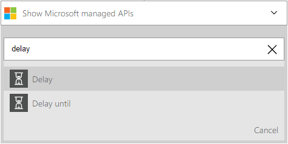

<properties
    pageTitle="Adicionar um atraso nos aplicativos de lógica | Microsoft Azure"
    description="Visão geral do atraso e atraso-até ações e como usá-las com um aplicativo do Azure lógica."
    services=""
    documentationCenter=""
    authors="jeffhollan"
    manager="erikre"
    editor=""
    tags="connectors"/>

<tags
   ms.service="logic-apps"
   ms.devlang="na"
   ms.topic="article"
   ms.tgt_pltfrm="na"
   ms.workload="na"
   ms.date="07/18/2016"
   ms.author="jehollan"/>

# Começar a usar o atraso e atraso-até ações

Usando o atraso e "atraso-até" ações, você pode concluir cenários de fluxo de trabalho.

Por exemplo, você pode:

- Espere até um dia da semana para enviar uma atualização de status através de e-mail.
- Atrasar o fluxo de trabalho até que uma chamada de HTTP tem tempo para ser concluída antes de continuar e recuperar o resultado.

Para começar a usar a ação de atraso em um aplicativo de lógica, consulte [criar um aplicativo de lógica](../app-service-logic/app-service-logic-create-a-logic-app.md).

## Usar as ações de atraso

Uma ação é uma operação que é executada pelo fluxo de trabalho que é definido em um aplicativo de lógica. [Saiba mais sobre ações](connectors-overview.md).

Aqui está uma sequência de exemplo de como usar uma etapa de atraso em um aplicativo de lógica:

1. Depois de adicionar um disparador, clique em **Nova etapa** para adicionar uma ação.
2. Pesquisar **atraso** exibir as ações de atraso. Neste exemplo, podemos selecionará **atraso**.

    

3. Conclua qualquer uma das propriedades da ação para configurar o atraso.

    

4. Clique em **Salvar** para publicar e ativar o aplicativo de lógica.

## Detalhes de ação

O disparador de recorrência tem as seguintes propriedades que podem ser configuradas.

### Ação de atraso

Esta ação atrasa a execução de um determinado intervalo de tempo.
R * significa que é um campo obrigatório.

|Nome para exibição|Nome da propriedade|Descrição|
|---|---|---|
|Contagem *|Contagem|O número de unidades de tempo de atraso|
|Unidade *|unidade|A unidade de tempo: `Second`, `Minute`, `Hour`, ou`Day`|
 

### Atraso-até ação

Esta ação atrasos executar até uma data/hora especificada.
R * significa que é um campo obrigatório.

|Nome para exibição|Nome da propriedade|Descrição|
|---|---|---|
|Ano *|carimbo de hora|O ano para adiar até (GMT)|
|Mês *|carimbo de hora|Mês para adiar até (GMT)|
|Dia *|carimbo de hora|O dia para adiar até (GMT)|
 

## Próximas etapas

Agora, experimente a plataforma e [criar um aplicativo de lógica](../app-service-logic/app-service-logic-create-a-logic-app.md). Você pode explorar os outros conectores disponíveis nos aplicativos de lógica examinando nossa [lista APIs](apis-list.md).
