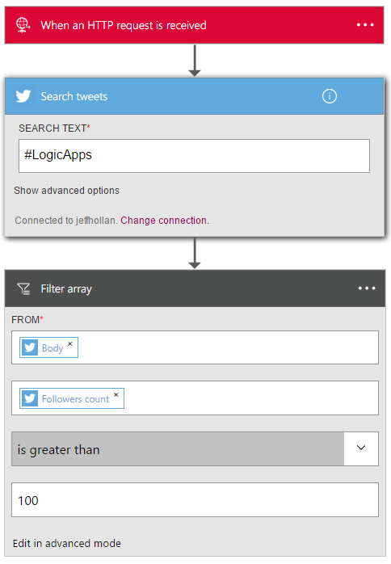

<properties
    pageTitle="Adicionar a ação de consulta nos aplicativos de lógica | Microsoft Azure"
    description="Visão geral da ação de consulta para realizar ações como matriz de filtro."
    services=""
    documentationCenter=""
    authors="jeffhollan"
    manager="erikre"
    editor=""
    tags="connectors"/>

<tags
   ms.service="logic-apps"
   ms.devlang="na"
   ms.topic="article"
   ms.tgt_pltfrm="na"
   ms.workload="na"
   ms.date="07/20/2016"
   ms.author="jehollan"/>

# Começar a usar a ação de consulta

Usando a ação de consulta, você pode trabalhar com lotes e matrizes para realizar os fluxos de trabalho:

- Crie uma tarefa para todos os registros de alta prioridade de banco de dados.
- Salve todos os anexos de PDF para emails em um blob do Microsoft Azure.

Para começar a usar a ação de consulta em um aplicativo de lógica, consulte [criar um aplicativo de lógica](../app-service-logic/app-service-logic-create-a-logic-app.md).

## Usar a ação de consulta

Uma ação é uma operação que é executada pelo fluxo de trabalho que é definido em um aplicativo de lógica. [Saiba mais sobre ações](connectors-overview.md).  

A ação de consulta atualmente tem uma operação, chamada a matriz de filtro, que é exposta no designer. Isso permite que você consultar uma matriz e retornar um conjunto de resultados filtrados.

Aqui está como você pode adicioná-lo em um aplicativo de lógica:

1. Selecione o botão **Nova etapa** .
2. Escolha **Adicionar uma ação**.
3. Na caixa de pesquisa ação, digite **filtro** para a ação de **matriz de filtro** de lista.

    

4. Selecione uma matriz para filtrar. (A captura de tela a seguir mostra a matriz de resultados de uma pesquisa do Twitter.)
5. Crie uma condição deve ser avaliada em cada item. (A captura de tela a seguir filtros tweets dos usuários que têm mais de 100 seguidores.)

    

    A ação produzirá uma nova matriz que contém apenas os resultados que atenderam aos requisitos do filtro.
6. Clique no canto superior esquerdo da barra de ferramentas para salvar e seu aplicativo de lógica será salvar e publicar (Ativar).

## Ação de consulta

Aqui estão os detalhes para a ação que suporta esse conector. O conector tem uma ação possível.

|Ação|Descrição|
|---|---|
|Matriz de filtro|Avalia uma condição para cada item em uma matriz e retorna os resultados|

## Detalhes de ação

A ação de consulta vem com uma ação possível. As tabelas a seguir descrevem os campos de entrada obrigatórios e opcionais para a ação e os detalhes de saída correspondentes que estão associados usando a ação.

### Matriz de filtro
A seguir são campos de entrada para a ação, que faz uma solicitação de saída de HTTP.
R * significa que é um campo obrigatório.

|Nome para exibição|Nome da propriedade|Descrição|
|---|---|---|
|De *|De|A matriz para filtrar|
|Condição *|onde|A condição deve ser avaliada para cada item|
 

### Detalhes de saída

Estes são os detalhes de saída para a resposta HTTP.

|Nome da propriedade|Tipo de dados|Descrição|
|---|---|---|
|Matriz filtrada|matriz|Uma matriz que contém um objeto para cada resultado filtrado|

## Próximas etapas

Agora, experimente a plataforma e [criar um aplicativo de lógica](../app-service-logic/app-service-logic-create-a-logic-app.md). Você pode explorar os outros conectores disponíveis nos aplicativos de lógica examinando nossa [lista APIs](apis-list.md).
