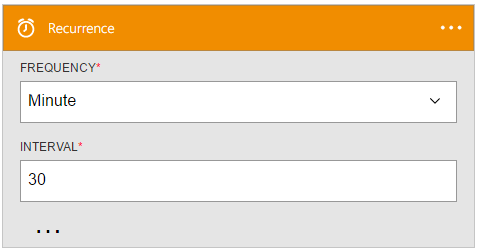

<properties
    pageTitle="Adicionar o disparador de recorrência nos aplicativos de lógica | Microsoft Azure"
    description="Visão geral do disparador recorrência e como usá-lo com um aplicativo do Azure lógica."
    services=""
    documentationCenter=""
    authors="jeffhollan"
    manager="erikre"
    editor=""
    tags="connectors"/>

<tags
   ms.service="logic-apps"
   ms.devlang="na"
   ms.topic="article"
   ms.tgt_pltfrm="na"
   ms.workload="na"
   ms.date="07/18/2016"
   ms.author="jehollan"/>

# Começar a usar o disparador de recorrência

Usando o disparador de recorrência, você pode criar poderosos fluxos de trabalho na nuvem.

Por exemplo, você pode:

- Agende um fluxo de trabalho para executar um procedimento armazenado SQL diariamente.
- Enviar por email um resumo de todos os tweets na semana passada sobre um determinado hashtag.

Para começar a usar o disparador de recorrência em um aplicativo de lógica, consulte [criar um aplicativo de lógica](../app-service-logic/app-service-logic-create-a-logic-app.md).

## Use um gatilho de recorrência

Um disparador é um evento que pode ser usado para iniciar o fluxo de trabalho que é definido em um aplicativo de lógica. [Saiba mais sobre gatilhos](connectors-overview.md).

Aqui está uma sequência de exemplo de como configurar um gatilho de recorrência em um aplicativo de lógica:

1. Adicione o disparador de **Recorrência** como a primeira etapa em um aplicativo de lógica.
2. Preencha os parâmetros para o intervalo de recorrência.

O aplicativo de lógica agora inicia uma execução após cada intervalo de tempo.

## Detalhes de disparadores

O disparador de recorrência tem as seguintes propriedades que podem ser configuradas.

Ele aciona um aplicativo de lógica após um intervalo de tempo especificado.
R * significa que é um campo obrigatório.

|Nome para exibição|Nome da propriedade|Descrição|
|---|---|---|
|Frequência *|frequência|The unit of time: `Second`, `Minute`, `Hour`, `Day`, or `Year`.|
|Intervalo *|intervalo|O intervalo de frequência determinada para a recorrência.|
|Fuso horário|fuso horário|Se uma hora de início for fornecida sem um FUSO horário, este fuso horário será usado.|
|Hora de início|hora de início|A hora de início no [formato ISO 8601](https://en.wikipedia.org/wiki/ISO_8601#Combined_date_and_time_representations).|
 

## Próximas etapas

Agora, experimente a plataforma e [criar um aplicativo de lógica](../app-service-logic/app-service-logic-create-a-logic-app.md). Você pode explorar os outros conectores disponíveis nos aplicativos de lógica examinando nossa [lista APIs](apis-list.md).
