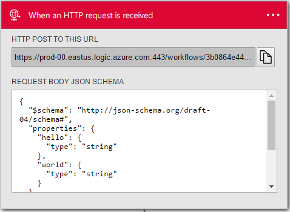

<properties
    pageTitle="Usar ações de solicitação e resposta | Microsoft Azure"
    description="Visão geral da solicitação e resposta disparador e ação em um aplicativo do Azure lógica"
    services=""
    documentationCenter=""
    authors="jeffhollan"
    manager="erikre"
    editor=""
    tags="connectors"/>

<tags
   ms.service="logic-apps"
   ms.devlang="na"
   ms.topic="article"
   ms.tgt_pltfrm="na"
   ms.workload="na"
   ms.date="07/18/2016"
   ms.author="jehollan"/>

# Começar a usar os componentes de solicitação e resposta

Com os componentes de solicitação e resposta em um aplicativo de lógica, você pode responder a eventos em tempo real.

Por exemplo, você pode:

- Responda a uma solicitação HTTP com dados de um banco de dados local por meio de um aplicativo de lógica.
- Acione um aplicativo de lógica de um evento de webhook externo.
- Chame um aplicativo de lógica com uma ação de solicitação e resposta de dentro de outro aplicativo de lógica.

Para começar a usar as ações de solicitação e resposta em um aplicativo de lógica, consulte [criar um aplicativo de lógica](../app-service-logic/app-service-logic-create-a-logic-app.md).

## Use o disparador de solicitação HTTP

Um disparador é um evento que pode ser usado para iniciar o fluxo de trabalho que é definido em um aplicativo de lógica. [Saiba mais sobre gatilhos](connectors-overview.md).

Veja aqui uma sequência de exemplo de como configurar uma solicitação HTTP no Designer de aplicativo de lógica.

1. Adicione o disparador **solicitação - solicitação HTTP um quando for recebida** em seu aplicativo de lógica. Opcionalmente, você pode fornecer um esquema JSON (usando uma ferramenta como [JSONSchema.net](http://jsonschema.net)) para o corpo da solicitação. Isso permite que o designer para gerar tokens de propriedades na solicitação HTTP.
2. Adicione outra ação para que você pode salvar o aplicativo de lógica.
3. Depois de salvar o aplicativo de lógica, você pode obter a URL de solicitação HTTP do cartão de solicitação.
4. Uma POSTAGEM de HTTP (você pode usar uma ferramenta como [carteiro](https://www.getpostman.com/)) para a URL aciona o aplicativo de lógica.

>[AZURE.NOTE] Se você não definir uma ação de resposta, um `202 ACCEPTED` resposta imediatamente é retornada ao chamador. Você pode usar a ação de resposta para personalizar uma resposta.

## Usar a ação de resposta HTTP

A ação de resposta HTTP só é válida quando você usá-lo em um fluxo de trabalho é disparado por uma solicitação HTTP. Se você não definir uma ação de resposta, um `202 ACCEPTED` resposta imediatamente é retornada ao chamador.  Você pode adicionar uma ação de resposta em qualquer etapa do fluxo de trabalho. O aplicativo de lógica apenas mantém a solicitação de entrada aberta para um minuto de uma resposta.  Após um minuto, se nenhuma resposta foi enviada do fluxo de trabalho (e existe uma ação de resposta na definição), um `504 GATEWAY TIMEOUT` é retornado para o chamador.

Veja aqui como adicionar uma ação de resposta HTTP:

1. Selecione o botão **Nova etapa** .
2. Escolha **Adicionar uma ação**.
3. Na caixa de pesquisa ação, digite a **resposta** para listar a ação de resposta.

    

4. Adicione todos os parâmetros que são necessários para a mensagem de resposta HTTP.

    

5. Clique no canto superior esquerdo da barra de ferramentas para salvar e seu aplicativo de lógica será salvar e publicar (Ativar).

## Gatilho de solicitação

Aqui estão os detalhes para o disparador que dá suporte a esse conector. Não há um disparador única solicitação.

|Disparadores|Descrição|
|---|---|
|Solicitação|Ocorre quando uma solicitação HTTP for recebida|

## Ação de resposta

Aqui estão os detalhes para a ação que suporta esse conector. Há uma ação única resposta que só pode ser usada quando ele é acompanhado por um gatilho de solicitação.

|Ação|Descrição|
|---|---|
|Resposta|Retorna uma resposta à solicitação de HTTP correlacionada|

### Detalhes do acionador e ação

As tabelas a seguir descrevem os campos de entrada para o disparador e a ação e o correspondente detalhes de saída.

#### Gatilho de solicitação
A seguir é um campo de entrada para o disparador de uma solicitação HTTP de entrada.

|Nome para exibição|Nome da propriedade|Descrição|
|---|---|---|
|Esquema JSON|esquema|O esquema JSON do corpo da solicitação HTTP|
 

**Detalhes de saída**

Estes são os detalhes de saída para a solicitação.

|Nome da propriedade|Tipo de dados|Descrição|
|---|---|---|
|Cabeçalhos|objeto|Cabeçalhos de solicitação|
|Corpo|objeto|Objeto de solicitação|

#### Ação de resposta

A seguir são campos de entrada para a ação de resposta HTTP. R * significa que é um campo obrigatório.

|Nome para exibição|Nome da propriedade|Descrição|
|---|---|---|
|Código de status *|statusCode|O código de status HTTP|
|Cabeçalhos|cabeçalhos|Um objeto JSON de qualquer cabeçalhos de resposta para incluir|
|Corpo|corpo|Corpo da resposta|

## Próximas etapas

Agora, experimente a plataforma e [criar um aplicativo de lógica](../app-service-logic/app-service-logic-create-a-logic-app.md). Você pode explorar os outros conectores disponíveis nos aplicativos de lógica examinando nossa [lista APIs](apis-list.md).
