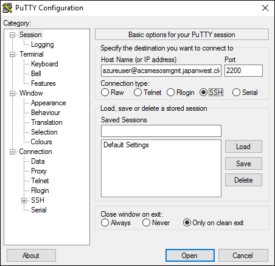

<properties
   pageTitle="Conectar a um cluster de serviço de contêiner do Azure | Microsoft Azure"
   description="Conecte a um cluster de serviço de contêiner do Azure usando um túnel SSH."
   services="container-service"
   documentationCenter=""
   authors="rgardler"
   manager="timlt"
   editor=""
   tags="acs, azure-container-service"
   keywords="Docker, contêineres, Microserviços, DC/SO, Azure"/>

<tags
   ms.service="container-service"
   ms.devlang="na"
   ms.topic="get-started-article"
   ms.tgt_pltfrm="na"
   ms.workload="na"
   ms.date="09/13/2016"
   ms.author="rogardle"/>


# <a name="connect-to-an-azure-container-service-cluster"></a>Conectar a um cluster de serviço de contêiner do Azure

O DC/SO e clusters Docker Swarm que são implantados pelo serviço de contêiner do Azure expõem pontos de extremidade do restante. No entanto, esses pontos de extremidade não são abertos para o mundo exterior. Para gerenciar esses pontos de extremidade, você deve criar um túnel SSH (Secure Shell). Após um SSH túnel tiver sido estabelecida, você pode executar comandos contra os pontos de extremidade de cluster e exibir cluster UI através de um navegador em seu próprio sistema. Este documento o orientará durante a criação de um túnel SSH do Linux, OS X e Windows.

>[AZURE.NOTE] Você pode criar uma sessão SSH com um sistema de gerenciamento de cluster. No entanto, não recomendamos isso. Trabalhe diretamente em um sistema de gerenciamento expõe o risco para alterações de configuração inadvertidas.   

## <a name="create-an-ssh-tunnel-on-linux-or-os-x"></a>Criar um túnel SSH em Linux ou OS X

A primeira coisa que você fazer quando você cria um túnel SSH em Linux ou OS X é localizar o nome DNS público de balanceamento de carga mestres. Para fazer isso, expanda o grupo de recursos para que cada recurso está sendo exibido. Localize e selecione o endereço IP público do mestre. Isso abrirá uma lâmina que contém informações sobre o endereço IP público, que inclui o nome DNS. Salve este nome para uso posterior. <br />


Abra um shell e execute o seguinte comando onde:

**Porta** é a porta do ponto de extremidade que você deseja expor. Por nuvem, isso é 2375. Para DC/sistema operacional, use a porta 80.  
**Nome de usuário** é o nome de usuário que foi fornecido quando você implantado cluster.  
**DNSPREFIX** é o prefixo DNS que você forneceu quando você implantado cluster.  
**Região** é a região em que seu grupo de recursos está localizado.  
**PATH_TO_PRIVATE_KEY** [Opcional] é o caminho para a chave privada que corresponde à chave pública fornecida quando você criou o cluster de serviço do contêiner. Use esta opção com -i sinalizar.

```bash
ssh -L PORT:localhost:PORT -f -N [USERNAME]@[DNSPREFIX]mgmt.[REGION].cloudapp.azure.com -p 2200
```
> A porta de conexão SSH é 2200 – não a porta padrão 22.

## <a name="dcos-tunnel"></a>Túnel DC/SO

Para abrir um túnel para os pontos de extremidade relacionadas ao DC/SO, execute um comando semelhante ao seguinte:

```bash
sudo ssh -L 80:localhost:80 -f -N azureuser@acsexamplemgmt.japaneast.cloudapp.azure.com -p 2200
```

Agora você pode acessar os pontos de extremidade relacionadas ao DC/SO em:

- DC/SISTEMA OPERACIONAL:`http://localhost/`
- Maratona:`http://localhost/marathon`
- Mesos:`http://localhost/mesos`

Da mesma forma, você pode acessar o resto APIs para cada aplicativo por este túnel.

## <a name="swarm-tunnel"></a>Túnel por nuvem

Para abrir um túnel para o ponto de extremidade por nuvem, execute um comando semelhante ao seguinte:

```bash
ssh -L 2375:localhost:2375 -f -N azureuser@acsexamplemgmt.japaneast.cloudapp.azure.com -p 2200
```

Agora você pode definir a variável de ambiente DOCKER_HOST da seguinte maneira. Você pode continuar a usar a interface de linha de Docker (comando) normalmente.

```bash
export DOCKER_HOST=:2375
```

## <a name="create-an-ssh-tunnel-on-windows"></a>Criar um túnel SSH no Windows

Há várias opções para a criação de encapsulamentos SSH no Windows. Este documento descreverá como usar acabamento para fazer isso.

Baixe acabamento ao seu sistema do Windows e executar o aplicativo.

Insira um nome de host é composto o nome de usuário de administrador de cluster e o nome DNS público do primeiro mestre no cluster. O **Nome do Host** ficará assim: `adminuser@PublicDNS`. Insira 2200 para a **porta**.



Selecione **SSH** e **autenticação**. Adicione o seu arquivo de chave privada para autenticação.


Selecione **túneis** e configure o seguinte encaminhado portas:
- **Porta de origem:** Sua preferência – uso 80 para o DC/SO ou 2375 para por nuvem.
- **Destino:** Use localhost:80 para DC/SO ou localhost:2375 para por nuvem.

O exemplo a seguir está configurado para o DC/SO, mas terá aparência semelhante para Docker Swarm.

>[AZURE.NOTE] Porta 80 não deve estar em uso quando você cria este túnel.


Quando terminar, salve a configuração de conexão e conectar a sessão de acabamento. Quando você se conectar, você pode ver a configuração da porta no log de eventos acabamento.


Quando você configurou o túnel para o DC/SO, você pode acessar o ponto de extremidade relacionado em:

- DC/SISTEMA OPERACIONAL:`http://localhost/`
- Maratona:`http://localhost/marathon`
- Mesos:`http://localhost/mesos`

Quando você configurou o túnel para Docker Swarm, você pode acessar o cluster por nuvem através da CLI Docker. Primeiro você precisará configurar uma variável de ambiente do Windows denominada `DOCKER_HOST` com um valor de ` :2375`.

## <a name="next-steps"></a>Próximas etapas

Implantar e gerenciar contêineres com DC/SO ou por nuvem:

- [Trabalhar com o serviço de contêiner Azure e DC/SO](container-service-mesos-marathon-rest.md)
- [Trabalhar com o serviço de contêiner Azure e por Docker nuvem](container-service-docker-swarm.md)
