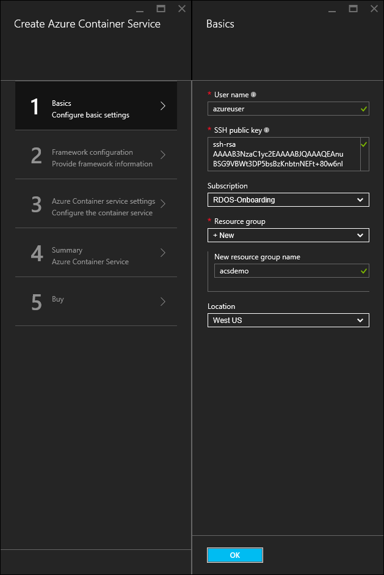

<properties
   pageTitle="Implantar um cluster de serviço de contêiner do Azure | Microsoft Azure"
   description="Implante um cluster de serviço de contêiner do Azure usando o portal do Azure, o Azure CLI ou PowerShell."
   services="container-service"
   documentationCenter=""
   authors="rgardler"
   manager="timlt"
   editor=""
   tags="acs, azure-container-service"
   keywords="Docker, contêineres, Microserviços, Mesos, Azure"/>

<tags
   ms.service="container-service"
   ms.devlang="na"
   ms.topic="get-started-article"
   ms.tgt_pltfrm="na"
   ms.workload="na"
   ms.date="09/13/2016"
   ms.author="rogardle"/>

# <a name="deploy-an-azure-container-service-cluster"></a>Implantar um cluster de serviço de contêiner do Azure

Serviço de contêiner Azure oferece implantação rápida de contêiner de código-fonte aberto popular soluções de agrupamento e coordenação. Usando o serviço de contêiner do Azure, você pode implantar DC/SO e Docker Swarm clusters com modelos do Gerenciador de recursos do Azure ou o portal do Azure. Você implantar esses clusters usando conjuntos de escala de máquina Virtual do Azure e os clusters tirar proveito das ofertas de rede e armazenamento Azure. Para acessar o serviço de contêiner do Azure, você precisa de uma assinatura do Azure. Se você não tiver um, em seguida, você pode inscrever-se para uma [avaliação gratuita](http://azure.microsoft.com/pricing/free-trial/?WT.mc_id=AA4C1C935).

Este documento orientará Implantando um cluster de serviço de contêiner do Azure usando o [portal do Azure](#creating-a-service-using-the-azure-portal), o [Azure interface de linha (comando)](#creating-a-service-using-the-azure-cli)e o [módulo do PowerShell do Azure](#creating-a-service-using-powershell).  

## <a name="create-a-service-by-using-the-azure-portal"></a>Criar um serviço usando o portal do Azure

Entre portal do Azure, selecione **novo**e pesquisar o Azure Marketplace **Azure contêiner de serviço**.

  <br />

Selecione o **Serviço de contêiner do Azure**e clique em **criar**.

  <br />

Insira as seguintes informações:

- **Nome de usuário**: Este é o nome de usuário que será usado para uma conta em cada uma das máquinas virtuais e conjuntos de escala de máquina virtual do cluster de serviço de contêiner do Azure.
- **Assinatura**: selecione uma assinatura do Azure.
- **Grupo de recursos**: selecione um grupo de recursos existente ou crie um novo.
- **Local**: selecione uma região Azure para a implantação do Azure contêiner Service.
- **Chave pública SSH**: adicionar a chave pública que será usada para autenticação contra máquinas virtuais de serviço de contêiner do Azure. É muito importante que essa chave contém sem quebras de linha e que inclui o prefixo 'ssh-rsa' e o 'username@domain' sufixo. Ele deve parecer com o seguinte: **ssh rsa AAAAB3Nz … <>...... UcyupgH azureuser@linuxvm **. Para obter orientações sobre a criação de chaves Secure Shell (SSH), consulte os artigos [Linux]( https://azure.microsoft.com/documentation/articles/virtual-machines-linux-ssh-from-linux/) e [Windows]( https://azure.microsoft.com/documentation/articles/virtual-machines-linux-ssh-from-windows/) .

Clique em **Okey** quando você estiver pronto para prosseguir.

  <br />

Selecione um tipo de coordenação. As opções são:

- **DC/SO**: implanta um cluster de DC/sistema operacional.
- **Swarm**: implanta um cluster Docker Swarm.

Clique em **Okey** quando você estiver pronto para prosseguir.

  <br />

Insira as seguintes informações:

- **Contar mestre**: O número de mestres no cluster.
- **Contagem de agente**: para Docker Swarm, esta será o número inicial de agentes no conjunto de escala de agente. Para DC/sistema operacional, esse será o número inicial de agentes em um conjunto de escala particular. Além disso, um conjunto de escala público é criado, que contém um número predeterminado de agentes. O número de agentes neste conjunto de escala público é determinado por mestres quantos foram criadas no cluster – um agente público para um mestre e dois agentes públicos para três ou cinco mestres.
- **Tamanho de máquina virtual do agente**: O tamanho das máquinas virtuais agente.
- **Prefixo DNS**: um nome exclusivo do mundo que será usado para prefixar partes principais dos nomes de domínio totalmente qualificado para o serviço.

Clique em **Okey** quando você estiver pronto para prosseguir.

  <br />

Clique em **Okey** após a validação de serviço.

  <br />

Clique em **criar** para iniciar o processo de implantação.

  <br />

Se você tiver optado por fixar a implantação para o portal do Azure, você pode ver o status da implantação.

  <br />

Quando tiver concluído a implantação, cluster Azure contêiner serviço está pronto para uso.

## <a name="create-a-service-by-using-the-azure-cli"></a>Criar um serviço usando a CLI do Azure

Para criar uma instância do serviço de contêiner do Azure usando a linha de comando, você precisa de uma assinatura do Azure. Se você não tiver um, em seguida, você pode inscrever-se para uma [avaliação gratuita](http://azure.microsoft.com/pricing/free-trial/?WT.mc_id=AA4C1C935). Você também precisa ter [instalado](../xplat-cli-install.md) e [configurado](../xplat-cli-connect.md) a CLI do Azure.

Para implantar um cluster de Docker Swarm ou DC/SO, selecione um dos seguintes modelos do GitHub. Observe que ambos esses modelos são os mesmos, com exceção da seleção de orchestrator padrão.

* [Modelo de DC/SO](https://github.com/Azure/azure-quickstart-templates/tree/master/101-acs-dcos)
* [Modelo de por nuvem](https://github.com/Azure/azure-quickstart-templates/tree/master/101-acs-swarm)

Em seguida, certifique-se de que a CLI Azure foi conectada a uma assinatura do Azure. Você pode fazer isso usando o seguinte comando:

```bash
azure account show
```
Se uma conta do Azure não for retornada, use o seguinte comando para entrar CLI no Azure.

```bash
azure login -u user@domain.com
```

Em seguida, configure as ferramentas de CLI do Azure para usar o Gerenciador de recursos do Azure.

```bash
azure config mode arm
```

Criar um grupo de recursos do Azure e cluster de serviço de contêiner com o seguinte comando, onde:

- **RESOURCE_GROUP** é o nome do grupo de recursos que você deseja usar para esse serviço.
- **Local** é o Azure região onde o grupo de recursos e implantação do Azure contêiner Service serão criados.
- **TEMPLATE_URI** é o local do arquivo de implantação. Observe que isso deve ser o arquivo bruto, não um ponteiro para o GitHub UI. Para localizar esta URL, selecione o arquivo azuredeploy.json no GitHub e clique no botão de **matéria** .

> [AZURE.NOTE] Quando você executar este comando, o shell solicitará para valores de parâmetro de implantação.

```bash
azure group create -n RESOURCE_GROUP DEPLOYMENT_NAME -l LOCATION --template-uri TEMPLATE_URI
```

### <a name="provide-template-parameters"></a>Fornecer parâmetros de modelo

Esta versão do comando requer que você definir parâmetros interativamente. Se quiser fornecer parâmetros, como uma cadeia de caracteres formatada em JSON, você poderá fazer isso usando o `-p` alternar. Por exemplo:

 ```bash
azure group deployment create RESOURCE_GROUP DEPLOYMENT_NAME --template-uri TEMPLATE_URI -p '{ "param1": "value1" … }'
```

Como alternativa, você pode fornecer um arquivo de parâmetros JSON formatados usando o `-e` alternar:

```bash
azure group deployment create RESOURCE_GROUP DEPLOYMENT_NAME --template-uri TEMPLATE_URI -e PATH/FILE.JSON
```

Para ver um exemplo de arquivo de parâmetros nomeado `azuredeploy.parameters.json`, procure-o com os modelos de serviço do Azure contêiner do GitHub.

## <a name="create-a-service-by-using-powershell"></a>Criar um serviço usando o PowerShell

Você também pode implantar um cluster de serviço de contêiner do Azure com o PowerShell. Este documento é baseado na versão 1.0 [módulo do PowerShell do Azure](https://azure.microsoft.com/blog/azps-1-0/).

Para implantar um cluster de Docker Swarm ou DC/SO, selecione um dos seguintes modelos. Observe que ambos esses modelos são os mesmos, com exceção da seleção de orchestrator padrão.

* [Modelo de DC/SO](https://github.com/Azure/azure-quickstart-templates/tree/master/101-acs-dcos)
* [Modelo de por nuvem](https://github.com/Azure/azure-quickstart-templates/tree/master/101-acs-swarm)

Antes de criar um cluster em sua assinatura do Azure, verifique se que sua sessão do PowerShell foi entrou no Azure. Você pode fazer isso com a `Get-AzureRMSubscription` comando:

```powershell
Get-AzureRmSubscription
```

Se você precisar entrar no Azure, use o `Login-AzureRMAccount` comando:

```powershell
Login-AzureRmAccount
```

Se você estiver implantando um novo grupo de recursos, você deve primeiro criar o grupo de recursos. Para criar um novo grupo de recursos, use o `New-AzureRmResourceGroup` comando e especifique um nome e um destino região de grupo do recurso:

```powershell
New-AzureRmResourceGroup -Name GROUP_NAME -Location REGION
```

Depois de criar um grupo de recursos, você pode criar seu cluster com o comando a seguir. O URI do modelo desejado será especificado o `-TemplateUri` parâmetro. Quando você executar este comando, PowerShell solicitará para valores de parâmetro de implantação.

```powershell
New-AzureRmResourceGroupDeployment -Name DEPLOYMENT_NAME -ResourceGroupName RESOURCE_GROUP_NAME -TemplateUri TEMPLATE_URI
```

### <a name="provide-template-parameters"></a>Fornecer parâmetros de modelo

Se você estiver familiarizado com o PowerShell, sabe que você pode percorrer os parâmetros disponíveis para um cmdlet digitando um sinal de subtração (-) e, em seguida, pressionar a tecla TAB. Essa mesma funcionalidade também funciona com parâmetros que você define no seu modelo. Assim que você digitar o nome do modelo, o cmdlet busca o modelo, analisa os parâmetros e adiciona os parâmetros de modelo ao comando dinamicamente. Isso facilita muito especificar os valores de parâmetro de modelo. E, se você esquecer um valor de parâmetro necessário, PowerShell solicita o valor.

Abaixo está o comando completo, com parâmetros incluídos. Você pode fornecer seus próprios valores para os nomes dos recursos.

```powershell
New-AzureRmResourceGroupDeployment -ResourceGroupName RESOURCE_GROUP_NAME-TemplateURI TEMPLATE_URI -adminuser value1 -adminpassword value2 ....
```

## <a name="next-steps"></a>Próximas etapas

Agora que você tem um cluster funcionando, consulte estes documentos para conexão e detalhes de gerenciamento:

- [Conectar a um cluster de serviço de contêiner do Azure](container-service-connect.md)
- [Trabalhar com o serviço de contêiner Azure e DC/SO](container-service-mesos-marathon-rest.md)
- [Trabalhar com o serviço de contêiner Azure e por Docker nuvem](container-service-docker-swarm.md)
