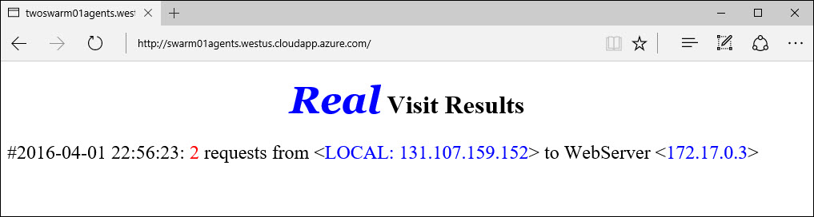

<properties
   pageTitle="Gerenciamento de contêiner de serviço de contêiner Azure com Docker Swarm | Microsoft Azure"
   description="Implantar contêineres em uma Docker Swarm no serviço de contêiner do Azure"
   services="container-service"
   documentationCenter=""
   authors="neilpeterson"
   manager="timlt"
   editor=""
   tags="acs, azure-container-service"
   keywords="Docker, contêineres, Microserviços, Mesos, Azure"/>

<tags
   ms.service="container-service"
   ms.devlang="na"
   ms.topic="get-started-article"
   ms.tgt_pltfrm="na"
   ms.workload="na"
   ms.date="09/13/2016"
   ms.author="timlt"/>

# <a name="container-management-with-docker-swarm"></a>Gerenciamento de contêiner com Docker Swarm

Por nuvem docker fornece um ambiente para implantar cargas de trabalho contidas em um conjunto de pool de hosts de Docker. Por nuvem docker usa a API de Docker nativo. O fluxo de trabalho para gerenciar contêineres em um Docker Swarm é quase idêntico ao que seria em um host único contêiner. Este documento fornece exemplos simples de implantação contida em recipiente cargas de trabalho em uma instância de serviço do Azure contêiner de Docker Swarm. Para obter mais documentação profundamente em Docker Swarm, consulte [Docker Swarm em Docker.com](https://docs.docker.com/swarm/).

Pré-requisitos para os exercícios neste documento:

[Criar um cluster por nuvem no serviço de contêiner do Azure](container-service-deployment.md)

[Conectar-se com o cluster por nuvem no serviço de contêiner do Azure](container-service-connect.md)

## <a name="deploy-a-new-container"></a>Implantar um novo contêiner

Para criar um novo recipiente na Docker Swarm, use o `docker run` comando (garantindo que você abriu um túnel SSH para mestres de acordo com as os pré-requisitos acima). Este exemplo cria um contêiner do `yeasy/simple-web` imagem:


```bash
user@ubuntu:~$ docker run -d -p 80:80 yeasy/simple-web

4298d397b9ab6f37e2d1978ef3c8c1537c938e98a8bf096ff00def2eab04bf72
```

Após o contêiner tiver sido criado, use `docker ps` para retornar informações sobre o contêiner. Observe aqui que o agente por nuvem que hospeda o contêiner é listado:


```bash
user@ubuntu:~$ docker ps

CONTAINER ID        IMAGE               COMMAND                  CREATED             STATUS              PORTS                 NAMES
4298d397b9ab        yeasy/simple-web    "/bin/sh -c 'python i"   31 seconds ago      Up 9 seconds        10.0.0.5:80->80/tcp   swarm-agent-34A73819-1/happy_allen
```  

Agora você pode acessar o aplicativo que está em execução neste contêiner através do nome DNS público de Balanceador de carga de agente por nuvem. Você pode encontrar essas informações no portal do Azure:  


  

Por padrão, o balanceador de carga tem portas 80, 443 e 8080 aberto. Se você deseja se conectar a outra porta, que você precisará abrir essa porta no balanceador de carga do Azure para o Pool de agente.

## <a name="deploy-multiple-containers"></a>Implantar vários contêineres

Como vários contêineres são iniciados, executando 'docker executar' várias vezes, você pode usar o `docker ps` estiver executando o comando para ver que hospeda os contêineres. No exemplo abaixo, três contêineres são distribuídos uniformemente entre os três agentes por nuvem:  


```bash
user@ubuntu:~$ docker ps

CONTAINER ID        IMAGE               COMMAND                  CREATED             STATUS              PORTS                 NAMES
11be062ff602        yeasy/simple-web    "/bin/sh -c 'python i"   11 seconds ago      Up 10 seconds       10.0.0.6:83->80/tcp   swarm-agent-34A73819-2/clever_banach
1ff421554c50        yeasy/simple-web    "/bin/sh -c 'python i"   49 seconds ago      Up 48 seconds       10.0.0.4:82->80/tcp   swarm-agent-34A73819-0/stupefied_ride
4298d397b9ab        yeasy/simple-web    "/bin/sh -c 'python i"   2 minutes ago       Up 2 minutes        10.0.0.5:80->80/tcp   swarm-agent-34A73819-1/happy_allen
```  

## <a name="deploy-containers-by-using-docker-compose"></a>Implantar contêineres usando Docker redigir

Você pode usar o Docker compor para automatizar a implantação e a configuração de vários contêineres. Para fazer isso, certifique-se de que um túnel SSH (Secure Shell) foi criado e que a variável DOCKER_HOST foi definida (consulte os pré-requisitos acima).

Crie um arquivo de docker compose.yml em seu sistema local. Para fazer isso, use este [exemplo](https://raw.githubusercontent.com/rgardler/AzureDevTestDeploy/master/docker-compose.yml).

```bash
web:
  image: adtd/web:0.1
  ports:
    - "80:80"
  links:
    - rest:rest-demo-azure.marathon.mesos
rest:
  image: adtd/rest:0.1
  ports:
    - "8080:8080"

```

Executar `docker-compose up -d` para iniciar as implantações de contêiner:


```bash
user@ubuntu:~/compose$ docker-compose up -d
Pulling rest (adtd/rest:0.1)...
swarm-agent-3B7093B8-0: Pulling adtd/rest:0.1... : downloaded
swarm-agent-3B7093B8-2: Pulling adtd/rest:0.1... : downloaded
swarm-agent-3B7093B8-3: Pulling adtd/rest:0.1... : downloaded
Creating compose_rest_1
Pulling web (adtd/web:0.1)...
swarm-agent-3B7093B8-3: Pulling adtd/web:0.1... : downloaded
swarm-agent-3B7093B8-0: Pulling adtd/web:0.1... : downloaded
swarm-agent-3B7093B8-2: Pulling adtd/web:0.1... : downloaded
Creating compose_web_1
```

Por fim, a lista de execução contêineres será retornada. Esta lista reflete os contêineres que foram implantados usando Docker compor:


```bash
user@ubuntu:~/compose$ docker ps
CONTAINER ID        IMAGE               COMMAND                CREATED             STATUS              PORTS                     NAMES
caf185d221b7        adtd/web:0.1        "apache2-foreground"   2 minutes ago       Up About a minute   10.0.0.4:80->80/tcp       swarm-agent-3B7093B8-0/compose_web_1
040efc0ea937        adtd/rest:0.1       "catalina.sh run"      3 minutes ago       Up 2 minutes        10.0.0.4:8080->8080/tcp   swarm-agent-3B7093B8-0/compose_rest_1
```

Naturalmente, você pode usar `docker-compose ps` para examinar apenas os contêineres definidos no seu `compose.yml` arquivo.

## <a name="next-steps"></a>Próximas etapas

[Saiba mais sobre Docker Swarm](https://docs.docker.com/swarm/)
