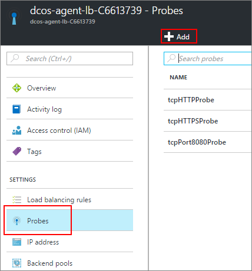
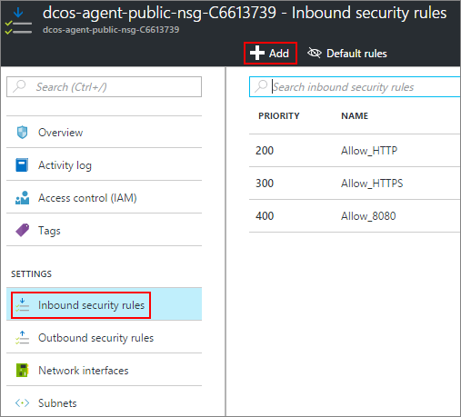

<properties
   pageTitle="Habilitar acesso público a um aplicativo do ACS | Microsoft Azure"
   description="Como habilitar o acesso do público em um serviço de contêiner do Azure."
   services="container-service"
   documentationCenter=""
   authors="Thraka"
   manager="timlt"
   editor=""
   tags="acs, azure-container-service"
   keywords="Docker, contêineres, Microserviços, Mesos, Azure"/>

<tags
   ms.service="container-service"
   ms.devlang="na"
   ms.topic="article"
   ms.tgt_pltfrm="na"
   ms.workload="na"
   ms.date="08/26/2016"
   ms.author="timlt"/>

# Habilitar acesso público a um aplicativo de serviço de contêiner do Azure

Qualquer recipiente DC/SO no ACS [pool de agente público](container-service-mesos-marathon-ui.md#deploy-a-docker-formatted-container) automaticamente é exposto à internet. Por padrão, portas **80**, **443**, **8080** são abertos e qualquer recipiente (pública) listening nessas portas são acessíveis. Este artigo mostra como abrir mais portas para seus aplicativos no serviço de contêiner do Azure.

## Abrir uma porta (portal) 

Primeiro, precisamos abrir a porta que queremos.

1. Faça logon no portal.
2. Localize o grupo de recursos que implantado o serviço de contêiner do Azure para.
3. Selecione o balanceador de carga do agente (que é nomeado semelhante ao **XXXX-agente-lb-XXXX**).

    

4. Clique em **testes** e em seguida **Adicionar**.

    

5. Preencha o formulário de teste e clique em **Okey**.

  	| Campo | Descrição |
  	| ----- | ----------- |
  	| Nome  | Um nome descritivo do teste. |
  	| Porta  | A porta do contêiner para testar. |
  	| Caminho  | (Quando no modo HTTP) O caminho de site relativa para teste. HTTPS não têm suportada. |
  	| Intervalo | A quantidade de tempo entre teste tentativas, em segundos. |
  	| Limite não íntegra | Número de teste consecutiva tentativas antes de considerar o contêiner não íntegra. | 
    

6. De volta às propriedades do agente do balanceador de carga, clique em **regras de balanceamento de carga** e em seguida **Adicionar**.

    

7. Preencha o formulário de Balanceador de carga e clique em **Okey**.

  	| Campo | Descrição |
  	| ----- | ----------- |
  	| Nome  | Um nome descritivo de Balanceador de carga. |
  	| Porta  | A porta de entrada pública. |
  	| Porta de back-end | A porta públicos interno do contêiner para rotear o tráfego para. |
  	| Pool de back-end | Os contêineres neste pool será o destino para este balanceador de carga. |
  	| Teste | O teste usado para determinar se um destino no **pool de back-end** está íntegro. |
  	| Persistência sessão | Determina como o tráfego de um cliente deve ser tratado para a duração da sessão.  **Nenhum**: solicitações sucessivas do mesmo cliente podem ser tratadas por qualquer contêiner. **IP do cliente**: solicitações sucessivas do mesmo IP do cliente são tratadas pelo mesmo contêiner. **IP do cliente e protocolo**: solicitações sucessivas da mesma combinação de protocolo e IP do cliente são tratadas pelo mesmo contêiner. |
  	| Tempo limite ocioso | (Somente TCP) Em minutos, o tempo para manter um cliente TCP/HTTP abrir sem depender de *manutenção de funcionamento* mensagens. |

## Adicionar uma regra de segurança (portal)

Em seguida, precisamos adicionar uma regra de segurança que rotear o tráfego de nossa porta aberta pelo firewall.

1. Faça logon no portal.
2. Localize o grupo de recursos que implantado o serviço de contêiner do Azure para.
3. Selecione o grupo de segurança de rede agente **pública** (que é nomeado semelhante ao **XXXX-agente-público-nsg-XXXX**).

    

4. Selecione **regras de segurança de entrada** e **Adicionar**.

    

5. Preencha a regra de firewall para permitir que o seu pública porta e clique em **Okey**.

  	| Campo | Descrição |
  	| ----- | ----------- |
  	| Nome  | Um nome descritivo da regra do firewall. |
  	| Prioridade | Classificação de prioridade para a regra. Quanto menor o número maior a prioridade. |
  	| Fonte | Restringir o intervalo de endereço IP recebido para ser permitido ou negado por esta regra. Use **qualquer** para não especificar uma restrição. |
  	| Serviço | Selecione um conjunto de serviços predefinidos para que essa regra de segurança é. Caso contrário use **personalizada** para criar suas próprias. |
  	| Protocolo | Restringir o tráfego com base em **TCP** ou **UDP**. Use **qualquer** para não especificar uma restrição. |
  	| Intervalo de portas | Quando o **serviço** for **personalizado**, especifica o intervalo de portas que afeta esta regra. Você pode usar uma única porta, como **80**ou um intervalo como **1024-1500**. |
  	| Ação | Permitir ou negar tráfego que atende aos critérios. |

## Próximas etapas

Saiba mais sobre a diferença entre [agentes de DC/SO públicos e privados](container-service-dcos-agents.md).

Leia mais informações sobre como [gerenciar seus contêineres de DC/sistema operacional](container-service-mesos-marathon-ui.md).