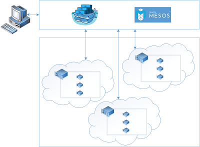

<properties
   pageTitle="Introdução de serviço do contêiner Azure | Microsoft Azure"
   description="Serviço de contêiner Azure fornece uma maneira para simplificar a criação, configuração e gerenciamento de um cluster de máquinas virtuais pré-configuradas para executar aplicativos contida em recipiente."
   services="container-service"
   documentationCenter=""
   authors="rgardler"
   manager="timlt"
   editor=""
   tags="acs, azure-container-service"
   keywords="Docker, contêineres, Microserviços, Mesos, Azure"/>

<tags
   ms.service="container-service"
   ms.devlang="na"
   ms.topic="article"
   ms.tgt_pltfrm="na"
   ms.workload="na"
   ms.date="09/13/2016"
   ms.author="rogardle"/>

# Introdução de serviço de contêiner Azure

Serviço de contêiner Azure torna mais simples para você criar, configurar e gerenciar um cluster de máquinas virtuais pré-configuradas para executar aplicativos contida em recipiente. Ele usa uma configuração otimizada das populares ferramentas de agendamento e coordenação de código-fonte aberto. Isso permite que você use suas habilidades existentes ou desenhar após um corpo grande e crescente de Conhecimento de comunidade, implantar e gerenciar aplicativos baseados em contêiner no Microsoft Azure.

Serviço de contêiner Azure utiliza o formato de contêiner de Docker para garantir que seus contêineres de aplicativo sejam totalmente portátil. Ele também dá suporte à sua opção de maratona e DC/SO ou Docker Swarm para que você possa dimensionar esses aplicativos para milhares de contêineres, ou até mesmo dezenas de milhares.

Usando o serviço de contêiner do Azure, você pode aproveitar os recursos de nível empresarial do Azure, mas ainda mantendo portabilidade do aplicativo – incluindo portabilidade nas camadas de coordenação.

Usando o serviço de contêiner Azure
-----------------------------

Nosso objetivo com o serviço de contêiner do Azure é fornecer um contêiner de ambiente de hospedagem usando tecnologias que são populares entre nossos clientes hoje e ferramentas de código-fonte aberto. Para esse fim, podemos expor os pontos de extremidade de API padrão para seu orchestrator escolhido (DC/SO ou Docker Swarm). Usando esses pontos de extremidade, você pode utilizar qualquer software que seja capaz de conversar com esses pontos de extremidade. Por exemplo, no caso do ponto de extremidade Docker Swarm, você pode optar por usar a interface de linha de Docker (CLI). Para DC/sistema operacional, você pode optar por usar a CLI DCOS.

Criando um cluster de Docker usando o serviço de contêiner do Azure
-------------------------------------------------------

Para começar a usar o serviço de contêiner do Azure, você implanta um cluster de serviço do Azure contêiner através do portal (Pesquisar 'Azure contêiner serviço'), usando um modelo de Gerenciador de recursos do Azure ([Docker Swarm](https://github.com/Azure/azure-quickstart-templates/tree/master/101-acs-swarm) ou [DC/SO](https://github.com/Azure/azure-quickstart-templates/tree/master/101-acs-dcos)) ou com a [CLI](/documentation/articles/xplat-cli-install/). Os modelos de início rápido fornecido podem ser modificados para incluir a configuração Azure adicional ou avançada. Para obter mais informações sobre como implantar um cluster de serviço de contêiner do Azure, consulte [implantar um cluster de serviço de contêiner do Azure](container-service-deployment.md).

Implantar um aplicativo
------------------------

Serviço de contêiner Azure oferece uma opção de Docker Swarm ou DC/SO para coordenação. Como implantar o seu aplicativo depende de sua opção de orchestrator.

### Usando DC/SO

DC/OS é um sistema operacional distribuído com base no núcleo de sistemas distribuídos do Apache Mesos. Apache Mesos está localizado no Apache Software Foundation e lista alguns da [maiores nomes em IT](http://mesos.apache.org/documentation/latest/powered-by-mesos/) como usuários e colaboradores.

DC/sistema operacional e Apache Mesos incluem um conjunto de recursos impressionantes:

-   Escalabilidade comprovada

-   Tolerância replicados mestre e escrava usando Apache ZooKeeper

-   Suporte para contêineres formatados como Docker

-   Nativo isolamento entre tarefas com Linux contêineres

-   Multiresource agendamento (memória, CPU, disco e portas)

-   Java, Python e C++ APIs para desenvolver novos aplicativos paralelos

-   Um interface do usuário da web para exibir o estado do cluster

Por padrão, o DC/sistema operacional em execução no serviço de contêiner do Azure inclui a plataforma de coordenação maratona para cargas de trabalho de agendamento. No entanto, a implantação de DC/SO do ACS é incluído universo Mesosphere dos serviços que podem ser adicionados ao serviço, eles incluem Spark, Hadoop, Cassandra e muito mais.

#### Usando maratona

Maratona é um sistema de controle de serviços de cgroups — ou, no caso de serviço de contêiner do Azure, contêineres formatados como Docker e todo o cluster inicial. Maratona fornece uma interface de usuário da web da qual você pode implantar seus aplicativos. Você pode acessar esse em uma URL parecida com `http://DNS_PREFIX.REGION.cloudapp.azure.com` onde DNS\_PREFIXO e região são definidos no momento da implantação. Claro, você também pode fornecer o seu próprio nome DNS. Para obter mais informações sobre como executar um contêiner usando a web maratona interface do usuário, consulte [gerenciamento de contêiner através do interface do usuário da web](container-service-mesos-marathon-ui.md).

Você também pode usar as APIs REST para se comunicar com maratona. Há um número de bibliotecas de cliente que estão disponíveis para cada ferramenta. Eles cobrir uma variedade de idiomas – e, é claro, você pode usar o protocolo HTTP em qualquer idioma. Além disso, muitas ferramentas DevOps populares fornecem suporte maratona. Isso fornece flexibilidade máxima para sua equipe de operações quando você estiver trabalhando com um cluster de serviço de contêiner do Azure. Para obter mais informações sobre como executar um contêiner, usando a API REST maratona, consulte [gerenciamento de contêiner com a API REST](container-service-mesos-marathon-rest.md).

### Usando por Docker nuvem

Por docker nuvem fornece clusters nativo para Docker. Como Docker Swarm serve a API Docker padrão, qualquer ferramenta que já se comunica com um daemon Docker pode usar por nuvem transparente dimensionar para vários hosts Azure contêiner de serviço.

Ferramentas compatíveis para gerenciar contêineres em um cluster por nuvem incluem, mas não estão limitadas ao seguinte:

-   Dokku

-   Redija docker CLI e Docker

-   Krane

-   Jenkins

Vídeos
------

Introdução-se com o serviço de contêiner do Azure (101):  

> [AZURE.VIDEO azure-container-service-101]

Criando aplicativos usando o serviço de contêiner Azure (compilação 2016)

> [AZURE.VIDEO build-2016-building-applications-using-the-azure-container-service]
