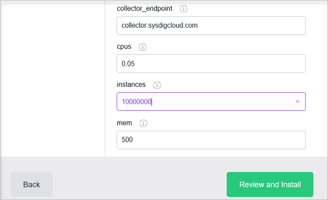

<properties
   pageTitle="Monitorar um cluster de serviço de contêiner do Azure com Sysdig | Microsoft Azure"
   description="Monitore um cluster de serviço de contêiner do Azure com Sysdig."
   services="container-service"
   documentationCenter=""
   authors="rbitia"
   manager="timlt"
   editor=""
   tags="acs, azure-container-service"
   keywords="Contêineres, DC/sistema operacional, Azure"/>

<tags
   ms.service="container-service"
   ms.devlang="na"
   ms.topic="get-started-article"
   ms.tgt_pltfrm="na"
   ms.workload="na"
   ms.date="08/08/2016"
   ms.author="t-ribhat"/>

# Monitorar um cluster de serviço de contêiner do Azure com Sysdig

Neste artigo, vamos implantará agentes de Sysdig para todos os nós do agente no seu cluster de serviço de contêiner do Azure. Você precisa de uma conta com Sysdig para essa configuração. 

## Pré-requisitos 

[Implantar](container-service-deployment.md) e [Conectar](container-service-connect.md) um cluster configurado pelo serviço de contêiner do Azure. Explorar o [maratona UI](container-service-mesos-marathon-ui.md). Vá para [http://app.sysdigcloud.com](http://app.sysdigcloud.com) para configurar uma conta de nuvem Sysdig. 

## Sysdig

Sysdig é um serviço de monitoramento que permite monitorar seus contêineres dentro de seu cluster. Sysdig é conhecido para ajudar na solução de problemas, mas também tiver suas métricas de monitoramento básicas de CPU, rede, memória e i/o. Sysdig torna mais fácil ver quais contêineres estão funcionando o máximo proveito das ou essencialmente usando mais de memória e CPU. Esta exibição está na seção "Visão geral", que está em beta no momento. 

 

## Configurar uma implantação Sysdig com maratona

Estas etapas mostrarão a você como configurar e implantar aplicativos de Sysdig para seu cluster com maratona. 

Acessar a interface do usuário DC/SO via [http://localhost:80 /](http://localhost:80/) uma vez na interface do usuário do DC/sistema operacional, navegue até "Universo", que está na parte inferior esquerda e procure por "Sysdig".

Agora para concluir a configuração que você precisa de uma conta de nuvem Sysdig ou uma conta de avaliação gratuita. Depois que você está conectado ao site de nuvem do Sysdig, clique no seu nome de usuário e na página, você deve ver seu "tecla de acesso". 

 

Em seguida, digite sua chave de acesso para a configuração de Sysdig dentro do universo DC/sistema operacional. 

Conjunto de agora as instâncias 10000000 portanto sempre que um novo nó é adicionado ao cluster Sysdig serão automaticamente implantar um agente para esse novo nó. Isso é uma solução temporária para garantir que Sysdig implantará em todos os novos agentes dentro do cluster. 

Depois de instalar o pacote navegue para a Sysdig UI e você poderá explorar as métricas de uso diferentes para os contêineres seu cluster. 