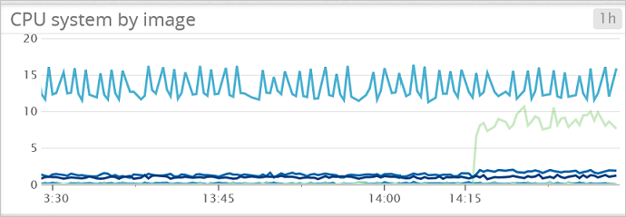

<properties
   pageTitle="Monitorar um cluster de serviço de contêiner do Azure com Datadog | Microsoft Azure"
   description="Monitore um cluster de serviço de contêiner do Azure com Datadog. Use a web de DC/SO UI para implantar os agentes de Datadog em cluster."
   services="container-service"
   documentationCenter=""
   authors="rbitia"
   manager="timlt"
   editor=""
   tags="acs, azure-container-service"
   keywords="Contêineres, DC/sistema operacional, por nuvem Docker, Azure"/>

<tags
   ms.service="container-service"
   ms.devlang="na"
   ms.topic="article"
   ms.tgt_pltfrm="na"
   ms.workload="infrastructure"   
   ms.date="07/28/2016"
   ms.author="t-ribhat"/>

# Monitorar um cluster de serviço de contêiner do Azure com Datadog

Neste artigo, nós implantará agentes de Datadog para todos os nós do agente no seu cluster de serviço de contêiner do Azure. Você precisará de uma conta com Datadog para esta configuração. 

## Pré-requisitos 

[Implantar](container-service-deployment.md) e [Conectar](container-service-connect.md) um cluster configurado pelo serviço de contêiner do Azure. Explorar o [maratona UI](container-service-mesos-marathon-ui.md). Vá para [http://datadoghq.com](http://datadoghq.com) para configurar uma conta de Datadog. 

## Datadog 

Datadog é um serviço de monitoramento que reúne dados de monitoramento de seus contêineres dentro de seu cluster de serviço de contêiner do Azure. Datadog tem um painel de integração de Docker onde você pode ver métricas específicas dentro de seus contêineres. Métricas obtidas seus contêineres são organizadas por CPU, memória, rede e e/s. Datadog divide métricas em contêineres e imagens. Um exemplo da aparência da interface do usuário para o uso da CPU está abaixo.

## Configurar uma implantação Datadog com maratona

Estas etapas mostrarão a você como configurar e implantar aplicativos de Datadog para seu cluster com maratona. 

Acessar a interface do usuário DC/SO via [http://localhost:80 /](http://localhost:80/). Uma vez na interface do usuário do DC/sistema operacional, navegue até "Universo" que está na parte inferior esquerda e pesquise por "Datadog" e clique em "Instalar".

Agora para concluir a configuração será necessário uma conta de Datadog ou uma conta de avaliação gratuita. Depois que você está conectado com a aparência do site de Datadog à esquerda e ir para integrações -> depois da API. 

Em seguida, digite sua chave API para a configuração de Datadog dentro do universo DC/sistema operacional. 

 

Na configuração acima instâncias são definidas como 10000000 isso sempre que um novo nó é adicionado ao cluster Datadog implantará automaticamente um agente para esse nó. Esta é uma solução temporária. Depois de instalar o pacote, você deve navegar de volta para o site Datadog e localizar "Painéis". A partir daí, você verá personalizado e painéis de integração. No painel de integração de Docker terá todas as métricas de contêiner que você precisa para monitorar seu cluster. 
