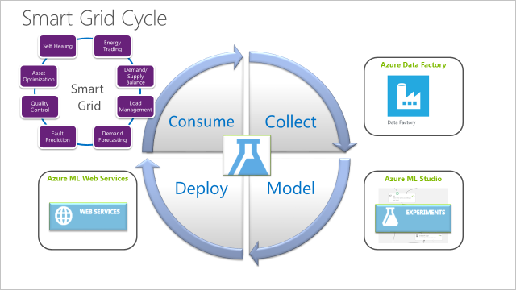
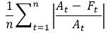
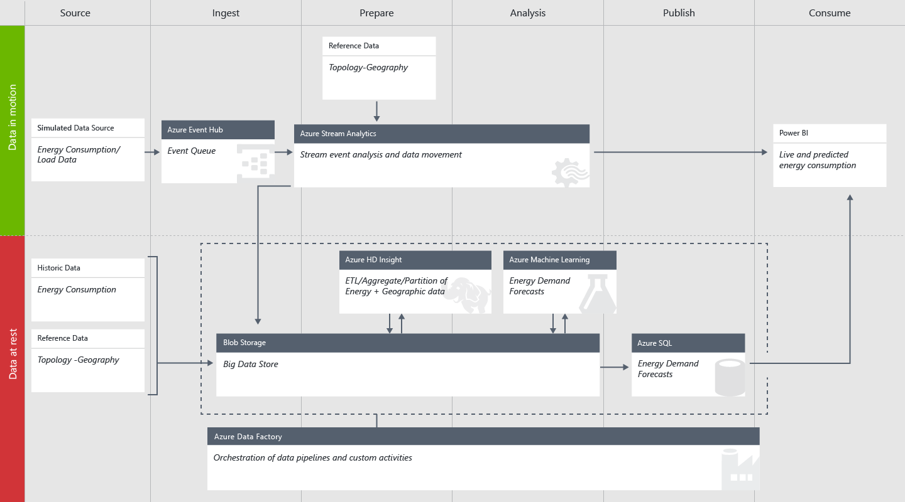

<properties
    pageTitle="Manual de modelo de solução de inteligência de Cortana para previsão de demanda de energia | Microsoft Azure"
    description="Um modelo de solução com Microsoft Cortana Intelligence que ajuda a demanda por uma empresa de utilitário de energia de previsão."
    services="cortana-analytics"
    documentationCenter=""
    authors="ilanr9"
    manager="ilanr9"
    editor="yijichen"/>

<tags
    ms.service="cortana-analytics"
    ms.workload="data-services"
    ms.tgt_pltfrm="na"
    ms.devlang="na"
    ms.topic="article"
    ms.date="01/24/2016"
    ms.author="ilanr9;yijichen;garye"/>

# Manual de modelo de solução de inteligência de Cortana para previsão de demanda de energia  

## Resumo executivo  

Nos últimos anos, Internet das coisas (IoT), fontes de energia alternativo e grandes dados têm mescladas para criar oportunidades grandes no domínio utilitário e energia. Ao mesmo tempo, o utilitário e o setor de energia inteira viu consumo nivelamento check-out com consumidores exigindo melhores maneiras de controlar o uso de energia. Portanto, o utilitário e empresas de grade inteligentes estão em grande necessidade de inovar e renovar próprios. Além disso, muitos grades de energia e utilitário estão ficando desatualizadas e muito dispendioso manter e gerenciar. Durante o último ano, a equipe tem trabalhado em um número de contratos dentro do domínio de energia. Durante esses contratos, encontramos muitos casos em que os utilitários ou ISVs (fornecedores independentes de Software) têm foi observando previsão para demanda de energia futuras. Essas previsões desempenham um papel importante em seus negócios atuais e futuros e tornaram a base para vários casos de uso. Eles incluem previsão de carga de energia curto e a longo prazo, negociação, balanceamento de carga, otimização de grade etc. Dados grandes e métodos de análise avançada (AA) como o aprendizado de máquina (ML) são os principais motivadores para produzir previsões precisas e confiáveis.  

Neste manual, podemos reunir os negócios e diretrizes analíticas necessárias para um desenvolvimento bem-sucedido e solução de previsão de implantação de demanda de energia. Estas diretrizes propostos podem ajudar utilitários, cientistas de dados e engenheiros de dados em estabelecendo soluções totalmente operacionalizadas baseado em nuvem, previsão de demanda. Para as empresas que estão iniciando apenas seus dados grandes e jornada de análise avançada, tal solução pode representar a propagação inicial em sua estratégia de grade inteligente a longo prazo.

>[AZURE.TIP] Para baixar um diagrama que fornece uma visão geral de arquitetura deste modelo, consulte [arquitetura de modelo de solução de inteligência de Cortana para previsão de demanda de energia](cortana-analytics-architecture-demand-forecasting-energy.md).  

## Visão geral  

Este documento aborda os negócios, dados e aspectos técnicos da usando inteligência de Cortana e em determinado Azure máquina aprendizagem AML () para a implementação e implantação de soluções de previsão de energia. O documento consiste em três partes principais:  

1. Compreensão de negócios  
2. Compreensão de dados  
3. Implementação técnica

A parte de **Negócios compreendendo** descreve o aspecto de negócios um precisa compreender e considerar antes de tomar uma decisão de investimento. Explica como qualificar o problema de negócios à mão para garantir que a análise de previsão e aprendizado de máquina realmente eficaz e aplicável. O documento ainda mais explica as Noções básicas de aprendizado de máquina e como ele é usado para solucionar problemas de energia de previsão. Descreve os pré-requisitos e os critérios de qualificação de um caso de uso. Alguns exemplo casos de uso e caso comercial cenários também são fornecidos.

Os dados são o princípio principal para qualquer solução de aprendizado de máquina. A parte de **Dados compreensão** deste documento aborda alguns aspectos importantes dos dados. Descreve o tipo de dados que são necessários para previsão de energia, requisitos de qualidade de dados e quais fontes de dados existem normalmente. Nós também explicam como os dados processados são usados para preparar recursos de dados que realmente direcionam a parte de modelagem.

A terceira parte do documento aborda o aspecto de **Implementação técnica** de uma solução. Engenharia de recurso e modelagem estão no núcleo do processo de ciência de dados e, portanto, estão sendo discutidos em detalhes. Ele cubra o conceito de serviços web, que são um importante veículo para implantação de nuvem de soluções de análise de previsão. Nós também descrevem uma arquitetura típica de uma solução de operationalized de ponta a ponta.

Além disso, o documento inclui material de referência que você pode usar para compreender ainda mais o domínio e tecnologia.

É importante observar que não pretendemos cobrir neste documento o processo de ciência de dados mais profundo, seus aspectos matemáticos e técnicos. Esses detalhes podem ser encontrados na [documentação do Azure ML](http://azure.microsoft.com/services/machine-learning/) e [blogs](http://blogs.microsoft.com/blog/tag/azure-machine-learning/).

### Público-alvo   
O público-alvo para este documento for business e equipe técnica que gostaria de obter conhecimento e compreensão de aprendizado de máquina com base em soluções e como eles estão sendo usados especificamente dentro do domínio de energia de previsão.

Cientistas de dados também podem beneficiar deste documento para obter uma melhor compreensão do processo de alto nível que orienta a implantação de uma solução de previsão de energia de leitura. Neste contexto-também pode ser usado para estabelecer uma linha de base boa e ponto de partida para obter mais informações detalhadas e avançadas material.

### Tendências do setor  
Nos últimos anos, IoT, fontes de energia alternativo e dados de grandes foram mescladas para criar oportunidades grandes no espaço utilitário e energia. Ao mesmo tempo, o utilitário e os setores de energia inteira viu consumo nivelamento check-out com consumidores exigindo melhores maneiras de controlar o uso de energia.

Muitos utilitário e empresas de energia inteligente tiveram sido pioneiro [grade inteligente](https://en.wikipedia.org/wiki/Smart_grid) Implantando um número de uso casos que façam usam dos dados gerados pela grade. Muitos casos de uso envolvem as características inerentes de produção de energia: não pode ser acumulado nem Reserve um armazenados como estoque. Portanto, o que é gerado deve ser usado. Utilitários que deseja tornar-se mais eficiente precisam consumo de energia de previsão simplesmente porque que lhe dará-los maior capacidade de **Saldo suprimento e demanda**, impedindo desperdício de energia, **reduzir emissão de gás de efeito**e controle de custos.

Quando falar de custos, há outro aspecto importante, que é o preço. Novas habilidades a comerciais power entre utilitários tiveram trouxe uma ótima necessidade de **previsão demanda futura e preços futuros de fornecimento de**. Isso pode ajudar empresas determinar seus volumes de produção.

Quando usamos a palavra 'inteligente', podemos realmente se referir a uma grade que pode aprender e, em seguida, fazer previsões. Ele pode antecipar sazonais alterações no consumo bem como **prever situações de sobrecarga temporária e ajustar automaticamente para ele**. Por meio da regulamentação remotamente consumo (com a ajuda destas metros inteligentes), podem ser tratadas situações de sobrecarga localizados. **Por prever primeiro e, em seguida, atuando**, a grade se torna mais inteligente ao longo do tempo.

Para o restante deste documento nos concentraremos em uma família específica de casos de uso que abordam a previsão do futuro, curto prazo e a longo prazo demanda de energia. Estamos trabalhado nessas áreas por alguns meses e ganharam alguns dados de conhecimento e habilidade que nos permitem produzir resultados de notas do setor. Outros casos de uso serão abordados também no documento no futuro próximo.

## Compreensão de negócios

### Objetivos comerciais
O objetivo de **Demonstração de energia** é demonstrar uma análise de previsão típico e solução que pode ser implantada em um quadro de muito pouco tempo de aprendizado de máquina. Especificamente, o nosso foco atual é ativar soluções de previsão de demanda de energia para que seu valor de negócios pode ser percebido e aproveitado após rapidamente. As informações contidas neste manual podem ajudar o cliente realizando as seguintes metas:
-   Solução baseada em hora abreviada ao valor de aprendizado de máquina
-   Capacidade de expandir um piloto use maiusculas e minúsculas para outros casos de uso ou para um escopo mais amplo com base em suas necessidades de negócios
-   Obter rapidamente o conhecimento de produto do pacote de inteligência de Cortana

Com esses objetivos em mente, este manual aponta para oferecer os negócios e conhecimento técnico que ajudará atingir essas metas.

### Carga de energia e previsão de demanda
Dentro do setor de energia, pode haver várias maneiras na qual demanda previsão pode ajudar a resolver problemas de negócios essenciais. Na verdade, previsão de demanda pode ser considerado a base para muitos casos de uso de núcleo no setor. Em geral, consideramos dois tipos de previsões de demanda de energia: curto e longo prazo. Cada um deles pode servir um propósito diferente e utilizar uma abordagem diferente. A principal diferença entre os dois é o horizonte de previsão, significando que o intervalo de tempo no futuro para os quais nós seria previsão.

#### Curto prazo carga de previsão
Dentro do contexto de demanda de energia, curto prazo carregar previsão (STLF) é definido como a carga agregada que está prevista em um futuro próximo em várias partes de grade (ou a grade como um todo). Nesse contexto, curto prazo é definido para ser horizonte de tempo dentro do intervalo de 1 hora e 24 horas. Em alguns casos, também é possível um horizonte de 48 horas. Portanto, STLF é muito comum em um caso de uso operacional da grade. Aqui estão alguns exemplos de STLF controlado pelo casos de uso:
-   Suprimento e demanda balanceamento
-   Suporte de negociação de energia
-   Tomada de mercado (preço de energia de configuração)
-   Otimização operacional da grade
-   [Resposta de propostas](https://en.wikipedia.org/wiki/Demand_response)
-   Previsão de demanda de pico
-   Gerenciamento de lado de propostas
-   Balanceamento de carga e prevenção de sobrecarga
-   Previsão de carga de longo prazo
-   Detecção de falhas e anomalias
-   Pico curtailment/nivelamento 

Modelo STLF principalmente são baseados no passado próximo (último dia ou semana) dados de consumo e uso previsto temperatura como uma previsão importante. Obtendo precisa temperatura de previsão para a próxima hora e backup 24 horas está se tornando menos de um desafio dias agora. Esses modelos são menos confidenciais sazonais padrões ou tendências de consumo de longo prazo.

Soluções SLTF também são probabilidade para gerar um alto volume de chamadas de previsão (solicitações de serviço) desde que estão sendo invocados em uma base por hora e em alguns casos mesmo com frequência maior. Também é muito comum ver onde cada Subestação individual ou transformador é representado por um modelo de autônomo e, portanto, o volume de solicitações de previsão ainda maior de implantação.

#### Previsão de carga de longo prazo
O objetivo de longo prazo carga previsão (LTLF) é previsão demanda de energia com um horizonte de tempo variando de 1 semana para vários meses (e em alguns casos de um número de anos). Este intervalo de horizonte principalmente é aplicável para planejamento e casos de uso do investimento.

Cenários de longo prazo, é importante ter dados de alta qualidade que abrange um intervalo de vários anos (mínimos 3 anos). Esses modelos normalmente serão extrair padrões de sazonalidade dos dados históricos e uso predicators externos tal como padrões do tempo e clima.

É importante esclarecer o que mais o horizonte de previsão, menos precisas a previsão pode ser. Portanto, é importante produzir alguns intervalos de confiança junto com a previsão real que permita humanos fator a variação possível para o seu processo de planejamento.

Como o cenário de consumo para LTLF principalmente está planejando, podemos esperar muito volumes de previsão inferiores (em comparação com o STLF). Estamos geralmente verá essas previsões incorporadas ferramentas de visualização como Excel ou PowerBI e ser chamados manualmente pelo usuário.

### Previsão de termos de curto prazo versus longo
A tabela a seguir compara STLF e LTLF em relação aos atributos mais importantes:

|Atributo|Previsão de carga de curto prazo|Previsão de carga de longo prazo|
|---|---|---|
|Previsão horizonte|De 1 hora 48 horas|De 1 a 6 meses ou mais|
|Detalhamento de dados|Por hora|Por hora ou diariamente|
|Usos típicos|<ul><li>Demanda/suprimentos balanceamento</li><li>Selecione a hora de previsão</li><li>Resposta de propostas</li></ul>|<ul><li>Planejamento de longo prazo</li><li>Planejamento de ativos de grade</li><li>Planejamento de recursos</li></ul>|
|Corretas típicas|<ul><li>Dia ou semana</li><li>Hora do dia</li><li>Temperatura por hora</li></ul>|<ul><li>Mês do ano</li><li>Dia do mês</li><li>Clima e temperatura de longo prazo</li></ul>|
|Intervalo de dados históricos|Dois a três anos de dados|Cinco a 10 anos de dados|
|Precisão típica|MAPE * de 5% ou inferior|MAPE * de 25% ou inferior|
|Frequência de previsão|Produzidas a cada hora ou a cada 24 horas|Produzidas depois mensais, trimestrais ou anuais|
\*[MAPE](https://en.wikipedia.org/wiki/Mean_absolute_percentage_error) – porcentagem de erro média média

Como pode ser visto desta tabela, é muito importante distinguir entre o curto e a longo prazo previsão cenários como esses representam necessidades de negócios diferentes e podem ter diferentes de implantação e padrões de consumo.

### Caso de uso de exemplo 1: eSmart sistemas – otimização de sobrecarga
Uma função importante de uma [grade inteligente](https://en.wikipedia.org/wiki/Smart_grid) é dinamicamente e constantemente otimizar e ajustar para os padrões de consumo a alteração. Consumo de energia pode ser afetado por alterações de curto prazo que são principalmente causadas por flutuações de temperatura (*por exemplo*, mais potência é usada para aquecimento ou condição de ar). Ao mesmo tempo, consumo de energia também é influenciado pela tendências de longo prazo. Eles podem incluir efeitos de sazonalidade, feriados nacionais, crescimento de consumo a longo prazo e até mesmo econômicas fatores como o índice do consumidor, preço do petróleo e GDP.

Neste caso de uso, [eSmart](http://www.esmartsystems.com/) queria implantar uma solução baseada em nuvem que permite prever a propensity de uma situação de sobrecarga em qualquer determinada Subestação da grade. Em particular, eSmart queria identificar substations que provavelmente sobrecarga na próxima hora, para que uma ação imediata pode ser tomada para evitar ou resolver essa situação.

Um precisos e a execução rápida previsão requer implementação dos modelos de previsão três:
-   Modelo de termos longo que permite fazer previsões de consumo de energia em cada Subestação durante o próximo algumas semanas ou meses
-   Modelo de curto prazo que permite a previsão de situação de sobrecarga em uma determinado Subestação durante a próxima hora
-   Modelo de temperatura que fornece a previsão de temperatura de futura sobre vários cenários

O objetivo do modelo de longo prazo é classifique os substations por seu propensity sobrecarregar (dada sua capacidade de transmissão de energia) durante a próxima semana ou mês. Isso permite a criação de uma lista curta de substations que faria servir como uma entrada para a previsão de curto prazo. Assim como temperatura uma previsão importante para o modelo de longo prazo, é necessário para produzir previsões de temperatura de cenário de vários constantemente e feed-los como entrada para o modelo de longo prazo. A previsão de curto prazo, em seguida, é invocada para prever quais Subestação é provável sobrecarregar sobre a próxima hora.

Os modelos de curto e longo prazo são implantados individualmente por cada Subestação. Portanto, a execução prática desses modelos requer coordenação considerável. Para obter maior precisão de previsão no curto prazo, um modelo mais granular dedicado a cada hora do dia. Todos esses modelos são executados a cada hora e término execução em poucos minutos para permitir que o tempo suficiente para responder e realizar ações prevenção, se necessário. Essa coleção de modelos é atualizada usando periódico novos treinamentos os dados mais recentes.

Mais informações sobre esse caso de uso podem ser encontradas [aqui](https://customers.microsoft.com/Pages/CustomerStory.aspx?recid=18945).

#### Usar critérios de qualificação caso – pré-requisitos
A principal força de inteligência de Cortana está em sua capacidade poderosa implantar e dimensionar soluções centrados em aprendizado de máquina. Ele foi projetado para suportar milhares de previsões que são executadas simultaneamente. Ele pode dimensionar automaticamente para atender a um padrão de consumo a alteração. Portanto, é o foco de uma solução em precisão e computação de desempenho. Por exemplo, uma empresa de utilitário está interessada em produzir energia precisos previsão para a próxima hora e para cada hora do dia. Por outro lado, estamos menos interessados em responder a pergunta de por que a demanda é prevista sejam como ele é (o modelo em si executarão desse).

Portanto, é importante perceber que nem todos os casos de uso e problemas de negócios podem ser resolvidos com eficiência usando o aprendizado de máquina.

Inteligência de Cortana e aprendizado de máquina podem ser altamente eficazes de solucionar um problema de negócios determinado quando os seguintes critérios são atendidos:
-   O problema de negócios em mãos é **previsão** natureza. Um exemplo de caso de uso de previsão é uma empresa de utilitário que gostaria de prever carga de energia em uma determinado Subestação durante a próxima hora. Por outro lado, analisar e classificando drivers de demanda histórica seria **descritivo** natureza e, portanto, menos aplicáveis.
-   Há um claro **caminho de ação** a ser tomada quando a previsão está disponível. Por exemplo, prever uma sobrecarga em uma Subestação durante a próxima hora pode acionar uma ação proativa de redução de carga que está associada essa Subestação e potencialmente evitando uma sobrecarga.
-   Caso de uso representa um **típico tipo de problema** tal resolvido que, quando ele pode preparar o caminho para solucionar outros semelhantes casos de uso.
-   O cliente pode definir **metas quantitativas e qualitativas** para demonstrar uma implementação bem-sucedida solução. Por exemplo, uma boa meta quantitativa para previsão de demanda de energia seria o limite de precisão necessária (*por exemplo*, até 5% erro é permitido) ou quando prever Subestação sobrecarga então a precisão (taxa de true positivos) e cancelamento (grau de positivos true) deve estar acima de um determinado limite. Essas metas devem ser derivadas de metas de negócios do cliente.
-   Há um **cenário de integração** de limpar com fluxo de trabalho de negócios da empresa. Por exemplo, a previsão de carga de Subestação pode ser integrada para a Central de controle de grade para permitir que as atividades de prevenção de sobrecarga.
-   O cliente tem pronto para usar **dados com qualidade suficiente** para oferecer suporte o caso de uso (veja mais na próxima seção, **Qualidade dos dados**, este manual).
-   O cliente adota arquitetura de centrados em dados de nuvem ou de **aprendizado de máquina baseada em nuvem**, incluindo ML do Azure e outros componentes de pacote de inteligência de Cortana.
-   O cliente está disposto estabelecer **um fluxo de dados de ponta a ponta** que instalações a entrega de dados em nuvem continuamente e está disposto **tornem operacional** a solução.
-   O cliente está pronto para **dedicar recursos** quem vai ser ativamente envolvidos durante a implementação piloto inicial para que o conhecimento e a propriedade da solução podem ser transferidos para o cliente após a conclusão bem-sucedida.
-   O recurso de cliente deve ser um **profissional de dados competente**, preferência um cientista de dados.

Qualificação de um caso de uso com base em critérios acima bastante pode melhorar as taxas de sucesso de um caso de uso e estabelecer uma boa beachhead para a implementação de casos de uso futuro.

### Soluções baseadas em nuvem
Pacote de inteligência de Cortana no Azure é um ambiente integrado que reside na nuvem. A implantação de uma solução de análise avançada em um ambiente de nuvem contém benefícios substanciais para empresas e ao mesmo tempo podem significam grande mudança para empresas que usam ainda soluções de TI no local. Dentro do setor de energia, há uma tendência de limpar da migração gradual de operações na nuvem. Essa tendência vai lado a lado junto com o desenvolvimento da grade inteligente conforme discutido acima, **Tendências do setor**. Como este manual se destina uma solução baseada em nuvem no domínio de energia, é importante explicar os benefícios e outras considerações de implantar uma solução baseada em nuvem.

Talvez a maior vantagem de uma solução baseada em nuvem é o custo. Como uma solução faz uso dos componentes implantadas na nuvem, há nenhuma antecipados custos ou COGS (custo dos bens vendidos) componente associada a ele. Isso significa que não é necessário investir em hardware, software e manutenção de TI e, portanto, há uma redução substancial em risco de negócios.

Outra vantagem importante é a estrutura de custo flexível das soluções baseadas em nuvem. Servidores baseado em nuvem para armazenamento de computação ou podem ser implantados e dimensionados em uma base just conforme necessário. Isso representa a vantagem de eficiência de custo de uma solução baseada em nuvem.

Por fim, não é necessário para investir em manutenção de TI ou desenvolvimento de infraestrutura futuras como tudo isso é parte da oferta baseado na nuvem. Essa extensão, Cortana inteligência Suite inclui o melhor nos serviços de classe e seu mapa mantém evolução. Recursos, componentes e novos recursos constantemente estão sendo introduzidos e evoluem.

Para uma empresa que está iniciando sua transição para a nuvem, altamente recomendamos adotar uma abordagem gradual implementando um mapa de migração de nuvem. Podemos acreditar que para utilitários e empresas no domínio de energia, os casos de uso descritos neste manual representam uma excelente oportunidade para piloto soluções de análise de previsão na nuvem.

#### Considerações de negócios justificação maiusculas
Em muitos casos, o cliente pode estar interessado em fazer uma justificação de negócios para um caso de uso determinado em que uma solução baseada em nuvem e aprendizado de máquina são componentes importantes. Ao contrário de uma solução no local, no caso de uma solução baseada em nuvem, o componente de custo antecipado é mínimo e a maioria dos elementos de custo são associada ao uso real. Quando se trata de implantar um solução no pacote de inteligência de Cortana de previsão de energia, vários serviços podem ser integrados com uma única estrutura de custo comum. Por exemplo, bancos de dados (*por exemplo*, SQL Azure) podem ser usados para armazenar os dados processados e, em seguida, para as previsões reais Azure ML é usado para hospedar os serviços de previsão. Neste exemplo, a estrutura de custo pode incluir componentes transações e armazenamento.

Por outro lado, um deve ter uma boa compreensão do valor comercial do operando uma demanda de energia previsão (curto ou longo prazo). Na verdade, é importante perceber o valor de negócios de cada operação de previsão. Por exemplo, com precisão previsão de carga de energia de próximas 24 horas pode impedir que overproduction ou pode ajudar a evitar sobrecargas na grade e isso pode ser quantificação em termos de economia financeira diariamente.

Uma fórmula básica para calcular o benefício financeiro de demanda previsão solução seria: 

Como o pacote de inteligência de Cortana oferece um modelo de preços flexível, não é necessário para gerar um componente de custo fixo para esta fórmula. Essa fórmula pode ser calculada em uma base de diária, mensal ou anual.

Atual pacote de inteligência de Cortana e Azure ML os planos de preços podem ser encontradas [aqui](http://azure.microsoft.com/pricing/details/machine-learning/).

### Processo de desenvolvimento de soluções
O ciclo de desenvolvimento de uma demanda de energia previsão solução normalmente envolve 4 fases, em todos os que podemos fazer uso de serviços e tecnologias baseado em nuvem do pacote de inteligência de Cortana.

Isso é ilustrado no diagrama a seguir:

O parágrafo seguinte descreve esse processo da 4 etapa:

1.  **Coleta de dados** – qualquer solução de análise avançada com base depende de dados (consulte **Compreendendo de dados**). Especificamente, quando se trata de análise de previsão e previsão, podemos dependem de fluxo contínuo, dinâmico de dados. No caso de previsão de demanda de energia, esses dados podem se originar diretamente de medidores inteligentes ou já ser agregados em um banco de dados local. Nós também dependem de outras fontes externas de dados como clima e temperatura. Esse fluxo contínuo de dados deve ser coordenado, agendado e armazenado. [Fábrica de dados do Azure](http://azure.microsoft.com/services/data-factory/) (AAD) é nossa força de trabalho principal para realizar esta tarefa.
2.  **Modelagem** – de energia precisa e confiável prevê, um deve desenvolver (trem) e manter um modelo excelente que usa os dados históricos e extrai os padrões de significativos e antecipados dos dados. A área de aprendizado de máquina (ML) tem crescem rapidamente com algoritmos mais avançados sendo desenvolvidos regularmente. Azure ML Studio fornece uma excelente experiência de usuário que ajuda a utilizar os algoritmos ML mais avançados em um fluxo de trabalho concluído. Fluxo de trabalho é ilustrado em um diagrama de fluxo intuitivo e inclui a preparação de dados, a extração do recurso, modelagem e avaliação de modelo. O usuário pode retirar em centenas de vários modelos que estão incluídos neste ambiente. No final desta fase um cientista dados terá um modelo de trabalho que seja totalmente avaliadas e pronto para implantação.

    O diagrama a seguir é uma ilustração de um fluxo de trabalho típico:

    

3.  **Implantação** – com um modelo de trabalho no lado, a próxima etapa é implantação. Veja o modelo é convertido em um serviço da web que expõe uma API RESTful que pode ser chamado simultaneamente pela Internet usando vários clientes de consumo. ML Azure fornece uma maneira simples de implantar um modelo diretamente a partir do Studio de ML Azure com um único clique de um botão. O processo de implantação inteiro acontece nos bastidores. Essa solução pode dimensionar automaticamente para atender o consumo necessário.

4.  **Consumo** – nesta fase, podemos realmente fazer utilizar o modelo de previsão de para produzir previsões. O consumo pode ser controlado pelo empenho de um aplicativo de usuário (*por exemplo*, o painel) ou diretamente de um sistema operacional como demanda/suprimentos balanceamento sistema ou uma solução de otimização de grade. Vários casos de uso podem ser ativados em um único modelo.

## Compreensão de dados
Após abordando as considerações de negócios (consulte **Compreendendo de negócios**) de uma demanda de energia previsão solução, podemos agora está prontos para discutir a parte de dados. Qualquer solução de análise de previsão depende de dados confiáveis. Para previsão de demanda de energia, podemos dependem de dados de consumo histórico com vários níveis de detalhamento. Esses dados históricos são usados como a matéria-prima. Ele passará uma análise de cuidado no qual o cientista dados identifique corretas (também conhecidas como recursos) que podem ser colocadas em um modelo que eventualmente gerará as previsões necessárias.

O restante desta seção, podemos descreverá as várias etapas e considerações para Noções básicas sobre os dados e como colocá-la em um formulário utilizável.

### O ciclo de desenvolvimento do modelo
Produzir bons modelos requer alguma preparação cuidadosa de previsão e planejamento. Dividir o processo de modelagem em várias etapas e concentrando-se em uma etapa por vez podem melhorar drasticamente o resultado de todo o processo.

O diagrama a seguir ilustra como o processo de modelagem pode ser dividido em várias etapas:

Como pode ser visto que o ciclo consiste em seis etapas:
-   Formulação de problema
-   Inclusão de dados e exploração de dados
-   Preparação de dados e engenharia de recurso
-   Modelagem
-   Avaliação do modelo
-   Desenvolvimento

O restante desta seção, podemos descreverá as etapas individuais e os itens a serem considerados em cada etapa.

### Formulação de problema
Pode consideramos a formulação problema como a etapa mais importante um precisa tomar antes da implementação de qualquer solução de análise de previsão. Aqui podemos transformar o problema de negócios e decompor-la para elementos específicos que podem ser resolvidos usando dados e técnicas de modelagem. É uma boa prática Formula o problema como um conjunto de perguntas que podemos gostaria de responder. Aqui estão algumas perguntas possíveis que podem ser aplicáveis dentro do escopo de previsão de demanda de energia:
-   O que é a carga esperada em uma Subestação individual na próxima horas ou dias?
-   Em que momento do dia, a minha grade terá pico demanda?
-   Qual é a probabilidade minha grade para sustentar a carga de pico esperado?
-   Quanto power a estação de energia deve gerar durante a cada hora do dia?

Formular essas perguntas nos permite concentrar-se em obter os dados corretos e implementar uma solução totalmente alinhado com o problema de negócios em questão. Além disso, podemos então definir algumas medidas fundamentais que nos permitem avaliar o desempenho do modelo. Por exemplo, como precisas a previsão deveria e qual é o intervalo de erro que ainda seria aceitável pela empresa?

### Fontes de dados
Grade de smart moderna coleta dados de várias partes e componentes da grade. Esses dados representam vários aspectos da operação e a utilização da grade de energia. Dentro do escopo da previsão de demanda de energia, podemos são limitação de discussão em fontes de dados que refletem o consumo de demanda real. Uma importante fonte do consumo de energia são metros inteligentes. Utilitários em todo o mundo estão implantando rapidamente metros inteligentes para seus consumidores. Metros inteligentes gravem o consumo de energia real e esses dados de volta para a empresa utilitário de retransmissão constantemente. Dados são coletados e enviados novamente em um intervalo fixo, desde a cada 5 minutos para 1 hora. Metros inteligentes mais avançados podem ser programados remotamente para controlar e saldo o consumo real dentro de uma família. Dados de medidor inteligente é relativamente confiáveis e incluem um carimbo de hora. Que torna um princípio importante para previsão. Medidor de dados pode ser agregados (somado para cima) em vários níveis dentro da topologia de grade: transformador, subestação, região, *etc*. Nós, em seguida, escolha o nível de agregação necessários para criar um modelo de previsão para ele. Por exemplo, se a empresa utilitário gostaria de previsão futura carga em cada um dos seus substations de grade, em seguida, dados dos metros todos os podem ser agregados para cada Subestação individual e usados como entrada para o modelo de previsão. Nós consulte metros inteligentes como uma fonte de dados internas.

Uma previsão de demanda de energia confiável também será dependem de outras fontes de dados externas. Um fator importante que afeta o consumo de energia é o clima, ou mais precisamente a temperatura. Dados históricos mostram forte correlação entre a temperatura externa e consumo de energia. Durante dias de verão quente, verifique os consumidores use dos seus ar condicionado e durante o power inverno em sistemas de aquecimento. Uma fonte confiável temperaturas históricos no local de grade, portanto, é fundamental. Além disso, podemos também dependem de previsão preciso de temperatura como previsão de consumo de energia.

Outras fontes de dados externas também podem ajudar na criação de modelos de previsão de demanda de energia. Eles podem incluir longo prazo alterações de clima, econômicos índices (*por exemplo*, GDP) e outras pessoas. Neste documento nós não incluirá essas outras fontes de dados.

### Estrutura de dados
Depois de identificar as fontes de dados necessários, podemos gostaria garantir que os dados processados que foram coletados incluem os recursos de dados corretos. Para criar um modelo de previsão de demanda confiável, seria precisamos garantir que os dados coletados incluem os elementos de dados que podem ajudar a prever a demanda futura. Aqui estão alguns requisitos básicos relativas a estrutura de dados (esquema) dos dados processados.

Os dados processados consistem em linhas e colunas. Cada medida é representada como uma única linha de dados. Cada linha de dados inclui várias colunas (também conhecidas como recursos ou campos).

1.  **Carimbo de hora** – o campo de carimbo de hora representa o tempo real quando as unidades de medida foi registrada. Ele deve ser compatível com um dos formatos de data/hora comum. Partes de data e hora devem ser incluídos. Na maioria dos casos, não é necessário para o tempo para ser gravado até o segundo nível de detalhamento. É importante especificar o fuso horário no qual os dados são gravados.
2.  **Medidor de ID** - esse campo identifica o medidor ou o dispositivo de medição. É uma variável categórica e pode ser uma combinação de dígitos e caracteres.
3.  **Valor de consumo** – este é o consumo real em uma determinada data/hora. O consumo pode ser medido em kWh (kilowatt) ou qualquer outro preferencial unidades. É importante observar que a unidade de medida deve ficar consistente em todas as medidas dos dados. Em alguns casos, consumo pode ser fornecido em 3 fases de energia. Nesse caso, podemos precisaria coletar todas as fases de consumo independente.
4.  **Temperatura** – a temperatura geralmente são coletadas de uma fonte independente. No entanto, ele deve ser compatível com os dados de consumo. Ele deve incluir um carimbo de hora conforme descrito acima que permitirá que ele seja sincronizado com os dados de consumo real. O valor de temperatura pode ser especificado em graus Celsius ou Fahrenheit, mas deve permanecer consistente em todas as medidas.
5.  **Local –** No campo local é geralmente associado com o local onde os dados de temperatura foram coletados. Ele pode ser representado como um número de código postal ou no formato do latitude/longitude (lat/long).

As tabelas a seguir mostra exemplos de um formato de dados de consumo e temperatura boa:

|**Data**|**Tempo**|**ID do medidor**|**Fase 1**|**Fase 2**|**Fase 3**|
|--------|--------|------------|-----------|-----------|-----------|
|7/1/2015|10:00:00|ABC1234     |7.0        |2.1        |5.3        |
|7/1/2015|10:00:01|ABC1234     |7.1        |2.2        |4.3        |
|7/1/2015|10:00:02|ABC1234     |6.0        |2.1        |4.0        |

|**Data**|**Tempo**|**Local**|**Temperatura**|
|--------|--------|-------------|---------------|
|7/1/2015|10:00:00|11242        |24,4           |
|7/1/2015|10:00:01|11242        |24,4           |
|7/1/2015|10:00:02|11242        |24,5           |

Como pode ser visto acima, este exemplo inclui 3 valores diferentes para consumo associado 3 fases de energia. Além disso, observe que os campos de data e hora são separadas, porém eles também podem ser combinados em uma única coluna. Nesse caso, a coluna de local é representada em um formato de CEP de 5 dígitos e a temperatura em um formato de grau Celsius.

### Formato de dados
Pacote de inteligência de Cortana pode oferecer suporte os formatos de dados mais comuns, como CSV, TSV, JSON, *etc*. É importante que o formato de dados permanece consistente para todo o ciclo de vida do projeto.

### Inclusão de dados
Como previsão de demanda de energia é previsto constantemente e frequentemente, podemos deve garantir que os dados processados está fluindo por meio de um processo de inclusão de dados sólida e confiável. O processo de inclusão deve garantir que os dados processados estão disponíveis para o processo de previsão no tempo necessário. Que significa que a frequência de inclusão de dados deve ser maior do que a frequência de previsão.

Por exemplo: se nossa demanda previsão solução poderia gerar uma nova previsão às 8:00 AM diariamente, então precisamos garantir que todos os dados que foram coletados durante as últimas 24 horas tenham sido incluídos totalmente até esse ponto e tem mesmo incluam a última hora dos dados.

Para fazer isso, o pacote de inteligência de Cortana oferece várias maneiras para dar suporte a um processo de inclusão de dados confiáveis. Isso será discutido ainda mais na seção **implantação** deste documento.

### Qualidade de dados
Fonte de dados bruto que é necessário para fazer previsões de demanda confiável e precisa deve atender a alguns critérios de qualidade de dados básico. Embora métodos estatísticos avançados podem ser usados para compensar algum problema de qualidade de dados possíveis, ainda precisamos garantir que estamos está ultrapassando algum limite de qualidade da base de dados quando a inclusão de novos dados. Aqui estão algumas considerações sobre a qualidade dos dados processados:
-   **Valor ausente** – isso se refere à situação quando medida específica não foram coletada. O requisito básico aqui é que a taxa de valor ausente não deve ser maior do que 10% para qualquer período de tempo determinado. Caso o que está faltando um único valor, ele deve ser indicada usando um valor predefinido (por exemplo: '9999') e não '0', o que poderia ser uma medida válida.
-   **Precisão de medição** – o valor real do consumo ou temperatura devem ser registradas com precisão. Medidas incorretas produzirá previsões incorretas. Normalmente, o erro de medida deve ser menor que 1% em relação ao valor true.
-   **Tempo de medida** – é necessário que o carimbo de hora real dos dados coletados não desviem por mais de 10 segundos relativo a hora true da medição real.
-   **Sincronização** – quando várias fontes de dados estão sendo usados (*por exemplo*, consumo e temperatura) nós deve garantir que há são não problemas de nenhuma sincronização de tempo entre elas. Isso significa que a diferença de horário entre o carimbo de hora coletado qualquer dois independentes de fontes de dados não deve exceder mais de 10 segundos.
-   **Latência** - conforme discutido acima, **Inclusão de dados**, podemos dependem um processo de fluxo e inclusão de dados confiáveis. Para controlar que estamos deve garantir que podemos controlar a latência de dados. Isso é especificado como a diferença de tempo entre a hora em que as unidades de medida real foi feita e a hora em que ele foi carregado para o armazenamento do conjunto de inteligência de Cortana e está pronto para uso. Para carga de curto prazo a latência total de previsão não deve ser maior do que 30 minutos. Para carga de longo prazo a latência total de previsão não deve ser maior que 1 dia.

### Preparação de dados e engenharia de recurso
Depois que os dados processados foram ingerido (consulte a **Inclusão de dados**) e foi armazenados com segurança, está pronto para ser processado. A fase de preparação de dados é basicamente levando os dados processados e convertendo (transformando, reformatação)-lo em um formulário para a fase de modelagem. Que podem incluir operações simples como usando a coluna de dados processados como ela está com o valor de medida real, valores padronizados, mais complexas operações como [tempo demora](https://en.wikipedia.org/wiki/Lag_operator)e outras pessoas. As colunas de dados recém-criado citadas como recursos de dados e o processo de gerar esses é conhecido como engenharia de recurso. No final deste processo temos um novo conjunto de dados que tenha sido derivado os dados processados e podem ser usado para modelagem. Além disso, a fase de preparação de dados precisa cuidam de valores ausentes (consulte a **Qualidade dos dados**) e compensá-los. Em alguns casos, também podemos precisaria normalizar os dados para garantir que todos os valores são representados na mesma escala.

Nesta seção que nós listam alguns dos recursos dados comuns que são incluídos na energia demanda modelos de previsão.

**Tempo controlado pelo recursos:** Esses recursos são derivados dos dados de carimbo de data/hora. Estas são extraídas e convertidas em categorias recursos como:
-   Hora do dia – esta é a hora do dia que usa valores de 0 a 23
-   Dia da semana – isso representa o dia da semana e leva valores de 1 (domingo) a 7 (sábado)
-   Dia do mês – isso representa a data real e podem tomar valores de 1 a 31
-   Mês do ano – isso representa o mês e leva valores de 1 (janeiro) a 12 (dezembro)
-   Fim de semana – esse é um recurso de valor binário que leva os valores de 0 para dias úteis ou 1 para o fim de semana
-   Feriado - esse é um recurso de valor binário que leva os valores de 0 para um dia regular ou 1 para um feriado
-   Termos de Fourier – os termos de Fourier são espessuras que são derivadas do carimbo de hora e são usadas para capturar a sazonalidade (ciclos) dos dados. Como podemos pode ter várias estações em nossos dados pode precisamos vários termos de Fourier. Por exemplo, valores de demanda podem ter diários, semanais e anuais estações/ciclos que resultará em termos de Fourier 3.

**Recursos de medição independente:** Os recursos independentes incluem todos os elementos de dados que estamos gostaria de usar como corretas em nosso modelo. Aqui, podemos excluir o recurso dependente que precisamos prever.
-   Recurso de retardo – são adiantado de tempo valores da demanda real. Por exemplo, os recursos de tempo de latência 1 conterá o valor de demanda na hora anterior (presumindo que dados por hora) relativo o carimbo de hora atual. Da mesma forma, podemos pode adicionar retardo 2, 3, de tempo de retardo *etc*. A combinação real dos recursos de retardo usados são determinadas durante a fase de modelagem pela avaliação dos resultados modelo.
-   Tendências de longo prazo – esse recurso representa o crescimento linear em demanda entre anos.

**Recurso dependente:** O recurso dependente é a coluna de dados que estamos gostaria nosso modelo prever. Com o [aprendizado de máquina supervisionada](https://en.wikipedia.org/wiki/Supervised_learning), precisamos primeiro treinar o modelo usando os recursos dependentes (que também é conhecido como rótulos). Isso permite que o modelo aprender os padrões dos dados associados ao recurso dependente. Previsão de demanda de energia normalmente queremos prever a demanda real e, portanto, usaríamos-lo como o recurso dependente.

**Manipulação de valores ausentes:** Durante a fase de preparação de dados, seria precisamos determinar a melhor estratégia para lidar com valores ausentes. Isso é feito principalmente usando os vários [métodos de imputation de dados](https://en.wikipedia.org/wiki/Imputation_(statistics))de estatísticas. No caso de previsão de demanda de energia, podemos normalmente impute valores ausentes usando média móvel de pontos de dados disponíveis anterior.

**Normalização de dados:** Normalização de dados é outro tipo de transformação que é usado para trazer todos os dados numéricos como previsão para uma escala semelhante. Normalmente, isso ajuda a melhorar a precisão do modelo e a precisão. Nós normalmente faria isso divide o valor real pelo intervalo de dados.
Isso acompanhará o valor original para baixo em um intervalo menor, normalmente entre -1 e 1.

## Modelagem
A fase de modelagem é onde ocorre a conversão de dados em um modelo. No centro desse processo lá avançados algoritmos que digitalizar os dados históricos (dados de treinamento), extrair padrões e criar um modelo. Esse modelo pode ser usado mais tarde prever em novos dados que não foi usados para criar o modelo.

Depois que temos um modelo de trabalho confiável podemos então pode usá-lo para pontuação novos dados que estão estruturados para incluir os recursos necessários (X). O processo de pontuação fará utilizar o modelo persistente (objeto da fase de treinamento) de e prever a variável de destino que é indicada por Ŷ.

### Técnicas de modelagem de previsão de demanda
No caso de demanda previsão podemos fazer uso dos dados históricos que são ordenados por hora. Geralmente, podemos fazer referência aos dados que inclui a dimensão de tempo como [série temporal](https://en.wikipedia.org/wiki/Time_series). O objetivo de modelagem de série de tempo é encontrar tempo relacionadas tendências, sazonalidade, autocorrelação (correlação ao longo do tempo) e Formula aqueles em um modelo.

Nos últimos anos algoritmos avançados foram desenvolvidos para acomodar a série temporal e melhorar a precisão da previsão. Vamos abordar brevemente algumas delas aqui.

> [AZURE.NOTE] Esta seção não se destina a ser usado como um aparelho de aprendizagem e previsão de visão geral, mas como uma breve pesquisa de modelagem técnicas que são usadas para previsão de demanda. Para obter mais informações e material educacional sobre série temporal, é altamente recomendável livro online [previsão: princípios e prática](https://www.otexts.org/book/fpp).

#### [**MA (média móvel)**](https://www.otexts.org/fpp/6/2)
Média móvel é uma das técnicas analíticas primeira que foi usado para série temporal e é ainda um dos mais usados técnicas a partir de hoje. Também é a base para mais avançadas técnicas de previsão. Com a média móvel nós são previsão o próximo ponto de dados pela média sobre os pontos mais recentes K, onde K indica a ordem de média móvel.

A técnica de média móvel tem o efeito de suavização a previsão e, portanto, não pode manipular volatilidade bem grande nos dados.

#### [**ETS (Ajuste exponencial)**](https://www.otexts.org/fpp/7/5)
Suavização exponencial (ETS) é uma família de vários métodos que usam média ponderada dos pontos de dados recentes para prever o próximo ponto de dados. A ideia é atribuir maior importância para valores mais recentes e diminuir gradualmente esse peso para valores de medida mais antigos. Há um número de diferentes métodos com essa família, algumas delas incluem manipulação de sazonalidade dos dados como [Método sazonal Terra-Winters](https://www.otexts.org/fpp/7/5).

Alguns desses métodos também considerar a sazonalidade dos dados.

#### [**ARIMA (automática regressão integrados movendo média)**](https://www.otexts.org/fpp/8)
Auto regressão integrado movendo média (ARIMA) é outra família de métodos comumente usado para previsão de série de tempo. Ele praticamente combina métodos de regressão automática com média móvel. Métodos de regressão automática usam modelos de regressão fazendo valores de série de tempo anterior para calcular o próximo ponto de data. Métodos ARIMA também se aplicam a diferenciação métodos que incluem calcular a diferença entre pontos de dados e usando aqueles em vez do valor original medido. Por fim, ARIMA também usa as técnicas de média móveis descritos acima. A combinação de todos esses métodos de várias maneiras é o que constrói da família dos métodos ARIMA.

ETS e ARIMA são amplamente usados hoje para previsão de demanda de energia e muitos outros problemas de previsão. Em muitos casos combinados juntos para fornecer resultados muito precisos.

**Regressão múltiplo de geral** Modelos de regressão podem ser a abordagem de modelagem mais importante dentro do domínio de aprendizado de máquina e estatísticas. No contexto de série temporal usamos regressão para prever os valores futuros (*por exemplo*, de demanda). Regressão podemos faça uma combinação de linear das corretas e saiba os pesos (também conhecidos como coeficientes) desses corretas durante o processo de treinamento. O objetivo é produzir uma linha de regressão que preveja nosso valor previsto. Métodos de regressão são adequados quando a variável de destino é numérica e, portanto, também se encaixa série temporal. Há uma grande variedade de métodos de regressão, incluindo modelos de regressão muito simples como [Regressão Linear](https://en.wikipedia.org/wiki/Linear_regression) e aquelas mais avançadas como árvores de decisão, [Florestas aleatório](https://en.wikipedia.org/wiki/Random_forest), [Redes neurais](https://en.wikipedia.org/wiki/Artificial_neural_network)e aumentou árvores de decisão.

Construir demanda de energia previsão como um problema de regressão oferece muita flexibilidade na seleção nossos recursos de dados que podem ser combinados da demanda real tempo séries de dados e fatores externos como temperatura. Obter mais informações sobre os recursos selecionados são discutidas no recurso seção (consulte **preparação de dados e de engenharia de recurso**) Este manual de engenharia.

Da nossa experiência com implementação e implantação do piloto de previsões de demanda de energia, descobrimos que os modelos de regressão avançadas que estão disponíveis no Azure ML tendem a produzir os melhores resultados e podemos fazer uso delas.

## Avaliação do modelo
Avaliação do modelo tem um papel fundamental no **Ciclo de desenvolvimento do modelo**. Nesta etapa olharmos para validar o modelo e seu desempenho com dados reais. Durante a etapa de modelagem usamos uma parte dos dados disponíveis para o modelo de treinamento. Durante a fase de avaliação, podemos levar o restante dos dados para testar o modelo. Praticamente significa que estamos são alimentação de dados do novo modelo que tenham sido reestruturar e contém os mesmos recursos do conjunto de dados de treinamento. No entanto, durante o processo de validação, podemos usar o modelo para prever a variável de destino em vez de fornecer a variável de destino disponível. Podemos geralmente se referir a esse processo como pontuação de modelo. Usamos faria, em seguida, os valores de destino true e compará-los com os previsto. O objetivo aqui é medir e minimizar o erro de previsão, indicando a diferença entre as previsões e o valor true. Quantificação as unidades de medida do erro é chave desde que queremos ajustar o modelo e validar se o erro é realmente diminuindo. Ajuste fino do modelo pode ser feito modificando parâmetros de modelo que controlam o processo de aprendizagem ou adicionando ou removendo recursos de dados (referidos como [Limpar parâmetros](https://channel9.msdn.com/Blogs/Windows-Azure/Data-Science-Series-Building-an-Optimal-Model-With-Parameter-Sweep)). Praticamente, isso significa que talvez precisamos iteramos entre a recurso de engenharia de modelagem e modelar fases de avaliação várias vezes até nós são capazes de reduzir o erro para o nível exigido.

É importante ênfase que o erro de previsão nunca será zero como nunca é um modelo que poderá perfeitamente prever cada resultado. No entanto, há uma determinada magnitude do erro aceitável pela empresa. Durante o processo de validação, podemos gostaria garantir que nossos erro de previsão do modelo seja no nível ou melhor do que o nível de tolerância de negócios. Portanto, é importante definir o nível do erro tolerável no início do ciclo durante a fase de **Formulação do problema** .

### Técnicas de avaliação típica
Existem várias maneiras nas quais previsão de erro pode ser medido e quantificação. Nesta seção, nos concentraremos a discussão sobre técnicas de avaliação relevantes para a série temporal e, no específicos para previsão de demanda de energia.

#### [**MAPE**](https://en.wikipedia.org/wiki/Mean_absolute_percentage_error)
MAPE significa significam absoluta erro de porcentagem. Com MAPE nós são computação a diferença entre cada previsto ponto e o valor real desse ponto. Podemos então mostre o erro por ponto Calculando a proporção da diferença relativo o valor real. Na última etapa podemos média desses valores. A fórmula matemática usada para MAPE é o seguinte:

*onde umt é o valor real, Ft é o valor previsto e n é o horizonte de previsão.*

## Implantação
Depois que temos dedicado para baixo a fase de modelagem e validados o desempenho de modelo estamos prontos para ir para a fase de implantação. Nesse contexto, a implantação significa permitindo que o cliente consumir o modelo executando previsões reais nele em grande escala. O conceito de implantação é chave no Azure ML como nosso objetivo principal é constantemente invocar previsões em vez de apenas obter a visão dos dados. A fase de implantação é a parte onde estamos habilitar o modelo ser consumida em escala grande.

Dentro do contexto de previsão de demanda de energia, nosso objetivo é invocar previsões contínuas e periódicos garantindo que os dados atualizados estão disponíveis para o modelo e que os dados previstos são enviados para o cliente consumindo.

### Implantação de serviços da Web
O bloco de construção de implantação principal no Azure ML é o serviço da web. Essa é a maneira mais eficiente para habilitar o consumo de um modelo de previsão na nuvem. O serviço Web encapsula o modelo e quebra-com uma [RESTful](http://www.restapitutorial.com/) API (Application Programming Interface). A API pode ser usada como parte de qualquer código de cliente, conforme ilustrado no diagrama abaixo.

Como pode ser visto, o serviço web é implantado na nuvem Suite de inteligência de Cortana e pode ser chamado sobre seu ponto de extremidade de API REST exposto. Tipos diferentes de clientes em vários domínios podem chamar o serviço por meio da API de Web simultaneamente. O serviço da web também pode ser dimensionados para oferecer suporte a milhares de chamadas simultâneas.

### Uma arquitetura de solução típica
Ao implantar uma demanda de energia previsão solução, estamos interessados em implantar uma solução de ponta a ponta que ultrapassa o serviço da web de previsão e facilita o fluxo de dados inteiro. No momento que podemos invocar uma nova previsão, podemos precisaria certificar-se de que o modelo é tio com os recursos de dados atualizados. Que significa que os dados não processados coletados recentemente é constantemente incluídos, processados e transformados no recurso necessário configurar em que o modelo foi criado. Ao mesmo tempo, podemos gostaria de disponibilizar os dados previstos para o fim consumir clientes. Um exemplo dados ciclo de fluxo (ou pipeline de dados) é ilustrado no diagrama abaixo:

Estas são as etapas que ocorram como parte do ciclo de previsão de demanda de energia:
1.  Milhões de medidores de dados implantado constantemente estão gerando dados de consumo de energia em tempo real.
2.  Esses dados está sendo coletadas e carregado em um repositório de nuvem (*por exemplo*, Azure Blob).
3.  Antes de serem processados, os dados processados são agregados a um Subestação ou nível regional, conforme definido pela empresa.
4.  O processamento de recurso depois (consulte **preparação de dados e processamento de recurso**) ocorrerá e produz os dados que são necessários para o modelo de treinamento ou pontuação – os dados do conjunto de recurso são armazenados em um banco de dados (*por exemplo*, SQL Azure).
5.  O serviço de novos treinamento é chamado de treinar novamente o modelo de previsão que a versão atualizada do modelo é mantida para que ele pode ser usado pelo serviço da web pontuação.
6.  O serviço web pontuação é invocado em um agendamento que se adapte a frequência de previsão necessária.
7.  Os dados previstos são armazenados em um banco de dados que pode ser acessado pelo cliente de consumo de fim.
8.  O cliente de consumo recupera as previsões, aplica volta para a grade e consome-lo de acordo com o caso de uso necessários.

É importante observar que todo esse ciclo é totalmente automatizado e é executado em um cronograma. A organização inteira desse ciclo de dados pode ser feita usando ferramentas como [Fábrica de dados do Azure](http://azure.microsoft.com/services/data-factory/).

### Arquitetura de implantação de ponta a ponta
Para praticamente implantar uma solução de previsão de demanda de energia em Cortana inteligência, precisamos garantir que os componentes necessários estão estabelecidos e configurados corretamente.

O diagrama a seguir ilustra uma arquitetura de inteligência de Cortana com base típica que implementa e organiza o ciclo de fluxo de dados que está descrito acima:

Para obter mais informações sobre cada um dos componentes e toda a sua arquitetura consulte o modelo de solução de energia.
