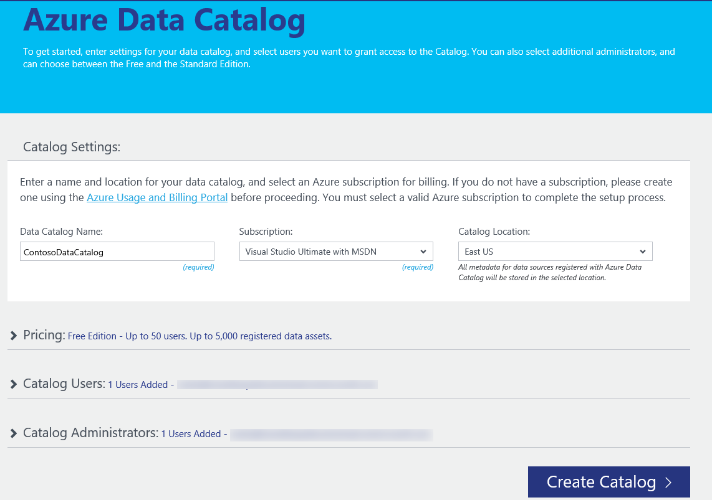
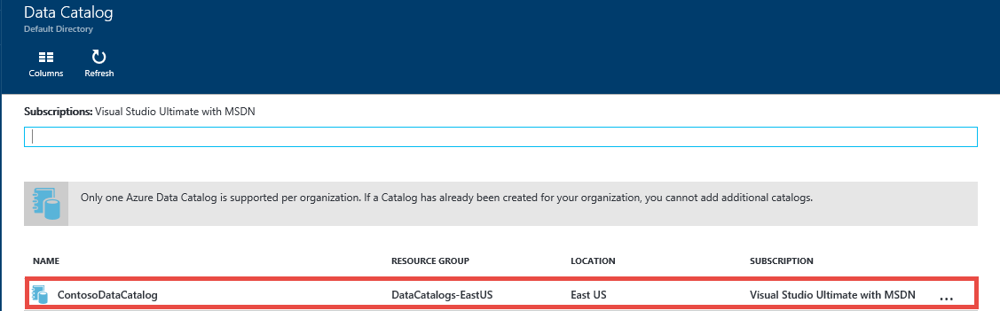
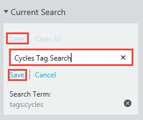
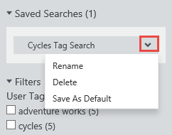
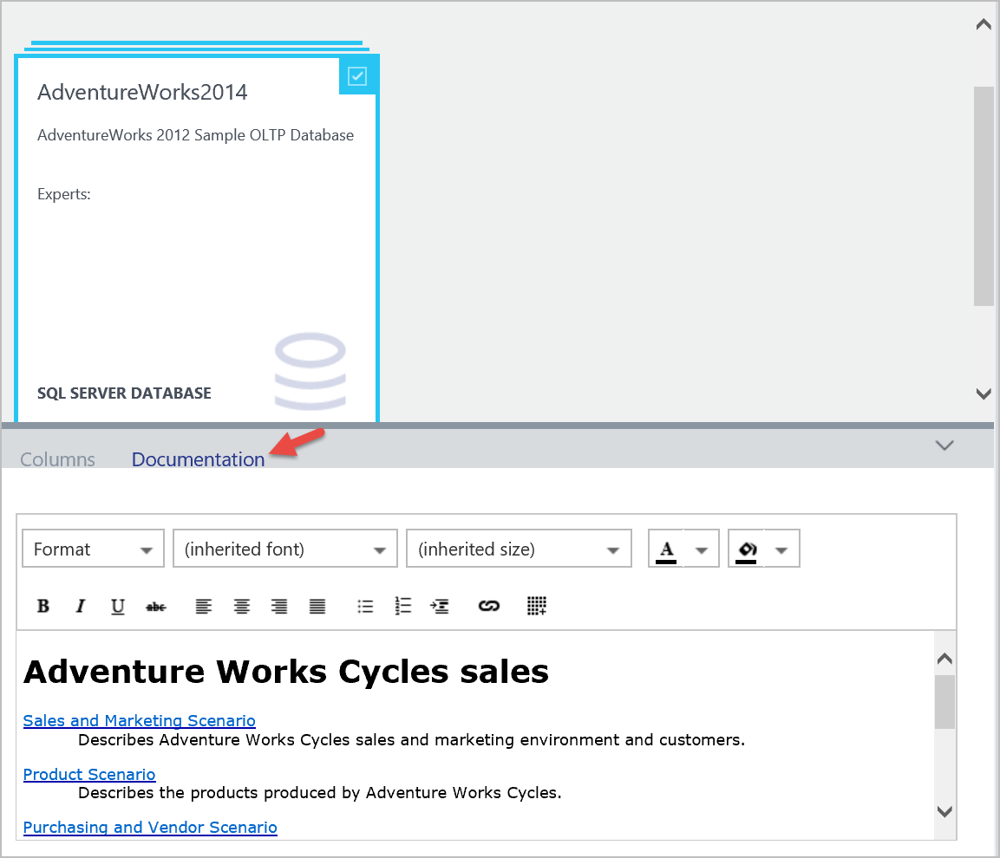
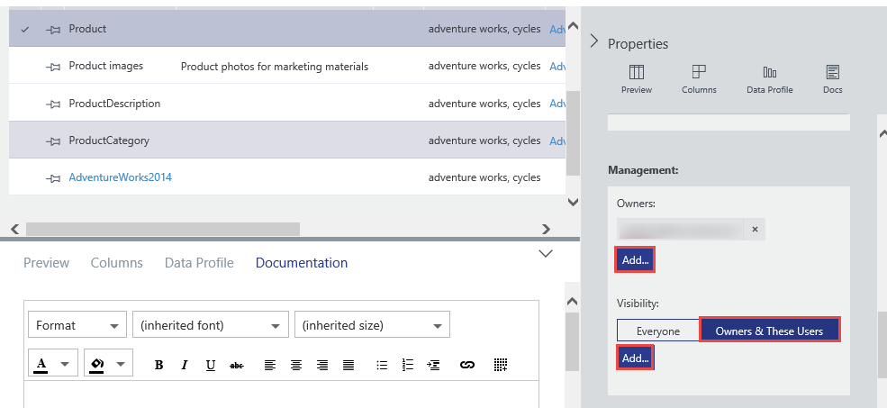
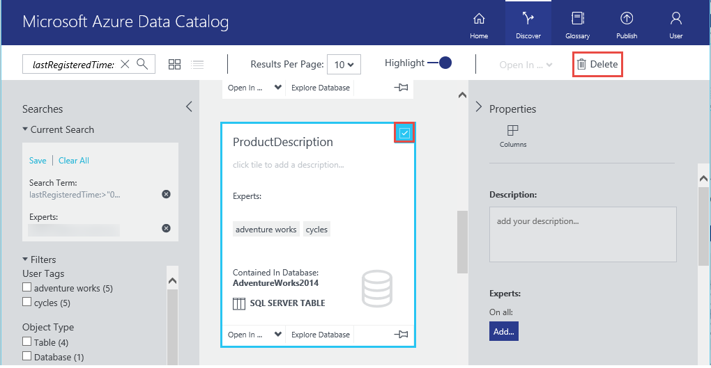
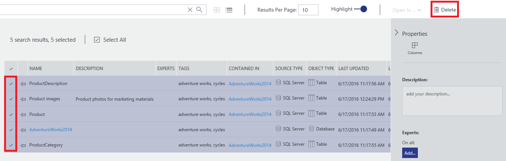

<properties
    pageTitle="Introdução ao catálogo de dados | Microsoft Azure"
    description="Tutorial de ponta a ponta apresentando os cenários e recursos de catálogo de dados do Azure."
    documentationCenter=""
    services="data-catalog"
    authors="steelanddata"
    manager="jhubbard"
    editor=""
    tags=""/>
<tags
    ms.service="data-catalog"
    ms.devlang="NA"
    ms.topic="get-started-article"
    ms.tgt_pltfrm="NA"
    ms.workload="data-catalog"
    ms.date="09/20/2016"
    ms.author="spelluru"/>

# Introdução ao catálogo de dados do Azure
Catálogo de dados do Azure é um serviço de nuvem totalmente gerenciado que serve como um sistema de registro e sistema de descoberta de ativos de dados corporativos. Para obter uma visão detalhada, consulte [o que é o catálogo de dados do Azure](data-catalog-what-is-data-catalog.md).

Este tutorial ajuda você a começar a usar o catálogo de dados do Azure. Execute os seguintes procedimentos neste tutorial:

| Procedimento | Descrição |
| :--- | :---------- |
| [Catálogo de dados de provisionamento](#provision-data-catalog) | Neste procedimento, você provisionar ou configurar o catálogo de dados do Azure. Realizar esta etapa somente se o catálogo não tiver sido configurado antes. Você pode ter apenas um catálogo de dados por organização (domínio do Microsoft Azure Active Directory), mesmo que haja várias assinaturas associadas à sua conta do Azure. |
| [Registrar ativos de dados](#register-data-assets) | Neste procedimento, você pode registrar ativos de dados do banco de dados de amostra AdventureWorks2014 com o catálogo de dados. Registro é o processo de extração chave metadados estruturais, como nomes, tipos e locais da fonte de dados e copiando metadados para o catálogo. Fonte de dados e ativos de dados permanecem onde eles são, mas os metadados é usado pelo catálogo para torná-las mais facilmente descoberto e compreendido. |
| [Descubra ativos de dados](#discover-data-assets) | Neste procedimento, você pode usar o portal de catálogo de dados do Azure para descobrir ativos de dados que foram registrados na etapa anterior. Depois de uma fonte de dados tiver sido registrada com o catálogo de dados do Azure, seus metadados é indexado pelo serviço para que os usuários podem procurar facilmente os dados necessários. |
| [Anotar ativos de dados](#annotate-data-assets) | Neste procedimento, você pode fornecer anotações (informações como descrições, marcas, documentação ou especialistas) para os ativos de dados. Essas informações complementam os metadados extraídos da fonte de dados e fazer com que a fonte de dados mais compreendido para mais pessoas. |
| [Conectar a ativos de dados](#connect-to-data-assets) | Neste procedimento, você pode abrir ativos de dados nas ferramentas de cliente integrado (como o Excel e ferramentas de dados do SQL Server) e uma ferramenta não integrada (SQL Server Management Studio). |
| [Gerenciar ativos de dados](#manage-data-assets) | Neste procedimento, você configurar segurança para seus ativos de dados. Catálogo de dados não dar aos usuários acesso aos dados em si. O proprietário da fonte de dados controla o acesso a dados.    Com o catálogo de dados, você pode descobrir fontes de dados e exibir os **metadados** relacionados às fontes registradas no catálogo. Pode haver situações, no entanto, onde a fontes de dados devem estar visíveis somente para usuários específicos ou para membros de grupos específicos. Para esses cenários, você pode usar o catálogo de dados para obter a propriedade de ativos de dados registrados dentro do catálogo e controlar a visibilidade dos ativos que pertence a você. |
| [Remover ativos de dados](#remove-data-assets) | Neste procedimento, você saiba como remover ativos de dados do catálogo de dados. |  

## Pré-requisitos de tutoriais

### Assinatura do Azure
Para configurar o catálogo de dados do Azure, você deve ser o proprietário ou coproprietário de uma assinatura do Azure.

Assinaturas do Azure ajudam você a organizar o acesso aos recursos de serviço de nuvem como o catálogo de dados do Azure. Eles também ajuda você controlar como o uso do recurso for relatado, cobrado e paga. Cada assinatura pode ter uma configuração de pagamento e cobrança diferentes, para que você possa ter diferentes assinaturas e diferentes planos por departamento, project, escritório regional e assim por diante. Cada serviço de nuvem pertence a uma assinatura, e você precisa ter uma assinatura antes de configurar o catálogo de dados do Azure. Para saber mais, consulte [Gerenciar contas, assinaturas e funções administrativas](../active-directory/active-directory-how-subscriptions-associated-directory.md).

Se você não tiver uma assinatura, você pode criar uma conta de avaliação gratuita em apenas alguns minutos. Consulte [Avaliação gratuita](https://azure.microsoft.com/pricing/free-trial/) para obter detalhes.

### Active Directory do Azure
Para configurar o catálogo de dados do Azure, você deve estar conectado com uma conta de usuário do Azure Active Directory (AD Azure). Você deve ser o proprietário ou coproprietário de uma assinatura do Azure.  

Azure AD fornece uma maneira fácil de sua empresa gerenciar identidades e acesso, tanto na nuvem e locais. Você pode usar uma única conta corporativa ou escolar para entrar em qualquer aplicativo web nuvem ou local. Catálogo de dados do Azure usa Azure AD para autenticar entrar. Para saber mais, consulte [o que é o Active Directory do Azure](../active-directory/active-directory-whatis.md).

### Configuração de política do Azure Active Directory

Você pode encontrar uma situação onde você pode entrar no portal do catálogo de dados do Azure, mas quando você tenta entrar para a ferramenta de registro de fonte de dados, você encontrar uma mensagem de erro que impede que você entrar. Este erro pode ocorrer quando você estiver na rede da empresa ou quando você estiver se conectando de fora da rede da empresa.

A ferramenta de registro usa *autenticação de formulários* para validar Inscrições de usuário no Active Directory do Azure. Para entrar com êxito, um administrador do Active Directory do Azure deve habilitar a autenticação de formulários na *política de autenticação global*.

Com a política de autenticação global, você pode habilitar a autenticação separadamente para intranet e extranet conexões, conforme mostrado na imagem a seguir. Erros de entrada podem ocorrer se a autenticação de formulários não está habilitada para a rede do qual você está se conectando.

 

Para obter mais informações, consulte [Configurando políticas de autenticação](https://technet.microsoft.com/library/dn486781.aspx).

## Catálogo de dados de provisionamento
Você pode provisionar apenas um catálogo de dados por organização (domínio do Active Directory do Azure). Portanto, se o proprietário ou coproprietário de uma assinatura do Azure que pertence a esse domínio do Active Directory do Azure já tiver criado um catálogo, você não poderá criar um catálogo novamente, mesmo se você tiver várias assinaturas Azure. Para testar se um catálogo de dados foi criado por um usuário no seu domínio do Active Directory do Azure, vá para a [home page do catálogo de dados do Azure](http://azuredatacatalog.com) e verifique se você vir o catálogo. Se um catálogo já tiver sido criado por você, ignore o procedimento a seguir e vá para a próxima seção.    

1. Vá para a [página de serviço de catálogo de dados](https://azure.microsoft.com/services/data-catalog) e clique em **começar**.

    
2. Entrar com uma conta de usuário que é o proprietário ou coproprietário de uma assinatura do Azure. Consulte a seguinte página depois de entrar.

    
3. Especifique um **nome** para o catálogo de dados, a **assinatura** que você deseja usar e o **local** para o catálogo.
4. Expanda **preços** e selecione um catálogo de dados do Azure **edition** (livre ou padrão).
    
5. Expanda o **Catálogo de usuários** e clique em **Adicionar** para adicionar usuários para o catálogo de dados. Você é automaticamente adicionados a esse grupo.
    
6. Expanda **Administradores de catálogo** e clique em **Adicionar** para adicionar outros administradores para o catálogo de dados. Você é automaticamente adicionados a esse grupo.
    
7. Clique em **Criar catálogo** para criar o catálogo de dados para sua organização. Você vê a home page de catálogo de dados após sua criação.
        

### Encontrar um catálogo de dados no portal do Azure
1. Em uma guia separada no navegador da web ou em uma janela de navegador da web separado, vá para o [portal do Azure](https://portal.azure.com) e entre com a mesma conta que você usou para criar o catálogo de dados na etapa anterior.
2. Selecione **Procurar** e clique em **Catálogo de dados**.

     você vir o catálogo de dados que você criou.

    
4.  Clique no catálogo que você criou. Você vê a lâmina de **Catálogo de dados** no portal.

    
5. Você pode exibir propriedades de catálogo de dados e atualizá-los. Por exemplo, clique em **nível de preços** e alterar a edição.

    

### Banco de dados de exemplo do Adventure Works
Neste tutorial, você registra ativos de dados (tabelas) do banco de dados de exemplo AdventureWorks2014 para o mecanismo de banco de dados do SQL Server, mas você pode usar qualquer fonte de dados com suporte se você preferir trabalhar com dados familiar e relevantes para sua função. Para obter uma lista de fontes de dados com suporte, consulte [fontes de dados com suporte](data-catalog-dsr.md).

### Instalar o banco de dados OLTP de 2014 do Adventure Works
O banco de dados do Adventure Works oferece suporte a cenários de processamento de transações onlinehttps padrão para um fabricante de bicicletas fictício (Adventure Works ciclos), que inclui produtos, vendas e compras. Neste tutorial, você registrar informações sobre produtos para o catálogo de dados do Azure.

Para instalar o banco de dados de exemplo Adventure Works:

1. Baixe a [Adventure Works 2014 completo banco de dados Backup.zip](https://msftdbprodsamples.codeplex.com/downloads/get/880661) no CodePlex.
2. Para restaurar o banco de dados em sua máquina, siga as instruções em [restaurar um Backup do banco de dados usando o SQL Server Management Studio](http://msdn.microsoft.com/library/ms177429.aspx)ou seguindo estas etapas:
    1. Abra o SQL Server Management Studio e conectar ao mecanismo de banco de dados do SQL Server.
    2. Clique com botão direito **bancos de dados** e clique em **Restaurar banco de dados**.
    3. Em **Restaurar banco de dados**, clique na opção de **dispositivo** de **origem** e clique em **Procurar**.
    4. Em **Selecione dispositivos de backup**, clique em **Adicionar**.
    5. Vá para a pasta onde você tenha o arquivo **AdventureWorks2014.bak** , selecione o arquivo e clique **Okey** para fechar a caixa de diálogo **Localizar o arquivo de Backup** .
    6. Clique em **Okey** para fechar a caixa de diálogo **Selecione dispositivos de backup** .    
    7. Clique em **Okey** para fechar a caixa de diálogo **Restaurar banco de dados** .

Agora você pode registrar ativos de dados do banco de dados de exemplo Adventure Works usando o catálogo de dados do Azure.

## Registrar ativos de dados

Neste exercício, você pode usar a ferramenta de registro para registrar ativos de dados do banco de dados Adventure Works com o catálogo. Registro é o processo de extraindo chave metadados estruturais, como nomes, tipos e locais de fonte de dados e os ativos que ela contém e copiando metadados para o catálogo. Fonte de dados e ativos de dados permanecem onde eles são, mas os metadados é usado pelo catálogo para torná-las mais facilmente descoberto e compreendido.

### Registrar uma fonte de dados

1.  Vá para a [home page do catálogo de dados do Azure](https://azuredatacatalog.com) e clique em **Publicar dados**.

    

2.  Clique em **Iniciar aplicativo** para baixar, instalar e executar a ferramenta de registro em seu computador.

    

3. Na página de **boas-vindas** , clique em **entrar** e insira suas credenciais.    

    

4. Na página de **Catálogo de dados do Microsoft Azure** , clique em **SQL Server** e **Avançar**.

    

5.  Insira as propriedades de conexão do SQL Server para **AdventureWorks2014** (consulte o exemplo a seguir) e clique em **Conectar**.

    

6.  Registre os metadados dos seus ativos de dados. Neste exemplo, você registrar objetos de **Produção/produto** do namespace AdventureWorks produção:

    1. Na árvore de **Hierarquia de servidor** , expanda **AdventureWorks2014** e clique em **produção**.
    2. Selecione o **produto**, **ProductCategory**, **ProductDescription**e **ProductPhoto** usando Ctrl + clique.
    3. Clique em **Mover seta selecionado** (**>**). Essa ação move todos os objetos selecionados para a lista de **objetos sejam registrados** .

        
    4. Selecione **incluir uma visualização** para incluir uma visualização de instantâneo dos dados. O instantâneo inclui até 20 registros de cada tabela, e ele é copiado para o catálogo.
    5. Selecione **Incluir perfil de dados** para incluir um instantâneo das estatísticas de objeto para o perfil de dados (por exemplo: valores mínimos, médio e máximos para uma coluna, o número de linhas).
    6. No campo **Adicionar marcas** , insira **da adventure works, ciclos**. Essa ação adiciona marcas de pesquisa para esses ativos de dados. Marcas são uma ótima maneira de ajudar os usuários a localizar uma fonte de dados registrados.
    7. Especifique o nome de um **especialista** em dados (opcionais).

        

    8. Clique em **registrar**. Catálogo de dados do Azure registra seus objetos selecionados. Neste exercício, os objetos selecionados da Adventure Works são registrados. A ferramenta de registro extrai metadados de ativo dados e copia esses dados para o serviço de catálogo de dados do Azure. Os dados permanecem onde ele reside no momento, e ele permaneça sob o controle dos administradores e políticas do sistema atual.

        

    9. Para ver seus objetos de fonte de dados registrados, clique em **Exibir Portal**. No portal do catálogo de dados do Azure, confirme que você ver todos os quatro tabelas e o banco de dados no modo de exibição de grade.

        

Neste exercício, você registrou objetos de banco de dados de exemplo Adventure Works para que eles podem ser facilmente descobertos pelos usuários em toda a organização. No próximo exercício, você aprenderá a descobrir ativos de dados registrados.

## Descubra ativos de dados
Descoberta no catálogo de dados do Azure usa dois mecanismos primários: pesquisa e filtragem.

Pesquisando destina-se para ser intuitiva e eficiente. Por padrão, os termos de pesquisa são comparados com qualquer propriedade no catálogo, incluindo anotações fornecido pelo usuário.

Filtragem foi projetada para complementar pesquisando. Você pode selecionar características específicas como especialistas, tipo de fonte de dados, tipo de objeto e marcas para exibir ativos de dados correspondente e para restringir os resultados da pesquisa para correspondência ativos.

Usando uma combinação de pesquisa e filtragem, você pode navegar rapidamente as fontes de dados que foram registradas com o catálogo de dados do Azure para descobrir os ativos de dados que você precisa.

Neste exercício, você pode usar o portal de catálogo de dados do Azure para descobrir ativos de dados registrados no exercício anterior. Consulte a [referência de sintaxe de pesquisa de catálogo de dados](https://msdn.microsoft.com/library/azure/mt267594.aspx) para obter detalhes sobre a sintaxe de pesquisa.

A seguir estão alguns exemplos para descobrir ativos de dados do catálogo.  

### Descubra ativos de dados com pesquisa básica
Pesquisa básica ajuda você a pesquisar um catálogo usando um ou mais termos de pesquisa. Os resultados são qualquer ativos que correspondem em qualquer propriedade com um ou mais destes termos especificados.

1. Clique em **página inicial** no portal do catálogo de dados do Azure. Se você tiver fechado o navegador da web, vá para a [home page do catálogo de dados do Azure](https://www.azuredatacatalog.com).
2. Na caixa de pesquisa, digite `cycles` e pressione **ENTER**.

    
3. Confirme que você ver todos os quatro tabelas e o banco de dados (AdventureWorks2014) nos resultados. Você pode alternar entre o **modo de exibição de grade** e o **modo de exibição de lista** , clicando em botões na barra de ferramentas, conforme mostrado na imagem a seguir. Observe que a palavra-chave de pesquisa é realçada nos resultados da pesquisa porque a opção **Realçar** está **ativada**. Você também pode especificar o número de **resultados por página** nos resultados da pesquisa.

    

    O painel de **pesquisas** está à esquerda e o painel de **Propriedades** está à direita. No painel de **pesquisas** , você pode alterar critérios de pesquisa e filtrar os resultados. O painel de **Propriedades** exibe as propriedades de um objeto selecionado na grade ou na lista.

4. Clique em **produto** nos resultados da pesquisa. Clique na **visualização**, **colunas**, **Perfil de dados**e **documentação** guias ou clique na seta para expandir o painel inferior.  

    

    Na guia **Visualizar** , você visualizar os dados na tabela **Product** .  
5. Clique na guia **colunas** para localizar detalhes sobre colunas (como **nome** e **tipo de dados**) nos ativos de dados.
6. Clique na guia de **Perfil de dados** para ver a criação de perfil de dados (por exemplo: número de linhas, o tamanho dos dados ou valor mínimo em uma coluna) nos ativos de dados.
7. Filtre os resultados usando **filtros** à esquerda. Por exemplo, clique em **tabela** para **Tipo de objeto**, e você verá somente as quatro tabelas, não o banco de dados.

    

### Descubra ativos de dados com escopo de propriedade
Propriedade escopo ajuda você a descobrir ativos de dados onde o termo de pesquisa é correspondido com a propriedade especificada.

1. Limpe o filtro de **tabela** em **Tipo de objeto** em **filtros**.  
2. Na caixa de pesquisa, digite `tags:cycles` e pressione **ENTER**. Consulte a [referência de sintaxe de pesquisa de catálogo de dados](https://msdn.microsoft.com/library/azure/mt267594.aspx) para todas as propriedades que você pode usar para pesquisar o catálogo de dados.
3. Confirme que você ver todos os quatro tabelas e o banco de dados (AdventureWorks2014) nos resultados.  

    

### Salvar a pesquisa
1. No painel de **pesquisas** na seção **Pesquisa atual** , insira um nome para a pesquisa e clique em **Salvar**.

    
2. Confirme que a pesquisa salva aparece em **Pesquisas salvas**.

    
3. Selecione uma das ações que você pode realizar em pesquisa salva (**Renomear**, **Excluir**, **Salvar como padrão** pesquisa).

    

### Operadores booleanos
Você pode ampliar ou restringir sua pesquisa com operadores booleanos.

1. Na caixa de pesquisa, digite `tags:cycles AND objectType:table`, e pressione **ENTER**.
2. Confirme que você vê somente tabelas (não o banco de dados) nos resultados.  

    

### Agrupamento entre parênteses
Agrupando com parênteses, você pode agrupar partes da consulta para alcançar o isolamento lógico, especialmente juntamente com operadores booleanos.

1. Na caixa de pesquisa, digite `name:product AND (tags:cycles AND objectType:table)` e pressione **ENTER**.
2. Confirme que você veja apenas a tabela **produto** nos resultados da pesquisa.

       

### Operadores de comparação
Com operadores de comparação, você pode usar comparações diferente de igualdade para propriedades que têm tipos de dados de data e numéricos.

1. Na caixa de pesquisa, digite `lastRegisteredTime:>"06/09/2016"`.
2. Limpe o filtro de **tabela** em **Tipo de objeto**.
3. Pressione **ENTER**.
4. Confirme que você vê as tabelas de **produto**, **ProductCategory**, **ProductDescription**e **ProductPhoto** e o banco de dados AdventureWorks2014 registrados nos resultados da pesquisa.

    

Veja [como descobrir ativos de dados](data-catalog-how-to-discover.md) para obter informações detalhadas sobre descobrindo ativos de dados e a [referência de sintaxe de pesquisa de catálogo de dados](https://msdn.microsoft.com/library/azure/mt267594.aspx) para sintaxe de pesquisa.

## Anotar ativos de dados
Neste exercício, você usa o portal do catálogo de dados do Azure para anotar (Adicionar informações como descrições, marcas ou especialistas) você que já se inscreveram no catálogo de ativos de dados. As anotações complementam e aprimorar os metadados estruturais extraídos da fonte de dados durante o registro e faz com que os ativos de dados muito mais fácil descobrir e entender.

Neste exercício, você anotar um ativo de dados único (ProductPhoto). Adicione um nome amigável e uma descrição para o ProductPhoto dados ativos.  

1.  Vá para a [home page do catálogo de dados do Azure](https://www.azuredatacatalog.com) e pesquise com `tags:cycles` para encontrar os ativos de dados que você registrou.  
2. Clique em **ProductPhoto** nos resultados da pesquisa.  
3. Inserir **imagens do produto** para **Nome amigável** e **fotos de produto para materiais de marketing** para a **Descrição**.

    

    A **Descrição** ajudam a outras pessoas descobrir e entender o porquê e como usar os ativos de dados selecionado. Você também pode adicionar mais marcas e exibir colunas. Agora você pode tentar pesquisa e filtragem para descobrir ativos de dados usando os metadados descritivo que você adicionou ao catálogo.

Você também pode fazer o seguinte nesta página:

- Adicione especialistas do ativo de dados. Clique em **Adicionar** na área de **especialistas** .
- Adicione marcas no nível do conjunto de dados. Clique em **Adicionar** na área de **marcas** . Uma marca pode ser uma marca de usuário ou uma marca de glossário. Standard Edition do catálogo de dados inclui um glossário de negócios que ajuda a administradores de catálogo definir uma taxonomia de negócios central. Usuários de catálogo, em seguida, podem anotar ativos de dados com termos do glossário. Para obter mais informações, consulte [como configurar o Glossário de negócios para regulamentadas marcação](data-catalog-how-to-business-glossary.md)
- Adicione marcas no nível da coluna. Clique em **Adicionar** em **marcas** para a coluna que você deseja anotar.
- Adicione descrição do nível de coluna. Insira a **Descrição** de uma coluna. Você também pode exibir os metadados de descrição extraídos da fonte de dados.
- Adicione informações de **solicitação de acesso** que mostra aos usuários como solicitar acesso ao ativo dados.

    

- Escolha a guia **documentação** e fornecer documentação para o ativo de dados. Com documentação do catálogo de dados do Azure, você pode usar o catálogo de dados como um repositório de conteúdo para criar uma narrativa completa de seus ativos de dados.

    

Você também pode adicionar uma anotação para vários ativos de dados. Por exemplo, você pode selecionar todos os ativos de dados que você registrou e especificar um especialista para eles.

Catálogo de dados do Azure é compatível com uma abordagem de compras demais para anotações. Qualquer usuário do catálogo de dados pode adicionar descrições de (usuário ou Glossário), marcas e outros metadados, para que qualquer usuário com uma perspectiva sobre um ativo de dados e seu uso pode ter essa perspectiva capturada e disponível para outros usuários.

Veja [como anotar ativos de dados](data-catalog-how-to-annotate.md) para obter informações detalhadas sobre a anotação em ativos de dados.

## Conectar a ativos de dados
Neste exercício, você pode abrir ativos de dados em uma ferramenta de cliente integrado (Excel) e uma ferramenta não integrada (SQL Server Management Studio) usando as informações de conexão.

> [AZURE.NOTE] É importante lembrar que o catálogo de dados do Azure não fornecem acesso à fonte de dados reais — simplesmente facilita a descobrir e compreendê-lo. Quando você se conectar à fonte de dados, o aplicativo de cliente que você escolher usa suas credenciais do Windows ou solicita credenciais conforme necessário. Se você não anteriormente foram concedidas acesso à fonte de dados, você precisa ter acesso antes que você possa se conectar.

### Conectar a um ativo de dados no Excel

1. Selecione o **produto** dos resultados da pesquisa. Clique em **Abrir** na barra de ferramentas e clique em **Excel**.

    
2. Clique em **Abrir** na janela pop-up de download. Esta conexão pode variar dependendo do navegador.

    
3. Na janela **Aviso de segurança do Microsoft Excel** , clique em **Ativar**.

    
4. Mantenha os padrões na caixa de diálogo **Importar dados** e clique em **Okey**.

    
5. Exiba a origem de dados no Excel.

    

Neste exercício, você conectado à ativos de dados descobertos usando catálogo de dados do Azure. Com o portal de catálogo de dados do Azure, você pode conectar diretamente, usando os aplicativos cliente integrados ao menu **Abrir no** . Você também pode se conectar com qualquer aplicativo que você escolher usando as informações de local de conexão incluídas nos metadados ativo. Por exemplo, você pode usar o SQL Server Management Studio para se conectar ao banco de dados AdventureWorks2014 para acessar os dados de ativos de dados registrados neste tutorial.

1. Abra o **SQL Server Management Studio**.
2. Na caixa de diálogo **conectar ao servidor** , digite o nome do servidor no painel de **Propriedades** do portal do catálogo de dados do Azure.
3. Use autenticação adequado e credenciais para acessar o ativo de dados. Se você não tiver acesso, use informações no campo **Solicitar acesso** para colocá-lo.

    

Clique em **Cadeias de caracteres de Conexão de modo de exibição** para exibir e copiar ADF.NET, ODBC e OLEDB cadeias de caracteres de conexão para a área de transferência para uso em seu aplicativo.

## Gerenciar ativos de dados
Nesta etapa, você verá como configurar segurança para seus ativos de dados. Catálogo de dados não dar aos usuários acesso aos dados em si. O proprietário da fonte de dados controla o acesso a dados.

Você pode usar o catálogo de dados para descobrir fontes de dados e exibir os metadados relacionados às fontes registradas no catálogo. Pode haver situações, no entanto, onde fontes de dados somente devem estar visíveis para usuários específicos ou membros de grupos específicos. Para esses cenários, você pode usar o catálogo de dados para obter a propriedade de ativos de dados registrados no catálogo do e para o controle, em seguida, a visibilidade dos ativos pertence a você.

> [AZURE.NOTE] Os recursos de gerenciamento descritos neste exercício estão disponíveis apenas no Standard Edition do Azure catálogo de dados, não na edição gratuito.
No catálogo de dados do Azure, você pode obter a propriedade de ativos de dados, adicionar colegas proprietários para ativos de dados e definir a visibilidade de ativos de dados.

### Obter a propriedade de ativos de dados e restringir a visibilidade

1. Vá para a [home page do catálogo de dados do Azure](https://www.azuredatacatalog.com). Na caixa de texto **Pesquisar** , digite `tags:cycles` e pressione **ENTER**.
2. Clique em um item na lista de resultados e clique em **Levar posse** na barra de ferramentas.
3. Na seção **gerenciamento** do painel de **Propriedades** , clique em **Apropriar**.

    
4. Para restringir a visibilidade, escolha **esses usuários e proprietários** na seção **visibilidade** e clique em **Adicionar**. Insira os endereços de email de usuário na caixa de texto e pressione **ENTER**.

    

## Remover ativos de dados

Neste exercício, você pode usar o portal de catálogo de dados do Azure para remover a visualização de dados de ativos de dados registrados e excluir ativos de dados do catálogo.

No catálogo de dados do Azure, você pode excluir um ativo individual ou excluir vários ativos.

1. Vá para a [home page do catálogo de dados do Azure](https://www.azuredatacatalog.com).
2. Na caixa de texto **Pesquisar** , digite `tags:cycles` e clique em **ENTER**.
3. Selecione um item na lista de resultados e clique em **Excluir** na barra de ferramentas conforme mostrado na imagem a seguir:

    

    Se você estiver usando o modo de exibição de lista, a caixa de seleção está à esquerda do item conforme mostrado na imagem a seguir:

    

    Você também pode selecionar vários ativos de dados e excluí-los, conforme mostrado na imagem a seguir:

    

> [AZURE.NOTE] O comportamento padrão do catálogo é permitir que qualquer usuário para registrar qualquer fonte de dados e para permitir que qualquer usuário excluir qualquer ativo de dados que tenha sido registrado. Os recursos de gerenciamento incluídos no Standard Edition do Azure catálogo de dados fornecem opções adicionais para tomar a propriedade de ativos, restringir quem pode descobrir ativos, e restringir quem pode excluir ativos.

## Resumo

Neste tutorial, você explorados recursos essenciais do catálogo de dados do Azure, incluindo o registro, fazendo anotações, descobrindo e gerenciar ativos de dados corporativos. Agora que você concluiu o tutorial, é hora para começar. Você pode começar hoje Registrando as fontes de dados que você e sua equipe dependem e por colegas convidando para usar o catálogo.

## Referências

- [Como registrar ativos de dados](data-catalog-how-to-register.md)
- [Como descobrir ativos de dados](data-catalog-how-to-discover.md)
- [Como anotar ativos de dados](data-catalog-how-to-annotate.md)
- [Como ativos de dados de documento](data-catalog-how-to-documentation.md)
- [Como se conectar a ativos de dados](data-catalog-how-to-connect.md)
- [Como gerenciar ativos de dados](data-catalog-how-to-manage.md)
