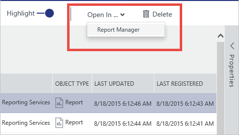

<properties
   pageTitle="Como se conectar a fontes de dados | Microsoft Azure"
   description="Artigo de instruções realce como se conectar a fontes de dados descobertos com o catálogo de dados do Azure."
   services="data-catalog"
   documentationCenter=""
   authors="steelanddata"
   manager="NA"
   editor=""
   tags=""/>
<tags
   ms.service="data-catalog"
   ms.devlang="NA"
   ms.topic="article"
   ms.tgt_pltfrm="NA"
   ms.workload="data-catalog"
   ms.date="09/15/2016"
   ms.author="maroche"/>

# Como se conectar a fontes de dados

## Introdução
**Catálogo de dados do Microsoft Azure** é um serviço de nuvem totalmente gerenciado que serve como um sistema de registro e sistema de descoberta para fontes de dados corporativos. Em outras palavras, **Catálogo de dados do Azure** trata ajudar as pessoas a descobrir, entender e usar fontes de dados e ajudar as empresas para obter mais valor de seus dados existentes. Um aspecto fundamental desse cenário é usando os dados – depois que um usuário descobre uma fonte de dados e entenda sua finalidade, a próxima etapa é para se conectar à fonte de dados para colocar seus dados em uso.

## Locais de fonte de dados
Durante o registro de fonte de dados, o **Catálogo de dados do Azure** recebe metadados sobre a fonte de dados. Esses metadados incluem os detalhes do local da fonte de dados. Os detalhes do local varia de fonte de dados à fonte de dados, mas ele sempre conterá as informações necessárias para se conectar. Por exemplo, o local para uma tabela do SQL Server inclui o nome do servidor, nome do banco de dados, nome do esquema e nome da tabela, enquanto o local de um relatório do SQL Server Reporting Services inclui o nome do servidor e o caminho para o relatório. Outros tipos de fonte de dados terá locais que reflitam a estrutura e os recursos do sistema de origem.

## Ferramentas de cliente integrado
A maneira mais simples para se conectar a uma fonte de dados é usar o "aberto no..." menu no portal do **Catálogo de dados do Azure** . Esse menu exibe uma lista das opções de conexão com os ativos de dados selecionado.
Ao usar o modo de exibição de bloco de padrão, esse menu está disponível no cada bloco.

 

Ao usar o modo de exibição de lista, no menu está disponível na barra de pesquisa na parte superior da janela do portal.

 

## Aplicativos cliente com suporte
Ao usar o "aberto no..." menu para fontes de dados no portal do catálogo de dados do Azure, o aplicativo cliente correto deve ser instalado no computador cliente.

| Abrir no aplicativo | Extensão de arquivo / protocolo | Versões com suporte do aplicativo |
| --- | --- | --- |
| Excel | . odc | Excel 2010 ou posterior |
| Excel (superior 1000) | . odc | Excel 2010 ou posterior |
| Power Query | . xlsx | Excel 2016 ou o Excel 2010 ou o Excel 2013 com o Power Query para suplementos do Excel instalado
| Área de trabalho do Power BI | .pbix | Power BI Desktop julho 2016 ou posterior |
| Ferramentas de dados do SQL Server | vsweb: / / | Atualização do Visual Studio 2013 4 ou posterior com ferramentas do SQL Server instalada |
| Gerenciador de relatórios | http:// | Consulte [requisitos de navegador para o SQL Server Reporting Services](https://technet.microsoft.com/en-us/library/ms156511.aspx) |

## Seus dados, suas ferramentas
As opções disponíveis no menu dependerá do tipo de dados ativos atualmente selecionado. Claro, não todas as ferramentas possíveis serão incluídas na "aberto no..." menu, mas ele ainda estiver fácil para se conectar à fonte de dados usando qualquer ferramenta de cliente. Quando um ativo de dados é selecionado no portal do **Catálogo de dados do Azure** , a localização completa é exibida no painel Propriedades.

 

Os detalhes de informações de conexão serão diferentes de tipo de fonte de dados para o tipo de fonte de dados, mas as informações incluídas no portal você terá tudo o que você precisa se conectar à fonte de dados em qualquer ferramenta de cliente. Os usuários podem copiar os detalhes de conexão para fontes de dados que eles descobriram usando o **Catálogo de dados do Azure**, permitindo que eles trabalhar com os dados em sua ferramenta de escolha.

## Permissões de fonte de dados e conectando-se
Embora o **Catálogo de dados do Azure** faz a fontes de dados detectáveis, acesso aos dados em si permanece sob o controle do proprietário da fonte de dados ou do administrador. Descobrir uma fonte de dados no **Catálogo de dados do Azure** não dá um usuário todas as permissões para acessar a fonte de dados em si.

Para tornar mais fácil para os usuários que Descubra uma fonte de dados, mas não tem permissão para acessar seus dados, os usuários podem fornecer informações na propriedade solicitar acesso ao anotar uma fonte de dados. Informações fornecidas aqui – incluindo links ao processo ou ponto de contato para obter acesso de fonte de dados – são apresentadas junto com as informações de local de fonte de dados no portal.

 

##Resumo
Registrar uma fonte de dados com o **Catálogo de dados do Azure** garante que os dados detectáveis copiando metadados estruturais e descritivo da fonte de dados para o serviço de catálogo. Depois que uma fonte de dados tiver sido registrada e descoberta, usuários podem se conectar à fonte de dados a partir do portal de **Catálogo de dados do Azure** "aberto no..." " menu ou usando suas ferramentas de dados de escolha.

## Consulte também
- Tutorial de [Introdução ao catálogo de dados do Azure](data-catalog-get-started.md) para obter detalhes passo a passo sobre como se conectar a fontes de dados.
