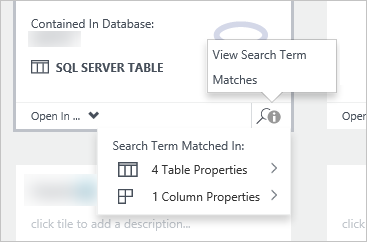

<properties
   pageTitle="Como descobrir fontes de dados | Microsoft Azure"
   description="Artigo de instruções realce como descobrir ativos de dados registrados com o catálogo de dados do Azure, incluindo pesquisando e filtragem e usando o impacto realce recursos do portal do catálogo de dados do Azure."
   services="data-catalog"
   documentationCenter=""
   authors="steelanddata"
   manager="NA"
   editor=""
   tags=""/>
<tags
   ms.service="data-catalog"
   ms.devlang="NA"
   ms.topic="article"
   ms.tgt_pltfrm="NA"
   ms.workload="data-catalog"
   ms.date="10/04/2016"
   ms.author="maroche"/>

# Como descobrir fontes de dados

## Introdução
**Catálogo de dados do Microsoft Azure** é um serviço de nuvem totalmente gerenciado que serve como um sistema de registro e sistema de descoberta para fontes de dados corporativos. Em outras palavras, **Catálogo de dados do Azure** trata ajudar as pessoas a descobrir, entender e usar fontes de dados e ajudar as empresas para obter mais valor de seus dados existentes. Depois que uma fonte de dados tiver sido registrada com o **Catálogo de dados do Azure**, seus metadados é indexado pelo serviço, para que os usuários possam pesquisar facilmente para descobrir os dados necessários.

## Pesquisa e filtragem

Descoberta no **Catálogo de dados do Azure** usa dois mecanismos primários: pesquisa e filtragem.

Pesquisando foi projetado para ser intuitiva e poderosa – por padrão, os termos de pesquisa são comparados com qualquer propriedade no catálogo, incluindo anotações fornecido pelo usuário.

Filtragem foi projetada para complementar pesquisando. Os usuários podem selecionar características específicas como especialistas, tipo de fonte de dados, tipo de objeto e marcas, para exibir apenas ativos de dados correspondente e para restringir os resultados da pesquisa para correspondência ativos também.

Usando uma combinação de pesquisa e filtragem, os usuários podem navegar rapidamente as fontes de dados que foram registradas com o **Catálogo de dados do Azure** para descobrir fontes de dados que precisam.

## Sintaxe de pesquisa

Embora a pesquisa de texto livre padrão é simples e intuitiva, os usuários também podem usar sintaxe de pesquisa de **Catálogo de dados do Azure**do ter mais controle sobre os resultados da pesquisa. Pesquisa de **Catálogo de dados do Azure** suporta as seguintes técnicas:

| Técnica                 | Usar                                                                                                                                     | Exemplo                                                   |
|---------------------------|-----------------------------------------------------------------------------------------------------------------------------------------|-----------------------------------------------------------|
| Pesquisa básica              | Pesquisa básica usando um ou mais termos de pesquisa. Os resultados são qualquer ativos que correspondem em qualquer propriedade com um ou mais destes termos especificados. | dados de vendas                                                |
| Escopo de propriedade          | Retornar somente fontes de dados onde o termo de pesquisa é correspondido com a propriedade especificada                                                   | nome: Finanças                                              |
| Operadores booleanos         | Ampliar ou restringir uma pesquisa usando as operações booleanas                                                                                     | Finanças não corporativo                                     |
| Agrupar com parêntese | Use parênteses para partes de grupo da consulta para alcançar o isolamento lógico, especialmente em conjunto com operadores booleanos              | nome: finanças e (marcas: T1 ou marcas: T2) |
| Operadores de comparação      | Use comparações diferente de igualdade para propriedades que têm tipos de dados de data e numéricos                                                | modifiedTime > "11/05/2014"                                 |

Para obter mais informações sobre pesquisa de **Catálogo de dados do Azure** , consulte [https://msdn.microsoft.com/library/azure/mt267594.aspx](https://msdn.microsoft.com/library/azure/mt267594.aspx).

## Realce de ocorrências
Ao exibir resultados de pesquisa, quaisquer propriedades exibidas que coincidem com os termos de pesquisa especificada – como o nome de ativos de dados, descrição e marcas – serão realçadas para facilitar a identificar por que um determinado dados ativos foi retornado por uma determinada pesquisa.

> [AZURE.NOTE] Os usuários podem ativar visitas realce desativar se desejar, usando a opção "Realce" no portal do **Catálogo de dados do Azure** .

Ao exibir resultados de pesquisa, não sempre pode ser óbvio por um ativo de dados é incluído, mesmo com realce de sucessos habilitado. Porque todas as propriedades são pesquisadas por padrão, um ativo de dados pode ser retornado devido a uma correspondência em uma propriedade de nível de coluna. E porque vários usuários podem anotar ativos de dados registrados com suas próprias marcas e descrições, nem todos os metadados podem ser exibido na lista de resultados da pesquisa.

No padrão exibição lado a lado, cada bloco exibido nos resultados da pesquisa incluirá um ícone de "corresponde ao termo de pesquisa de modo de exibição", que permite ao usuário para exibir rapidamente o número de correspondências e sua localização e acessá-los a se desejado.

 

## Resumo
Registrar uma fonte de dados com o **Catálogo de dados do Azure** facilita a descobrir e entender, copiando metadados estruturais e descritivo da fonte de dados para o serviço de catálogo de fonte de dados. Depois que uma fonte de dados tiver sido registrada, os usuários podem descobri-la usando a filtragem e pesquisa de dentro do portal de **Catálogo de dados do Azure** .

## Consulte também
- Tutorial de [Introdução ao catálogo de dados do Azure](data-catalog-get-started.md) para obter detalhes passo a passo sobre como descobrir fontes de dados.
