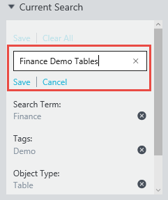
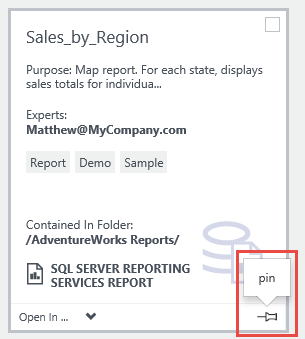
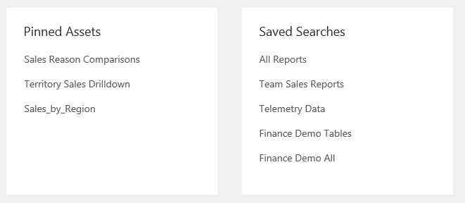

<properties
   pageTitle="Como salvar pesquisas e fixar ativos de dados | Microsoft Azure"
   description="Artigo de instruções realce recursos no catálogo de dados do Azure para salvar fontes de dados e ativos de dados para reutilização posterior."
   services="data-catalog"
   documentationCenter=""
   authors="steelanddata"
   manager="NA"
   editor=""
   tags=""/>
<tags
   ms.service="data-catalog"
   ms.devlang="NA"
   ms.topic="article"
   ms.tgt_pltfrm="NA"
   ms.workload="data-catalog"
   ms.date="10/10/2016"
   ms.author="maroche"/>

# Como salvar pesquisas e fixar ativos de dados

## Introdução

Catálogo de dados do Microsoft Azure oferece recursos de descoberta de fonte de dados. Os usuários podem pesquisar rapidamente e filtrar o catálogo para localizar fontes de dados e compreender sua finalidade, tornando mais fácil localizar os dados corretos para o trabalho em questão.

Mas e quanto quando os usuários precisam costuma trabalhar com os mesmos dados? E quando os usuários contribuem regularmente seus conhecimentos às mesmas fontes de dados no catálogo? Nessas situações, ter repetidamente emitir o mesmo procura pode ser ineficaz – é onde pesquisa salva e fixos dados ativos podem ajudar.

## Pesquisas salvas

Uma pesquisa salva no catálogo de dados do Azure é uma definição de pesquisa reutilizável, por usuário. Quando um usuário tenha definido uma pesquisa – incluindo termos de pesquisa, marcas e outros filtros – ele pode salvá-lo para uso posterior. A definição de pesquisa salva pode ser executada novamente em uma data posterior, para retornar qualquer ativos de dados que correspondem a seus critérios de pesquisa.

### Criar uma pesquisa salva

Para criar uma pesquisa salva, primeiro digite os critérios de pesquisa para reutilização. Clique no link "Salvar" na caixa de "Pesquisa atual" no portal do catálogo de dados do Azure.

 

Quando solicitado, digite um nome para a pesquisa salva. Selecione um nome que seja significativo e descritivo dos ativos de dados que serão retornados pela pesquisa.

 

### Gerenciando pesquisas salvas

Depois que um usuário tem uma ou mais pesquisas salvas, uma opção de "Pesquisas salvas" aparecerá no portal do catálogo de dados do Azure sob a caixa de "Pesquisa atual". Quando expandida, a lista completa de pesquisas salva será exibida.

 

Selecionar uma pesquisa salva na lista fará com que a pesquisa a ser executado.

Selecionando o menu suspenso fornecerá um conjunto de opções de gerenciamento:

 

Selecionar "Renomear" solicitará que o usuário insira um novo nome para a pesquisa salva. A definição de pesquisa não será alterada.

Selecionando "Excluir" solicitará a confirmação do usuário e, em seguida, removerá a pesquisa salva de lista do usuário.

Selecionar "Salvar como padrão" irá marcar escolhido pesquisa salvo como a pesquisa padrão para o usuário. Se o usuário executa uma pesquisa "vazia" na home page do catálogo de dados do Azure, pesquisa de padrão do usuário será executada. Além disso, a pesquisa marcados como padrão aparecerá na parte superior da lista de pesquisa salva.

### Pesquisas salvas organizacionais

Todos os usuários podem salvar pesquisas para seu próprio uso. Administradores de catálogo de dados também podem salvar pesquisas para todos os usuários dentro da organização. Ao salvar uma pesquisa, os administradores são apresentados com uma opção para compartilhar a pesquisa salva dentro da empresa. Se esta opção for selecionada, a pesquisa salva será incluída na lista de pesquisas disponíveis para todos os usuários.

 

## Ativos de dados fixados

Pesquisas salvas permitem aos usuários salvar e reutilizar as definições de pesquisa. os ativos de dados retornados pelas pesquisas podem mudar ao longo do tempo, como o conteúdo a alteração de catálogo. A fixação de ativos de dados permite aos usuários identificar explicitamente ativos de dados específicos para facilitar o acesso sem precisar usar uma pesquisa.

A fixação de um ativo de dados é simples – usuários podem simplesmente clicar no ícone de "fixar" para os dados de ativos para adicioná-lo à sua lista de fixada. Esse ícone aparece no canto do bloco ativo no modo de exibição lado a lado e na coluna mais à esquerda na exibição de lista no portal do catálogo de dados do Azure.

Fazendo o unpin de um ativo é igualmente simples – usuários simplesmente clicam no ícone de "fixar" novamente para alternar a configuração para o ativo selecionado.

## "Meus ativos"
Catálogo de dados do Azure home page do portal inclui uma seção de "Meus ativos" que exibe os ativos de interesse ao usuário atual. Esta seção inclui ambos os ativos fixos e pesquisas salvas.

## Resumo
Catálogo de dados do Azure fornece recursos que tornam mais fácil para os usuários descobrir fontes de dados que precisam, para que eles passam menos tempo procurando dados e mais tempo trabalhando com ele. Pesquisas salvas e fixos dados ativos construir com esses recursos principais para que os usuários possam facilmente identificar fontes de dados com os quais eles funcionarão repetidamente.
