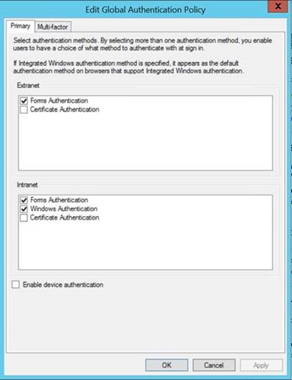

<properties
   pageTitle="Pré-requisitos de catálogo de dados Azure | Microsoft Azure"
   description="Azure catálogo de dados pré-requisitos - que você precisa para começar a usar o catálogo de dados do Azure."
   services="data-catalog"
   documentationCenter=""
   authors="steelanddata"
   manager="NA"
   editor=""
   tags=""/>
<tags
   ms.service="data-catalog"
   ms.devlang="NA"
   ms.topic="article"
   ms.tgt_pltfrm="NA"
   ms.workload="data-catalog"
   ms.date="09/21/2016"
   ms.author="maroche"/>

# Pré-requisitos de catálogo de dados Azure

## O que eu preciso para começar a usar o catálogo de dados do Azure?

Há algumas coisas que você precisará cuidam da antes de você pode configurar o **Catálogo de dados do Azure**. Não se preocupe – eles não terão longos!

## Assinatura do Azure
Para configurar o catálogo de dados do Azure, você deve ser o proprietário ou coproprietário de uma assinatura do Azure.

Assinaturas do Azure ajudam você a organizar o acesso aos recursos de serviço de nuvem como o catálogo de dados do Azure. Eles também ajuda você controlar como o uso do recurso for relatado, cobrado e paga. Cada assinatura pode ter uma configuração de pagamento e cobrança diferentes, para que você possa ter diferentes assinaturas e diferentes planos por departamento, project, escritório regional e assim por diante. Cada serviço de nuvem pertence a uma assinatura, e você precisa ter uma assinatura antes de configurar o catálogo de dados do Azure. Para saber mais, consulte [Gerenciar contas, assinaturas e funções administrativas](../active-directory/active-directory-assign-admin-roles.md).

## Active Directory do Azure
Para configurar o catálogo de dados do Azure, você deve estar conectado usando uma conta de usuário do Active Directory do Azure.

Azure Active Directory (AD Azure) fornece uma maneira fácil de sua empresa gerenciar identidades e acesso, tanto na nuvem e locais. Os usuários podem usar uma única conta corporativa ou escolar para logon único para qualquer nuvem e local de aplicativo da web. Catálogo de dados do Azure usa Azure AD para autenticar logon. Para saber mais, consulte [o que é o Active Directory do Azure](../active-directory/active-directory-whatis.md).

> [AZURE.NOTE] O [portal do Azure](http://portal.azure.com/) permite aos usuários entre usando uma Account da Microsoft ou um trabalho Azure Active Directory conta ou da escola. Para configurar o catálogo de dados do Azure usando o portal do Azure ou usando o [portal de catálogo de dados](http://www.azuredatacatalog.com) você deve estar conectado usando uma conta do Active Directory do Azure, não uma conta pessoal.

## Configuração de política do Active Directory

Em algumas situações, os usuários podem encontrar uma situação onde eles podem fazer logon no portal do catálogo de dados do Azure, mas quando tentam com a ferramenta de registro de fonte de dados que eles encontrarem uma mensagem de erro que impede que logon fazer logon. Esse comportamento de problema pode ocorrer somente quando o usuário está na rede da empresa, ou pode ocorrer apenas quando o usuário está se conectando de fora da rede da empresa.

A ferramenta de registro de fonte de dados usa autenticação de formulários para validar o logon de usuário no Active Directory. Para logon bem-sucedido, formulários de autenticação deve estar habilitado na política de autenticação Global por um administrador do Active Directory.

A política de autenticação Global permite métodos de autenticação sejam habilitadas separadamente para intranet e extranet conexões, conforme ilustrado abaixo. Podem ocorrer erros de logon se autenticação de formulários não estiver habilitada para a rede de onde o usuário está se conectando.

 

Para obter mais informações, consulte [Configurar políticas de autenticação](https://technet.microsoft.com/library/dn486781.aspx).
