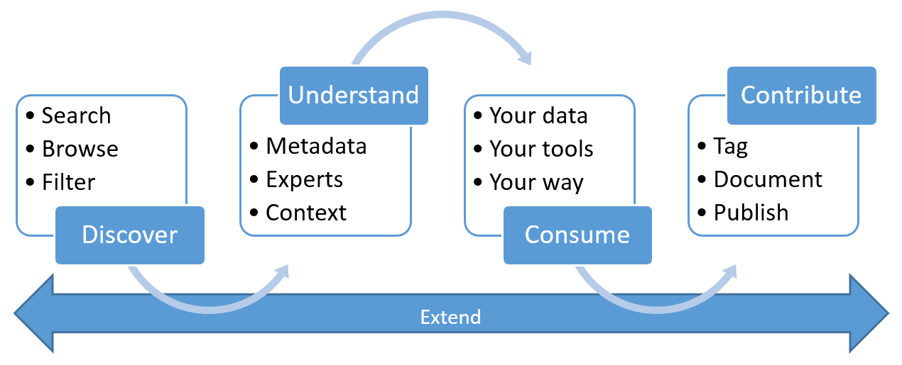

<properties
   pageTitle="O que é o catálogo de dados do Azure? | Microsoft Azure"
   description="Este artigo fornece uma visão geral do catálogo de dados do Microsoft Azure, incluindo seus recursos e os problemas que ele foi projetado para endereço. Catálogo de dados fornece recursos que permitem que qualquer usuário – de analistas para cientistas de dados para os desenvolvedores – registrar, descobrir, compreendam e consumam fontes de dados."
   services="data-catalog"
   documentationCenter=""
   authors="steelanddata"
   manager="NA"
   editor=""
   tags=""/>
<tags
   ms.service="data-catalog"
   ms.devlang="NA"
   ms.topic="get-started-article"
   ms.tgt_pltfrm="NA"
   ms.workload="data-catalog"
   ms.date="09/21/2016"
   ms.author="maroche"/>

# O que é o catálogo de dados do Azure?

Catálogo de dados do Azure é um serviço de nuvem totalmente gerenciado que permite aos usuários para descobrir fontes de dados que precisam e para entender as fontes de dados localizar, enquanto ajudando as organizações a obter mais valor de seus investimentos. Catálogo de dados fornece recursos que permitem que qualquer usuário – de analistas para cientistas de dados para os desenvolvedores – para descobrir, compreendam e consumam fontes de dados. Catálogo de dados inclui um modelo de crowdsourcing de metadados e anotações e permite que todos os usuários contribuir seu conhecimento para construir uma comunidade e cultura de dados.

## Desafios de descoberta para consumidores de dados

Normalmente, descobrir origens de dados corporativos foi um processo orgânico com base em conhecimento tribal. Isso apresenta vários desafios para as empresas que desejam obter o valor máximo de suas informações.

-   Os usuários não estão cientes de que fontes de dados existirem, a menos que eles vêm em contato com as-lo como parte do processo de outro; Não há nenhum local central onde as fontes de dados são registradas.
-   A menos que um usuário conhece o local de uma fonte de dados, ele não consegue se conectar aos dados usando um aplicativo cliente; experiências de consumo de dados exigem que os usuários saibam o caminho ou a cadeia de conexão.
-   A menos que um usuário sabe a localização da documentação da fonte de dados, ele não consegue entender que o destinados usa dos dados; documentação e fontes de dados ao vivo em locais diferentes e são consumidas por meio de experiências diferentes.
-   Se um usuário tiver dúvidas sobre um ativo de informações, ele deverá localize o especialista ou equipe responsável para os dados e envolva esses especialistas offline; Não há nenhuma conexão explícita entre dados e aqueles com perspectivas especialistas em seu uso.
-  A menos que um usuário entenda o processo de solicitação de acesso à fonte de dados, descobrindo a fonte de dados e sua documentação ainda não lhe permitem acessar os dados que ele requer.

## Desafios de descoberta para produtores de dados

Enquanto os consumidores de dados enfrentam esses desafios, os usuários responsáveis por produzir e mantendo ativos de informações enfrentam desafios dos seus próprios.

-   Fazendo anotações fontes de dados com metadados descritivos geralmente é um esforço perdido; aplicativos cliente geralmente ignoram descrições armazenadas na fonte de dados.
-   Criar documentação para fontes de dados geralmente é um esforço perdido; manter a documentação em sincronia com a fonte de dados é uma responsabilidade em andamento e os usuários terão confiança na documentação como ele geralmente é considerado sendo desatualizada.
- Restringindo o acesso à fonte de dados e garantir que os consumidores de dados sabe solicitar acesso são um desafio contínuo.

Criar e manter a documentação para uma fonte de dados é complexa e demorada. O desafio de disponibilizando essa documentação prontamente para todos que usam a fonte de dados geralmente é ainda mais.

Quando combinados, esses desafios apresentam uma barreira significativa para as empresas que queiram incentivar e promover o uso e a compreensão de dados corporativos.

## Catálogo de dados do Azure podem ajudar

Catálogo de dados foi projetado para resolver esses problemas e habilitar as empresas para obter o valor máximo de seus ativos de informação existentes. Ajuda do catálogo de dados fazendo fontes de dados compreendido e facilmente descobertos pelos usuários que precisam os dados que gerenciam.

Catálogo de dados fornece um serviço baseado em nuvem nos quais dados de origem pode ser registrada. Os dados permanecem em sua localização existente, mas uma cópia dos metadados é adicionado ao catálogo de dados, juntamente com uma referência para o local de origem de dados. Esses metadados também será indexado para tornar cada fonte de dados facilmente descobertos por meio de pesquisa e compreendido aos usuários que descobri-lo.

Depois que uma fonte de dados tiver sido registrada, seus metadados, em seguida, podem ser aprimorado, por usuário que executou o registro ou por outros usuários na empresa. Qualquer usuário pode anotar uma fonte de dados, fornecendo descrições, marcas ou outros metadados, como documentação e processos para solicitar acesso à fonte de dados. Este metadados descritivos suplementam os metadados estruturais (como nomes de coluna e tipos de dados) registrado da fonte de dados.

Descobrindo e Noções básicas sobre o seu uso e fontes de dados é a principal finalidade de registrar as fontes. Quando usuários corporativos precisam de dados para seus esforços (que podem ser inteligência comercial, desenvolvimento de aplicativos, ciência de dados ou qualquer outra tarefa onde os dados corretos são necessários) eles podem usar a experiência de descoberta de catálogo de dados rapidamente para localizar dados que corresponda às suas necessidades, entender os dados de avaliar seu treino para finalidade e consumir dados abrindo a fonte de dados em sua ferramenta de escolha. Ao mesmo tempo, catálogo de dados permite aos usuários contribuir com o catálogo, marcação, documentando e anotando fontes de dados que já foram registrados e registrando novas fontes de dados que podem ser descobertos, compreendidos e consumidas pela comunidade de usuários de catálogo.

## Introdução ao catálogo de dados

Para começar a usar o catálogo de dados hoje, visite [www.azuredatacatalog.com](https://www.azuredatacatalog.com).

Um guia de Introdução ao obter está disponível [aqui](data-catalog-get-started.md).

## Saiba mais sobre o catálogo de dados

Para saber mais sobre os recursos do catálogo de dados, consulte:

* [Como registrar a fontes de dados](data-catalog-how-to-register.md)
* [Como descobrir fontes de dados](data-catalog-how-to-discover.md)
* [Como anotar fontes de dados](data-catalog-how-to-annotate.md)
* [Como fontes de dados de documento](data-catalog-how-to-documentation.md)
* [Como se conectar a fontes de dados](data-catalog-how-to-connect.md)
* [Como trabalhar com dados de grandes](data-catalog-how-to-big-data.md)
* [Como gerenciar ativos de dados](data-catalog-how-to-manage.md)
* [Como configurar o Glossário de negócios](data-catalog-how-to-business-glossary.md)
* [Perguntas frequentes](data-catalog-frequently-asked-questions.md)
