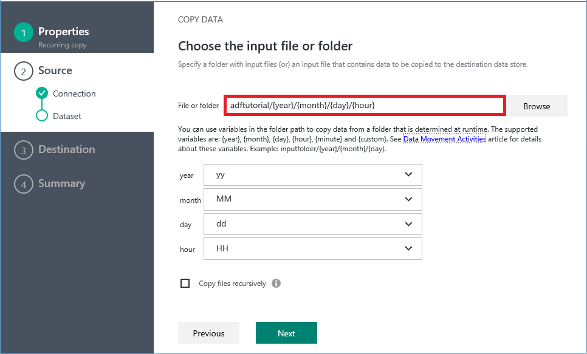
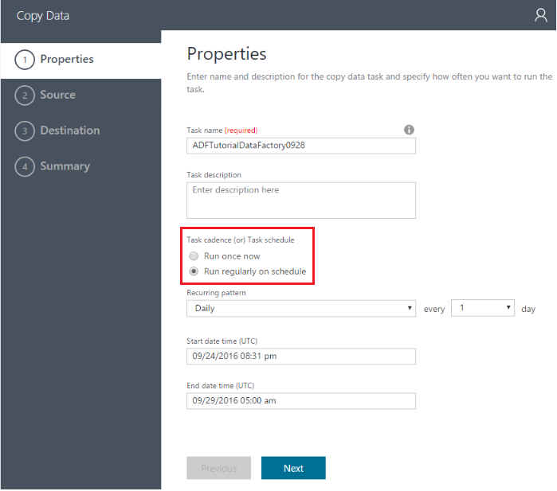

<properties
    pageTitle="Assistente de cópia Azure de fábrica dados | Microsoft Azure"
    description="Saiba mais sobre como usar o Assistente de cópia do Azure de fábrica dados para copiar dados de fontes de dados com suporte para receptores."
    services="data-factory"
    documentationCenter=""
    authors="spelluru"
    manager="jhubbard"
    editor="monicar"/>

<tags
    ms.service="data-factory"
    ms.workload="data-services"
    ms.tgt_pltfrm="na"
    ms.devlang="na"
    ms.topic="article"
    ms.date="10/03/2016"
    ms.author="spelluru"/>

# Dados Azure Factory - Assistente de cópia
O Assistente de cópia de fábrica de dados do Azure é facilitar o processo de assimilar dados, que geralmente é a primeira etapa em um cenário de integração de dados de ponta a ponta. Quando concluir o Assistente de cópia de fábrica de dados do Azure, você não precisa compreender qualquer definições de JSON para serviços vinculados, conjuntos de dados e canais. No entanto, depois de concluir todas as etapas no assistente, o assistente cria automaticamente um pipeline para copiar dados de fonte de dados selecionada para o destino selecionado. Além disso, o Assistente de cópia ajuda você a para validar os dados sejam incluídos no momento da criação, que salva muito tempo, especialmente quando você estiver inclusão dados pela primeira vez da fonte de dados. Para iniciar o Assistente de cópia, clique no bloco **copiar dados** na página inicial de sua fábrica de dados.

## Um assistente intuitivo para copiar dados
Esse assistente permite que você facilmente mover dados de uma ampla variedade de fontes para destinos em minutos. Depois de concluir o assistente, um pipeline com uma atividade de cópia é criado automaticamente para você juntamente com dependentes entidades de fábrica de dados (serviços vinculados e conjuntos de dados). Não há etapas adicionais são necessárias para criar o pipeline.   

> [AZURE.NOTE] Consulte o artigo do [tutorial do Assistente de cópia](data-factory-copy-data-wizard-tutorial.md) para obter instruções passo a passo criar um pipeline de amostra para copiar dados de um Azure blob a uma tabela do Azure SQL Database. 

O assistente destina-se com dados de grandes em mente desde o início. É simples e eficiente para criar canais de fábrica de dados que movem centenas de tabelas usando o Assistente para copiar dados, arquivos ou pastas. O Assistente suporta os seguintes recursos de três: visualização de dados automática, captura do esquema e mapeamento e filtragem de dados. 

## Visualização de dados automática 
O Assistente de cópia permite que você examine parte dos dados da fonte de dados selecionada para validar se os dados forem os dados corretos que você deseja copiar. Além disso, se os dados de origem estiverem em um arquivo de texto, o Assistente de cópia analisa o arquivo de texto para saber o esquema e delimitadores de coluna e linha automaticamente. 

## Captura de esquema e mapeamento 
O esquema de dados de entrada não pode coincidir com o esquema de dados de saída em alguns casos. Neste cenário, você precisa mapear colunas do esquema de fonte para colunas do esquema de destino. 

O Assistente para copiar automaticamente mapeado colunas no esquema de fonte para colunas no esquema de destino. Você pode substituir os mapeamentos usando as listas suspensas (ou) especificar se uma coluna precisa ser ignorado ao copiar os dados.   

## Filtragem de dados  
O assistente permite filtrar dados de origem para selecionar apenas os dados que precisa ser copiado para o armazenamento de dados de destino/receptor. Filtragem reduz o volume dos dados sejam copiados para o armazenamento de dados do receptor e, portanto, melhora a taxa de transferência da operação de cópia. Ele oferece uma maneira flexível para filtrar dados em um banco de dados relacional usando SQL query language (ou) arquivos em uma pasta de blob do Microsoft Azure usando [variáveis e funções de Data Factory](data-factory-functions-variables.md).   

### Filtragem de dados em um banco de dados  
No exemplo, a consulta SQL usa o `Text.Format` função e `WindowStart` variável. 

### Filtragem de dados em uma pasta de blob do Microsoft Azure
Você pode usar variáveis no caminho da pasta para copiar dados de uma pasta que é determinada no tempo de execução com base em [variáveis de sistema](data-factory-functions-variables.md#data-factory-system-variables). As variáveis com suporte são: **{ano}**, **{mês}**, **{day}**, **{hora}**, **{minuto}**e **{personalizado}**. Exemplo: inputfolder / {ano} / {mês} / {dia}.

Suponha que você tenha entrada pastas no seguinte formato:

    2016/03/01/01
    2016/03/01/02
    2016/03/01/03
    ...

Clique no botão **Procurar** para o **arquivo ou pasta**, navegue até uma dessas pastas (por exemplo, 2016 -> 03 -> 01 -> 02) e clique em **Escolher**. Você deve ver `2016/03/01/02` na caixa de texto. Agora, substitua **2016** **{ano}**, **03** com **{mês}**, **01** com **{day}**e **02** com **{hora}**e, em seguida, pressione Tab. Você deve ver nas listas suspensas para selecionar o formato para esses quatro variáveis:

   

Como mostrado na seguinte captura de tela, você também pode usar uma variável **personalizado** e qualquer [suporte a cadeias de caracteres de formato](https://msdn.microsoft.com/library/8kb3ddd4.aspx). Para selecionar uma pasta com essa estrutura, use o botão **Procurar** primeiro. Em seguida, substitua um valor **{personalizado}**e pressione Tab para ver a caixa de texto onde você pode digitar a cadeia de caracteres de formato.     

## Suporte para diversos dados e tipos de objeto
Usando o Assistente de cópia, você pode mover com eficiência centenas de tabelas, arquivos ou pastas.

## Opções de agendamento
Você pode executar a operação de cópia uma vez ou em um cronograma (por hora, diárias, e assim por diante). Ambas as opções podem ser usadas para a amplitude dos conectores entre locais, nuvem e cópia da área de trabalho local.

Uma operação de cópia única permite que a movimentação de uma fonte de dados para um destino apenas uma vez. Aplica-se aos dados de qualquer tamanho e em qualquer formato compatível. A cópia programada permite que você copiar dados em uma recorrência indicada. Você pode usar rich configurações (como repetir, tempo limite e alertas) para configurar a cópia agendada.

## Próximas etapas
Para uma rápida explicação passo a passo de como usar o Assistente de cópia de fábrica de dados para criar um pipeline com atividade de cópia, consulte [Tutorial: criar um pipeline usando o Assistente de cópia](data-factory-copy-data-wizard-tutorial.md).
