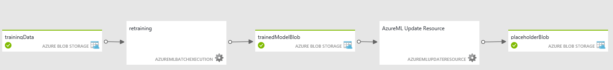

<properties 
    pageTitle="Usar atividades de aprendizado de máquina | Microsoft Azure" 
    description="Descreve como criar criar canais de previsão usando fábrica de dados do Azure e aprendizado de máquina do Azure" 
    services="data-factory" 
    documentationCenter="" 
    authors="sharonlo101" 
    manager="jhubbard" 
    editor="monicar"/>

<tags 
    ms.service="data-factory" 
    ms.workload="data-services" 
    ms.tgt_pltfrm="na" 
    ms.devlang="na" 
    ms.topic="article" 
    ms.date="09/06/2016" 
    ms.author="shlo"/>

# Criar canais de previsão usando atividades de aprendizado de máquina do Azure   
> [AZURE.SELECTOR]
[Seção](data-factory-hive-activity.md)  
[Porco](data-factory-pig-activity.md)  
[MapReduce](data-factory-map-reduce.md)  
[Fluxo de Hadoop](data-factory-hadoop-streaming-activity.md)
[Aprendizado de máquina](data-factory-azure-ml-batch-execution-activity.md) 
[Procedimento armazenado](data-factory-stored-proc-activity.md)
[Dados Lucerne Analytics U-SQL](data-factory-usql-activity.md)
[.NET personalizado](data-factory-use-custom-activities.md)

## Introdução

[Aprendizado de máquina do Azure](https://azure.microsoft.com/documentation/services/machine-learning/) permite construir, testar e implantar soluções de análise de previsão. Do ponto de vista alto nível, ele é feito em três etapas: 

1. **Criar uma experiência de treinamento**. Realizar esta etapa usando o Azure ML Studio. O studio ML é um ambiente de desenvolvimento visual colaborativo que você usa para treinar e testar um modelo de análise de previsão usando dados de treinamento.
2. **Convertê-lo para um experimento previsão**. Depois que o modelo foi treinado com dados existentes e estiver pronto para usá-lo para pontuação novos dados, você preparar e simplificar seu experimento de pontuação.
3. **Implantá-lo como um serviço web**. Você pode publicar seu experimento pontuação como um serviço web Azure. Você pode enviar dados para o seu modelo via esse ponto de final de serviço web e receber previsões de resultado para o modelo.  

Azure fábrica de dados permite que você crie facilmente canais que usam um publicados [Aprendizado de máquina do Azure] [ azure-machine-learning] serviço para análise de previsão da web. Consulte [Introdução ao Azure dados Factory](data-factory-introduction.md) e [Crie sua primeira pipeline](data-factory-build-your-first-pipeline.md) artigos para começar rapidamente com o serviço de fábrica de dados do Azure. 

Usando a **Atividade de execução de lote** em um pipeline de fábrica de dados do Azure, você pode chamar um serviço da web ML do Azure para fazer previsões sobre os dados no lote. Consulte a seção de [invocar um ML Azure serviço usando a atividade de execução de lote web](#invoking-an-azure-ml-web-service-using-the-batch-execution-activity) para obter detalhes.

Ao longo do tempo, os modelos de previsão no ML Azure pontuação experiências precisam ser retrained usando novos conjuntos de dados de entrada. Você pode treinar novamente um modelo do Azure ML de um pipeline de fábrica de dados seguindo as etapas a seguir: 

1. Publica o experimento de treinamento (não previsão experimento) como um serviço da web. Realizar esta etapa no Azure ML Studio que você fez para expor experimento previsão como um serviço da web no cenário anterior.
2. Use a atividade de execução do Azure ML lote para chamar o serviço web para a experiência de treinamento. Basicamente, você pode usar a atividade de execução de lote do Azure ML para invocar serviço da web de treinamento e pontuação serviço da web. 
  
Depois de terminar com treinamento, você deseja atualizar o serviço web de pontuação (previsão experimento exposto como um serviço da web) com o modelo de treinamento recentemente. Aqui estão as etapas: 

1. Adicione um ponto de fim não padrão para o serviço web pontuação. O ponto de extremidade padrão do serviço da web não pode ser atualizado, então você precisa criar um ponto de extremidade não padrão usando o portal do Azure. Consulte o artigo [Criar pontos de extremidade](../machine-learning/machine-learning-create-endpoint.md) para informações conceituais e procedimentos.
2. Atualize serviços ML Azure vinculados existentes de pontuação para usar o ponto de extremidade não padrão. Comece a usar o novo ponto de extremidade para usar o serviço web que é atualizado.
3. Use a **Atividade de recurso Atualizar do Azure ML** para atualizar o serviço da web com o modelo de treinamento recentemente.  

Consulte a seção de [modelos de Atualizando Azure ML usando a atividade de recurso de atualização](#updating-azure-ml-models-using-the-update-resource-activity) para obter detalhes. 

## Chamar um serviço da web usando a atividade de execução de lote

Você usa fábrica de dados do Azure para coordenar o processamento e movimentação de dados e, em seguida, executar execução em lotes usando aprendizado de máquina do Azure. Aqui estão as etapas de nível superior:

1. Crie um serviço de aprendizado de máquina do Azure vinculado. Você precisa do seguinte:
    1. O **URI de solicitação** para a execução de lote API. Você pode encontrar o URI solicitar clicando no link de **Execução de LOTE** na página de serviços da web.
    1. **Chave API** do serviço da web de aprendizado de máquina do Azure publicado. Você pode encontrar a chave de API clicando o serviço da web publicado. 
 2. Use a atividade de **AzureMLBatchExecution** .

    

    

### Cenário: Experimenta usando entradas/saídas de serviço de Web que fazem referência aos dados no armazenamento de Blob do Azure
Neste cenário, o serviço Web de aprendizado de máquina do Azure faz previsões usando dados de um arquivo em um armazenamento de blob do Microsoft Azure e armazena os resultados de previsão no armazenamento de blob. O seguinte JSON define um pipeline de fábrica de dados com uma atividade de AzureMLBatchExecution. A atividade possui o conjunto de dados **DecisionTreeInputBlob** como entrada e **DecisionTreeResultBlob** como a saída. O **DecisionTreeInputBlob** é passado como entrada para o serviço web usando a propriedade JSON **webServiceInput** . O **DecisionTreeResultBlob** é passado como uma saída para o serviço Web usando a propriedade JSON **webServiceOutputs** .  

> [AZURE.IMPORTANT] 
> Se o serviço da web leva várias entradas, use a propriedade **webServiceInputs** em vez de usar **webServiceInput**. Consulte a seção [serviço Web requer várias entradas](#web-service-requires-multiple-inputs) para obter um exemplo de como usar a propriedade webServiceInputs.
>  
> Conjuntos de dados que são referenciados pela **webServiceInput**/**webServiceInputs** e **webServiceOutputs** propriedades ( **typeProperties**) também devem ser incluídas na atividade **entradas** e **saídas**.
> 
> No seu experimento Azure ML, entrada de serviço da web e portas de saída e parâmetros globais têm nomes de padrão ("input1", "input2") que você pode personalizar. Os nomes que você usa para webServiceInputs, webServiceOutputs e configurações de globalParameters devem corresponder exatamente aos nomes nas experiências. Você pode exibir a carga de solicitação de exemplo na página Ajuda de execução de lote de seu ponto de extremidade do Azure ML verificar o mapeamento esperado. 

    {
      "name": "PredictivePipeline",
      "properties": {
        "description": "use AzureML model",
        "activities": [
          {
            "name": "MLActivity",
            "type": "AzureMLBatchExecution",
            "description": "prediction analysis on batch input",
            "inputs": [
              {
                "name": "DecisionTreeInputBlob"
              }
            ],
            "outputs": [
              {
                "name": "DecisionTreeResultBlob"
              }
            ],
            "linkedServiceName": "MyAzureMLLinkedService",
            "typeProperties":
            {
                "webServiceInput": "DecisionTreeInputBlob",
                "webServiceOutputs": {
                    "output1": "DecisionTreeResultBlob"
                }                
            },
            "policy": {
              "concurrency": 3,
              "executionPriorityOrder": "NewestFirst",
              "retry": 1,
              "timeout": "02:00:00"
            }
          }
        ],
        "start": "2016-02-13T00:00:00Z",
        "end": "2016-02-14T00:00:00Z"
      }
    }

> [AZURE.NOTE] Apenas entradas e saídas da atividade AzureMLBatchExecution podem ser passadas como parâmetros para o serviço Web. Por exemplo, no trecho de JSON acima, DecisionTreeInputBlob é uma entrada para a atividade de AzureMLBatchExecution, que é passada como entrada para o serviço Web via webServiceInput parâmetro.   

### Exemplo

Este exemplo usa o armazenamento do Azure para manter os dados de entrada e saídos. 

Recomendamos que você percorra [criar sua primeira pipeline com dados fábrica] [ adf-build-1st-pipeline] tutorial antes de passar por esse exemplo. Use o Editor de fábrica de dados para criar artefatos de fábrica de dados (serviços vinculados, conjuntos de dados, pipeline) neste exemplo.   
 

1. Crie um **serviço vinculado** para seu **Armazenamento do Azure**. Se os arquivos de entrada e saídos estão nas contas de armazenamento diferente, será necessário dois serviços vinculados. Aqui está um exemplo JSON:

        {
          "name": "StorageLinkedService",
          "properties": {
            "type": "AzureStorage",
            "typeProperties": {
              "connectionString": "DefaultEndpointsProtocol=https;AccountName=[acctName];AccountKey=[acctKey]"
            }
          }
        }

2. Crie a **entrada** de fábrica de dados do Azure **dataset**. Ao contrário de alguns outros dados fábrica conjuntos de dados, esses conjuntos de dados devem conter valores **folderPath** e **fileName** . Você pode usar a partição para fazer com que cada execução de lote (cada fatia de dados) processar ou produzir entrada exclusiva e arquivos de saída. Talvez você precise incluir algumas atividades upstream para transformar a entrada no formato de arquivo CSV e coloque-o na conta de armazenamento para cada fatia. Nesse caso, você não incluiria as configurações **externas** e **externalData** mostradas no exemplo a seguir, e sua DecisionTreeInputBlob seria o conjunto de dados de saída de uma atividade diferente.

        {
          "name": "DecisionTreeInputBlob",
          "properties": {
            "type": "AzureBlob",
            "linkedServiceName": "StorageLinkedService",
            "typeProperties": {
              "folderPath": "azuremltesting/input",
              "fileName": "in.csv",
              "format": {
                "type": "TextFormat",
                "columnDelimiter": ","
              }
            },
            "external": true,
            "availability": {
              "frequency": "Day",
              "interval": 1
            },
            "policy": {
              "externalData": {
                "retryInterval": "00:01:00",
                "retryTimeout": "00:10:00",
                "maximumRetry": 3
              }
            }
          }
        }
    
    Seu arquivo csv entrada deve ter a linha de cabeçalho de coluna. Se você estiver usando a **Atividade de cópia** para criar/mover o csv para o armazenamento de blob, você deve definir a propriedade do receptor **blobWriterAddHeader** como **true**. Por exemplo:
    
         sink: 
         {
             "type": "BlobSink",     
             "blobWriterAddHeader": true 
         }
     
    Se o arquivo csv não tiver a linha de cabeçalho, você poderá ver o seguinte erro: **erro na atividade: erro ao ler a cadeia de caracteres. Símbolo inesperado: StartObject. Caminho ', linha 1, posição 1**.
3. Crie a **saída** de fábrica de dados do Azure **dataset**. Este exemplo usa a partição para criar um caminho de saída exclusivo para cada execução de fatia. Sem as partições, a atividade seria substituir o arquivo.

        {
          "name": "DecisionTreeResultBlob",
          "properties": {
            "type": "AzureBlob",
            "linkedServiceName": "StorageLinkedService",
            "typeProperties": {
              "folderPath": "azuremltesting/scored/{folderpart}/",
              "fileName": "{filepart}result.csv",
              "partitionedBy": [
                {
                  "name": "folderpart",
                  "value": {
                    "type": "DateTime",
                    "date": "SliceStart",
                    "format": "yyyyMMdd"
                  }
                },
                {
                  "name": "filepart",
                  "value": {
                    "type": "DateTime",
                    "date": "SliceStart",
                    "format": "HHmmss"
                  }
                }
              ],
              "format": {
                "type": "TextFormat",
                "columnDelimiter": ","
              }
            },
            "availability": {
              "frequency": "Day",
              "interval": 15
            }
          }
        }

4. Criar um **serviço vinculado** do tipo: **AzureMLLinkedService**, fornecendo a API principais e URL de execução de lote de modelo.
        
        {
          "name": "MyAzureMLLinkedService",
          "properties": {
            "type": "AzureML",
            "typeProperties": {
              "mlEndpoint": "https://[batch execution endpoint]/jobs",
              "apiKey": "[apikey]"
            }
          }
        }
5. Por fim, autor um pipeline que contém uma atividade de **AzureMLBatchExecution** . Durante a execução, o pipeline executa as seguintes etapas:
    1. Obtém o local do arquivo de entrada de seus conjuntos de dados de entrada.
    2. Invoca a execução de lote de aprendizado de máquina do Azure API
    3. Copia a saída de execução de lote para o blob fornecido no seu conjunto de dados de saída. 

    > [AZURE.NOTE] Atividade de AzureMLBatchExecution pode ter zero ou mais entradas e saídas de uma ou mais.

        {
          "name": "PredictivePipeline",
          "properties": {
            "description": "use AzureML model",
            "activities": [
              {
                "name": "MLActivity",
                "type": "AzureMLBatchExecution",
                "description": "prediction analysis on batch input",
                "inputs": [
                  {
                    "name": "DecisionTreeInputBlob"
                  }
                ],
                "outputs": [
                  {
                    "name": "DecisionTreeResultBlob"
                  }
                ],
                "linkedServiceName": "MyAzureMLLinkedService",
                "typeProperties":
                {
                    "webServiceInput": "DecisionTreeInputBlob",
                    "webServiceOutputs": {
                        "output1": "DecisionTreeResultBlob"
                    }                
                },
                "policy": {
                  "concurrency": 3,
                  "executionPriorityOrder": "NewestFirst",
                  "retry": 1,
                  "timeout": "02:00:00"
                }
              }
            ],
            "start": "2016-02-13T00:00:00Z",
            "end": "2016-02-14T00:00:00Z"
          }
        }

    **Iniciar** e **Encerrar** datetimes deve estar no [formato ISO](http://en.wikipedia.org/wiki/ISO_8601). Por exemplo: 2014-10-14T16:32:41Z. A hora de **término** é opcional. Se você não especificar o valor da propriedade **final** , ele é calculado como "**Iniciar + 48 horas.**" Para executar o pipeline indefinidamente, especifique **9999-09-09** como o valor da propriedade de **fim** . Consulte [A referência de script de JSON](https://msdn.microsoft.com/library/dn835050.aspx) para obter detalhes sobre propriedades JSON.

    > [AZURE.NOTE] Especificar a entrada para o AzureMLBatchExecution atividade é opcional. 

### Cenário: Experimenta usando módulos de leitor/gravador para se referir a dados em vários armazenamentos

Outro cenário comum ao criar experiências Azure ML é usar o leitor e gravador módulos. O módulo do leitor é usado para carregar dados em um experimento e o módulo do gravador é de salvar dados de suas experiências. Para obter detalhes sobre módulos leitor e gravador, consulte os tópicos de [leitor](https://msdn.microsoft.com/library/azure/dn905997.aspx) e [Gravador](https://msdn.microsoft.com/library/azure/dn905984.aspx) na biblioteca MSDN.     

Ao usar os módulos leitor e gravador, é recomendável usar um parâmetro de serviço Web para cada propriedade desses módulos leitor/gravador. Esses parâmetros da web permitem que você configure os valores durante a execução. Por exemplo, você poderia criar um experimento com um módulo de leitor que usa um banco de dados do SQL Azure: XXX.database.windows.net. Após ter sido implantado o serviço da web, você deseja habilitar os consumidores do serviço da web especificar outro Azure SQL Server chamado YYY.database.windows.net. Você pode usar um parâmetro de serviço Web para permitir que este valor a ser configurado.

> [AZURE.NOTE] Entrada de serviço Web e saída são diferentes dos parâmetros de serviço Web. No primeiro cenário, você viu como uma entrada e saída podem ser especificados para um serviço da Web do Azure ML. Neste cenário, você pode passar parâmetros para um serviço Web que correspondem às propriedades de módulos de leitor/gravador. 

Vamos examinar um cenário para usar parâmetros de serviço Web. Você tem um serviço de web de aprendizado de máquina do Azure implantado que usa um módulo de leitor para ler dados de uma das fontes de dados compatíveis com o Azure aprendizado de máquina (por exemplo: Azure SQL Database). Após a execução do lote é executada, os resultados são gravados usando um módulo de gravador (Azure SQL Database).  Não há entradas de serviço web e saídas são definidas nas experiências. Nesse caso, recomendamos que você configure parâmetros de serviço web relevantes para os módulos leitor e gravador. Essa configuração permite que o leitor/gravador módulos ser configurado quando usando a atividade de AzureMLBatchExecution. Especificar parâmetros de serviço Web na seção **globalParameters** na atividade JSON da seguinte maneira. 

    "typeProperties": {
        "globalParameters": {
            "Param 1": "Value 1",
            "Param 2": "Value 2"
        }
    }

Você também pode usar [Funções de fábrica dados](https://msdn.microsoft.com/library/dn835056.aspx) passar valores para os parâmetros de serviço Web, conforme mostrado no exemplo a seguir:

    "typeProperties": {
        "globalParameters": {
           "Database query": "$$Text.Format('SELECT * FROM myTable WHERE timeColumn = \\'{0:yyyy-MM-dd HH:mm:ss}\\'', Time.AddHours(WindowStart, 0))"
        }
    }
 
> [AZURE.NOTE] Os parâmetros de serviço Web diferenciam maiusculas de minúsculas, portanto, certifique-se de que os nomes que você especificar na atividade JSON correspondem aos expostos pelo serviço da Web. 

### Usando um módulo de leitor ler dados de vários arquivos no Azure Blob
Grandes dados tubulações com atividades como porco e seção pode produzir um ou mais arquivos de saída sem extensão. Por exemplo, quando você especifica uma tabela externa de seção, os dados para a tabela de seção externo podem ser armazenados em armazenamento de blob do Microsoft Azure com os seguintes 000000_0 de nome. Você pode usar o módulo leitor em um experimento para ler vários arquivos e usá-los para previsões. 

Ao usar o módulo do leitor em uma experiência de aprendizado de máquina do Azure, você pode especificar o Azure Blob como entrada. Os arquivos no armazenamento de blob do Microsoft Azure podem ser os arquivos de saída (exemplo: 000000_0) que são produzidos por um script de porco e seção em execução no HDInsight. O módulo leitor permite que você leia arquivos (com nenhum extensões) Configurando a **caminho ao contêiner, diretório/blob**. O **caminho ao contêiner** aponta para o contêiner e **diretório/blob** de pontos de pasta que contém os arquivos conforme mostrado na imagem a seguir. O asterisco ou seja, \*) **Especifica que todos os arquivos no contêiner/pasta (ou seja, dados/aggregateddata/ano = mês/2014-6 /\*)** sejam lidas como parte da experiência.

### Exemplo 
#### Pipeline com atividade de AzureMLBatchExecution com parâmetros de serviço Web

    {
      "name": "MLWithSqlReaderSqlWriter",
      "properties": {
        "description": "Azure ML model with sql azure reader/writer",
        "activities": [
          {
            "name": "MLSqlReaderSqlWriterActivity",
            "type": "AzureMLBatchExecution",
            "description": "test",
            "inputs": [
              {
                "name": "MLSqlInput"
              }
            ],
            "outputs": [
              {
                "name": "MLSqlOutput"
              }
            ],
            "linkedServiceName": "MLSqlReaderSqlWriterDecisionTreeModel",
            "typeProperties":
            {
                "webServiceInput": "MLSqlInput",
                "webServiceOutputs": {
                    "output1": "MLSqlOutput"
                }
                "globalParameters": {
                    "Database server name": "<myserver>.database.windows.net",
                    "Database name": "<database>",
                    "Server user account name": "<user name>",
                    "Server user account password": "<password>"
                }              
            },
            "policy": {
              "concurrency": 1,
              "executionPriorityOrder": "NewestFirst",
              "retry": 1,
              "timeout": "02:00:00"
            },
          }
        ],
        "start": "2016-02-13T00:00:00Z",
        "end": "2016-02-14T00:00:00Z"
      }
    }
 
No exemplo acima JSON:

- O serviço Web de aprendizado de máquina do Azure implantado usa um leitor e um módulo de gravador para leitura/gravação dados de/para um banco de dados do SQL Azure. Este serviço Web expõe quatro parâmetros a seguir: nome do servidor, nome do banco de dados, nome de conta de usuário do servidor e senha de conta de usuário do servidor de banco de dados.  
- **Iniciar** e **Encerrar** datetimes deve estar no [formato ISO](http://en.wikipedia.org/wiki/ISO_8601). Por exemplo: 2014-10-14T16:32:41Z. A hora de **término** é opcional. Se você não especificar o valor da propriedade **final** , ele é calculado como "**Iniciar + 48 horas.**" Para executar o pipeline indefinidamente, especifique **9999-09-09** como o valor da propriedade de **fim** . Consulte [A referência de script de JSON](https://msdn.microsoft.com/library/dn835050.aspx) para obter detalhes sobre propriedades JSON.

### Outros cenários

#### Serviço da Web requer várias entradas
Se o serviço da web leva várias entradas, use a propriedade **webServiceInputs** em vez de usar **webServiceInput**. Conjuntos de dados que são referenciados pela **webServiceInputs** também devem ser incluídos na atividade **entradas**.
 
No seu experimento Azure ML, entrada de serviço da web e portas de saída e parâmetros globais têm nomes de padrão ("input1", "input2") que você pode personalizar. Os nomes que você usa para webServiceInputs, webServiceOutputs e configurações de globalParameters devem corresponder exatamente aos nomes nas experiências. Você pode exibir a carga de solicitação de exemplo na página Ajuda de execução de lote de seu ponto de extremidade do Azure ML verificar o mapeamento esperado.

    {
        "name": "PredictivePipeline",
        "properties": {
            "description": "use AzureML model",
            "activities": [{
                "name": "MLActivity",
                "type": "AzureMLBatchExecution",
                "description": "prediction analysis on batch input",
                "inputs": [{
                    "name": "inputDataset1"
                }, {
                    "name": "inputDataset2"
                }],
                "outputs": [{
                    "name": "outputDataset"
                }],
                "linkedServiceName": "MyAzureMLLinkedService",
                "typeProperties": {
                    "webServiceInputs": {
                        "input1": "inputDataset1",
                        "input2": "inputDataset2"
                    },
                    "webServiceOutputs": {
                        "output1": "outputDataset"
                    }
                },
                "policy": {
                    "concurrency": 3,
                    "executionPriorityOrder": "NewestFirst",
                    "retry": 1,
                    "timeout": "02:00:00"
                }
            }],
            "start": "2016-02-13T00:00:00Z",
            "end": "2016-02-14T00:00:00Z"
        }
    }

#### Serviço Web não exige uma entrada

Serviços de web execução do Azure ML lote podem ser usados para executar qualquer fluxo de trabalho, para R ou Python scripts de exemplo, que talvez não exijam qualquer entradas. Ou, o experimento pode estar configurado com um módulo de leitor que não expõe qualquer GlobalParameters. Nesse caso, a atividade de AzureMLBatchExecution seria configurada da seguinte maneira:

    {
        "name": "scoring service",
        "type": "AzureMLBatchExecution",
        "outputs": [
            {
                "name": "myBlob"
            }
        ],
        "typeProperties": {
            "webServiceOutputs": {
                "output1": "myBlob"
            }              
         },
        "linkedServiceName": "mlEndpoint",
        "policy": {
            "concurrency": 1,
            "executionPriorityOrder": "NewestFirst",
            "retry": 1,
            "timeout": "02:00:00"
        }
    },
   

#### Serviço Web não exige uma entrada/saída
O serviço do Azure ML lote execução da web pode não ter qualquer saída de serviço Web configurada. Neste exemplo, nenhum serviço Web de entrada ou saída, nem qualquer GlobalParameters configurados. Ainda há uma saída configurada na atividade em si, mas ele não é fornecido como um webServiceOutput.

    {
        "name": "retraining",
        "type": "AzureMLBatchExecution",
        "outputs": [
            {
                "name": "placeholderOutputDataset"
            }
        ],
        "typeProperties": {
         },
        "linkedServiceName": "mlEndpoint",
        "policy": {
            "concurrency": 1,
            "executionPriorityOrder": "NewestFirst",
            "retry": 1,
            "timeout": "02:00:00"
        }
    },

#### Leitores de usos de serviço Web e criadores e a atividade é executada somente quando outras atividades tiveram êxito

Os módulos de leitor e gravador de serviço do web Azure ML podem estar configurados para executar com ou sem qualquer GlobalParameters. No entanto, talvez você queira incorporar chamadas de serviço em um pipeline que usa dependências de conjunto de dados para chamar o serviço somente quando alguns processamento upstream concluído. Você também pode disparar alguma outra ação após a execução do lote usando essa abordagem. Nesse caso, você pode expressar as dependências usando entradas de atividade e saídas, sem qualquer uma de nomenclatura como entradas de serviço Web ou saídas.

    {
        "name": "retraining",
        "type": "AzureMLBatchExecution",
        "inputs": [
            {
                "name": "upstreamData1"
            },
            {
                "name": "upstreamData2"
            }
        ],
        "outputs": [
            {
                "name": "downstreamData"
            }
        ],
        "typeProperties": {
         },
        "linkedServiceName": "mlEndpoint",
        "policy": {
            "concurrency": 1,
            "executionPriorityOrder": "NewestFirst",
            "retry": 1,
            "timeout": "02:00:00"
        }
    },

Os **argumentos** são:

-   Se seu ponto de extremidade do experimento usa um webServiceInput: ele é representado por um conjunto de dados de blob e está incluído nas entradas de atividade e a propriedade webServiceInput. Caso contrário, a propriedade webServiceInput é omitida. 
-   Se seu ponto de extremidade do experimento usa webServiceOutput(s): elas são representadas pelos conjuntos de dados de blob e são incluídas em saídas atividade e na propriedade webServiceOutputs. A atividade saídas e webServiceOutputs são mapeados pelo nome de cada saída o experimento. Caso contrário, a propriedade webServiceOutputs é omitida.
-   Se seu ponto de extremidade do experimento expõe globalParameter(s), eles recebem na propriedade globalParameters atividade como chave, pares de valor. Caso contrário, a propriedade globalParameters é omitida. As teclas diferenciam maiusculas de minúsculas. [Funções de fábrica de dados do Azure](data-factory-scheduling-and-execution.md#data-factory-functions-reference) podem ser usados os valores. 
- Conjuntos de dados adicionais podem ser incluídos nas propriedades de entradas e saídas de atividade, sem referenciado na typeProperties a atividade. Esses conjuntos de dados regem execução com dependências de fatia mas caso contrário são ignorados pela atividade AzureMLBatchExecution. 

## Atualizando modelos usando atividade do recurso de atualização
Ao longo do tempo, os modelos de previsão no ML Azure pontuação experiências precisam ser retrained usando novos conjuntos de dados de entrada. Depois de terminar com treinamento, você deseja atualizar o pontuação serviço da web com o modelo de ML retrained. As etapas típicas para habilitar novos treinamentos e atualizações modelos de Azure ML via serviços da web são: 

1. Crie um experimento no [Azure ML Studio](https://studio.azureml.net). 
2. Quando você estiver satisfeito com o modelo, use o Azure ML Studio publicar serviços da web para os dois o **treinamento experimentar** e pontuação /**experimento previsão**.

A tabela a seguir descreve os serviços web usados neste exemplo.  Para obter detalhes, consulte [treinar novamente aprendizado de máquina modela programaticamente](../machine-learning/machine-learning-retrain-models-programmatically.md) .

| Tipo de serviço web | Descrição 
| :------------------ | :---------- 
| **Serviço da web de treinamento** | Recebe dados de treinamento e produz modelos de treinamento. A saída do treinamento é um arquivo de .ilearner em um armazenamento de Blob do Azure.  O **ponto de extremidade padrão** é criado automaticamente para você quando você publica o experimento treinamento como um serviço web. Você pode criar mais pontos de extremidade, mas o exemplo usa somente o ponto de extremidade padrão |
| **Serviço web de pontuação** | Recebe exemplos de dados sem rótulo e fazer previsões. A saída de previsão poderia ter várias formas, como um arquivo. csv ou linhas em um banco de dados do SQL Azure, dependendo da configuração do experimento. O ponto de extremidade padrão é criado automaticamente para você quando você publica o experimento previsão como um serviço web. Crie o segundo **ponto de extremidade não padrão e atualizável** usando o [portal do Azure](https://manage.windowsazure.com). Você pode criar mais pontos de extremidade, mas este exemplo usa apenas um ponto extremo atualizável não padrão. Consulte o artigo [Criar pontos de extremidade](../machine-learning/machine-learning-create-endpoint.md) para as etapas.       
 
A figura a seguir mostra a relação entre a pontuação de pontos de extremidade no Azure ML e treinamento. 

Você pode chamar o **serviço da web de treinamento** , usando a **Atividade de execução do Azure ML lote**. Invocar um serviço da web de treinamento é igual ao chamar um serviço da web do Azure ML (pontuação serviço web) para dados de pontuação. As seções anteriores cobrem como chamar um serviço da web do Azure ML de um pipeline de fábrica de dados do Azure em detalhes. 
  
Você pode chamar a **pontuação de serviço web** usando a **Atividade de recurso Atualizar do Azure ML** para atualizar o serviço web com o modelo de treinamento recentemente. Conforme mencionado na tabela acima, você deve criar e usar o ponto de extremidade atualizável não padrão. Além disso, atualize qualquer serviços vinculados existentes na sua fábrica de dados para usar o ponto de extremidade não padrão para que eles sempre usem o modelo de retrained mais recentes. 

O cenário a seguir fornece mais detalhes. Ela tem um exemplo de treinamento e atualizar modelos de Azure ML de um pipeline de fábrica de dados do Azure. 
 
### Cenário: treinamento e atualizando um modelo de ML do Azure
Esta seção fornece um pipeline de exemplo que usa a **atividade de execução de lote do Azure ML** treinar novamente um modelo. O pipeline também usa o **recurso de atualização do Azure ML atividade** para atualizar o modelo no serviço da web pontuação. A seção também fornece trechos JSON para todos os serviços vinculados, conjuntos de dados e pipeline no exemplo. 

Veja aqui o modo de exibição de diagrama do pipeline de exemplo. Como você pode ver, a atividade de execução do Azure ML lote leva a entrada de treinamento e produz um resultado de treinamento (iLearner arquivo). A atividade de recurso de atualização do Azure ML leva essa saída de treinamento e atualiza o modelo no ponto de extremidade do serviço web pontuação. Atividade de recurso de atualização não produzir qualquer saída. O placeholderBlob é apenas um dataset de saída fictício que é necessário pelo serviço de fábrica de dados do Azure para executar o pipeline. 

#### Armazenamento de Blob do Azure vinculado serviço:
Armazenamento do Azure mantém os dados a seguir:

- dados de treinamento. Os dados de entrada para o serviço de web de treinamento do Azure ML.  
- arquivo de iLearner. A saída do serviço da web de treinamento do Azure ML. Este arquivo também é a entrada para a atividade de recursos de atualização.  
   
Aqui está a definição de JSON de amostra do serviço vinculada: 

    {
        "name": "StorageLinkedService",
        "properties": {
            "type": "AzureStorage",
            "typeProperties": {
                "connectionString": "DefaultEndpointsProtocol=https;AccountName=name;AccountKey=key"
            }
        }
    }

#### Dataset de entrada de treinamento:
O conjunto de dados a seguir representa os dados de entrada de treinamento para o serviço de web de treinamento do Azure ML. A atividade de execução de lote do Azure ML utiliza este conjunto de dados como uma entrada. 

    {
        "name": "trainingData",
        "properties": {
            "type": "AzureBlob",
            "linkedServiceName": "StorageLinkedService",
            "typeProperties": {
                "folderPath": "labeledexamples",
                "fileName": "labeledexamples.arff",
                "format": {
                    "type": "TextFormat"
                }
            },
            "availability": {
                "frequency": "Week",
                "interval": 1
            },
            "policy": {          
                "externalData": {
                    "retryInterval": "00:01:00",
                    "retryTimeout": "00:10:00",
                    "maximumRetry": 3
                }
            }
        }
    }

#### Conjunto de dados de saída de treinamento:
O conjunto de dados a seguir representa o arquivo de iLearner de saída do serviço da web de treinamento do Azure ML. A atividade de execução do Azure ML lote produz este conjunto de dados. Este conjunto de dados também é a entrada para a atividade de recurso de atualização do Azure ML.

    {
        "name": "trainedModelBlob",
        "properties": {
            "type": "AzureBlob",
            "linkedServiceName": "StorageLinkedService",
            "typeProperties": {
                "folderPath": "trainingoutput",
                "fileName": "model.ilearner",
                "format": {
                    "type": "TextFormat"
                }
            },
            "availability": {
                "frequency": "Week",
                "interval": 1
            }
        }
    }

#### Serviço de vinculado para o ponto de extremidade do Azure ML treinamento 
O seguinte trecho JSON define um serviço de aprendizado de máquina do Azure vinculado que aponta para o ponto de extremidade padrão do serviço da web de treinamento. 

    {   
        "name": "trainingEndpoint",
        "properties": {
            "type": "AzureML",
            "typeProperties": {
                "mlEndpoint": "https://ussouthcentral.services.azureml.net/workspaces/xxx/services/--training experiment--/jobs",
                "apiKey": "myKey"
            }
        }
    }

No **Azure ML Studio**, faça o seguinte para obter valores de **mlEndpoint** e **apiKey**:

1. Clique em **Serviços da WEB** no menu à esquerda.
2. Clique no **serviço da web de treinamento** na lista de serviços da web. 
3. Clique em Copiar ao lado da caixa de texto de **chave API** . Cole o editor de dados fábrica JSON a chave na área de transferência.
4. No **Azure ML studio**, clique em **Execução em LOTES** link.
5. Copie o **URI de solicitação** da seção **Solicitar** e colá-lo em editor de dados JSON de fábrica.   

#### Serviço vinculado para empresa de pontuação atualizável Azure ML:
O seguinte trecho JSON define um serviço de aprendizado de máquina do Azure vinculado que aponta para o ponto de extremidade atualizável não padrão do serviço da web pontuação.  

    {
        "name": "updatableScoringEndpoint2",
        "properties": {
            "type": "AzureML",
            "typeProperties": {
                "mlEndpoint": "https://ussouthcentral.services.azureml.net/workspaces/xxx/services/--scoring experiment--/jobs",
                "apiKey": "endpoint2Key",
                "updateResourceEndpoint": "https://management.azureml.net/workspaces/xxx/webservices/--scoring experiment--/endpoints/endpoint2"
            }
        }
    }

Antes de criar e implantar um ML Azure vinculado serviço, siga as etapas no artigo de [Pontos de extremidade de criar](../machine-learning/machine-learning-create-endpoint.md) para criar um segundo (não padrão e atualizável) ponto de extremidade do serviço da web pontuação.

Depois de criar o ponto de extremidade atualizável não padrão, faça o seguinte:

- Clique em **Execução em LOTES** para obter o valor URI para a propriedade JSON **mlEndpoint** .
- Clique em link de **Recurso de atualização** para obter o valor URI para a propriedade JSON **updateResourceEndpoint** . A chave de API é na própria página de ponto de extremidade (no canto inferior direito). 

 
#### Espaço reservado para o conjunto de dados de saída:
A atividade de recurso de atualização do Azure ML não gera nenhuma saída. Entretanto, fábrica de dados do Azure requer um conjunto de dados de saída para direcionam o cronograma de um pipeline. Portanto, podemos usar um conjunto de dados fictício/espaço reservado neste exemplo.  

    {
        "name": "placeholderBlob",
        "properties": {
            "availability": {
                "frequency": "Week",
                "interval": 1
            },
            "type": "AzureBlob",
            "linkedServiceName": "StorageLinkedService",
            "typeProperties": {
                "folderPath": "any",
                "format": {
                    "type": "TextFormat"
                }
            }
        }
    }

#### Pipeline
O pipeline tem duas atividades: **AzureMLBatchExecution** e **AzureMLUpdateResource**. A atividade de execução de lote do Azure ML leva os dados de treinamento como entrada e produz um arquivo de iLearner como uma saída. A atividade chama o serviço da web de treinamento (experimento treinamento exposto como um serviço da web) com os dados de entrada de treinamento e recebe o arquivo de ilearner do serviço Web. O placeholderBlob é apenas um dataset de saída fictício que é necessário pelo serviço de fábrica de dados do Azure para executar o pipeline. 

    {
        "name": "pipeline",
        "properties": {
            "activities": [
                {
                    "name": "retraining",
                    "type": "AzureMLBatchExecution",
                    "inputs": [
                        {
                            "name": "trainingData"
                        }
                    ],
                    "outputs": [
                        {
                            "name": "trainedModelBlob"
                        }
                    ],
                    "typeProperties": {
                        "webServiceInput": "trainingData",
                        "webServiceOutputs": {
                            "output1": "trainedModelBlob"
                        }              
                     },
                    "linkedServiceName": "trainingEndpoint",
                    "policy": {
                        "concurrency": 1,
                        "executionPriorityOrder": "NewestFirst",
                        "retry": 1,
                        "timeout": "02:00:00"
                    }
                },
                {
                    "type": "AzureMLUpdateResource",
                    "typeProperties": {
                        "trainedModelName": "Training Exp for ADF ML [trained model]",
                        "trainedModelDatasetName" :  "trainedModelBlob"
                    },
                    "inputs": [
                        {
                            "name": "trainedModelBlob"
                        }
                    ],
                    "outputs": [
                        {
                            "name": "placeholderBlob"
                        }
                    ],
                    "policy": {
                        "timeout": "01:00:00",
                        "concurrency": 1,
                        "retry": 3
                    },
                    "name": "AzureML Update Resource",
                    "linkedServiceName": "updatableScoringEndpoint2"
                }
            ],
            "start": "2016-02-13T00:00:00Z",
            "end": "2016-02-14T00:00:00Z"
        }
    }

### Leitor e gravador módulos

Um cenário comum para o uso de parâmetros de serviço Web é o uso de leitores do SQL Azure e autores. O módulo do leitor é usado para carregar dados em um experimento de serviços de gerenciamento de dados fora do Azure Studio de aprendizado de máquina. O módulo do gravador é de salvar dados de suas experiências em serviços de gerenciamento de dados fora do Azure Studio de aprendizado de máquina.  

Para obter detalhes sobre o Azure Blob/Azure SQL leitor/gravador, consulte os tópicos de [leitor](https://msdn.microsoft.com/library/azure/dn905997.aspx) e [Gravador](https://msdn.microsoft.com/library/azure/dn905984.aspx) na biblioteca MSDN. O exemplo na seção anterior usado o leitor de Blob do Azure e gravador de Blob do Azure. Esta seção discute usando o leitor de SQL Azure e gravador do SQL Azure.

## Perguntas frequentes

**Q:** Tenho vários arquivos que são gerados pelo meu canais de grande volume. Pode usar a atividade de AzureMLBatchExecution para trabalhar em todos os arquivos?

**A:** Sim. Consulte a seção **usando um módulo de leitor para ler dados de vários arquivos no Azure Blob** para obter detalhes. 

## Atividade de pontuação do Azure lote ML
Se você estiver usando a atividade de **AzureMLBatchScoring** para integrar com o aprendizado de máquina do Azure, recomendamos que você use a atividade de **AzureMLBatchExecution** mais recente. 

A atividade AzureMLBatchExecution é introduzida na versão de agosto de 2015 do SDK do Azure e PowerShell do Azure.

Se desejar continuar usando a atividade de AzureMLBatchScoring, continue lendo esta seção.  

### Atividade de pontuação de lote ML Azure usando o armazenamento do Azure para entrada/saída 

    {
      "name": "PredictivePipeline",
      "properties": {
        "description": "use AzureML model",
        "activities": [
          {
            "name": "MLActivity",
            "type": "AzureMLBatchScoring",
            "description": "prediction analysis on batch input",
            "inputs": [
              {
                "name": "ScoringInputBlob"
              }
            ],
            "outputs": [
              {
                "name": "ScoringResultBlob"
              }
            ],
            "linkedServiceName": "MyAzureMLLinkedService",
            "policy": {
              "concurrency": 3,
              "executionPriorityOrder": "NewestFirst",
              "retry": 1,
              "timeout": "02:00:00"
            }
          }
        ],
        "start": "2016-02-13T00:00:00Z",
        "end": "2016-02-14T00:00:00Z"
      }
    }

### Parâmetros de serviço Web
Para especificar valores de parâmetros de serviço Web, adicione uma seção de **typeProperties** à seção **AzureMLBatchScoringActivty** no pipeline de JSON, conforme mostrado no exemplo a seguir: 

    "typeProperties": {
        "webServiceParameters": {
            "Param 1": "Value 1",
            "Param 2": "Value 2"
        }
    }

Você também pode usar [Funções de fábrica dados](https://msdn.microsoft.com/library/dn835056.aspx) passar valores para os parâmetros de serviço Web, conforme mostrado no exemplo a seguir:

    "typeProperties": {
        "webServiceParameters": {
           "Database query": "$$Text.Format('SELECT * FROM myTable WHERE timeColumn = \\'{0:yyyy-MM-dd HH:mm:ss}\\'', Time.AddHours(WindowStart, 0))"
        }
    }
 
> [AZURE.NOTE] Os parâmetros de serviço Web diferenciam maiusculas de minúsculas, portanto, certifique-se de que os nomes que você especificar na atividade JSON correspondem aos expostos pelo serviço da Web. 

## Consulte também

- [Postagem de blog Azure: Introdução aos fábrica de dados do Azure e aprendizado de máquina do Azure](https://azure.microsoft.com/blog/getting-started-with-azure-data-factory-and-azure-machine-learning-4/)

[adf-build-1st-pipeline]: data-factory-build-your-first-pipeline.md

[azure-machine-learning]: http://azure.microsoft.com/services/machine-learning/

 
