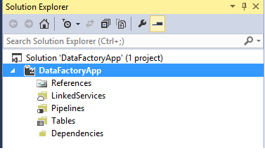
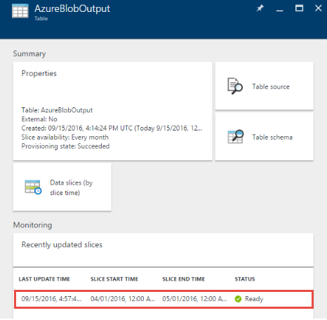

<properties
    pageTitle="Criar sua primeira fábrica de dados (Visual Studio) | Microsoft Azure"
    description="Neste tutorial, você cria um pipeline de fábrica do Azure dados de amostra usando o Visual Studio."
    services="data-factory"
    documentationCenter=""
    authors="spelluru"
    manager="jhubbard"
    editor="monicar"/>

<tags
    ms.service="data-factory"
    ms.workload="data-services"
    ms.tgt_pltfrm="na"
    ms.devlang="na"
    ms.topic="hero-article" 
    ms.date="10/17/2016"
    ms.author="spelluru"/>

# Tutorial: Criar seu primeiro Azure dados fábrica, usando o Microsoft Visual Studio
> [AZURE.SELECTOR]
- [Visão geral e os pré-requisitos](data-factory-build-your-first-pipeline.md)
- [Portal do Azure](data-factory-build-your-first-pipeline-using-editor.md)
- [O Visual Studio](data-factory-build-your-first-pipeline-using-vs.md)
- [PowerShell](data-factory-build-your-first-pipeline-using-powershell.md)
- [Modelo do Gerenciador de recursos](data-factory-build-your-first-pipeline-using-arm.md)
- [API REST](data-factory-build-your-first-pipeline-using-rest-api.md)

Neste artigo, você pode usar o Microsoft Visual Studio para criar sua primeira fábrica de dados do Azure.

## Pré-requisitos
1. Leia o artigo de [Visão geral do Tutorial](data-factory-build-your-first-pipeline.md) e conclua as etapas de **pré-requisito** .
2. Você deve ser um **administrador da assinatura do Azure** para poder publicar entidades de fábrica de dados do Visual Studio à fábrica de dados do Azure.
3. Você deve ter os seguintes programas instalados no seu computador: 
    - Visual Studio 2013 ou Visual Studio de 2015
    - Baixe o SDK do Azure para Visual Studio 2013 ou Visual Studio 2015. Navegue até a [Página de Download do Azure](https://azure.microsoft.com/downloads/) e clique **VS 2013** ou **VS 2015** na seção **.NET** .
    - Baixar o plug-in fábrica de dados do Azure mais recente para Visual Studio: [VS 2013](https://visualstudiogallery.msdn.microsoft.com/754d998c-8f92-4aa7-835b-e89c8c954aa5) ou o [VS 2015](https://visualstudiogallery.msdn.microsoft.com/371a4cf9-0093-40fa-b7dd-be3c74f49005). Você também pode atualizar o plug-in, fazendo o seguinte: no menu, clique em **Ferramentas** -> **extensões e atualizações** -> **Online** -> **Galeria do Visual Studio** -> **Ferramentas de fábrica de dados do Microsoft Azure para Visual Studio** -> **Atualizar**. 
 
Agora, vamos usar Visual Studio para criar uma fábrica de dados do Azure. 

## Criar um projeto do Visual Studio 
1. Abra o **Visual Studio 2013** ou **Visual Studio 2015**. Clique em **arquivo**, aponte para **novo**e clique em **projeto**. Você verá a caixa de diálogo **Novo projeto** .  
2. Na caixa de diálogo **Novo projeto** , selecione o modelo de **DataFactory** e clique em **Projeto de fábrica de dados vazio**.   

    

3. Insira um **nome** para o projeto, **local**e um nome para a **solução**e clique **Okey**.

    

## Criar serviços vinculados
Uma fábrica de dados pode ter um ou mais canais. Um pipeline pode ter uma ou mais atividades. Por exemplo, uma atividade de cópia para copiar dados de uma fonte para um armazenamento de dados de destino e uma atividade de HDInsight seção executar script de seção para transformar os dados de entrada. Consulte [armazena dados com suporte](data-factory-data-movement-activities.md##supported-data-stores-and-formats) para todas as fontes e receptores compatíveis com a atividade de cópia. Consulte [Serviços vinculados de computação](data-factory-compute-linked-services.md) para a lista de serviços de computação suportados pelo fábrica de dados. 

Nesta etapa, você vincular sua conta de armazenamento do Azure e um cluster de Azurehdinsight sob demanda sua fábrica de dados. A conta de armazenamento do Azure mantém os dados de entrada e saídos para o pipeline neste exemplo. O serviço de HDInsight vinculado é usado para executar o script de seção especificado na atividade do pipeline neste exemplo. Identificar quais dados store/computação serviços são usados no seu cenário e vincular desses serviços à fábrica dados criando serviços vinculados.  

Você pode especificar o nome e as configurações de fábrica dados mais tarde quando você publica sua solução de fábrica de dados.

#### Criar serviço de armazenamento do Azure vinculado
Nesta etapa, você pode vincular sua conta de armazenamento do Azure a sua fábrica de dados. Para este tutorial, você pode usar a mesma conta de armazenamento do Azure para armazenar dados de entrada/saída e o arquivo de script HQL. 

4. **Serviços vinculada** de atalho no solution explorer, aponte para **Adicionar**e clique em **Novo Item**.      
5. Na caixa de diálogo **Adicionar Novo Item** , selecione o **Serviço de vinculada de armazenamento do Azure** na lista e clique em **Adicionar**. 
3. Substitua o nome da sua conta de armazenamento do Azure e sua chave **accountname** e **accountkey** . Para saber como acessar sua chave de acesso de armazenamento, consulte [Exibir, copiar e as teclas de acesso do armazenamento gerar](../storage/storage-create-storage-account.md#view-copy-and-regenerate-storage-access-keys)

    

4. Salve o arquivo de **AzureStorageLinkedService1.json** .

#### Criar serviço Azurehdinsight vinculado
Nesta etapa, você pode vincular um cluster de HDInsight sob demanda a sua fábrica de dados. Cluster HDInsight é automaticamente criado no tempo de execução e excluído após a conclusão processamento e ocioso durante o período de tempo especificado. Você pode usar seu próprio cluster HDInsight em vez de usar um cluster de HDInsight sob demanda. Consulte [Calcular vinculadas Services](data-factory-compute-linked-services.md) para obter detalhes. 

1. No **Solution Explorer**, **Serviços vinculada**de atalho, aponte para **Adicionar**e clique em **Novo Item**.
2. Selecione **HDInsight no serviço vinculada de demanda**e clique em **Adicionar**. 
3. Substitua o **JSON** com o seguinte:

        {
          "name": "HDInsightOnDemandLinkedService",
          "properties": {
            "type": "HDInsightOnDemand",
            "typeProperties": {
              "version": "3.2",
              "clusterSize": 1,
              "timeToLive": "00:30:00",
              "linkedServiceName": "AzureStorageLinkedService1"
            }
          }
        }
    
    A tabela a seguir fornece descrições para as propriedades JSON usadas no trecho:
    
    Propriedade | Descrição
    -------- | -----------
    Versão | Especifica que a versão do HDInsight criado para ser 3,2. 
    ClusterSize | Especifica o tamanho do cluster HDInsight. 
    TimeToLive | Especifica que o tempo ocioso de cluster HDInsight, antes que seja excluída.
    linkedServiceName | Especifica a conta de armazenamento que é usada para armazenar os logs que são gerados pelo HDInsight

    Observe o seguinte: 
    
    - A fábrica de dados cria um cluster de HDInsight **baseado no Windows** para você com o JSON anterior. Você também poderia ter-criar um cluster de HDInsight **baseado em Linux** . Consulte [Serviço vinculada de HDInsight sob demanda](data-factory-compute-linked-services.md#azure-hdinsight-on-demand-linked-service) para obter detalhes. 
    - Você pode usar **seu próprio cluster HDInsight** em vez de usar um cluster de HDInsight sob demanda. Consulte [Serviço vinculada HDInsight](data-factory-compute-linked-services.md#azure-hdinsight-linked-service) para obter detalhes.
    - Cluster HDInsight cria um **contêiner padrão** no armazenamento de blob que você especificou no JSON (**linkedServiceName**). HDInsight não exclui este contêiner quando o cluster é excluído. Esse comportamento é por design. Com o serviço de HDInsight vinculado sob demanda, um cluster de HDInsight é criado sempre que uma fatia é processada, a menos que haja um cluster ao vivo existente (**timeToLive**). O cluster é excluído automaticamente quando o processamento é feito.
    
        Conforme mais fatias são processadas, você vê muitos contêineres em seu armazenamento de blob do Microsoft Azure. Se você não precisar delas para solução de problemas dos trabalhos, você talvez queira excluí-las para reduzir o custo de armazenamento. Os nomes desses contêineres seguem um padrão: "AAD**yourdatafactoryname**-**linkedservicename**- datetimestamp". Use ferramentas como o [Gerenciador de armazenamento da Microsoft](http://storageexplorer.com/) para excluir contêineres em seu armazenamento de blob do Microsoft Azure.

    Consulte [Serviço vinculada de HDInsight sob demanda](data-factory-compute-linked-services.md#azure-hdinsight-on-demand-linked-service) para obter detalhes. 
4. Salve o arquivo de **HDInsightOnDemandLinkedService1.json** .

## Criar conjuntos de dados
Nesta etapa, você criar conjuntos de dados para representar a entrada e saída de dados para processamento de seção. Esses conjuntos de dados consultem **AzureStorageLinkedService1** você tiver criado anteriormente neste tutorial. Os pontos de serviço vinculada a uma conta de armazenamento do Azure e conjuntos de dados especificar contêiner, pasta, nome do arquivo no armazenamento que contém a entrada e saída de dados.   

#### Criar entrada de conjunto de dados

1. No **Solution Explorer**, **tabelas**de atalho, aponte para **Adicionar**e clique em **Novo Item**. 
2. Selecione **Azure Blob** da lista, altere o nome do arquivo para **InputDataSet.json**e clique em **Adicionar**.
3. Substitua o **JSON** no editor com o seguinte: 

    No trecho de JSON, você está criando um dataset chamado **AzureBlobInput** que representa os dados de entrada para uma atividade no pipeline. Além disso, você especifica que os dados de entrada encontra-se no contêiner de blob chamado **adfgetstarted** e a pasta chamada **inputdata**
        
        {
            "name": "AzureBlobInput",
            "properties": {
                "type": "AzureBlob",
                "linkedServiceName": "AzureStorageLinkedService1",
                "typeProperties": {
                    "fileName": "input.log",
                    "folderPath": "adfgetstarted/inputdata",
                    "format": {
                        "type": "TextFormat",
                        "columnDelimiter": ","
                    }
                },
                "availability": {
                    "frequency": "Month",
                    "interval": 1
                },
                "external": true,
                "policy": {}
            }
        } 

    A tabela a seguir fornece descrições para as propriedades JSON usadas no trecho:

  	| Propriedade | Descrição |
  	| :------- | :---------- |
  	| tipo | A propriedade type é definida como AzureBlob porque os dados residem no armazenamento de blob do Microsoft Azure. |  
  	| linkedServiceName | refere-se a AzureStorageLinkedService1 que você criou anteriormente. |
  	| nome do arquivo | Essa propriedade é opcional. Se você omitir essa propriedade, todos os arquivos da folderPath são recebidos. Nesse caso, somente o input.log é processada. |
  	| tipo | Os arquivos de log estão em formato de texto, por isso usamos TextFormat. | 
  	| columnDelimiter | colunas nos arquivos de log são delimitadas pelo caractere de vírgula () |
  	| frequência/intervalo | frequência definida para o mês e o intervalo é 1, o que significa que as fatias de entrada estão disponíveis mensalmente. | 
  	| externo | Essa propriedade é definida como true se os dados de entrada não são gerados pelo serviço de dados fábrica. | 
      
    
3. Salve o arquivo de **InputDataset.json** . 

 
#### Criar conjunto de dados de saída
Agora, você cria o dataset de saída para representar os dados de saída armazenados no armazenamento de Blob do Azure. 

1. No **Solution Explorer**, **tabelas**de atalho, aponte para **Adicionar**e clique em **Novo Item**. 
2. Selecione **Azure Blob** da lista, altere o nome do arquivo para **OutputDataset.json**e clique em **Adicionar**. 
3. Substitua o **JSON** no editor com o seguinte: 

    No trecho de JSON, você está criando um conjunto de dados chamado **AzureBlobOutput**e especifica a estrutura dos dados que são geradas pelo script de seção. Além disso, você especificar que os resultados são armazenados no contêiner de blob chamado **adfgetstarted** e a pasta chamada **partitioneddata**. A seção de **disponibilidade** Especifica que o conjunto de dados de saída é produzido mensalmente.
    
        {
          "name": "AzureBlobOutput",
          "properties": {
            "type": "AzureBlob",
            "linkedServiceName": "AzureStorageLinkedService1",
            "typeProperties": {
              "folderPath": "adfgetstarted/partitioneddata",
              "format": {
                "type": "TextFormat",
                "columnDelimiter": ","
              }
            },
            "availability": {
              "frequency": "Month",
              "interval": 1
            }
          }
        }

    Consulte a seção de **criar o conjunto de dados de entrada** para descrições dessas propriedades. Você não definir a propriedade externa em um conjunto de dados de saída como o conjunto de dados é gerado pelo serviço de dados fábrica.

4. Salve o arquivo de **OutputDataset.json** .

### Crie pipeline
Nesta etapa, você pode criar sua primeira pipeline com uma atividade de **HDInsightHive** . A entrada fatia está disponível mensalmente (frequência: mês, intervalo: 1), fatia de saída é gerada mensalmente e a propriedade Agendador da atividade também é definida como mensal. As configurações para o conjunto de dados de saída e o Agendador de atividade devem corresponder. Atualmente, conjunto de dados de saída é o que orienta o cronograma, então você deve criar um conjunto de dados de saída, mesmo se a atividade não produzir qualquer saída. Se a atividade não assumir qualquer entrada, você pode ignorar a criação do dataset de entrada. As propriedades usadas em JSON a seguir são explicadas no final desta seção.

1. No **Solution Explorer**, clique com botão direito **canais**, aponte para **Adicionar**e clique em **Novo Item.** 
2. Selecione a **Seção Pipeline de transformação** da lista e clique em **Adicionar**. 
3. Substitua o **JSON** o trecho a seguir.

    > [AZURE.IMPORTANT] Substitua **storageaccountname** com o nome da sua conta de armazenamento.

        {
            "name": "MyFirstPipeline",
            "properties": {
                "description": "My first Azure Data Factory pipeline",
                "activities": [
                    {
                        "type": "HDInsightHive",
                        "typeProperties": {
                            "scriptPath": "adfgetstarted/script/partitionweblogs.hql",
                            "scriptLinkedService": "AzureStorageLinkedService1",
                            "defines": {
                                "inputtable": "wasb://adfgetstarted@<storageaccountname>.blob.core.windows.net/inputdata",
                                "partitionedtable": "wasb://adfgetstarted@<storageaccountname>.blob.core.windows.net/partitioneddata"
                            }
                        },
                        "inputs": [
                            {
                                "name": "AzureBlobInput"
                            }
                        ],
                        "outputs": [
                            {
                                "name": "AzureBlobOutput"
                            }
                        ],
                        "policy": {
                            "concurrency": 1,
                            "retry": 3
                        },
                        "scheduler": {
                            "frequency": "Month",
                            "interval": 1
                        },
                        "name": "RunSampleHiveActivity",
                        "linkedServiceName": "HDInsightOnDemandLinkedService"
                    }
                ],
                "start": "2016-04-01T00:00:00Z",
                "end": "2016-04-02T00:00:00Z",
                "isPaused": false
            }
        }

    No trecho de JSON, você está criando um pipeline que consiste em uma única atividade que usa a seção para processar dados em um cluster de HDInsight.
    
    No trecho de JSON, você está criando um pipeline que consiste em uma única atividade que usa a seção para processar dados em um cluster de HDInsight.
    
    O arquivo de script da seção, **partitionweblogs.hql**, está armazenado na conta de armazenamento do Azure (especificado por scriptLinkedService, chamado **AzureStorageLinkedService1**) e na pasta de **script** no contêiner **adfgetstarted**.

    A seção **define** é usada para especificar as configurações de tempo de execução que são passadas para o script de seção como valores de configuração de seção (por exemplo ${hiveconf: inputtable}, ${hiveconf:partitionedtable}).

    As propriedades de **início** e **fim** do pipeline Especifica o período ativo do pipeline.

    A atividade de JSON, você especificar que o script de seção é executado na computação especificada pela **linkedServiceName** – **HDInsightOnDemandLinkedService**.

    > [AZURE.NOTE] Consulte [Anatomia de um canal](data-factory-create-pipelines.md#anatomy-of-a-pipeline) para obter detalhes sobre propriedades JSON usadas no exemplo. 
3. Salve o arquivo de **HiveActivity1.json** .

### Adicionar partitionweblogs.hql e input.log como uma dependência 

1. **Dependências** na janela **Gerenciador de solução** de atalho, aponte para **Adicionar**e clique em **Novo Item**.  
2. Navegue até o **C:\ADFGettingStarted** selecione **partitionweblogs.hql**, arquivos de **input.log** e clique em **Adicionar**. Você criou esses dois arquivos como parte do pré-requisitos do [Tutorial visão geral](data-factory-build-your-first-pipeline.md).

Quando você publica a solução na próxima etapa, o arquivo **partitionweblogs.hql** é carregado para a pasta de scripts no contêiner de blob **adfgetstarted** .   

### Publicar/implantar entidades de fábrica de dados

18. Clique com botão direito projeto no Solution Explorer e clique em **Publicar**. 
19. Se você vir a caixa de diálogo **entrar sua conta da Microsoft** , insira suas credenciais para a conta que tem a assinatura do Azure e clique em **entrar**.
20. Você verá a caixa de diálogo a seguir:

    

21. Na página Configurar dados fábrica, faça o seguinte: 
    1. Selecione a opção **Criar nova fábrica de dados** .
    2. Insira um **nome** de exclusivo para a fábrica de dados. Por exemplo: **FirstDataFactoryUsingVS09152016**. O nome deve ser exclusivo.  
    
    
        > [AZURE.IMPORTANT] Se você receber o erro **nome de fábrica de dados "FirstDataFactoryUsingVS" não está disponível** durante a publicação, altere o nome (por exemplo, yournameFirstDataFactoryUsingVS). Consulte o tópico de [Dados Factory - regras de nomenclatura](data-factory-naming-rules.md) para regras de nomenclatura para artefatos de fábrica de dados.
3. Selecione a assinatura certa para o campo de **assinatura** .
     
     
        > [AZURE.IMPORTANT] Se você não vir qualquer assinatura, certifique-se de que você está conectado usando uma conta que seja um administrador ou co-da assinatura.  
        
    4. Selecione o **grupo de recursos** para a fábrica de dados a ser criado. 
    5. Selecione a **região** para a fábrica de dados. 
    6. Clique em **próximo** para alternar para a página **Publicar itens** . (Pressione **TAB** para tira o campo nome para se o botão **Avançar** ficará desabilitado.) 
23. Na página **Publicar itens** , certifique-se de que todas as fábricas de dados entidades estão selecionadas e clique em **próximo** para alternar para a página de **Resumo** .     
24. Revise o resumo e clique em **Avançar** para iniciar o processo de implantação e exibir o **Status da implantação**.
25. Na página de **Status de implantação** , você deve ver o status do processo de implantação. Clique em Concluir após a conclusão da implantação. 

 
Pontos importantes a Observação: 

- Se você receber o erro: "**esta assinatura não está registrada para usar o namespace Microsoft.DataFactory**", siga um destes procedimentos e tente publicar novamente: 

    - No Azure PowerShell, execute o seguinte comando para registrar o provedor de dados fábrica. 
        
            Register-AzureRmResourceProvider -ProviderNamespace Microsoft.DataFactory
    
        Você pode executar o seguinte comando para confirmar que a fábrica de dados provedor está registrado. 
    
            Get-AzureRmResourceProvider
    - Faça logon usando a assinatura Azure no [portal do Azure](https://portal.azure.com) e navegue até uma lâmina de fábrica de dados (ou) criar uma fábrica de dados no portal do Azure. Esta ação registra automaticamente o provedor para você.
-   O nome da fábrica dados pode ser registrado como um nome DNS no futuro e, portanto, ficam visível publicamente.
-   Para criar instâncias de fábrica de dados, você precisa ser um administrador ou co-da assinatura do Azure

 
## Pipeline de monitor

### Pipeline de monitor usando o modo de exibição de diagrama
6. Faça logon [portal do Azure](https://portal.azure.com/), faça o seguinte:
    1. Clique em **mais serviços** e **fábricas de dados**.
         
    2. Selecione o nome da sua fábrica de dados (por exemplo: **FirstDataFactoryUsingVS09152016**) na lista de fábricas de dados. 
        
7. Na página inicial de sua fábrica de dados, clique em **diagrama**.
  
    
7. No modo de exibição de diagrama, você vê uma visão geral dos canais e conjuntos de dados usados neste tutorial.
    
     
8. Para exibir todas as atividades no pipeline, pipeline no diagrama de atalho e clique em Abrir Pipeline. 

    
9. Confirme que você verá a atividade de HDInsightHive no pipeline. 
  
    

    Para navegar de volta para o modo de exibição anterior, clique em **fábrica de dados** no menu de navegação estrutural na parte superior. 
10. Na **Exibição de diagrama**, clique duas vezes o conjunto de dados **AzureBlobInput**. Confirme se a fatia está no estado **pronto** . Pode levar alguns minutos para que a fatia aparecem no estado pronto. Caso ele não após você espera um dia, veja se você tem o arquivo de entrada (input.log) colocado no contêiner direita (adfgetstarted) e a pasta (inputdata).

    
11. Clique no **X** para fechar **AzureBlobInput** blade. 
12. Na **Exibição de diagrama**, clique duas vezes o conjunto de dados **AzureBlobOutput**. Você verá que a fatia que no momento está sendo processada.

    
9. Quando o processamento é feito, você verá a fatia no estado **pronto** .

    > [AZURE.IMPORTANT] Criação de um cluster de HDInsight sob demanda normalmente leva um dia (aproximadamente 20 minutos). Portanto, espere o pipeline leva **aproximadamente 30 minutos** para processar na fatia.  

     
    
10. Quando a fatia está no estado **pronto** , verifique a pasta **partitioneddata** no contêiner de **adfgetstarted** em seu armazenamento de blob para os dados de saída.  
 
    
11. Clique na fatia para ver detalhes sobre ela em uma lâmina **fatia de dados** .

      
12. Clique em uma atividade executar na **lista de execuções de atividades** para ver detalhes sobre uma atividade executados (atividade de seção em nosso cenário) em uma janela de **atividade execução detalhes** .   
      
    
    Dos arquivos de log, você pode ver as informações de status e a consulta de seção que foi executada. Esses logs são úteis para a solução de problemas.  
 

Consulte [pipeline e conjuntos de dados do Monitor](data-factory-monitor-manage-pipelines.md) para obter instruções sobre como usar o portal do Azure para monitorar o pipeline e conjuntos de dados que você criou neste tutorial.

### Pipeline de monitor usando o Monitor & Gerenciar App
Você também pode usar o Monitor & Gerenciar aplicativo para monitorar seus canais. Para obter informações detalhadas sobre como usar este aplicativo, consulte [Monitor e gerenciar canais de fábrica de dados do Azure usando o monitoramento e gerenciamento de aplicativo](data-factory-monitor-manage-app.md).

1. Clique em Monitor e gerenciar bloco.

     
2. Você deve ver Monitor & Gerenciar aplicativos. Alterar a **hora de início** e **hora de término** para corresponder ao início (04-01-2016 12:00 AM) e término (04-02-2016 12:00 AM) do pipeline e clique em **Aplicar**.

     
3. Selecione uma janela de atividade na lista atividade Windows para ver detalhes sobre ele. 
    

> [AZURE.IMPORTANT] O arquivo de entrada é excluído quando a fatia é processada com êxito. Portanto, se você quiser executar novamente na fatia ou faça o tutorial novamente, carregue o arquivo de entrada (input.log) na pasta inputdata do contêiner adfgetstarted.
 

## Usar Server Explorer para exibir fábricas de dados

1. No **Visual Studio**, clique em **modo de exibição** no menu e clique em **Server Explorer**.
2. Na janela Gerenciador de servidor, expanda **Azure** e expanda **Fábrica de dados**. Se você vir **entrar no Visual Studio**, insira a **conta** associada a sua assinatura do Azure e clique em **continuar**. Insira a **senha**e clique em **entrar**. Visual Studio tenta obter informações sobre todas as fábricas Azure dados em sua assinatura. Você ver o status dessa operação na janela de **Lista de tarefas de fábrica de dados** .

    
3. Você pode uma fábrica de dados de atalho e selecione **Exportar fábrica de dados para o novo projeto** para criar um projeto do Visual Studio com base em uma fábrica de dados existente.

    

## Atualizar ferramentas de dados fábrica para Visual Studio

Para atualizar ferramentas de fábrica de dados do Azure para Visual Studio, faça o seguinte:

1. No menu clique em **Ferramentas** e selecione **extensões e atualizações**.
2. Selecione **as atualizações** no painel esquerdo e selecione **Galeria do Visual Studio**.
3. Selecione **Ferramentas de fábrica de dados do Azure para Visual Studio** e clique em **Atualizar**. Se você não vir essa entrada, você já tem a versão mais recente das ferramentas. 

## Usar arquivos de configuração
Você pode usar arquivos de configuração no Visual Studio para configurar propriedades vinculadas serviços/tabelas/canais diferentes para cada ambiente. 

Considere a seguinte definição de JSON para um serviço de armazenamento do Azure vinculado. Para especificar **connectionString** com valores diferentes para accountname e accountkey com base no ambiente de (teste/desenvolvimento/produção) no qual você está implantando entidades de fábrica de dados. Você pode obter esse comportamento usando arquivo de configuração separada para cada ambiente. 

    {
        "name": "StorageLinkedService",
        "properties": {
            "type": "AzureStorage",
            "description": "",
            "typeProperties": {
                "connectionString": "DefaultEndpointsProtocol=https;AccountName=<accountname>;AccountKey=<accountkey>"
            }
        }
    } 

### Adicionar um arquivo de configuração
Adicione um arquivo de configuração para cada ambiente, executando as seguintes etapas:   

1. O projeto de fábrica de dados em sua solução do Visual Studio de atalho, aponte para **Adicionar**e clique em **novo item**.
2. Selecione **Config** na lista de modelos instalados à esquerda, selecione o **Arquivo de configuração**, digite um **nome** para o arquivo de configuração e clique em **Adicionar**.

    
3. Adicione parâmetros de configuração e seus valores no seguinte formato.

        {
            "$schema": "http://datafactories.schema.management.azure.com/vsschemas/V1/Microsoft.DataFactory.Config.json",
            "AzureStorageLinkedService1": [
                {
                    "name": "$.properties.typeProperties.connectionString",
                    "value": "DefaultEndpointsProtocol=https;AccountName=<accountname>;AccountKey=<accountkey>"
                }
            ],
            "AzureSqlLinkedService1": [
                {
                    "name": "$.properties.typeProperties.connectionString",
                    "value":  "Server=tcp:spsqlserver.database.windows.net,1433;Database=spsqldb;User ID=spelluru;Password=Sowmya123;Trusted_Connection=False;Encrypt=True;Connection Timeout=30"
                }
            ]
        }

    Este exemplo configura a propriedade connectionString de um serviço de armazenamento do Azure vinculado e um serviço SQL Azure vinculado. Observe que a sintaxe para especificar o nome é [JsonPath](http://goessner.net/articles/JsonPath/).   

    Se JSON tem uma propriedade que tem uma matriz de valores como mostrado no código a seguir:  

        "structure": [
            {
                "name": "FirstName",
                "type": "String"
            },
            {
                "name": "LastName",
                "type": "String"
            }
        ],
    
    Configure propriedades conforme mostrado no seguinte arquivo de configuração (usar indexação com base em zero): 
        
        {
            "name": "$.properties.structure[0].name",
            "value": "FirstName"
        }
        {
            "name": "$.properties.structure[0].type",
            "value": "String"
        }
        {
            "name": "$.properties.structure[1].name",
            "value": "LastName"
        }
        {
            "name": "$.properties.structure[1].type",
            "value": "String"
        }

### Nomes de propriedades com espaços
Se um nome de propriedade tiver espaços, use colchetes, conforme mostrado no exemplo a seguir (nome do servidor de banco de dados): 

     {
         "name": "$.properties.activities[1].typeProperties.webServiceParameters.['Database server name']",
         "value": "MyAsqlServer.database.windows.net"
     }

### Implantar solução usando uma configuração
Quando você estiver publicando entidades de fábrica de dados do Azure no VS, você pode especificar a configuração que você deseja usar para essa operação de publicação. 

Para publicar entidades em um projeto de fábrica de dados do Azure usando arquivo de configuração:   

1. Projeto de fábrica de dados de atalho e clique em **Publicar** para ver a caixa de diálogo **Publicar itens** . 
2. Selecione uma fábrica de dados existentes ou especificar valores para a criação de uma fábrica de dados na página **Configurar fábrica de dados** e clique em **Avançar**.   
3. Na página **Publicar itens** : você verá uma lista suspensa com configurações disponíveis para o campo **Selecione Config de implantação** .

    

4. Selecione o **arquivo de configuração** que você deseja usar e clique em **Avançar**. 
5. Confirme se você ver o nome do arquivo JSON na página de **Resumo** e clique em **Avançar**. 
6. Clique em **Concluir** após a conclusão da operação de implantação. 

Quando você implanta, os valores do arquivo de configuração são usados para definir valores para propriedades nos arquivos JSON para entidades de fábrica de dados antes das entidades são implantadas em serviço de fábrica de dados do Azure.   

## Resumo 
Neste tutorial, você criou uma fábrica de dados do Azure para processar dados executando o script de seção em um cluster de hadoop HDInsight. Você usou o Editor de fábrica de dados no portal do Azure para fazer as seguintes etapas:  

1.  Criou uma **fábrica de dados**do Azure.
2.  Criou dois **Serviços vinculados**:
    1.  Serviço de **Armazenamento do azure** vinculado para vincular seu armazenamento de blob do Microsoft Azure que contém os arquivos de entrada/saída à fábrica dados.
    2.  Serviço vinculado de sob demanda de **Azurehdinsight** para vincular a um cluster de HDInsight Hadoop sob demanda à fábrica dados. Azure Data Factory cria um HDInsight Hadoop cluster just-in-time para processar dados de entrada e produzir dados de saída. 
3.  Criada dois **conjuntos de dados**, que descrevem dados de entrada e saídos para atividade de HDInsight seção no pipeline. 
4.  Criado um **pipeline** com uma atividade de **Seção de HDInsight** .  

## Próximas etapas
Neste artigo, você criou um pipeline com uma atividade de transformação (HDInsight atividade) que executa um script de seção em um cluster de HDInsight sob demanda. Para ver como usar uma atividade de cópia para copiar dados de um Blob do Azure para SQL Azure, consulte [Tutorial: copiar dados de um Azure blob para SQL Azure](data-factory-copy-data-from-azure-blob-storage-to-sql-database.md).
  
## Consulte também
| Tópico | Descrição |
| :---- | :---- |
| [Atividades de transformação de dados](data-factory-data-transformation-activities.md) | Este artigo fornece uma lista de atividades de transformação de dados (como HDInsight seção transformação usada neste tutorial) suportados pelo fábrica de dados do Azure. | 
| [Planejamento e à execução](data-factory-scheduling-and-execution.md) | Este artigo explica os aspectos de programação e a execução do modelo de aplicativo de fábrica de dados do Azure. |
| [Canais](data-factory-create-pipelines.md) | Este artigo ajuda você a entender canais e atividades em fábrica de dados do Azure e como usá-las para construir ponta a ponta fluxos de trabalho orientados a dados para sua situação ou empresa. |
| [Conjuntos de dados](data-factory-create-datasets.md) | Este artigo ajuda você a entender conjuntos de dados em fábrica de dados do Azure.
| [Monitorar e gerenciar canais usando o aplicativo de monitoramento](data-factory-monitor-manage-app.md) | Este artigo descreve como monitorar, gerenciar e depurar canais usando o monitoramento e gerenciamento de aplicativo. 
