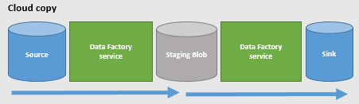
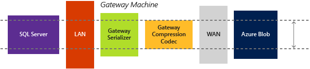
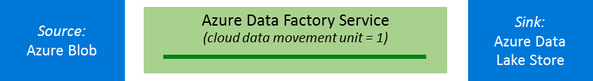

<properties
    pageTitle="Copiar guia ajuste e desempenho de atividade | Microsoft Azure"
    description="Saiba mais sobre os principais fatores que afetam o desempenho de movimentação de dados em fábrica de dados do Azure, quando você usa a atividade de cópia."
    services="data-factory"
    documentationCenter=""
    authors="linda33wj"
    manager="jhubbard"
    editor="monicar"/>

<tags
    ms.service="data-factory"
    ms.workload="data-services"
    ms.tgt_pltfrm="na"
    ms.devlang="na"
    ms.topic="article"
    ms.date="10/25/2016"
    ms.author="jingwang"/>

# Copiar guia ajuste e desempenho de atividade
Atividade de cópia do Azure dados fábrica oferece um primeira classe seguro, confiável e alto desempenho carregamento de dados solução. Ele permite que você copiar dezenas de terabytes de dados todos os dias em uma grande variedade de nuvem e armazenamentos de dados locais. Desempenho de carregamento de dados de rápido são fundamental para garantir que você pode focalizar o problema de "grandes dados" núcleo: criação de soluções de análise avançada e Obtendo ideias profunda de todos esses dados.

Azure fornece um conjunto de nível empresarial soluções de depósito de dados e armazenamento de dados e atividade de cópia oferece um experiência que seja fácil de configurar e de carregamento de dados altamente otimizados. Com apenas uma atividade de cópia única, você pode obter:

- Carregar dados em **Depósito de dados do SQL Azure** em **1.2 GBps**
- Carregar dados para **armazenamento de Blob do Azure** em **1.0 GBps**
- Carregar dados para **Armazenamento de Lucerne de dados do Azure** em **1.0 GBps**

Este artigo descreve:

- [Números de referência de desempenho](#performance-reference) de origem com suporte e os dados de receptor armazena para ajudá-lo a planejar seu projeto;
- Recursos que podem aumentar a produtividade de cópia em cenários diferentes, incluindo [cópia paralela](#parallel-copy), [unidades de movimentação de dados de nuvem](#cloud-data-movement-units)e [transferidos cópia](#staged-copy);
- [Diretrizes de ajuste de desempenho](#performance-tuning-steps) sobre como ajustar o desempenho e os principais fatores que podem afetar o desempenho de cópia.

> [AZURE.NOTE] Se você não estiver familiarizado com a atividade de cópia em geral, consulte [mover dados usando Copiar atividade](data-factory-data-movement-activities.md) antes de ler este artigo.

## Referência de desempenho

> [AZURE.NOTE] Você pode obter maior produtividade aproveitando mais unidades de movimentação de dados (DMUs) do padrão DMUs máximos, que é 8 para uma atividade de cópia de nuvem para nuvem executar. Por exemplo, com 100 DMUs, você pode copiar dados do Azure Blob para armazenamento de Lucerne do Azure dados a uma taxa de 1 gigabyte por segundo. Consulte a seção de [unidades de movimentação de dados de nuvem](#cloud-data-movement-units) para obter detalhes sobre esse recurso. Contate o [suporte do Azure](https://azure.microsoft.com/support/) solicitar DMUs mais.

Pontos de nota:

- Produtividade é calculada usando a seguinte fórmula: [tamanho dos dados de leitura de fonte] / [duração da execução de atividade cópia].
- Os números de referência de desempenho na tabela foram medidos usando o conjunto de dados [TPC-H](http://www.tpc.org/tpch/) em uma atividade de cópia única executar.
- Para copiar entre armazenamentos de dados de nuvem, defina **cloudDataMovementUnits** para 1 e 4 (ou 8) para comparação. **parallelCopies** não está especificado. Consulte a seção de [cópia paralela](#parallel-copy) para obter detalhes sobre esses recursos.
- Em armazenamentos de dados Azure, a fonte e o receptor estão na mesma região Azure.
- Híbrida (local a nuvem ou nuvem para o local) movimentação de dados, uma única instância do gateway estava em execução em um computador que foi separado do armazenamento de dados local. A configuração está listada na tabela a seguir. Quando uma única atividade estava em execução no gateway, a operação de cópia consumida apenas uma pequena parte da CPU, memória ou largura de banda de rede na máquina de teste.
    <table>
    <tr>
        <td>CPU</td>
        <td>32 núcleos 2,20 GHz Intel Xeon E5-2660 v2</td>
    </tr>
    <tr>
        <td>Memória</td>
        <td>128 GB</td>
    </tr>
    <tr>
        <td>Rede</td>
        <td>Interface de Internet: 10 Gbps; interface de intranet: 40 Gbps</td>
    </tr>
    </table>

## Cópia paralela
Você pode ler dados de origem ou gravar dados para o destino **em paralelo dentro de uma atividade de cópia executar**. Esse recurso melhora a produtividade de uma operação de cópia e reduz o tempo necessário para mover dados.

Esta configuração é diferente da propriedade **concorrência** na definição da atividade. A propriedade de **concorrência** determina o número de **que atividade de cópia simultânea é executado** para processar dados do windows de atividade diferente (AM de 1 a 2 AM, 2 AM 3 AM, 3 AM para 4 AM e assim por diante). Esse recurso é útil quando você executa uma carga histórica. A capacidade de cópia paralela aplica-se a uma **única atividade executar**.

Vamos examinar um cenário de exemplo. No exemplo a seguir, várias fatias do passado precisam ser processada. Dados fábrica executa uma instância de atividade de cópia (executar uma atividade) para cada fatia:

- A fatia de dados da janela de atividade primeira (AM de 1 a 2 AM) = = > atividade executar 1
- A fatia de dados da janela de atividade segunda (AM de 2 a 3 AM) = = > atividade executada 2
- A fatia de dados da janela de atividade segunda (3 AM para 4 AM) = = > atividade executar 3

E assim por diante.

Neste exemplo, quando o valor de **concorrência** é definido como 2, **atividade executar 1** e **atividade executar 2** copiem dados de duas atividades windows **simultaneamente** para melhorar o desempenho de movimentação de dados. No entanto, se vários arquivos associados à atividade executar 1, o serviço de movimentação de dados copia arquivos da origem para o arquivo de destino um por vez.

### parallelCopies
Você pode usar a propriedade **parallelCopies** para indicar o paralelismo que você deseja copiar atividade para usar. Você pode pensar essa propriedade como o número máximo de segmentos dentro de atividade de cópia que pode ler sua fonte ou gravar sua armazenamentos de dados receptor em paralelo.

Para cada atividade de cópia executar, Data Factory determina o número de cópias paralelas usar para copiar os dados da fonte de dados armazenam e para os dados de destino armazenam. O número padrão de cópias paralelos que ele usa depende do tipo de fonte e receptor que você está usando.  

Origem e receptor |   Contagem de cópia paralela padrão determinada pelo serviço
------------- | -------------------------------------------------
Copiar dados entre armazenamentos baseados em arquivos (armazenamento de Blob; Armazenamento de Lucerne de dados; Amazon S3. um sistema de arquivos local; HDFS um local) | Entre 1 e 32. Depende do tamanho dos arquivos e o número de unidades de movimentação de dados de nuvem (DMUs) usado para copiar dados entre dois armazenamentos de dados de nuvem ou a configuração física da máquina Gateway usada para obter uma cópia de híbrido (para copiar dados de ou para um armazenamento de dados local).
Copiar dados de **armazenam os dados de origem para o armazenamento de tabela do Azure** | 4
Todos os outros pares de origem e receptor | 1

Geralmente, o comportamento padrão deve fornecer a melhor taxa de transferência. No entanto controlar a carga em máquinas que hospeda seus dados armazena ou para ajustar o desempenho de cópia, você pode optar por substituir o valor padrão e especificar um valor para a propriedade de **parallelCopies** . O valor deve estar entre 1 e 32 (ambos inclusivo). Em tempo de execução para o melhor desempenho, atividade de cópia usa um valor que é menor ou igual ao valor que você definir.

    "activities":[  
        {
            "name": "Sample copy activity",
            "description": "",
            "type": "Copy",
            "inputs": [{ "name": "InputDataset" }],
            "outputs": [{ "name": "OutputDataset" }],
            "typeProperties": {
                "source": {
                    "type": "BlobSource",
                },
                "sink": {
                    "type": "AzureDataLakeStoreSink"
                },
                "parallelCopies": 8
            }
        }
    ]

Pontos de nota:

- Quando você copia dados entre armazenamentos baseados em arquivos, paralelismo acontece no nível do arquivo. Não há nenhum agrupamento em um único arquivo. O número real de cópias paralelas usa o serviço de movimentação de dados para a operação de cópia em tempo de execução não é maior que o número de arquivos que você tem. Se o comportamento de copiar **mergeFile**, atividade de cópia não pode aproveitar paralelismo.
- Quando você especifica um valor para a propriedade **parallelCopies** , considere o aumento de carga no seu armazenamento de dados de origem e receptor e ao gateway se for uma cópia de híbrido. Isso acontece especialmente quando você tem várias atividades ou simultâneas execuções das mesmas atividades que são executadas em relação ao mesmo armazenamento de dados. Se você perceber que o armazenamento de dados ou o Gateway está sobrecarregado com a carga, diminua o valor de **parallelCopies** para alivia a carga.
- Quando você copia dados de lojas que não são baseados em arquivo para armazenamentos que são baseados em arquivo, o serviço de movimentação de dados ignora a propriedade **parallelCopies** . Mesmo se paralelismo for especificado, ela não é aplicada nesse caso.

> [AZURE.NOTE] Você deve usar o Gateway de gerenciamento de dados versão 1.11 ou posterior para usar o recurso de **parallelCopies** ao fazer uma cópia de híbrido.

### Unidades de movimentação de dados de nuvem
Uma **unidade de movimentação de dados de nuvem (DMU —)** é uma medida que representa a potência (uma combinação de CPU, memória e alocação de recursos de rede) de uma única unidade na fábrica de dados. Um DMU — pode ser usado em uma operação de cópia de nuvem na nuvem, mas não em uma cópia de híbrido.

Por padrão, o Data Factory usa uma única nuvem DMU — para realizar uma única atividade de cópia executar. Para substituir esse padrão, especifique um valor para a propriedade **cloudDataMovementUnits** da seguinte maneira. Para obter informações sobre o nível de ganho de desempenho que você pode receber quando você configura mais unidades para uma fonte de cópia específica e receptor, consulte a [referência de desempenho](#performance-reference).

    "activities":[  
        {
            "name": "Sample copy activity",
            "description": "",
            "type": "Copy",
            "inputs": [{ "name": "InputDataset" }],
            "outputs": [{ "name": "OutputDataset" }],
            "typeProperties": {
                "source": {
                    "type": "BlobSource",
                },
                "sink": {
                    "type": "AzureDataLakeStoreSink"
                },
                "cloudDataMovementUnits": 4
            }
        }
    ]

Os **valores permitidos** para a propriedade **cloudDataMovementUnits** são 1 (padrão), 2, 4 e 8. O **número real de nuvem DMUs** que usa a operação de cópia em tempo de execução é igual ou menor que o valor configurado, dependendo do seu padrão de dados. 

> [AZURE.NOTE] Se precisar de mais nuvem DMUs para uma taxa de transferência maior, contate o [suporte do Azure](https://azure.microsoft.com/support/). Configuração de 8 e acima atualmente funciona apenas quando você copia vários arquivos de armazenamento de Blob para armazenamento de Blob, Data Lucerne Store ou banco de dados do SQL Azure, e o tamanho do arquivo é maior que ou igual a 16 MB individualmente.

Melhor usar essas duas propriedades e para aprimorar a taxa de transferência de movimentação de dados, consulte a [amostra casos de uso](#case-study-use-parallel-copy). Você não precisa configurar **parallelCopies** para aproveitar o comportamento padrão. Se você configurar e **parallelCopies** é muito pequeno, nuvem várias DMUs pode não ser totalmente utilizado.  

É **importante** lembrar que cobrado com base no período de tempo total da operação de cópia. Se um trabalho de cópia costumava levar uma hora com unidade de uma nuvem e agora ele leva 15 minutos com quatro unidades de nuvem, a fatura geral permanece quase o mesmo. Por exemplo, você pode usar quatro unidades de nuvem. A primeira unidade de nuvem gasta 10 minutos, o outro, 10 minutos, o terceiro, 5 minutos e uma quarta, 5 minutos, todas em uma atividade de cópia executam. Cobrado para o tempo de cópia total (movimentação de dados), que é de 10 + 10 + 5 + 5 = 30 minutos. Usar **parallelCopies** não afeta a cobrança.

## Copiar em estágios
Quando você copia dados de um armazenamento de dados de origem para um armazenamento de dados de receptor, você pode optar por usar o armazenamento de Blob como um armazenamento temporário provisório. Preparação é especialmente útil nos seguintes casos:

1.  **Você deseja incluir dados de várias fontes de dados para SQL Data Warehouse via PolyBase**. SQL Data Warehouse usa PolyBase como um mecanismo de alta produtividade para carregar uma grande quantidade de dados em um depósito de dados do SQL. No entanto, os dados de origem devem estar no armazenamento de Blob e ele deve atender aos critérios adicionais. Quando você carrega dados de um armazenamento de dados diferente de armazenamento de Blob, você pode ativar a cópia via provisório armazenamento de Blob preparação de dados. Nesse caso, a Data Factory executa as transformações de dados necessários para garantir que ela atende aos requisitos de PolyBase. Em seguida, ele usa PolyBase para carregar dados em um depósito de dados do SQL. Para obter mais detalhes, consulte [Usar PolyBase para carregar dados depósito de dados do SQL Azure](data-factory-azure-sql-data-warehouse-connector.md#use-polybase-to-load-data-into-azure-sql-data-warehouse).
2.  **Às vezes, leva algum tempo para realizar um movimento de dados híbridos (ou seja, para copiar entre os dados de um local store e um dados de nuvem armazenam) sobre uma conexão de rede lenta**. Para melhorar o desempenho, você poderá compactar as dados locais para que ele leva menos tempo para mover dados para o armazenamento de dados temporário na nuvem. Em seguida, você pode descompactar os dados na loja de preparação antes de carregá-lo no repositório de dados de destino.
3.  **Você não deseja abrir portas diferente de portas 80 e 443 em seu firewall, devido a políticas corporativas de TI**. Por exemplo, quando você copia dados de um armazenamento de dados local para um receptor de banco de dados do Azure SQL ou um receptor de depósito de dados do SQL Azure, você precisa ativar comunicação de saída TCP na porta 1433 para o firewall do Windows e do firewall corporativo. Neste cenário, tirar proveito do gateway para primeiro copiar dados para uma instância de teste de armazenamento de Blob sobre HTTP ou HTTPS na porta 443. Em seguida, carrega os dados no banco de dados SQL ou SQL Data Warehouse de teste de armazenamento de Blob. Nesse fluxo, não é necessário ativar a porta 1433.

### Funciona como em estágios de cópia
Quando você ativa o recurso de teste, primeiro os dados são copiados do armazenamento de dados de origem para o armazenamento de dados temporário (trazer seu próprio). Em seguida, os dados são copiados do armazenamento de dados de teste para o armazenamento de dados do receptor. Dados fábrica gerencia automaticamente o fluxo de dois estágios para você. Fábrica de dados também limpa dados temporários do armazenamento temporário após a movimentação de dados é concluída.

O cenário de cópia de nuvem (origem e receptor dados armazena estiverem na nuvem), o gateway não é usado. O serviço de dados fábrica executa as operações de cópia.

No cenário híbrida cópia (origem local e receptor seja na nuvem), o gateway move dados do armazenamento de dados de origem para um armazenamento de dados de teste. Serviço de fábrica de dados move dados do armazenamento de dados de teste para o armazenamento de dados do receptor. Copiar dados de um armazenamento de dados de nuvem para um armazenamento de dados local por meio de preparação também há suporte para o fluxo de inversa.

Quando você ativa a movimentação de dados usando um armazenamento temporário, você pode especificar se deseja que os dados a ser compactado antes de mover dados do armazenamento de dados de origem para um armazenamento de dados provisório ou teste e, em seguida, descompactado antes de mover dados de um provisório ou armazenamento de dados para o armazenamento de dados de receptor de teste.

Atualmente, você não pode copiar dados entre dois armazenamentos de dados local usando um armazenamento temporário. Esperamos que essa opção estará disponível em breve.

### Configuração
Defina a configuração de **enableStaging** em atividade de cópia para especificar se deseja que os dados a ser transferidos no armazenamento de Blob antes de carregá-lo em um armazenamento de dados de destino. Quando você definir **enableStaging** como TRUE, especifique as propriedades adicionais listadas na tabela a seguir. Se você não tiver um, você também precisa criar um armazenamento do Azure ou armazenamento compartilhado serviço vinculado a assinatura de acesso para preparação.

Propriedade | Descrição | Valor padrão | Necessário
--------- | ----------- | ------------ | --------
**enableStaging** | Especifique se você deseja copiar dados por meio de um repositório de teste de provisório. | FALSO | Não
**linkedServiceName** | Especifique o nome de um [AzureStorage](data-factory-azure-blob-connector.md#azure-storage-linked-service) ou [AzureStorageSas](data-factory-azure-blob-connector.md#azure-storage-sas-linked-service) serviço vinculado, que se refere a instância do armazenamento que você usar como uma loja de preparação provisória.    Você não pode usar o armazenamento com uma assinatura de acesso compartilhado para carregar dados em SQL Data Warehouse via PolyBase. Você pode usá-lo em todos os outros cenários. | N/D | Sim, quando **enableStaging** é definida como TRUE
**caminho** | Especifique o caminho de armazenamento de Blob que você deseja que contenha os dados em estágios. Se você não fornecer um caminho, o serviço cria um contêiner para armazenar dados temporários.    Especifica um caminho somente se você usar o armazenamento com uma assinatura de acesso compartilhado ou você exige dados temporários estar em um local específico. | N/D | Não
**enableCompression** | Especifica se os dados devem ser compactados antes que ele é copiado para o destino. Essa configuração reduz o volume de dados transferidos. | FALSO | Não

Aqui está um exemplo de definição de atividade de cópia com as propriedades que são descritos na tabela anterior:

    "activities":[  
    {
        "name": "Sample copy activity",
        "type": "Copy",
        "inputs": [{ "name": "OnpremisesSQLServerInput" }],
        "outputs": [{ "name": "AzureSQLDBOutput" }],
        "typeProperties": {
            "source": {
                "type": "SqlSource",
            },
            "sink": {
                "type": "SqlSink"
            },
            "enableStaging": true,
            "stagingSettings": {
                "linkedServiceName": "MyStagingBlob",
                "path": "stagingcontainer/path",
                "enableCompression": true
            }
        }
    }
    ]

### Impacto de cobrança
Cobrado com base em duas etapas: copiar duração e copiar tipo. 

- Quando você usa o teste durante uma cópia de nuvem (copiar dados de um armazenamento de dados de nuvem para outro armazenamento de dados de nuvem), cobrado [soma da duração de cópia de etapas 1 e 2] x [preço de unidade de cópia de nuvem].
- Quando você usa o teste durante uma cópia de híbrido (copiar dados de um armazenamento de dados local para um armazenamento de dados de nuvem), cobrado para [duração de cópia híbrido] x [preço de unidade de cópia híbrido] + [duração de cópia de nuvem] x [preço de unidade de cópia de nuvem].

## Etapas de ajuste de desempenho
Sugerimos que você siga estas etapas para ajustar o desempenho do seu serviço de fábrica de dados com a atividade de cópia:

1.  **Estabelecer uma linha de base**. Durante a fase de desenvolvimento, teste seu pipeline usando atividade de cópia em relação a uma amostra de dados representante. Você pode usar a fábrica de dados de [modelo de divisão](data-factory-scheduling-and-execution.md#time-series-datasets-and-data-slices) para limitar a quantidade de dados que você trabalha.

    Colete características de desempenho e tempo de execução usando o **monitoramento e gerenciamento de aplicativo**. Escolha **Monitor e gerenciar** na sua home page de fábrica de dados. No modo de exibição de árvore, escolha o **conjunto de dados de saída**. Na lista de **Atividade Windows** , escolha a atividade de cópia executar. **Atividade Windows** lista a duração de atividade de cópia e o tamanho dos dados que são copiados. A taxa de transferência é listada na **Atividade de uma janela do Explorer**. Para saber mais sobre o aplicativo, consulte [Monitor e gerenciar canais de fábrica de dados do Azure usando o monitoramento e gerenciamento de aplicativo](data-factory-monitor-manage-app.md).

    

    Posteriormente neste artigo, você pode comparar o desempenho e a configuração do seu cenário a cópia da atividade [referência de desempenho](#performance-reference) de nossos testes.
2. **Diagnosticar e otimizar o desempenho**. Se o desempenho que você observar não atender às suas expectativas, é necessário identificar gargalos de desempenho. Em seguida, otimize o desempenho para remover ou reduzir o efeito de gargalos. Uma descrição completa do diagnóstico de desempenho está além do escopo deste artigo, mas aqui estão algumas considerações comuns:
    - Recursos de desempenho:
        - [Cópia paralela](#parallel-copy)
        - [Unidades de movimentação de dados de nuvem](#cloud-data-movement-units)
        - [Copiar em estágios](#staged-copy)   
    - [Fonte](#considerations-for-the-source)
    - [PIA](#considerations-for-the-sink)
    - [Serialização e desserialização](#considerations-for-serialization-and-deserialization)
    - [Compactação](#considerations-for-compression)
    - [Mapeamento de coluna](#considerations-for-column-mapping)
    - [Gateway de gerenciamento de dados](#considerations-for-data-management-gateway)
    - [Outras considerações](#other-considerations)

3. **Expandir a configuração para todo o conjunto de dados**. Quando estiver satisfeito com os resultados da execução e desempenho, você pode expandir a definição e o período de ativo pipeline para cobrir todo o conjunto de dados.

## Considerações para a fonte
### Geral
Certifique-se de que o armazenamento de dados subjacente não fique sobrecarregado por outras cargas de trabalho que estejam em execução em ou em relação a ele. 

Para armazenamentos de dados da Microsoft, consulte [monitoramento e ajuste tópicos](#performance-reference) que são específicos para armazenamentos de dados e ajudam que você a compreender dados armazenam características de desempenho, minimizar os tempos de resposta e maximizar a produtividade.

Se você copiar dados do armazenamento de Blob depósito de dados do SQL, considere usar **PolyBase** para melhorar o desempenho. Consulte [Usar PolyBase para carregar dados depósito de dados do SQL Azure](data-factory-azure-sql-data-warehouse-connector.md###use-polybase-to-load-data-into-azure-sql-data-warehouse) para obter detalhes.

### Armazenamentos de dados baseados em arquivos
*(Inclui armazenamento Blob, dados Lucerne Store, Amazon S3, sistemas de arquivos locais e local HDFS)*

- **Tamanho médio de arquivo e a contagem de arquivo**: atividade de cópia transfere um arquivo de dados por vez. Com a mesma quantidade de dados para serem movidos, a produtividade geral é menor se os dados consistam em muitos arquivos pequenos em vez de alguns arquivos grandes devido a fase de inicialização para cada arquivo. Portanto, se possível, combine arquivos pequenos em arquivos maiores para obter maior produtividade.
- **Compactação e formato de arquivo**: para outras maneiras de melhorar o desempenho, consulte as seções [Considerações para serialização e desserialização](#considerations-for-serialization-and-deserialization) e [Considerações para compactação](#considerations-for-compression) .
- Para o cenário de **sistema de arquivos local** , em que o **Gateway de gerenciamento de dados** é necessária, consulte a seção [Considerações para o Gateway de gerenciamento de dados](#considerations-for-data-management-gateway) .

### Armazenamentos de dados relacionais
*(Inclui o banco de dados SQL; Depósito de dados do SQL; Amazon Redshift; Bancos de dados do SQL Server; e Oracle, bancos de dados MySQL, DB2, Teradata, Sybase e PostgreSQL, etc.)*

- **Padrão de dados**: O esquema de tabela afeta a taxa de transferência de cópia. Um tamanho de linha grande oferece um desempenho melhor do que o tamanho da linha pequeno, copie a mesma quantidade de dados. O motivo é que o banco de dados com mais eficiência pode recuperar menos lotes de dados que contêm menos linhas.
- **Consulta ou procedimento armazenado**: otimizar a lógica da consulta ou procedimento armazenado que você especifica na fonte de atividade de cópia para buscar dados com mais eficiência.
- Para **bancos de dados relacionais local**, como o SQL Server e Oracle, que requerem o uso do **Gateway de gerenciamento de dados**, consulte a seção [Considerações para Gateway de gerenciamento de dados](#considerations-on-data-management-gateway) .

## Considerações para o receptor

### Geral
Certifique-se de que o armazenamento de dados subjacente não fique sobrecarregado por outras cargas de trabalho que estejam em execução em ou em relação a ele. 

Para armazenamentos de dados da Microsoft, consulte [monitoramento e ajuste tópicos](#performance-reference) que são específicos para armazenamentos de dados. Esses tópicos podem ajudá-lo a compreender as características de desempenho de armazenamento de dados e como minimizar os tempos de resposta e maximizar a produtividade.

Se você estiver copiando dados do **armazenamento** de Blob depósito de **dados**do SQL, considere usar **PolyBase** para melhorar o desempenho. Consulte [Usar PolyBase para carregar dados depósito de dados do SQL Azure](data-factory-azure-sql-data-warehouse-connector.md###use-polybase-to-load-data-into-azure-sql-data-warehouse) para obter detalhes.

### Armazenamentos de dados baseados em arquivos
*(Inclui armazenamento Blob, dados Lucerne Store, Amazon S3, sistemas de arquivos locais e local HDFS)*

- **Comportamento de copiar**: se você copiar dados de um armazenamento de dados diferentes baseados em arquivos, atividade de cópia tem três opções por meio da propriedade **copyBehavior** . Preserva a hierarquia, nivela hierarquia ou mescla arquivos. Preservar ou nivelamento hierarquia tem pouca ou nenhuma sobrecarga de desempenho, mas mesclar arquivos provoca sobrecarga de desempenho aumentar.
- **Compactação e formato de arquivo**: consulte as seções [Considerações para serialização e desserialização](#considerations-for-serialization-and-deserialization) e [Considerações para compactação](#considerations-for-compression) para outras maneiras de melhorar o desempenho.
- **Armazenamento de blob**: atualmente, suportes de armazenamento de Blob só bloquear blobs para transferência de dados otimizada e a produtividade.
- **Sistemas de arquivos no local** em cenários que exigem o uso do **Gateway de gerenciamento de dados**, consulte a seção [Considerações para o Gateway de gerenciamento de dados](#considerations-for-data-management-gateway) .

### Armazenamentos de dados relacionais
*(Inclui o banco de dados SQL, SQL Data Warehouse, bancos de dados do SQL Server e bancos de dados Oracle)*

- **Copiar comportamento**: dependendo as propriedades que você definiu para **sqlSink**, atividade de cópia grava dados no banco de dados de destino de maneiras diferentes.
    - Por padrão, o serviço de movimentação de dados usa a API de cópia em massa para inserir dados em acrescenta modo, que oferece o melhor desempenho.
    - Se você configurar um procedimento armazenado no receptor, o banco de dados aplica-se a uma linha de dados por vez, em vez de como um carregamento em massa. Desempenho cai significativamente. Se seu conjunto de dados for grande, quando aplicável, considere a possibilidade de alternar para usando a propriedade **sqlWriterCleanupScript** .
    - Se você definir a propriedade **sqlWriterCleanupScript** para cada atividade de cópia executar, o serviço dispara o script e você usar a API de cópia em massa para inserir os dados. Por exemplo, para substituir a tabela inteira com os dados mais recentes, você pode especificar um script para primeiro excluir todos os registros antes de carregamento em massa os novos dados da fonte.
- **Tamanho padrão e em lotes de dados**:
    - O esquema de tabela afeta a taxa de transferência de cópia. Para copiar a mesma quantidade de dados, um tamanho de linha grande lhe desempenho melhor do que um tamanho pequeno linha porque o banco de dados com mais eficiência pode confirmar menos lotes de dados.
    - Atividade de cópia insere dados em uma série de lotes. Você pode definir o número de linhas em um lote usando a propriedade **writeBatchSize** . Se seus dados tiverem linhas pequenas, você pode definir a propriedade **writeBatchSize** com um valor maior a vantagem de sobrecarga de lote menor e maior produtividade. Se o tamanho da linha de dados for grande, tenha cuidado ao aumentar **writeBatchSize**. Um valor alto pode causar uma falha de cópia causada pela sobrecarga o banco de dados.
- Para **bancos de dados relacionais local** como o SQL Server e Oracle, que requerem o uso do **Gateway de gerenciamento de dados**, consulte a seção [Considerações para Gateway de gerenciamento de dados](#considerations-for-data-management-gateway) .

### NoSQL lojas
*(Inclui DocumentDB do Azure e armazenamento de tabela)*

- Para o **armazenamento de tabela**:
    - **Partição**: gravar dados em partições intercaladas drasticamente diminui o desempenho. Classificar os dados de origem pela chave de partição para que os dados inseridos com eficiência em uma partição após o outro, ou ajustar a lógica para gravar os dados em uma única partição.
- Para **DocumentDB**:
    - **Tamanho do lote**: A propriedade **writeBatchSize** define o número de solicitações paralelas no serviço DocumentDB para criar documentos. Você pode esperar melhor desempenho ao aumentar **writeBatchSize** porque mais solicitações paralelas são enviadas aos DocumentDB. No entanto, procure a limitação quando você grava DocumentDB (a mensagem de erro é "Solicitar a taxa for grande"). Vários fatores podem causar a otimização, incluindo o tamanho do documento, o número de termos em documentos e política de indexação da coleção de destino. Para obter maior produtividade de cópia, considere usar um conjunto de melhor, por exemplo, S3.

## Considerações para serialização e desserialização
Serialização e desserialização podem ocorrer quando seu conjunto de dados de entrada ou saída conjunto de dados é um arquivo. Atualmente, atividade de cópia suporta Avro e texto (por exemplo, CSV e TSV) formatos de dados.

**Copiar comportamento**:

-   Copiando arquivos entre armazenamentos de dados com base no arquivo:
    - Quando a entrada e saídos conjuntos de dados de ambas as tem a mesma ou nenhuma configuração de formato de arquivo, o serviço de movimentação de dados executa uma cópia binária sem qualquer serialização ou desserialização. Você vê uma taxa de transferência maior em comparação com o cenário, no qual as configurações de formato de arquivo de origem e receptor são diferentes uns dos outros.
    - Quando a entrada e saída conjuntos de dados ambas as estão no formato de texto e apenas a codificação tipo é diferente, o serviço de movimentação de dados apenas faz a conversão de codificação. Ele não verifica a qualquer serialização e desserialização, o que faz com que alguns desempenho sobrecarga comparado com uma cópia binária.
    - Quando a entrada e saídos conjuntos de dados ambas as tiver diferentes formatos de arquivo ou configurações diferentes, como delimitadores, o serviço de movimentação de dados desserializa dados de origem para transmitir, transformar e, em seguida, serializá-lo no formato de saída indicado. Essa operação resulta em um desempenho muito mais significativo sobrecarga comparado a outros cenários.
- Quando você copia arquivos de/para um armazenamento de dados que não seja baseada no arquivo (por exemplo, a partir de um armazenamento baseado em arquivo para um armazenamento relacional), a etapa serialização ou desserialização é necessária. Essa etapa resulta em sobrecarga significativa no desempenho.

**Formato de arquivo**: O formato de arquivo que você escolher pode afetar o desempenho de cópia. Por exemplo, Avro é um formato binário compacto que armazena metadados com dados. Ela tem amplo suporte no ecossistema do Hadoop para processar e consultar. No entanto, Avro é mais cara para serialização e desserialização, o que resulta em menor produtividade de cópia em comparação com o formato de texto. Verifique sua opção de formato de arquivo em todo o fluxo de processamento de forma global. Começar com o que os dados de formulário está armazenado em, armazenamentos de dados de origem ou ser extraídos de sistemas externos; o melhor formato para armazenamento, processamento analítico e consultando; e, em que formato os dados devem ser exportados em armazéns de dados para ferramentas de visualização e geração de relatórios. Às vezes, um formato de arquivo que está quase o ideal para ler e desempenho de gravação pode ser uma boa opção quando você considera o processo geral analítico.

## Considerações para compactação
Quando seu conjunto de dados de entrada ou saído é um arquivo, você pode definir a atividade de cópia para executar a compactação ou descompactação enquanto ele grava dados para o destino. Quando você escolhe compactação, você fazer uma escolha entre entrada/saída (e/s) e CPU. Compactando os custos de dados extras de recursos de computação. Mas em retorno, reduz e/s de rede e de armazenamento. Dependendo de seus dados, você poderá ver um aumento de produtividade geral de cópia.

**Codec**: atividade de cópia suporta gzip, bzip2 e tipos de compactação Deflate. Azure HDInsight pode consumir todos os três tipos de processamento. Cada codec de compactação tem vantagens. Por exemplo, bzip2 tem a taxa de transferência de cópia mais baixa, mas você receber o melhor desempenho de consulta de seção com bzip2 porque você poderá dividi-la para processamento. Gzip é a opção mais equilibrada, e ele é usado com mais frequência. Escolha o codec mais adequado para seu cenário de ponta a ponta.

**Nível**: você pode escolher entre duas opções para cada codec de compactação: mais rápido compactado e ideal compactado. A opção mais rápida compactada compacta os dados assim que possível, mesmo se o arquivo resultante não é compactado ideal. A opção ideal compactada gasta mais tempo em compactação e gera uma quantidade mínima de dados. Você pode testar duas opções para ver que fornece o melhor desempenho geral no seu caso.

**A consideração**: para copiar uma grande quantidade de dados entre um armazenamento local e na nuvem, considere o uso de armazenamento de blob provisório com compactação. Usando o armazenamento provisório é útil quando a largura de banda da sua rede corporativa e seus serviços Azure é o fator de limitação, e você deseja o conjunto de dados de entrada e conjunto de dados de saída os dois no formulário descompactado. Mais especificamente, você pode quebrar uma atividade de uma única cópia em atividades de cópia dois. Copia a primeira atividade de cópia da origem para um blob provisório ou preparação no formato compactado. A segunda atividade de cópia copia os dados compactados de teste e, em seguida, descompacta enquanto ele grava o receptor.

## Considerações para mapeamento de coluna
Você pode definir a propriedade **columnMappings** na atividade de cópia mapa todos ou um subconjunto das colunas de entrada para as colunas de saída. Depois que o serviço de movimentação de dados lê os dados de origem, ele precisa executar o mapeamento de coluna nos dados antes que ele grava os dados para o receptor. Esse processamento extra reduz produtividade de cópia.

Se armazenam seus dados de origem é questionável, por exemplo, se ele é um armazenamento relacional como banco de dados SQL ou o SQL Server, ou se é um repositório de NoSQL como o armazenamento de tabela ou DocumentDB, considere insistem a filtragem de coluna e reordenação lógica para a propriedade de **consulta** em vez de usar o mapeamento de coluna. Dessa forma, a projeção ocorre enquanto o serviço de movimentação de dados lê os dados do armazenamento de dados de origem, onde ele é muito mais eficiente.

## Considerações para o Gateway de gerenciamento de dados
Para obter recomendações de configuração do Gateway, consulte [Considerações para usar o Gateway de gerenciamento de dados](data-factory-move-data-between-onprem-and-cloud.md#Considerations-for-using-Data-Management-Gateway).

**Ambiente de máquina de gateway**: Recomendamos que você use uma máquina dedicada ao host Gateway de gerenciamento de dados. Usar ferramentas como PerfMon para examinar o uso de CPU, memória e largura de banda durante uma operação de cópia no seu computador do Gateway. Alternar para uma máquina mais potente se CPU, memória ou largura de banda de rede se tornar um gargalo.

**Atividade de cópia simultânea é executado**: uma única instância do Gateway de gerenciamento de dados pode servir várias execuções de atividade de cópia ao mesmo tempo ou simultaneamente. O número máximo de tarefas simultâneas é calculado com base na configuração de hardware do computador do Gateway. Trabalhos de cópia adicional são enfileirados até serem separados para cima pelo Gateway ou até que outro trabalho expire. Para evitar disputa de recursos no computador do Gateway, você pode testar seu cronograma de atividade de cópia para reduzir o número de trabalhos de cópia na fila por vez ou considere dividir a carga em várias máquinas de Gateway.

## Outras considerações
Se o tamanho dos dados que você deseja copiar for grande, você pode ajustar a lógica de negócios para partição ainda mais os dados usando o mecanismo de fatia em fábrica de dados. Em seguida, agende atividade de cópia seja executado com mais frequência para reduzir o tamanho de dados para cada atividade de cópia executar.

Cuidado o número de conjuntos de dados e atividades de cópia exigindo fábrica de dados ao conector para o mesmo armazenamento de dados ao mesmo tempo. Muitos trabalhos de cópia simultânea talvez aceleração um armazenamento de dados e levar o desempenho degradado, tentativas interno do trabalho de cópia e em alguns casos, falhas na execução.

## Exemplo de cenário: cópia de um SQL Server local para armazenamento de Blob
**Cenário**: um pipeline baseia-se para copiar dados de um SQL Server local para armazenamento de Blob no formato CSV. Para fazer o trabalho de cópia com mais rapidez, os arquivos CSV devem ser compactados em formato bzip2.

**Análise e teste**: A taxa de transferência da atividade de cópia é menor que 2 MBps, que é muito mais lento que o parâmetro de comparação de desempenho.

**Análise de desempenho e ajuste**: para solucionar o problema de desempenho, vejamos como os dados são processados e movidos.

1.  **Ler dados**: Gateway abre uma conexão para o SQL Server e envia a consulta. SQL Server responde enviando o fluxo de dados para o Gateway através da intranet.
2.  **Serialize e compactar dados**: Gateway serializa o fluxo de dados para o formato CSV e compacta os dados em um fluxo de bzip2.
3.  **Gravar dados**: Gateway carrega o fluxo de bzip2 ao armazenamento de Blob através da Internet.

Como você pode ver, os dados estão sendo processadas e movidos de forma sequencial streaming: SQL Server > LAN > Gateway > WAN > armazenamento de Blob. **O desempenho geral, determinado pela taxa de transferência mínima entre o pipeline**.

Um ou mais dos seguintes fatores podem causar o gargalo de desempenho:

-   **Fonte**: próprio SQL Server tem baixa taxa de transferência devido a sobrecarga.
-   **Gateway de gerenciamento de dados**:
    -   **LAN**: Gateway está localizado longe da máquina do SQL Server e tem uma conexão de baixa largura de banda.
    -   **Gateway**: Gateway atingiu suas limitações de carga para executar as seguintes operações:
        -   **Serialização**: serializar o fluxo de dados para o formato CSV tem produtividade lenta.
        -   **Compactação**: você escolheu um codec de compactação lenta (por exemplo, bzip2, que é 2,8 MBps com Core i7).
    -   **WAN**: A largura de banda entre a rede corporativa e seus serviços Azure está baixa (por exemplo, T1 = 1,544 kbps; T2 = 6,312 kbps).
-   **PIA**: armazenamento de Blob tem baixa taxa de transferência. (Esse cenário é provavelmente não porque seu SLA garante um mínimo de 60 MBps.)

Nesse caso, bzip2 compactação de dados pode estar desacelerando o pipeline de inteiro. Alternar para um codec de compactação gzip pode facilitar esse gargalo.

## Cenários de exemplo: Use cópia paralela  

**Cenário i:** Copie 1.000 arquivos de 1 MB do sistema de arquivos local para armazenamento de Blob.

**Análise e ajuste de desempenho**: por exemplo, se você tiver instalado o gateway em uma máquina de núcleo quatro, dados Factory usa 16 cópias paralelas para mover arquivos do sistema de arquivos ao armazenamento de Blob simultaneamente. Esta execução paralela deve resultar em alta taxa de transferência. Você também pode especificar explicitamente a contagem de cópias paralelos. Quando você copia muitos arquivos pequenos, cópias paralelas drasticamente ajudam a produtividade usando recursos com mais eficiência.

**Cenário II**: copiar 20 blobs de 500 MB de armazenamento de Blob para a análise de dados Lucerne Store e ajustar o desempenho.

**Análise e ajuste de desempenho**: neste cenário, Data Factory copia os dados do armazenamento de Blob para armazenamento de Lucerne dados usando cópia única (**parallelCopies** definido como 1) e unidades de movimentação de dados de nuvem único. A taxa de transferência que é observar será Fechar para que descrito na [seção de referência de desempenho](#performance-reference).   

**Cenário III**: tamanho de arquivo Individual é maior que dezenas de MB e volume total é grande.

**Análise e desempenho desativando**: crescentes **parallelCopies** não resultam em um melhor desempenho de cópia devido as limitações de recursos de um DMU — único nuvem. Em vez disso, você deverá especificar mais nuvem DMUs para obter mais recursos para realizar a movimentação de dados. Não especifica um valor para a propriedade de **parallelCopies** . Dados fábrica controla o paralelismo para você. Nesse caso, se você definir **cloudDataMovementUnits** para 4, uma taxa de transferência de aproximadamente quatro vezes ocorre.

## Referência
Aqui estão desempenho monitoramento e ajuste referências para alguns dos armazenamentos de dados com suporte:

- Armazenamento do Azure (incluindo o armazenamento de Blob e tabela): [destinos de escalabilidade de armazenamento do Azure](../storage/storage-scalability-targets.md) e o [desempenho de armazenamento do Azure e lista de verificação de escalabilidade](../storage//storage-performance-checklist.md)
- Banco de dados do SQL Azure: Você pode [monitorar o desempenho](../sql-database/sql-database-service-tiers.md#monitoring-performance) e verificar a porcentagem de unidade (DTU) de transação de banco de dados
- Depósito de dados do SQL Azure: Sua capacidade é medida em unidades de dados de depósito (DWUs); consulte [Gerenciar calcular power no depósito de dados do SQL Azure (visão geral)](../sql-data-warehouse/sql-data-warehouse-manage-compute-overview.md)
- Azure DocumentDB: [níveis de desempenho em DocumentDB](../documentdb/documentdb-performance-levels.md)
- No SQL Server local: [Monitor e ajuste de desempenho](https://msdn.microsoft.com/library/ms189081.aspx)
- Servidor de arquivos local: [ajuste de desempenho para servidores de arquivos](https://msdn.microsoft.com/library/dn567661.aspx)
