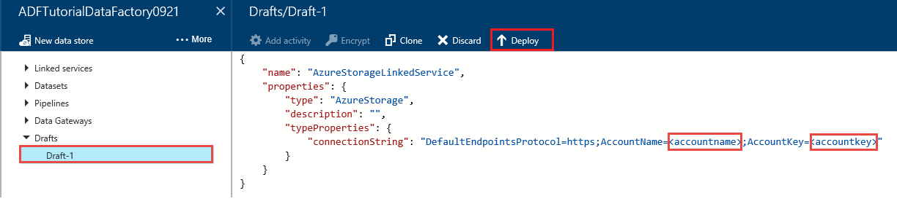
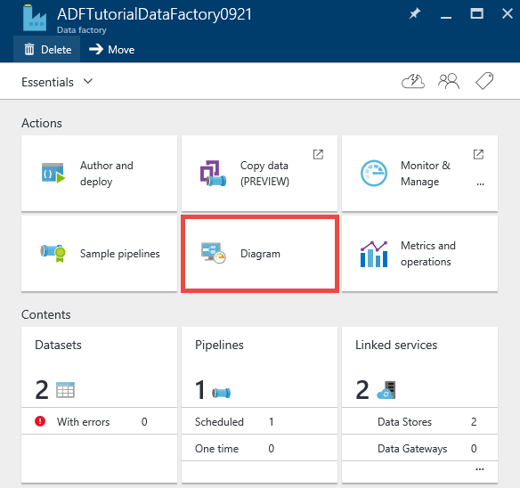
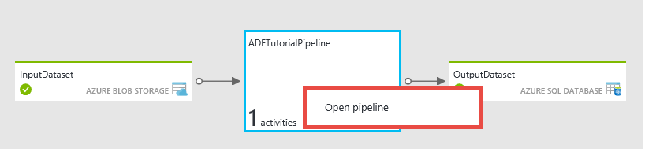
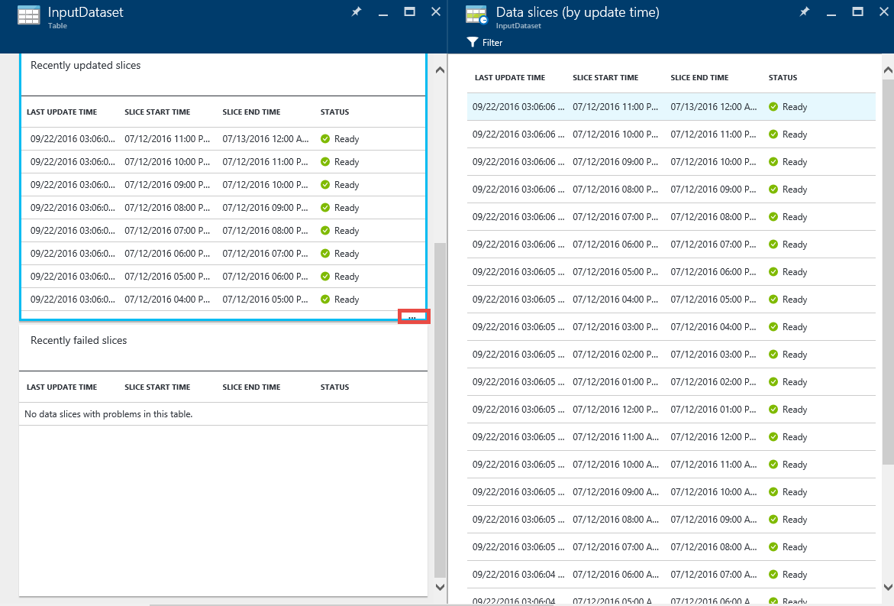
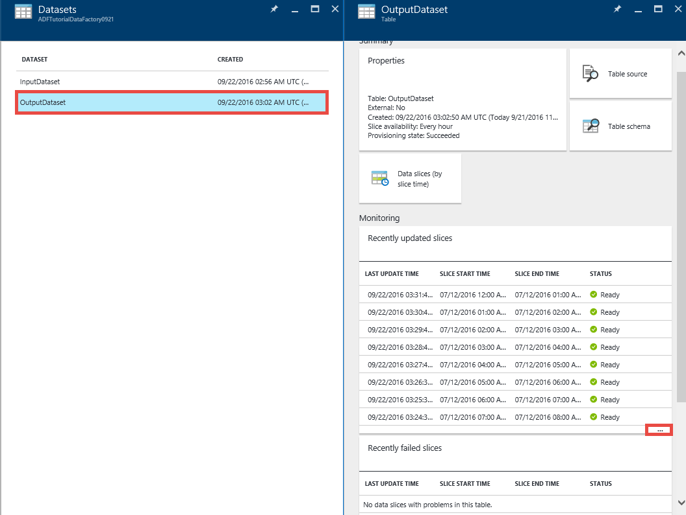
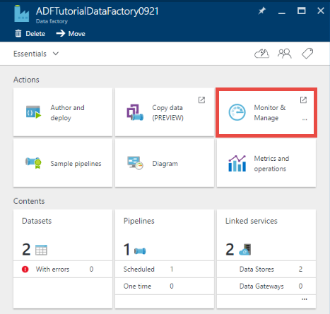

<properties 
    pageTitle="Tutorial: Criar um pipeline com atividade de cópia usando o portal Azure | Microsoft Azure" 
    description="Neste tutorial, você cria um pipeline de fábrica de dados do Azure com uma atividade de cópia usando o Editor de fábrica de dados no portal do Azure." 
    services="data-factory" 
    documentationCenter="" 
    authors="spelluru" 
    manager="jhubbard" 
    editor="monicar"/>

<tags 
    ms.service="data-factory" 
    ms.workload="data-services" 
    ms.tgt_pltfrm="na" 
    ms.devlang="na" 
    ms.topic="get-started-article" 
    ms.date="09/16/2016" 
    ms.author="spelluru"/>

# Tutorial: Criar um pipeline com atividade de cópia usando o portal do Azure
> [AZURE.SELECTOR]
- [Visão geral e os pré-requisitos](data-factory-copy-data-from-azure-blob-storage-to-sql-database.md)
- [Assistente de cópia](data-factory-copy-data-wizard-tutorial.md)
- [Portal do Azure](data-factory-copy-activity-tutorial-using-azure-portal.md)
- [O Visual Studio](data-factory-copy-activity-tutorial-using-visual-studio.md)
- [PowerShell](data-factory-copy-activity-tutorial-using-powershell.md)
- [Modelo do Gerenciador de recursos Azure](data-factory-copy-activity-tutorial-using-azure-resource-manager-template.md)
- [API REST](data-factory-copy-activity-tutorial-using-rest-api.md)
- [API .NET](data-factory-copy-activity-tutorial-using-dotnet-api.md)

Este tutorial mostra como criar e monitorar uma fábrica de dados Azure usando o portal do Azure. O pipeline na fábrica dados usa uma atividade de cópia para copiar dados de armazenamento de Blob do Azure para Azure SQL Database.

Aqui estão as etapas realizadas como parte deste tutorial:

Etapa | Descrição
-----| -----------
[Criar uma fábrica de dados do Azure](#create-data-factory) | Nesta etapa, você criar uma fábrica de dados Azure chamada **ADFTutorialDataFactory**.  
[Criar serviços vinculados](#create-linked-services) | Nesta etapa, você cria dois serviços vinculados: **AzureStorageLinkedService** e **AzureSqlLinkedService**.   O AzureStorageLinkedService links o armazenamento do Azure e AzureSqlLinkedService links o banco de dados do SQL Azure para o ADFTutorialDataFactory. Os dados de entrada para o pipeline reside em um contêiner de blob dos dados de saída e armazenamento de blob do Microsoft Azure ser armazenados em uma tabela do banco de dados do SQL Azure. Portanto, você adiciona esses dois armazenamentos de dados como serviços vinculados à fábrica dados.      
[Criar entrada e saída conjuntos de dados](#create-datasets) | Na etapa anterior, você criou serviços vinculados que se referem a armazenamentos de dados que contêm dados de entrada/saída. Nesta etapa, você define dois conjuntos de dados – **InputDataset** e **OutputDataset** – que representam os dados de entrada/saída que estão armazenados em armazenamentos de dados.   Para o InputDataset, você especifica o contêiner de blob que contém um blob com os dados de origem e para o OutputDataset, especificar a tabela SQL que armazena os dados de saída. Você também pode especificar outras propriedades como estrutura, disponibilidade e política. 
[Criar um pipeline](#create-pipeline) | Nesta etapa, você cria um pipeline chamado **ADFTutorialPipeline** na ADFTutorialDataFactory.   Adicionar uma **atividade de cópia** para o pipeline que copia de entrada de dados do Azure blob para a tabela do SQL Azure de saída. A atividade de cópia realiza a movimentação dos dados em fábrica de dados do Azure. Ele estiver usando um serviço globalmente disponível que pode copiar dados entre várias fontes de dados de uma maneira segura, confiável e flexível. Consulte o artigo de [Atividades de movimentação de dados](data-factory-data-movement-activities.md) para obter detalhes sobre a atividade de cópia. 
[Pipeline de monitor](#monitor-pipeline) | Nesta etapa, você pode monitorar as fatias de tabelas de entrada e saídas usando o portal do Azure.

## Pré-requisitos 
Pré-requisitos concluídas listados no artigo da [Visão geral do Tutorial](data-factory-copy-data-from-azure-blob-storage-to-sql-database.md) antes de executar este tutorial.

## Criar fábrica de dados
Nesta etapa, você pode usar o portal do Azure para criar uma fábrica de dados Azure denominada **ADFTutorialDataFactory**.

1.  Após fazer o login no [portal do Azure](https://portal.azure.com/), clique em **novo**, selecione **inteligência + análise**e clique em **Dados fábrica**. 

      

6. Na lâmina **nova fábrica de dados** :
    1. Digite **ADFTutorialDataFactory** para o **nome**. 
    
        

        O nome da fábrica dados Azure deve ser **exclusivo**. Se você receber o erro a seguir, altere o nome da fábrica dados (por exemplo, yournameADFTutorialDataFactory) e tente criar novamente. Consulte o tópico de [Dados Factory - regras de nomenclatura](data-factory-naming-rules.md) para regras de nomenclatura para artefatos de fábrica de dados.
    
            Data factory name “ADFTutorialDataFactory” is not available  
     
        
    2. Selecione sua **assinatura**do Azure.
    3. Para o grupo de recursos, siga um dos seguintes passos:
        1. Selecione **Usar existente**e selecione um grupo de recursos existente na lista suspensa. 
        2. Selecione **Criar novo**e digite o nome de um grupo de recursos.   
    
            Algumas das etapas deste tutorial suponha que você use o nome: **ADFTutorialResourceGroup** do grupo de recursos. Para saber mais sobre grupos de recursos, consulte [usando grupos de recursos para gerenciar os recursos do Azure](../azure-resource-manager/resource-group-overview.md).  
    4. Selecione o **local** para a fábrica de dados. Apenas as regiões com suporte pelo serviço fábrica de dados são mostradas na lista suspensa.
    5. Selecione **Fixar em Startboard**.     
    6. Clique em **criar**.

        > [AZURE.IMPORTANT] Para criar instâncias de fábrica de dados, você deve ser um membro da função [Colaborador de fábrica de dados](../active-directory/role-based-access-built-in-roles.md/#data-factory-contributor) no nível de grupo assinatura/recurso.
        >  
        >  O nome da fábrica dados pode ser registrado como um nome DNS no futuro e, portanto, ficam visível publicamente.              
9.  Para ver as mensagens de status e notificação, clique no ícone de sino na barra de ferramentas. 

     
10. Após a criação for concluída, você vê a lâmina de **Fábrica de dados** conforme mostrado na imagem.

    

## Criar serviços vinculados
Serviços vinculados vincular armazenamentos de dados ou calcular uma fábrica dados Azure os serviços. Consulte [armazena dados com suporte](data-factory-data-movement-activities.md##supported-data-stores-and-formats) para todas as fontes e receptores compatíveis com a atividade de cópia. Consulte [Serviços vinculados de computação](data-factory-compute-linked-services.md) para a lista de serviços de computação suportados pelo fábrica de dados. Neste tutorial, você não usar qualquer serviço de computação. 

Nesta etapa, você cria dois serviços vinculados: **AzureStorageLinkedService** e **AzureSqlLinkedService**. AzureStorageLinkedService vinculados links de serviço uma conta de armazenamento do Azure e AzureSqlLinkedService links um banco de dados do SQL Azure para o **ADFTutorialDataFactory**. Você cria um pipeline posteriormente neste tutorial que copia dados de um contêiner de blob no AzureStorageLinkedService para uma tabela do SQL no AzureSqlLinkedService.

### Criar um serviço vinculado para a conta de armazenamento do Azure
1.  Na lâmina **Fábrica de dados** , clique em **autor e implantar** peças para iniciar o **Editor** para a fábrica de dados.

     
5. No **Editor**, clique em **armazenam novos dados** botão na barra de ferramentas e selecione **armazenamento do Azure** no menu suspenso. Você deve ver o modelo JSON para a criação de um serviço de armazenamento do Azure vinculado no painel direito. 

        
6. Substituir `<accountname>` e `<accountkey>` com o nome de conta e os valores de chave da conta para a sua conta de armazenamento do Azure. 

     
6. Clique em **implantar** na barra de ferramentas. Agora, você verá o implantado **AzureStorageLinkedService** na exibição em árvore. 

    

> [AZURE.NOTE]
> Consulte [mover dados de/para o Azure Blob](data-factory-azure-blob-connector.md#azure-storage-linked-service) para obter detalhes sobre propriedades JSON.

### Criar um serviço vinculado para o banco de dados do SQL Azure
1. No **Editor de fábrica de dados**, clique em **armazenam novos dados** botão na barra de ferramentas e selecione **Azure SQL Database** no menu suspenso. Você deve ver o modelo JSON para criar o serviço SQL Azure vinculado no painel direito.
2. Substituir `<servername>`, `<databasename>`, `<username>@<servername>`, e `<password>` com nomes de seu servidor SQL Azure, banco de dados, conta de usuário e senha. 
3. Clique em **implantar** na barra de ferramentas para criar e implantar o **AzureSqlLinkedService**.
4. Confirme que você vê **AzureSqlLinkedService** na exibição em árvore. 

> [AZURE.NOTE]
> Para obter detalhes sobre propriedades JSON, consulte [mover dados de/para o Azure SQL Database](data-factory-azure-sql-connector.md#azure-sql-linked-service-properties) .

## Criar conjuntos de dados
Na etapa anterior, você criou vinculados serviços **AzureStorageLinkedService** e **AzureSqlLinkedService** para vincular uma conta de armazenamento do Azure e o banco de dados do SQL Azure à fábrica dados: **ADFTutorialDataFactory**. Nesta etapa, você define dois conjuntos de dados – **InputDataset** e **OutputDataset** – que representam os dados de entrada/saída que estão armazenados em armazenamentos de dados referidos por AzureStorageLinkedService e AzureSqlLinkedService, respectivamente. Para InputDataset, você especifica o contêiner de blob que contém um blob com os dados de origem e para OutputDataset, especificar a tabela SQL que armazena os dados de saída. 

### Criar entrada de conjunto de dados 
Nesta etapa, você cria um dataset chamado **InputDataset** que aponta para um contêiner de blob no armazenamento do Azure representado pelo serviço **AzureStorageLinkedService** vinculado.

1. No **Editor** para a fábrica de dados, clique em **… Mais**, clique em **novo conjunto de dados**e em **armazenamento de Blob do Azure** no menu suspenso. 

    
2. Substitua o seguinte trecho JSON JSON no painel direito: 

        {
          "name": "InputDataset",
          "properties": {
            "structure": [
              {
                "name": "FirstName",
                "type": "String"
              },
              {
                "name": "LastName",
                "type": "String"
              }
            ],
            "type": "AzureBlob",
            "linkedServiceName": "AzureStorageLinkedService",
            "typeProperties": {
              "folderPath": "adftutorial/",
              "fileName": "emp.txt",
              "format": {
                "type": "TextFormat",
                "columnDelimiter": ","
              }
            },
            "external": true,
            "availability": {
              "frequency": "Hour",
              "interval": 1
            }
          }
        }
        
     Observe os seguintes pontos: 
    
    - DataSet **tipo** está definido como **AzureBlob**.
    - **linkedServiceName** está definido como **AzureStorageLinkedService**. Você criou esse serviço vinculado na etapa 2.
    - **folderPath** está definido para o contêiner de **adftutorial** . Você também pode especificar o nome de um blob dentro da pasta usando a propriedade **nome do arquivo** . Como você não está especificando o nome do blob, dados de todos os blobs no contêiner são considerados como uma entrada de dados.  
    - formato **tipo** está definido como **TextFormat**
    - Existem dois campos no arquivo de texto – **nome** e **Sobrenome** – separado por um caractere de vírgula (**columnDelimiter**) 
    - A **disponibilidade** está definida para **cada hora** (**frequência** é definido como **hora** e o **intervalo** é definido como **1**). Portanto, Data Factory procura dados de entrada cada hora na pasta raiz do contêiner de blob (**adftutorial**) que você especificou. 
    
    Se você não especificar um **nome de arquivo** de um conjunto de dados de **entrada** , todos os arquivos/blobs da pasta entrada (**folderPath**) são considerados como entradas. Se você especificar um nome de arquivo no JSON, somente especificado arquivo/blob é considerado asn entrada.
 
    Se você não especificar um **nome de arquivo** para uma **tabela de saída**, os arquivos gerados no **folderPath** são nomeados no seguinte formato: dados. &lt;Guid\&gt;. txt (exemplo: Data.0a405f8a-93ff-4c6f-b3be-f69616f1df7a.txt.).

    Para definir **folderPath** e **fileName** dinamicamente com base no período de tempo **SliceStart** , use a propriedade **partitionedBy** . No exemplo a seguir, folderPath usa ano, mês e dia a partir do SliceStart (hora de início da fatia sendo processada) e fileName usa hora a partir do SliceStart. Por exemplo, se uma fatia é produzida para 2016-09-20T08:00:00, a nomedapasta está definida como wikidatagateway wikisampledataout/2016/09/20 e o nome do arquivo está definida como 08.csv. 

            "folderPath": "wikidatagateway/wikisampledataout/{Year}/{Month}/{Day}",
            "fileName": "{Hour}.csv",
            "partitionedBy": 
            [
                { "name": "Year", "value": { "type": "DateTime", "date": "SliceStart", "format": "yyyy" } },
                { "name": "Month", "value": { "type": "DateTime", "date": "SliceStart", "format": "MM" } }, 
                { "name": "Day", "value": { "type": "DateTime", "date": "SliceStart", "format": "dd" } }, 
                { "name": "Hour", "value": { "type": "DateTime", "date": "SliceStart", "format": "hh" } } 
            ],
2. Clique em **implantar** na barra de ferramentas para criar e implantar o conjunto de dados **InputDataset** . Confirme que você vê o **InputDataset** na exibição em árvore.

> [AZURE.NOTE]
> Consulte [mover dados de/para o Azure Blob](data-factory-azure-blob-connector.md#azure-blob-dataset-type-properties) para obter detalhes sobre propriedades JSON.

### Criar conjunto de dados de saída
Nesta parte da etapa, você criar um conjunto de dados de saída chamado **OutputDataset**. Este dataset aponta para uma tabela do SQL do banco de dados do SQL Azure são representados por **AzureSqlLinkedService**. 

1. No **Editor** para a fábrica de dados, clique em **… Mais**, clique em **novo conjunto de dados**e em **SQL Azure** no menu suspenso. 
2. Substitua o seguinte trecho JSON JSON no painel direito:

        {
          "name": "OutputDataset",
          "properties": {
            "structure": [
              {
                "name": "FirstName",
                "type": "String"
              },
              {
                "name": "LastName",
                "type": "String"
              }
            ],
            "type": "AzureSqlTable",
            "linkedServiceName": "AzureSqlLinkedService",
            "typeProperties": {
              "tableName": "emp"
            },
            "availability": {
              "frequency": "Hour",
              "interval": 1
            }
          }
        }
        
     Observe os seguintes pontos: 
    
    - DataSet **tipo** está definido como **AzureSQLTable**.
    - **linkedServiceName** está definido como **AzureSqlLinkedService** (você criou esse serviço vinculado na etapa 2).
    - **nome de tabela** está definido como **emp**.
    - Há três colunas – **ID**, **nome**e **Sobrenome** – na tabela emp no banco de dados. ID é uma coluna de identidade, portanto, você precisará especificar somente o **nome** e o **Sobrenome** aqui.
    - A **disponibilidade** está definido para **cada hora** (**frequência** definido como **hora** e **intervalo** definido como **1**).  O serviço de dados fábrica gera uma fatia de dados de saída cada hora na tabela **emp** do banco de dados do SQL Azure.

3. Clique em **implantar** na barra de ferramentas para criar e implantar o conjunto de dados **OutputDataset** . Confirme que você vê o **OutputDataset** na exibição em árvore. 

> [AZURE.NOTE]
> Para obter detalhes sobre propriedades JSON, consulte [mover dados de/para o Azure SQL Database](data-factory-azure-sql-connector.md#azure-sql-linked-service-properties) .

## Crie pipeline
Nesta etapa, você cria um pipeline com uma **Atividade de cópia** que usa **InputDataset** como entrada e **OutputDataset** como saída.

1. No **Editor** para a fábrica de dados, clique em **… Mais**e clique em **novo pipeline**. Como alternativa, você pode **canais** de atalho na exibição em árvore e clique em **novo pipeline**.
2. Substitua o seguinte trecho JSON JSON no painel direito: 
        
        {
          "name": "ADFTutorialPipeline",
          "properties": {
            "description": "Copy data from a blob to Azure SQL table",
            "activities": [
              {
                "name": "CopyFromBlobToSQL",
                "type": "Copy",
                "inputs": [
                  {
                    "name": "InputDataset"
                  }
                ],
                "outputs": [
                  {
                    "name": "OutputDataset"
                  }
                ],
                "typeProperties": {
                  "source": {
                    "type": "BlobSource"
                  },
                  "sink": {
                    "type": "SqlSink",
                    "writeBatchSize": 10000,
                    "writeBatchTimeout": "60:00:00"
                  }
                },
                "Policy": {
                  "concurrency": 1,
                  "executionPriorityOrder": "NewestFirst",
                  "retry": 0,
                  "timeout": "01:00:00"
                }
              }
            ],
            "start": "2016-07-12T00:00:00Z",
            "end": "2016-07-13T00:00:00Z"
          }
        } 

    Observe os seguintes pontos:

    - Na seção atividades, há apenas uma atividade cujo **tipo** está definido como **Copiar**.
    - Entrada da atividade está definida como **InputDataset** e saída para a atividade está definida como **OutputDataset**.
    - Na seção **typeProperties** , **BlobSource** especificado como o tipo de fonte e **SqlSink** é especificado como o tipo de receptor.

    Substitua o valor da propriedade **comece** com o valor de dia e de **término** atual com o próximo dia. Você pode especificar apenas a parte da data e ignorar a parte de hora do tempo de data. Por exemplo, "2016-02-03", que é equivalente a "2016-02-03T00:00:00Z"
    
    Ambos iniciar e encerrar datetimes deve estar no [formato ISO](http://en.wikipedia.org/wiki/ISO_8601). Por exemplo: 2016-10-14T16:32:41Z. A hora de **término** é opcional, mas podemos usá-lo neste tutorial. 
    
    Se você não especificar o valor da propriedade **final** , ele é calculado como "**início + 48 horas**". Para executar o pipeline indefinidamente, especifique **9999-09-09** como o valor da propriedade de **fim** .
    
    No exemplo anterior, há 24 fatias de dados como cada fatia de dados é gerada por hora.
    
4. Clique em **implantar** na barra de ferramentas para criar e implantar o **ADFTutorialPipeline**. Confirme que você vê o pipeline na exibição em árvore. 
5. Agora, feche a lâmina de **Editor** clicando em **X**. Clique no **X** novamente para ver a home page de **Fábrica de dados** para o **ADFTutorialDataFactory**.

**Parabéns!** Com êxito você tiver criado uma fábrica dados Azure, serviços vinculados, tabelas e um pipeline e agendado o pipeline.   
 
### Exibir a fábrica de dados em um modo de exibição de diagrama 
1. Na lâmina **Fábrica de dados** , clique em **diagrama**.

    
2. Você deve ver o diagrama semelhante a imagem a seguir: 

    

    Você pode aumentar o zoom, zoom, zoom para 100%, zoom para ajustá-la, posicione canais e tabelas automaticamente e mostrar informações de linhagem (destaca upstream e downstream itens dos itens selecionados).  Você pode clicar duas vezes um objeto (tabela de entrada/saída ou pipeline) para ver as propriedades para ele. 
3. **ADFTutorialPipeline** na exibição de diagrama de atalho e clique em **Abrir pipeline**. 

    
4. Você deve ver as atividades no pipeline juntamente com conjuntos de dados de entrada e saídos para as atividades. Neste tutorial, você pode ter apenas uma atividade no pipeline (atividade de cópia) com InputDataset como dataset de entrada e OutputDataset como dataset de saída.   

    
5. Clique em **fábrica de dados** na navegação estrutural no canto superior esquerdo para voltar para o modo de exibição de diagrama. O modo de exibição de diagrama exibe todos os canais. Neste exemplo, você criou somente um pipeline.   
 

## Pipeline de monitor
Nesta etapa, você pode usar o portal do Azure para monitorar o que está acontecendo em uma fábrica de dados do Azure. 

### Pipeline de monitor usando o modo de exibição de diagrama

1. Clique no **X** para fechar o modo de exibição de **diagrama** para ver a Data Factory home page de fábrica dados. Se você tiver fechado o navegador da web, siga estas etapas: 
    2. Navegue até o [portal do Azure](https://portal.azure.com/). 
    2. Clique duas vezes em **ADFTutorialDataFactory** na **Startboard** (ou) clique **fábricas de dados** no menu à esquerda e pesquise por ADFTutorialDataFactory. 
3. Você deve ver a contagem e nomes de tabelas e pipeline que você criou neste blade.

    
4. Agora, clique em bloco de **conjuntos de dados** .
5. Na lâmina **conjuntos de dados** , clique em **InputDataset**. Este conjunto de dados é do dataset de entrada para **ADFTutorialPipeline**.

       
5. Clique em **… (reticências)** Para ver todas as fatias de dados.

      

    Observe que todas as fatias de dados até a hora atual estão **prontos** porque o arquivo de **emp.txt** existe sempre no contêiner de blob: **adftutorial\input**. Confirme que nenhuma fatias aparecem na seção **fatias recentemente falhas** na parte inferior.

    Listas tanto **atualizados recentemente fatias** e **falhou recentemente fatias** são classificadas pela **hora da última atualização**. 
    
    Clique em **filtro** na barra de ferramentas para filtrar as fatias.  
    
    
6. Feche as lâminas até ver a lâmina de **conjuntos de dados** . Clique na **OutputDataset**. Este conjunto de dados é o conjunto de dados de saída para **ADFTutorialPipeline**.

    
6. Você verá a lâmina **OutputDataset** , conforme mostrado na imagem a seguir:

     
7. Observe que as fatias de dados até a hora atual já foram produzidas e estiverem **prontas**. Nenhum fatias mostram na seção **fatias problema** na parte inferior.
8. Clique em **… (Reticências)** Para ver todas as fatias.

    
9. Clique em qualquer fatia de dados na lista e você verá a lâmina **fatia de dados** .

    
  
    Se a fatia não estiver no estado **pronto** , você pode ver as fatias upstream que não estão prontos e estão bloqueando a fatia atual de executar na lista **Upstream fatias que são não está prontas** .
11. Na lâmina **FATIA de dados** , você deve ver que todas as atividades executa na lista na parte inferior. Clique em uma **atividade executada** para ver a lâmina de **atividade execução detalhes** . 

    
12. Clique no **X** para fechar todas as lâminas até voltar para a lâmina inicial para a **ADFTutorialDataFactory**.
14. (opcional) Clique **canais** na home page do **ADFTutorialDataFactory** **ADFTutorialPipeline** na lâmina **canais** e em detalhada por meio de tabelas de entrada (**consumida**) ou tabelas de saída (**Produced**).
15. Iniciar o **SQL Server Management Studio**, conecte o banco de dados do SQL Azure e verifique se as linhas são inseridas à tabela **emp** no banco de dados.

    

### Pipeline de monitor usando o Monitor & Gerenciar App
Você também pode usar o Monitor & Gerenciar aplicativo para monitorar seus canais. Para obter informações detalhadas sobre como usar este aplicativo, consulte [Monitor e gerenciar canais de fábrica de dados do Azure usando o monitoramento e gerenciamento de aplicativo](data-factory-monitor-manage-app.md).

1. Clique em **Monitor e gerenciar** bloco na página inicial para fábrica dados.

     
2. Você deve ver **monitorar e gerenciar aplicativos**. Altere a **hora de início** e **hora de término** para incluir (2016-07-12) de início e término (2016-07-13) do pipeline e clique em **Aplicar**. 

     
3. Selecione uma janela de atividade na lista **Atividade Windows** para ver detalhes sobre ele. 
    

## Resumo 
Neste tutorial, você criou uma fábrica de dados do Azure para copiar dados de um Azure blob um banco de dados do SQL Azure. Você usou o portal do Azure para criar a fábrica de dados, serviços vinculados, conjuntos de dados e um pipeline. Aqui estão as etapas de alto nível que você realizou neste tutorial:  

1.  Criou uma **fábrica de dados**do Azure.
2.  Criado **Serviços vinculados**:
    1. Um serviço de **Armazenamento do Azure** vinculado para vincular sua conta de armazenamento do Azure que contém os dados de entrada.    
    2. Um serviço **SQL Azure** vinculado para vincular seu banco de dados do SQL Azure que mantém os dados de saída. 
3.  Criar **conjuntos de dados** que descrevem dados de entrada e saída para canais.
4.  Criado um **pipeline** com uma **Atividade de cópia** com **BlobSource** como origem e **SqlSink** como receptor.  

## Consulte também
| Tópico | Descrição |
| :---- | :---- |
| [Atividades de movimentação de dados](data-factory-data-movement-activities.md) | Este artigo fornece informações detalhadas sobre a atividade de cópia que você usou no tutorial. |
| [Planejamento e à execução](data-factory-scheduling-and-execution.md) | Este artigo explica os aspectos de programação e a execução do modelo de aplicativo de fábrica de dados do Azure. |
| [Canais](data-factory-create-pipelines.md) | Este artigo ajuda você a entender canais e atividades do Azure dados fábrica. |
| [Conjuntos de dados](data-factory-create-datasets.md) | Este artigo ajuda você a entender conjuntos de dados em fábrica de dados do Azure.
| [Monitorar e gerenciar canais usando o aplicativo de monitoramento](data-factory-monitor-manage-app.md) | Este artigo descreve como monitorar, gerenciar e depurar canais usando o monitoramento e gerenciamento de aplicativo. 

