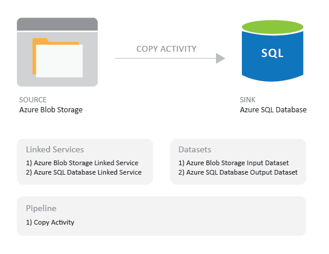

<properties
    pageTitle="Tutorial: Criar um pipeline usando o Gerenciador de recursos de modelo | Microsoft Azure"
    description="Neste tutorial, você cria um pipeline de fábrica de dados do Azure com uma atividade de cópia usando o modelo do Gerenciador de recursos do Azure."
    services="data-factory"
    documentationCenter=""
    authors="spelluru"
    manager="jhubbard"
    editor="monicar"/>

<tags
    ms.service="data-factory"
    ms.workload="data-services"
    ms.tgt_pltfrm="na"
    ms.devlang="na"
    ms.topic="get-started-article"
    ms.date="10/10/2016"
    ms.author="spelluru"/>

# Tutorial: Criar um pipeline com atividade de cópia usando o modelo do Gerenciador de recursos do Azure
> [AZURE.SELECTOR]
- [Visão geral e os pré-requisitos](data-factory-copy-data-from-azure-blob-storage-to-sql-database.md)
- [Assistente de cópia](data-factory-copy-data-wizard-tutorial.md)
- [Portal do Azure](data-factory-copy-activity-tutorial-using-azure-portal.md)
- [O Visual Studio](data-factory-copy-activity-tutorial-using-visual-studio.md)
- [PowerShell](data-factory-copy-activity-tutorial-using-powershell.md)
- [Modelo do Gerenciador de recursos Azure](data-factory-copy-activity-tutorial-using-azure-resource-manager-template.md)
- [API REST](data-factory-copy-activity-tutorial-using-rest-api.md)
- [API .NET](data-factory-copy-activity-tutorial-using-dotnet-api.md)

Este tutorial mostra como criar e monitorar uma fábrica Azure dados usando um modelo do Gerenciador de recursos do Azure. O pipeline na fábrica dados copia dados do armazenamento de Blob do Azure para Azure SQL Database.

## Pré-requisitos
- Percorra [Tutorial visão geral e pré-requisitos](data-factory-copy-data-from-azure-blob-storage-to-sql-database.md) e conclua as etapas de **pré-requisito** .
- Siga as instruções no artigo de [como instalar e configurar o Azure PowerShell](../powershell-install-configure.md) para instalar a versão mais recente do PowerShell do Azure em seu computador. Neste tutorial, você usa o PowerShell para implantar entidades de fábrica de dados. 
- (opcional) Consulte a [Criação de modelos do Azure Gerenciador de recursos](../resource-group-authoring-templates.md) para saber mais sobre modelos do Gerenciador de recursos do Azure.

## Neste tutorial

Neste tutorial, você pode criar uma fábrica de dados com as seguintes entidades de fábrica de dados:

Entidade | Descrição  
------ | ----------- 
Serviço de armazenamento vinculado do Azure | Vincula a sua conta de armazenamento do Azure para a fábrica de dados. Armazenamento do Azure é o armazenamento de dados de origem e o banco de dados do SQL Azure é o armazenamento de dados de receptor da atividade de cópia no tutorial. Especifica a conta de armazenamento que contém os dados de entrada para a atividade de cópia. 
Serviço de vinculado de banco de dados do SQL Azure| Vincula seu banco de dados do SQL Azure à fábrica dados. Especifica o banco de dados do SQL Azure que mantém os dados de saída para a atividade de cópia. 
Dataset de entrada Azure Blob | Refere-se ao serviço de armazenamento do Azure vinculado. O serviço vinculado se refere a uma conta de armazenamento do Azure e o conjunto de dados do Azure Blob Especifica o contêiner, pasta e nome de arquivo no armazenamento que contém os dados de entrada. 
Conjunto de dados de saída SQL Azure | Refere-se ao serviço SQL Azure vinculado. O serviço SQL Azure vinculado se refere a um servidor do SQL Azure e o conjunto de dados do SQL Azure Especifica o nome da tabela que contém os dados de saída. 
Pipeline de dados | O pipeline tem uma atividade do tipo copiar que usa o conjunto de dados do Azure blob como entrada e o conjunto de dados do SQL Azure como uma saída. A atividade de cópia copia dados de um Azure blob a uma tabela do banco de dados do SQL Azure.  

Uma fábrica de dados pode ter um ou mais canais. Um pipeline pode ter uma ou mais atividades. Há dois tipos de atividades: [atividades de movimentação de dados](data-factory-data-movement-activities.md) e [atividades de transformação de dados](data-factory-data-transformation-activities.md). Neste tutorial, você pode criar um pipeline com uma atividade (atividade de cópia).

 

A seção a seguir fornece o modelo completo do Gerenciador de recursos para definir entidades de fábrica de dados para que você possa rapidamente percorrer o tutorial e testar o modelo. Para entender como cada entidade de fábrica de dados está definida, consulte a seção de [entidades de fábrica de dados no modelo](#data-factory-entities-in-the-template) .

## Modelo de fábrica JSON de dados
O modelo de Gerenciador de recursos de nível superior para definir uma fábrica de dados é: 

    {
        "$schema": "http://schema.management.azure.com/schemas/2015-01-01/deploymentTemplate.json#",
        "contentVersion": "1.0.0.0",
        "parameters": { ...
        },
        "variables": { ...
        },
        "resources": [
            {
                "name": "[parameters('dataFactoryName')]",
                "apiVersion": "[variables('apiVersion')]",
                "type": "Microsoft.DataFactory/datafactories",
                "location": "westus",
                "resources": [
                    { ... },
                    { ... },
                    { ... },
                    { ... }
                ]
            }
        ]
    }

Crie um arquivo JSON chamado **ADFCopyTutorialARM.json** na pasta **C:\ADFGetStarted** com o seguinte conteúdo:

    {
        "contentVersion": "1.0.0.0",
        "$schema": "http://schema.management.azure.com/schemas/2015-01-01/deploymentTemplate.json#",
        "parameters": {
          "storageAccountName": { "type": "string", "metadata": { "description": "Name of the Azure storage account that contains the data to be copied." } },
          "storageAccountKey": { "type": "securestring", "metadata": { "description": "Key for the Azure storage account." } },
          "sourceBlobContainer": { "type": "string", "metadata": { "description": "Name of the blob container in the Azure Storage account." } },
          "sourceBlobName": { "type": "string", "metadata": { "description": "Name of the blob in the container that has the data to be copied to Azure SQL Database table" } },
          "sqlServerName": { "type": "string", "metadata": { "description": "Name of the Azure SQL Server that will hold the output/copied data." } },
          "databaseName": { "type": "string", "metadata": { "description": "Name of the Azure SQL Database in the Azure SQL server." } },
          "sqlServerUserName": { "type": "string", "metadata": { "description": "Name of the user that has access to the Azure SQL server." } },
          "sqlServerPassword": { "type": "securestring", "metadata": { "description": "Password for the user." } },
          "targetSQLTable": { "type": "string", "metadata": { "description": "Table in the Azure SQL Database that will hold the copied data." } 
          } 
        },
        "variables": {
          "dataFactoryName": "[concat('AzureBlobToAzureSQLDatabaseDF', uniqueString(resourceGroup().id))]",
          "azureSqlLinkedServiceName": "AzureSqlLinkedService",
          "azureStorageLinkedServiceName": "AzureStorageLinkedService",
          "blobInputDatasetName": "BlobInputDataset",
          "sqlOutputDatasetName": "SQLOutputDataset",
          "pipelineName": "Blob2SQLPipeline"
        },
        "resources": [
          {
            "name": "[variables('dataFactoryName')]",
            "apiVersion": "2015-10-01",
            "type": "Microsoft.DataFactory/datafactories",
            "location": "West US",
            "resources": [
              {
                "type": "linkedservices",
                "name": "[variables('azureStorageLinkedServiceName')]",
                "dependsOn": [
                  "[variables('dataFactoryName')]"
                ],
                "apiVersion": "2015-10-01",
                "properties": {
                  "type": "AzureStorage",
                  "description": "Azure Storage linked service",
                  "typeProperties": {
                    "connectionString": "[concat('DefaultEndpointsProtocol=https;AccountName=',parameters('storageAccountName'),';AccountKey=',parameters('storageAccountKey'))]"
                  }
                }
              },
              {
                "type": "linkedservices",
                "name": "[variables('azureSqlLinkedServiceName')]",
                "dependsOn": [
                  "[variables('dataFactoryName')]"
                ],
                "apiVersion": "2015-10-01",
                "properties": {
                  "type": "AzureSqlDatabase",
                  "description": "Azure SQL linked service",
                  "typeProperties": {
                    "connectionString": "[concat('Server=tcp:',parameters('sqlServerName'),'.database.windows.net,1433;Database=', parameters('databaseName'), ';User ID=',parameters('sqlServerUserName'),';Password=',parameters('sqlServerPassword'),';Trusted_Connection=False;Encrypt=True;Connection Timeout=30')]"
                  }
                }
              },
              {
                "type": "datasets",
                "name": "[variables('blobInputDatasetName')]",
                "dependsOn": [
                  "[variables('dataFactoryName')]",
                  "[variables('azureStorageLinkedServiceName')]"
                ],
                "apiVersion": "2015-10-01",
                "properties": {
                  "type": "AzureBlob",
                  "linkedServiceName": "[variables('azureStorageLinkedServiceName')]",
                  "structure": [
                    {
                      "name": "Column0",
                      "type": "String"
                    },
                    {
                      "name": "Column1",
                      "type": "String"
                    }
                  ],
                  "typeProperties": {
                    "folderPath": "[concat(parameters('sourceBlobContainer'), '/')]",
                    "fileName": "[parameters('sourceBlobName')]",
                    "format": {
                      "type": "TextFormat",
                      "columnDelimiter": ","
                    }
                  },
                  "availability": {
                    "frequency": "Day",
                    "interval": 1
                  },
                  "external": true
                }
              },
              {
                "type": "datasets",
                "name": "[variables('sqlOutputDatasetName')]",
                "dependsOn": [
                  "[variables('dataFactoryName')]",
                  "[variables('azureSqlLinkedServiceName')]"
                ],
                "apiVersion": "2015-10-01",
                "properties": {
                  "type": "AzureSqlTable",
                  "linkedServiceName": "[variables('azureSqlLinkedServiceName')]",
                  "structure": [
                    {
                      "name": "FirstName",
                      "type": "String"
                    },
                    {
                      "name": "LastName",
                      "type": "String"
                    }
                  ],
                  "typeProperties": {
                    "tableName": "[parameters('targetSQLTable')]"
                  },
                  "availability": {
                    "frequency": "Day",
                    "interval": 1
                  }
                }
              },
              {
                "type": "datapipelines",
                "name": "[variables('pipelineName')]",
                "dependsOn": [
                  "[variables('dataFactoryName')]",
                  "[variables('azureStorageLinkedServiceName')]",
                  "[variables('azureSqlLinkedServiceName')]",
                  "[variables('blobInputDatasetName')]",
                  "[variables('sqlOutputDatasetName')]"
                ],
                "apiVersion": "2015-10-01",
                "properties": {
                  "activities": [
                    {
                      "name": "CopyFromAzureBlobToAzureSQL",
                      "description": "Copy data frm Azure blob to Azure SQL",
                      "type": "Copy",
                      "inputs": [
                        {
                          "name": "[variables('blobInputDatasetName')]"
                        }
                      ],
                      "outputs": [
                        {
                          "name": "[variables('sqlOutputDatasetName')]"
                        }
                      ],
                      "typeProperties": {
                        "source": {
                          "type": "BlobSource"
                        },
                        "sink": {
                          "type": "SqlSink",
                          "sqlWriterCleanupScript": "$$Text.Format('DELETE FROM {0}', 'emp')"
                        },
                        "translator": {
                          "type": "TabularTranslator",
                          "columnMappings": "Column0:FirstName,Column1:LastName"
                        }
                      },
                      "Policy": {
                        "concurrency": 1,
                        "executionPriorityOrder": "NewestFirst",
                        "retry": 3,
                        "timeout": "01:00:00"
                      }
                    }
                  ],
                  "start": "2016-10-02T00:00:00Z",
                  "end": "2016-10-03T00:00:00Z"
                }
              }
            ]
          }
        ]
      }

## Parâmetros JSON 
Crie um arquivo JSON chamado **ADFCopyTutorialARM Parameters.json** que contém parâmetros para o modelo do Gerenciador de recursos do Azure. 

> [AZURE.IMPORTANT] Especifique o nome e a chave da sua conta de armazenamento do Azure para parâmetros **storageAccountName** e **storageAccountKey** .  

    {
        "$schema": "https://schema.management.azure.com/schemas/2015-01-01/deploymentParameters.json#",
        "contentVersion": "1.0.0.0",
        "parameters": { 
            "storageAccountName": { "value": "<Name of the Azure storage account>"  },
            "storageAccountKey": {
                "value": "<Key for the Azure storage account>"
            },
            "sourceBlobContainer": { "value": "adftutorial" },
            "sourceBlobName": { "value": "emp.txt" },
            "sqlServerName": { "value": "<Name of the Azure SQL server>" },
            "databaseName": { "value": "<Name of the Azure SQL database>" },
            "sqlServerUserName": { "value": "<Name of the user who has access to the Azure SQL database>" },
            "sqlServerPassword": { "value": "<password for the user>" },
            "targetSQLTable": { "value": "emp" }
        }
    }

> [AZURE.IMPORTANT] Você pode ter arquivos JSON de parâmetro separado para desenvolvimento, teste e ambientes de produção que você pode usar com o mesmo modelo de dados JSON de fábrica. Usando um script de Power Shell, você pode automatizar Implantando entidades de fábrica de dados nesses ambientes.  

## Criar fábrica de dados
1. Iniciar o **PowerShell do Azure** e execute o seguinte comando:
    - Executar `Login-AzureRmAccount` e insira o nome de usuário e senha que você usa para entrar no portal do Azure.  
    - Executar `Get-AzureRmSubscription` para exibir todas as assinaturas para essa conta.
    - Executar `Get-AzureRmSubscription -SubscriptionName <SUBSCRIPTION NAME> | Set-AzureRmContext` para selecionar a assinatura à qual você deseja trabalhar. 
2. Execute o seguinte comando para implantar entidades de fábrica de dados usando o modelo do Gerenciador de recursos que você criou na etapa 1.

        New-AzureRmResourceGroupDeployment -Name MyARMDeployment -ResourceGroupName ADFTutorialResourceGroup -TemplateFile C:\ADFGetStarted\ADFCopyTutorialARM.json -TemplateParameterFile C:\ADFGetStarted\ADFCopyTutorialARM-Parameters.json

## Pipeline de monitor
1. Faça logon no [portal do Azure](https://portal.azure.com) usando sua conta do Azure.
2. Clique em **fábricas de dados** no menu à esquerda (ou) clique **mais serviços** e clique **fábricas de dados** em **inteligência + ANALYTICS** categoria.

    
3. Na página **fábricas de dados** , pesquisar e localizar sua fábrica de dados. 

      
4. Clique em sua fábrica dados Azure. Consulte a home page de fábrica dados.

      
5. Clique em bloco de **diagrama** para ver a exibição de diagrama de sua fábrica de dados.

    
6. No modo de exibição de diagrama, clique duas vezes o conjunto de dados **SQLOutputDataset**. Você ver o status da fatia. Quando a operação de cópia for concluída, o status definir como **prontos.**

    
7. Quando a fatia está no estado **pronto** , verifique se que os dados são copiados para a tabela de **emp** do banco de dados do SQL Azure.

Consulte [pipeline e conjuntos de dados do Monitor](data-factory-monitor-manage-pipelines.md) para obter instruções sobre como usar os Azure blades portal para monitorar o pipeline e conjuntos de dados que você criou neste tutorial.

Você também pode usar o Monitor e gerenciar aplicativos para monitorar seu pipeline de dados. Consulte [Monitor e gerenciar canais de fábrica de dados do Azure usando o aplicativo de monitoramento](data-factory-monitor-manage-app.md) para obter detalhes sobre como usar o aplicativo.

## Entidades de fábrica de dados no modelo

### Definir fábrica de dados
Você pode definir uma fábrica de dados no modelo de Gerenciador de recurso, conforme mostrado no exemplo a seguir:  

    "resources": [
    {
        "name": "[variables('dataFactoryName')]",
        "apiVersion": "2015-10-01",
        "type": "Microsoft.DataFactory/datafactories",
        "location": "West US"
    }

O dataFactoryName é definido como: 
      
    "dataFactoryName": "[concat('AzureBlobToAzureSQLDatabaseDF', uniqueString(resourceGroup().id))]"

É uma cadeia de caracteres exclusiva com base na ID do grupo de recursos.  

### Definindo entidades de fábrica de dados
As seguintes entidades de fábrica de dados são definidas no modelo JSON: 

1. [Serviço de armazenamento vinculado do Azure](#azure-storage-linked-service)
2. [Serviço de vinculadas SQL Azure](#azure-sql-database-linked-service)
3. [Conjunto de dados do Azure blob](#azure-blob-dataset)
4. [Conjunto de dados SQL Azure](#azure-sql-dataset)
5. [Pipeline de dados com uma atividade de cópia](#data-pipeline)

#### Serviço de armazenamento vinculado do Azure
Especifique o nome e a chave da sua conta de armazenamento do Azure nesta seção. Consulte o [armazenamento do Azure vinculado serviço](data-factory-azure-blob-connector.md#azure-storage-linked-service) para obter detalhes sobre propriedades JSON usados para definir um serviço de armazenamento do Azure vinculado. 

    {
        "type": "linkedservices",
        "name": "[variables('azureStorageLinkedServiceName')]",
        "dependsOn": [
            "[variables('dataFactoryName')]"
        ],
        "apiVersion": "2015-10-01",
        "properties": {
            "type": "AzureStorage",
            "description": "Azure Storage linked service",
            "typeProperties": {
                "connectionString": "[concat('DefaultEndpointsProtocol=https;AccountName=',parameters('storageAccountName'),';AccountKey=',parameters('storageAccountKey'))]"
            }
        }
    }

ConnectionString usa os parâmetros storageAccountName e storageAccountKey. Os valores para esses parâmetros passados usando um arquivo de configuração. A definição também usa variáveis: azureStroageLinkedService e dataFactoryName definidos no modelo. 
    
#### Serviço de vinculado de banco de dados do SQL Azure
Especifique o nome do servidor SQL Azure, nome do banco de dados, nome de usuário e senha do usuário nesta seção. Consulte [SQL Azure vinculado serviço](data-factory-azure-sql-connector.md#azure-sql-linked-service-properties) para obter detalhes sobre propriedades JSON usados para definir um serviço SQL Azure vinculado.  

    {
        "type": "linkedservices",
        "name": "[variables('azureSqlLinkedServiceName')]",
        "dependsOn": [
          "[variables('dataFactoryName')]"
        ],
        "apiVersion": "2015-10-01",
        "properties": {
            "type": "AzureSqlDatabase",
            "description": "Azure SQL linked service",
            "typeProperties": {
                "connectionString": "[concat('Server=tcp:',parameters('sqlServerName'),'.database.windows.net,1433;Database=', parameters('databaseName'), ';User ID=',parameters('sqlServerUserName'),';Password=',parameters('sqlServerPassword'),';Trusted_Connection=False;Encrypt=True;Connection Timeout=30')]"
            }
        }
    }

ConnectionString usa Nome_servidor_sql, databaseName, sqlServerUserName e sqlServerPassword parâmetros cujos valores são passados usando um arquivo de configuração. A definição também usa as seguintes variáveis do modelo: azureSqlLinkedServiceName, dataFactoryName.

#### Conjunto de dados do Azure blob
Especifique os nomes de contêiner de blob, pasta e arquivo que contém os dados de entrada. Consulte [Propriedades de conjunto de dados do Azure Blob](data-factory-azure-blob-connector.md#azure-blob-dataset-type-properties) para obter detalhes sobre propriedades JSON usados para definir um conjunto de dados do Azure Blob. 

    {
        "type": "datasets",
        "name": "[variables('blobInputDatasetName')]",
        "dependsOn": [
          "[variables('dataFactoryName')]",
          "[variables('azureStorageLinkedServiceName')]"
        ],
        "apiVersion": "2015-10-01",
        "properties": {
            "type": "AzureBlob",
            "linkedServiceName": "[variables('azureStorageLinkedServiceName')]",
            "structure": [
            {
                "name": "Column0",
                "type": "String"
            },
            {
                "name": "Column1",
                "type": "String"
            }
            ],
            "typeProperties": {
                "folderPath": "[concat(parameters('sourceBlobContainer'), '/')]",
                "fileName": "[parameters('sourceBlobName')]",
                "format": {
                    "type": "TextFormat",
                    "columnDelimiter": ","
                }
            },
            "availability": {
                "frequency": "Day",
                "interval": 1
            },
            "external": true
        }
    }

#### Conjunto de dados SQL Azure
Você pode especificar o nome da tabela no banco de dados SQL Azure que contém os dados copiados do armazenamento de Blob do Azure. Consulte [Propriedades de conjunto de dados do SQL Azure](data-factory-azure-sql-connector.md#azure-sql-dataset-type-properties) para obter detalhes sobre propriedades JSON usados para definir um conjunto de dados do SQL Azure. 

    {
        "type": "datasets",
        "name": "[variables('sqlOutputDatasetName')]",
        "dependsOn": [
            "[variables('dataFactoryName')]",
            "[variables('azureSqlLinkedServiceName')]"
        ],
        "apiVersion": "2015-10-01",
        "properties": {
            "type": "AzureSqlTable",
            "linkedServiceName": "[variables('azureSqlLinkedServiceName')]",
            "structure": [
            {
                "name": "FirstName",
                "type": "String"
            },
            {
                "name": "LastName",
                "type": "String"
            }
            ],
            "typeProperties": {
                "tableName": "[parameters('targetSQLTable')]"
            },
            "availability": {
                "frequency": "Day",
                "interval": 1
            }
        }
    }

#### Pipeline de dados
Definir um pipeline que copia dados do Azure blob dataset para o conjunto de dados do SQL Azure. Consulte [Pipeline JSON](data-factory-create-pipelines.md#pipeline-json) para descrições dos elementos JSON usados para definir um pipeline neste exemplo. 

    {
        "type": "datapipelines",
        "name": "[variables('pipelineName')]",
        "dependsOn": [
            "[variables('dataFactoryName')]",
            "[variables('azureStorageLinkedServiceName')]",
            "[variables('azureSqlLinkedServiceName')]",
            "[variables('blobInputDatasetName')]",
            "[variables('sqlOutputDatasetName')]"
        ],
        "apiVersion": "2015-10-01",
        "properties": {
            "activities": [
            {
                "name": "CopyFromAzureBlobToAzureSQL",
                "description": "Copy data frm Azure blob to Azure SQL",
                "type": "Copy",
                "inputs": [
                {
                    "name": "[variables('blobInputDatasetName')]"
                }
                ],
                "outputs": [
                {
                    "name": "[variables('sqlOutputDatasetName')]"
                }
                ],
                "typeProperties": {
                    "source": {
                        "type": "BlobSource"
                    },
                    "sink": {
                        "type": "SqlSink",
                        "sqlWriterCleanupScript": "$$Text.Format('DELETE FROM {0}', 'emp')"
                    },
                    "translator": {
                        "type": "TabularTranslator",
                        "columnMappings": "Column0:FirstName,Column1:LastName"
                    }
                },
                "Policy": {
                    "concurrency": 1,
                    "executionPriorityOrder": "NewestFirst",
                    "retry": 3,
                    "timeout": "01:00:00"
                }
            }
            ],
            "start": "2016-10-02T00:00:00Z",
            "end": "2016-10-03T00:00:00Z"
        }
    }

## Reutilizar o modelo 
No tutorial, você criou um modelo para definir entidades de fábrica de dados e um modelo para passar valores para parâmetros. O pipeline copia dados de uma conta de armazenamento do Azure para um banco de dados do SQL Azure especificado via parâmetros. Para usar o mesmo modelo para implantar entidades de fábrica de dados em diferentes ambientes, você cria um arquivo de parâmetro para cada ambiente e usá-lo ao implantar o ambiente.     

Exemplo:  

    New-AzureRmResourceGroupDeployment -Name MyARMDeployment -ResourceGroupName ADFTutorialResourceGroup -TemplateFile ADFCopyTutorialARM.json -TemplateParameterFile ADFCopyTutorialARM-Parameters-Dev.json

    New-AzureRmResourceGroupDeployment -Name MyARMDeployment -ResourceGroupName ADFTutorialResourceGroup -TemplateFile ADFCopyTutorialARM.json -TemplateParameterFile ADFCopyTutorialARM-Parameters-Test.json

    New-AzureRmResourceGroupDeployment -Name MyARMDeployment -ResourceGroupName ADFTutorialResourceGroup -TemplateFile ADFCopyTutorialARM.json -TemplateParameterFile ADFCopyTutorialARM-Parameters-Production.json

Observe que o primeiro comando usa o arquivo de parâmetro para o ambiente de desenvolvimento, um segundo para o ambiente de teste e a uma terceira do ambiente de produção.  

Você também pode reutilizar o modelo para executar tarefas repetidas. Por exemplo, você precisa criar várias fábricas de dados com um ou mais canais que implementam a mesma lógica, mas cada fábrica dados usa o armazenamento do Azure diferentes e contas do Azure SQL Database. Neste cenário, você use o mesmo modelo no mesmo ambiente (desenvolvimento, teste ou produção) com arquivos de parâmetros diferentes para criar fábricas de dados.   

