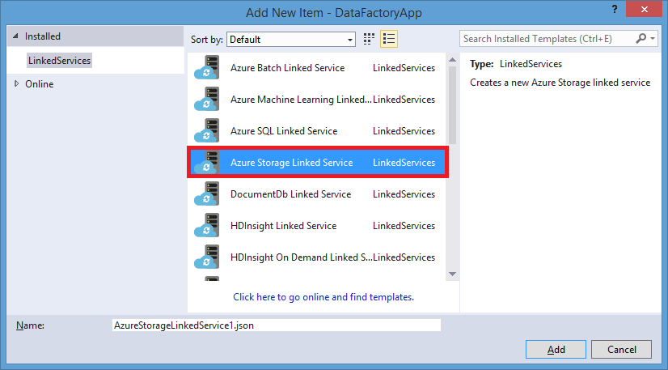
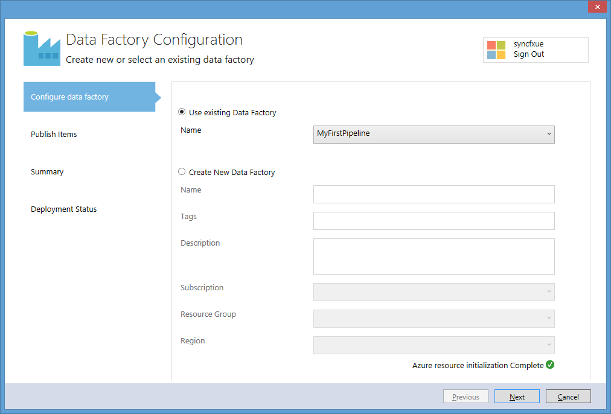

<properties 
    pageTitle="Tutorial: Criar um pipeline com atividade de cópia usando o Visual Studio | Microsoft Azure" 
    description="Neste tutorial, você cria um pipeline de fábrica de dados do Azure com uma atividade de cópia usando o Visual Studio." 
    services="data-factory" 
    documentationCenter="" 
    authors="spelluru" 
    manager="jhubbard" 
    editor="monicar"/>

<tags 
    ms.service="data-factory" 
    ms.workload="data-services" 
    ms.tgt_pltfrm="na" 
    ms.devlang="na" 
    ms.topic="get-started-article" 
    ms.date="10/17/2016" 
    ms.author="spelluru"/>

# Tutorial: Criar um pipeline com atividade de cópia usando o Visual Studio
> [AZURE.SELECTOR]
- [Visão geral e os pré-requisitos](data-factory-copy-data-from-azure-blob-storage-to-sql-database.md)
- [Assistente de cópia](data-factory-copy-data-wizard-tutorial.md)
- [Portal do Azure](data-factory-copy-activity-tutorial-using-azure-portal.md)
- [O Visual Studio](data-factory-copy-activity-tutorial-using-visual-studio.md)
- [PowerShell](data-factory-copy-activity-tutorial-using-powershell.md)
- [Modelo do Gerenciador de recursos Azure](data-factory-copy-activity-tutorial-using-azure-resource-manager-template.md)
- [API REST](data-factory-copy-activity-tutorial-using-rest-api.md)
- [API .NET](data-factory-copy-activity-tutorial-using-dotnet-api.md)

Este tutorial mostra como criar e monitorar uma fábrica de dados Azure usando o Visual Studio. O pipeline na fábrica dados usa uma atividade de cópia para copiar dados de armazenamento de Blob do Azure para Azure SQL Database.

Aqui estão as etapas realizadas como parte deste tutorial:

1. Crie dois serviços vinculados: **AzureStorageLinkedService1** e **AzureSqlinkedService1**. 

    O AzureStorageLinkedService1 vincula um armazenamento do Azure e AzureSqlLinkedService1 vincula um banco de dados do SQL Azure à fábrica dados: **ADFTutorialDataFactoryVS**. Os dados de entrada para o pipeline residem em um contêiner de blob no armazenamento de blob do Microsoft Azure e dados de saída são armazenados em uma tabela do banco de dados do SQL Azure. Portanto, você adiciona esses dois armazenamentos de dados como serviços vinculados à fábrica dados.
2. Crie dois conjuntos de dados: **InputDataset** e **OutputDataset**, que representam os dados de entrada/saída que estão armazenados em armazenamentos de dados. 

    Para o InputDataset, especifique o contêiner de blob que contém um blob com os dados de origem. Para o OutputDataset, especifique a tabela do SQL que armazena os dados de saída. Você também pode especificar outras propriedades como estrutura, disponibilidade e política.
3. Crie um pipeline denominado **ADFTutorialPipeline** na ADFTutorialDataFactoryVS. 

    O pipeline tem uma **Atividade de cópia** que copia de entrada de dados do Azure blob para a tabela do SQL Azure de saída. A atividade de cópia realiza a movimentação dos dados em fábrica de dados do Azure. A atividade estiver usando um serviço globalmente disponível que pode copiar dados entre várias fontes de dados de uma maneira segura, confiável e flexível. Consulte o artigo de [Atividades de movimentação de dados](data-factory-data-movement-activities.md) para obter detalhes sobre a atividade de cópia. 
4. Crie uma fábrica de dados denominada **VSTutorialFactory**. Implante a fábrica de dados e todas as entidades de fábrica de dados (serviços vinculados, tabelas e o pipeline).    

## Pré-requisitos

1. Leia o artigo de [Visão geral do Tutorial](data-factory-copy-data-from-azure-blob-storage-to-sql-database.md) e conclua as etapas de **pré-requisito** . 
2. Você deve ser um **administrador da assinatura do Azure** para poder publicar entidades de fábrica de dados à fábrica de dados do Azure.  
3. Você deve ter os seguintes programas instalados no seu computador: 
    - Visual Studio 2013 ou Visual Studio de 2015
    - Baixe o SDK do Azure para Visual Studio 2013 ou Visual Studio 2015. Navegue até a [Página de Download do Azure](https://azure.microsoft.com/downloads/) e clique **VS 2013** ou **VS 2015** na seção **.NET** .
    - Baixar o plug-in fábrica de dados do Azure mais recente para Visual Studio: [VS 2013](https://visualstudiogallery.msdn.microsoft.com/754d998c-8f92-4aa7-835b-e89c8c954aa5) ou o [VS 2015](https://visualstudiogallery.msdn.microsoft.com/371a4cf9-0093-40fa-b7dd-be3c74f49005). Você também pode atualizar o plug-in seguindo as etapas a seguir: no menu, clique em **Ferramentas** -> **extensões e atualizações** -> **Online** -> **Galeria do Visual Studio** -> **Ferramentas de fábrica de dados do Microsoft Azure para Visual Studio** -> **Atualizar**.

## Criar um projeto do Visual Studio 
1. Inicie o **Visual Studio 2013**. Clique em **arquivo**, aponte para **novo**e clique em **projeto**. Você verá a caixa de diálogo **Novo projeto** .  
2. Na caixa de diálogo **Novo projeto** , selecione o modelo de **DataFactory** e clique em **Projeto de fábrica de dados vazio**. Se você não vir o modelo DataFactory, feche o Visual Studio, instale o SDK do Azure para Visual Studio 2013 e reabra o Visual Studio.  

    

3. Insira um **nome** para o projeto, **local**e um nome para a **solução**e clique **Okey**.

     

## Criar serviços vinculados
Serviços vinculados vincular armazenamentos de dados ou calcular uma fábrica dados Azure os serviços. Consulte [armazena dados com suporte](data-factory-data-movement-activities.md##supported-data-stores-and-formats) para todas as fontes e receptores compatíveis com a atividade de cópia. Consulte [Serviços vinculados de computação](data-factory-compute-linked-services.md) para a lista de serviços de computação suportados pelo fábrica de dados. Neste tutorial, você não usar qualquer serviço de computação. 

Nesta etapa, você cria dois serviços vinculados: **AzureStorageLinkedService1** e **AzureSqlLinkedService1**. AzureStorageLinkedService1 vinculados links de serviço de uma conta de armazenamento do Azure e AzureSqlLinkedService vincula um banco de dados do SQL Azure à fábrica dados: **ADFTutorialDataFactory**. 

### Criar o serviço de armazenamento do Azure vinculado

4. **Serviços vinculada** de atalho no solution explorer, aponte para **Adicionar**e clique em **Novo Item**.      
5. Na caixa de diálogo **Adicionar Novo Item** , selecione o **Serviço de vinculada de armazenamento do Azure** na lista e clique em **Adicionar**. 

    
 
3. Substituir `<accountname>` e `<accountkey>`* com o nome da sua conta de armazenamento do Azure e sua chave. 

    

4. Salve o arquivo de **AzureStorageLinkedService1.json** .

> Consulte [mover dados de/para o Azure Blob](data-factory-azure-blob-connector.md#azure-storage-linked-service) para obter detalhes sobre propriedades JSON.

### Criar o serviço SQL Azure vinculado

5. Clique com botão direito em nó de **Serviços vinculadas** no **Solution Explorer** novamente, aponte para **Adicionar**e clique em **Novo Item**. 
6. Desta vez, selecione o **Serviço vinculado do SQL Azure**e clique em **Adicionar**. 
7. No **arquivo de AzureSqlLinkedService1.json**, substitua `<servername>`, `<databasename>`, `<username@servername>`, e `<password>` com nomes de seu servidor SQL Azure, banco de dados, conta de usuário e senha.    
8.  Salve o arquivo de **AzureSqlLinkedService1.json** . 

> [AZURE.NOTE]
> Para obter detalhes sobre propriedades JSON, consulte [mover dados de/para o Azure SQL Database](data-factory-azure-sql-connector.md#azure-sql-linked-service-properties) .

## Criar conjuntos de dados
Na etapa anterior, você criou vinculados serviços **AzureStorageLinkedService1** e **AzureSqlLinkedService1** para vincular uma conta de armazenamento do Azure e o banco de dados do SQL Azure à fábrica dados: **ADFTutorialDataFactory**. Nesta etapa, você define dois conjuntos de dados – **InputDataset** e **OutputDataset** – que representam os dados de entrada/saída que estão armazenados em armazenamentos de dados referidos por AzureStorageLinkedService1 e AzureSqlLinkedService1, respectivamente. Para InputDataset, especifique o contêiner de blob que contém um blob com os dados de origem. Para OutputDataset, especifique a tabela do SQL que armazena os dados de saída.

### Criar entrada de conjunto de dados
Nesta etapa, você cria um dataset chamado **InputDataset** que aponta para um contêiner de blob no armazenamento do Azure representado pelo serviço **AzureStorageLinkedService1** vinculado. Uma tabela é um conjunto de dados retangular e é o único tipo de conjunto de dados com suporte no momento. 

9. **Tabelas** no **Explorador de solução**de atalho, aponte para **Adicionar**e clique em **Novo Item**.
10. Na caixa de diálogo **Adicionar Novo Item** , selecione **Blob do Azure**e clique em **Adicionar**.   
10. Substitua o texto JSON com o seguinte texto e salve o arquivo de **AzureBlobLocation1.json** . 

        {
          "name": "InputDataset",
          "properties": {
            "structure": [
              {
                "name": "FirstName",
                "type": "String"
              },
              {
                "name": "LastName",
                "type": "String"
              }
            ],
            "type": "AzureBlob",
            "linkedServiceName": "AzureStorageLinkedService1",
            "typeProperties": {
              "folderPath": "adftutorial/",
              "format": {
                "type": "TextFormat",
                "columnDelimiter": ","
              }
            },
            "external": true,
            "availability": {
              "frequency": "Hour",
              "interval": 1
            }
          }
        }

     Observe os seguintes pontos: 
    
    - DataSet **tipo** está definido como **AzureBlob**.
    - **linkedServiceName** está definido como **AzureStorageLinkedService**. Você criou esse serviço vinculado na etapa 2.
    - **folderPath** está definido para o contêiner de **adftutorial** . Você também pode especificar o nome de um blob dentro da pasta usando a propriedade **nome do arquivo** . Como você não está especificando o nome do blob, dados de todos os blobs no contêiner são considerados como uma entrada de dados.  
    - formato **tipo** está definido como **TextFormat**
    - Existem dois campos no arquivo de texto – **nome** e **Sobrenome** – separado por um caractere de vírgula (**columnDelimiter**) 
    - A **disponibilidade** está definida para **cada hora** (**frequência** é definido como **hora** e o **intervalo** é definido como **1**). Portanto, Data Factory procura dados de entrada cada hora na pasta raiz do contêiner de blob (**adftutorial**) que você especificou. 
    
    Se você não especificar um **nome de arquivo** de um conjunto de dados de **entrada** , todos os arquivos/blobs da pasta entrada (**folderPath**) são considerados como entradas. Se você especificar um nome de arquivo no JSON, somente especificado arquivo/blob é considerado asn entrada.
 
    Se você não especificar um **nome de arquivo** para uma **tabela de saída**, os arquivos gerados no **folderPath** são nomeados no seguinte formato: dados. &lt;Guid\&gt;. txt (exemplo: Data.0a405f8a-93ff-4c6f-b3be-f69616f1df7a.txt.).

    Para definir **folderPath** e **fileName** dinamicamente com base no período de tempo **SliceStart** , use a propriedade **partitionedBy** . No exemplo a seguir, folderPath usa ano, mês e dia a partir do SliceStart (hora de início da fatia sendo processada) e fileName usa hora a partir do SliceStart. Por exemplo, se uma fatia é produzida para 2016-09-20T08:00:00, a nomedapasta está definida como wikidatagateway wikisampledataout/2016/09/20 e o nome do arquivo está definida como 08.csv. 

            "folderPath": "wikidatagateway/wikisampledataout/{Year}/{Month}/{Day}",
            "fileName": "{Hour}.csv",
            "partitionedBy": 
            [
                { "name": "Year", "value": { "type": "DateTime", "date": "SliceStart", "format": "yyyy" } },
                { "name": "Month", "value": { "type": "DateTime", "date": "SliceStart", "format": "MM" } }, 
                { "name": "Day", "value": { "type": "DateTime", "date": "SliceStart", "format": "dd" } }, 
                { "name": "Hour", "value": { "type": "DateTime", "date": "SliceStart", "format": "hh" } } 

> [AZURE.NOTE]
> Consulte [mover dados de/para o Azure Blob](data-factory-azure-blob-connector.md#azure-blob-dataset-type-properties) para obter detalhes sobre propriedades JSON.

### Criar conjunto de dados de saída
Nesta etapa, você criar um conjunto de dados de saída chamado **OutputDataset**. Este dataset aponta para uma tabela do SQL do banco de dados do SQL Azure são representados por **AzureSqlLinkedService1**. 

11. Clique com botão direito **tabelas** no **Solution Explorer** novamente, aponte para **Adicionar**e clique em **Novo Item**.
12. Na caixa de diálogo **Adicionar Novo Item** , selecione **SQL Azure**e clique em **Adicionar**. 
13. Substitua o texto JSON com o seguinte JSON e salve o arquivo de **AzureSqlTableLocation1.json** .

        {
          "name": "OutputDataset",
          "properties": {
            "structure": [
              {
                "name": "FirstName",
                "type": "String"
              },
              {
                "name": "LastName",
                "type": "String"
              }
            ],
            "type": "AzureSqlTable",
            "linkedServiceName": "AzureSqlLinkedService1",
            "typeProperties": {
              "tableName": "emp"
            },
            "availability": {
              "frequency": "Hour",
              "interval": 1
            }
          }
        }

     Observe os seguintes pontos: 
    
    - DataSet **tipo** está definido como **AzureSQLTable**.
    - **linkedServiceName** está definido como **AzureSqlLinkedService** (você criou esse serviço vinculado na etapa 2).
    - **nome de tabela** está definido como **emp**.
    - Há três colunas – **ID**, **nome**e **Sobrenome** – na tabela emp no banco de dados. ID é uma coluna de identidade, portanto, você precisará especificar somente o **nome** e o **Sobrenome** aqui.
    - A **disponibilidade** está definido para **cada hora** (**frequência** definido como **hora** e **intervalo** definido como **1**).  O serviço de dados fábrica gera uma fatia de dados de saída cada hora na tabela **emp** do banco de dados do SQL Azure.

> [AZURE.NOTE]
> Para obter detalhes sobre propriedades JSON, consulte [mover dados de/para o Azure SQL Database](data-factory-azure-sql-connector.md#azure-sql-linked-service-properties) .

## Crie pipeline 
Você criou tabelas e os serviços de entrada/saída vinculados até o momento. Agora, você cria um pipeline com uma **Atividade de cópia** para copiar dados do Azure blob ao banco de dados do SQL Azure. 

1. Clique com botão direito **canais** no **Solution Explorer**, aponte para **Adicionar**e clique em **Novo Item**.  
15. Selecione o **Pipeline de dados de cópia** na caixa de diálogo **Adicionar Novo Item** e clique em **Adicionar**. 
16. Substitua o JSON com o seguinte JSON e salvar o arquivo de **CopyActivity1.json** .
            
        {
          "name": "ADFTutorialPipeline",
          "properties": {
            "description": "Copy data from a blob to Azure SQL table",
            "activities": [
              {
                "name": "CopyFromBlobToSQL",
                "type": "Copy",
                "inputs": [
                  {
                    "name": "InputDataset"
                  }
                ],
                "outputs": [
                  {
                    "name": "OutputDataset"
                  }
                ],
                "typeProperties": {
                  "source": {
                    "type": "BlobSource"
                  },
                  "sink": {
                    "type": "SqlSink",
                    "writeBatchSize": 10000,
                    "writeBatchTimeout": "60:00:00"
                  }
                },
                "Policy": {
                  "concurrency": 1,
                  "executionPriorityOrder": "NewestFirst",
                  "style": "StartOfInterval",
                  "retry": 0,
                  "timeout": "01:00:00"
                }
              }
            ],
            "start": "2015-07-12T00:00:00Z",
            "end": "2015-07-13T00:00:00Z",
            "isPaused": false
          }
        }

    Observe os seguintes pontos:

    - Na seção atividades, há apenas uma atividade cujo **tipo** está definido como **Copiar**.
    - Entrada da atividade está definida como **InputDataset** e saída para a atividade está definida como **OutputDataset**.
    - Na seção **typeProperties** , **BlobSource** especificado como o tipo de fonte e **SqlSink** é especificado como o tipo de receptor.

    Substitua o valor da propriedade **comece** com o valor de dia e de **término** atual com o próximo dia. Você pode especificar apenas a parte da data e ignorar a parte de hora do tempo de data. Por exemplo, "2016-02-03", que é equivalente a "2016-02-03T00:00:00Z"
    
    Ambos iniciar e encerrar datetimes deve estar no [formato ISO](http://en.wikipedia.org/wiki/ISO_8601). Por exemplo: 2016-10-14T16:32:41Z. A hora de **término** é opcional, mas podemos usá-lo neste tutorial. 
    
    Se você não especificar o valor da propriedade **final** , ele é calculado como "**início + 48 horas**". Para executar o pipeline indefinidamente, especifique **9999-09-09** como o valor da propriedade de **fim** .
    
    No exemplo anterior, há 24 fatias de dados como cada fatia de dados é gerada por hora.

## Publicar/implantar entidades de fábrica de dados
Nesta etapa, você publica entidades de fábrica de dados (serviços vinculados, conjuntos de dados e pipeline) que você criou anteriormente. Você também pode especificar o nome da nova fábrica de dados a ser criado para armazenar essas entidades.  

18. Clique com botão direito projeto no Solution Explorer e clique em **Publicar**. 
19. Se você vir a caixa de diálogo **entrar sua conta da Microsoft** , insira suas credenciais para a conta que tem a assinatura do Azure e clique em **entrar**.
20. Você verá a caixa de diálogo a seguir:

    
21. Na página Configurar dados fábrica, siga estas etapas: 
    1. Selecione a opção **Criar nova fábrica de dados** .
    2. Insira **VSTutorialFactory** de **nome**.  
    
        > [AZURE.IMPORTANT]  
        > O nome da fábrica dados Azure deve ser exclusivo. Se você receber um erro sobre o nome da fábrica de dados durante a publicação, altere o nome da fábrica de dados (por exemplo, yournameVSTutorialFactory) e tente publicar novamente. Consulte o tópico de [Dados Factory - regras de nomenclatura](data-factory-naming-rules.md) para regras de nomenclatura para artefatos de fábrica de dados.     
    3. Selecione a sua assinatura do Azure para o campo de **assinatura** .
     
        > [AZURE.IMPORTANT]Se você não vir qualquer assinatura, certifique-se de que você está conectado usando uma conta que seja um administrador ou co-da assinatura.  
    4. Selecione o **grupo de recursos** para a fábrica de dados a ser criado. 5. Selecione a **região** para a fábrica de dados. Apenas as regiões com suporte pelo serviço fábrica de dados são mostradas na lista suspensa.
6. Clique em **próximo** para alternar para a página **Publicar itens** .
    
           
23. Na página **Publicar itens** , certifique-se de que todas as fábricas de dados entidades estão selecionadas e clique em **próximo** para alternar para a página de **Resumo** .
    
         
24. Revise o resumo e clique em **Avançar** para iniciar o processo de implantação e exibir o **Status da implantação**.

    
25. Na página de **Status de implantação** , você deve ver o status do processo de implantação. Clique em Concluir após a conclusão da implantação. 
     Observe os seguintes pontos: 

- Se você receber o erro: "**esta assinatura não está registrada para usar o namespace Microsoft.DataFactory**", siga um destes procedimentos e tente publicar novamente: 

    - No Azure PowerShell, execute o seguinte comando para registrar o provedor de dados fábrica. 
        
            Register-AzureRmResourceProvider -ProviderNamespace Microsoft.DataFactory
    
        Você pode executar o seguinte comando para confirmar que a fábrica de dados provedor está registrado. 
    
            Get-AzureRmResourceProvider
    - Faça logon usando a assinatura do Azure para o [portal do Azure](https://portal.azure.com) e navegue até uma lâmina de fábrica de dados (ou) criar uma fábrica de dados no portal do Azure. Esta ação registra automaticamente o provedor para você.
-   O nome da fábrica dados pode ser registrado como um nome DNS no futuro e, portanto, ficam visível publicamente.

> [AZURE.IMPORTANT] Para criar instâncias de fábrica de dados, você precisa ser um administrador/co-administrador da assinatura do Azure

## Resumo
Neste tutorial, você criou uma fábrica de dados do Azure para copiar dados de um Azure blob um banco de dados do SQL Azure. Você usou o Visual Studio para criar a fábrica de dados, serviços vinculados, conjuntos de dados e um pipeline. Aqui estão as etapas de alto nível que você realizou neste tutorial:  

1.  Criou uma **fábrica de dados**do Azure.
2.  Criado **Serviços vinculados**:
    1. Um serviço de **Armazenamento do Azure** vinculado para vincular sua conta de armazenamento do Azure que contém os dados de entrada.    
    2. Um serviço **SQL Azure** vinculado para vincular seu banco de dados do SQL Azure que mantém os dados de saída. 
3.  **Conjuntos de dados**, criada que descrevem dados de entrada e saída para canais.
4.  Criado um **pipeline** com uma **Atividade de cópia** com **BlobSource** como origem e **SqlSink** como receptor. 

## Usar Server Explorer para exibir fábricas de dados

1. No **Visual Studio**, clique em **modo de exibição** no menu e clique em **Server Explorer**.
2. Na janela Gerenciador de servidor, expanda **Azure** e expanda **Fábrica de dados**. Se você vir **entrar no Visual Studio**, insira a **conta** associada a sua assinatura do Azure e clique em **continuar**. Insira a **senha**e clique em **entrar**. Visual Studio tenta obter informações sobre todas as fábricas Azure dados em sua assinatura. Você ver o status dessa operação na janela de **Lista de tarefas de fábrica de dados** .
    
3. Você pode com o botão direito em uma fábrica de dados e selecione Exportar fábrica de dados para o novo projeto para criar um projeto do Visual Studio com base em uma fábrica de dados existente.
      

## Atualizar ferramentas de dados fábrica para Visual Studio
Para atualizar ferramentas de fábrica de dados do Azure para Visual Studio, siga estas etapas:

1. No menu clique em **Ferramentas** e selecione **extensões e atualizações**. 
2. Selecione **as atualizações** no painel esquerdo e selecione **Galeria do Visual Studio**.
4. Selecione **Ferramentas de fábrica de dados do Azure para Visual Studio** e clique em **Atualizar**. Se você não vir essa entrada, você já tem a versão mais recente das ferramentas. 

Consulte [pipeline e conjuntos de dados do Monitor](data-factory-copy-activity-tutorial-using-azure-portal.md#monitor-pipeline) para obter instruções sobre como usar o portal do Azure para monitorar o pipeline e conjuntos de dados que você criou neste tutorial.

## Consulte também
| Tópico | Descrição |
| :---- | :---- |
| [Atividades de movimentação de dados](data-factory-data-movement-activities.md) | Este artigo fornece informações detalhadas sobre a atividade de cópia que você usou no tutorial. |
| [Planejamento e à execução](data-factory-scheduling-and-execution.md) | Este artigo explica os aspectos de programação e a execução do modelo de aplicativo de fábrica de dados do Azure. |
| [Canais](data-factory-create-pipelines.md) | Este artigo ajuda você a entender canais e atividades em fábrica de dados do Azure |
| [Conjuntos de dados](data-factory-create-datasets.md) | Este artigo ajuda você a entender conjuntos de dados em fábrica de dados do Azure.
| [Monitorar e gerenciar canais usando o aplicativo de monitoramento](data-factory-monitor-manage-app.md) | Este artigo descreve como monitorar, gerenciar e depurar canais usando o monitoramento e gerenciamento de aplicativo. 
